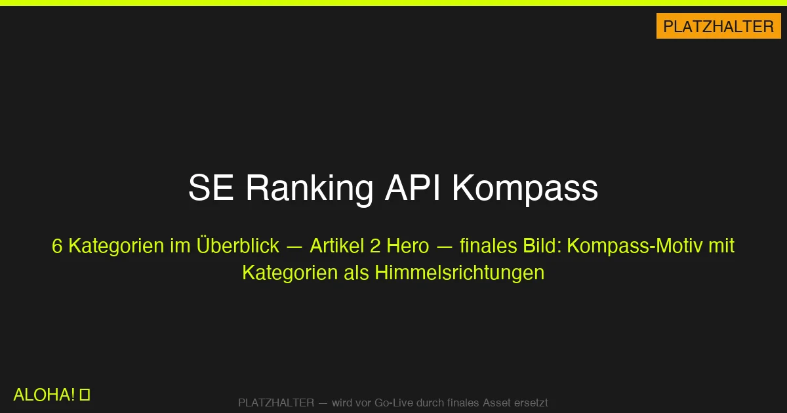
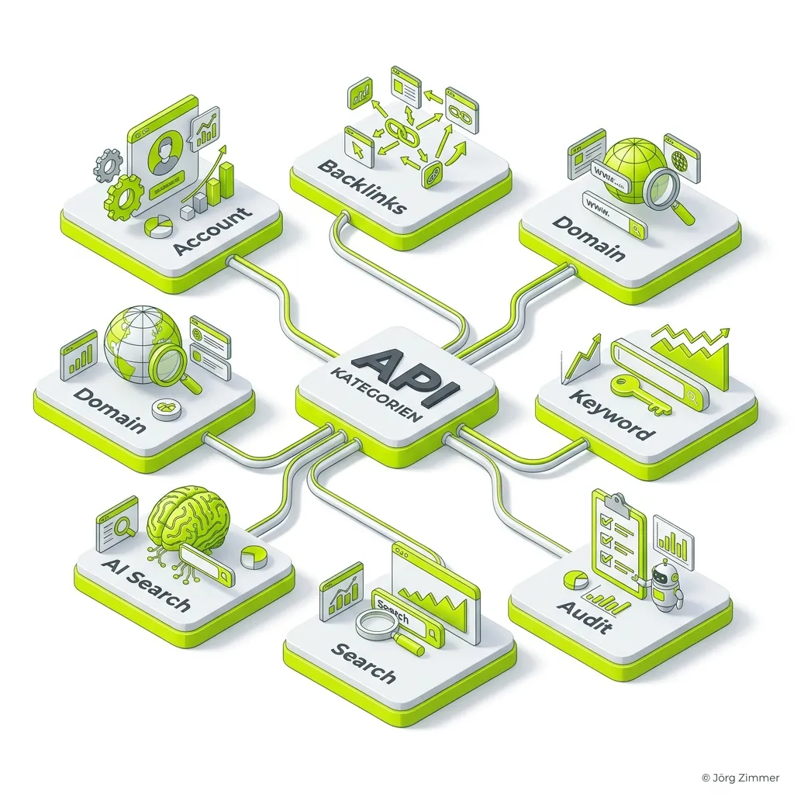
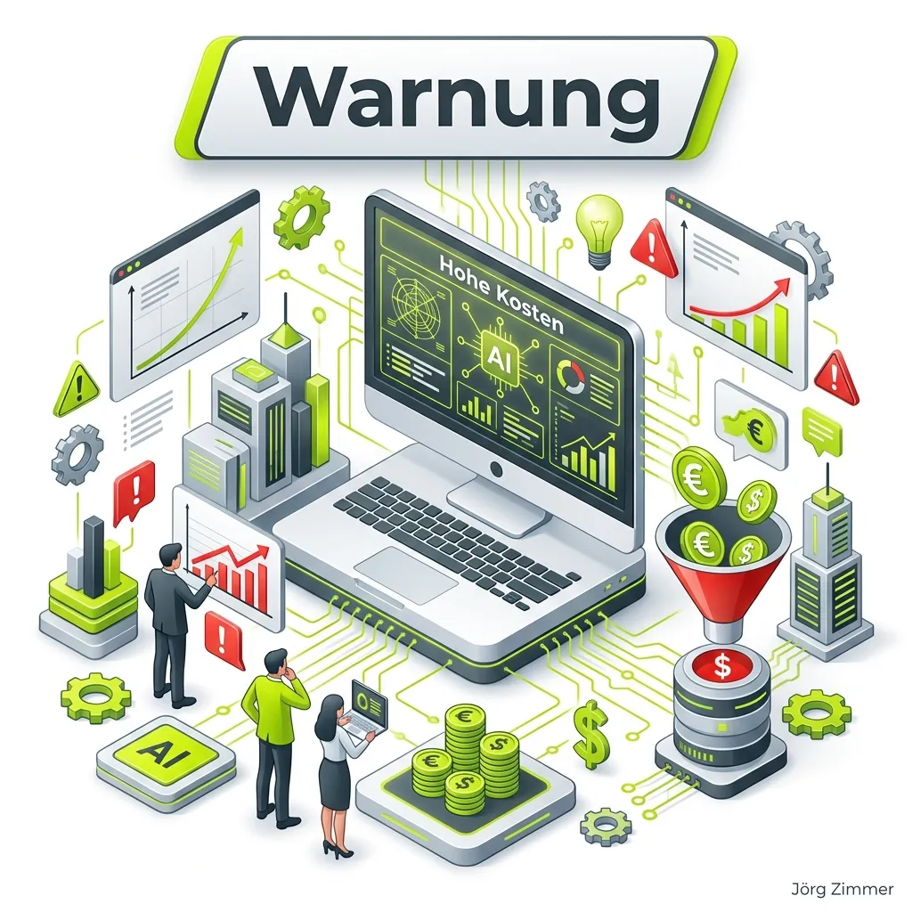
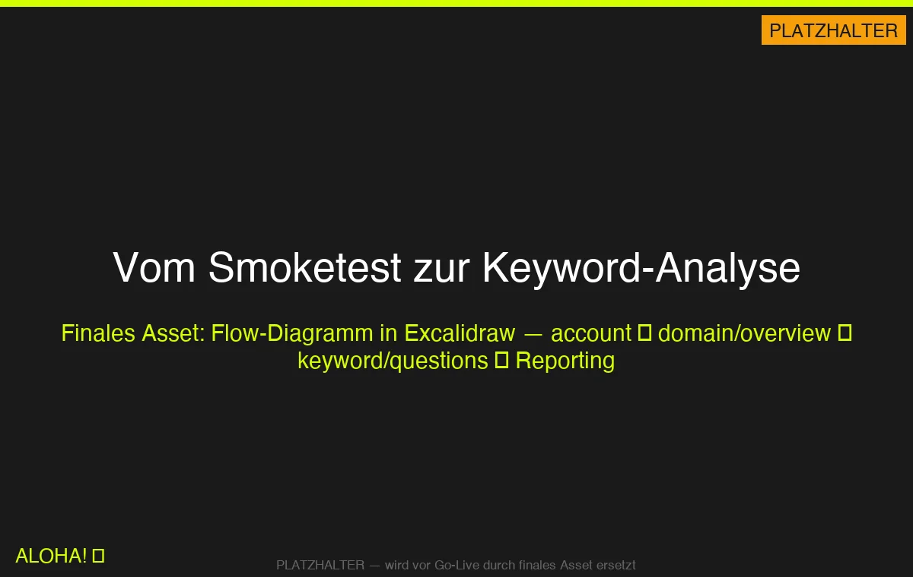

ALOHA 🌻!

Im [ersten Teil](../se-ranking-api-claude-code-setup/) habe ich dir gezeigt, wie du die <a href="https://seranking.com/de/?ga=4169588&source=link" target="_blank" rel="noopener noreferrer">SE Ranking</a> API mit Claude Code verbindest — inklusive dem Daily-Limit, das dir den 10k-Credit-Schock erspart.

Heute die logische Anschlussfrage: **Was kann die API denn eigentlich alles?**

Kurze Antwort: verdammt viel. Lange Antwort: 6 Kategorien, über 50 Endpunkte, Kosten zwischen 0 und 7.500 Credits pro Call. Ich sortiere das für dich — wie ein Kompass durch den API-Dschungel.

## Die 6 Kategorien im Überblick

| Kategorie | Zweck | Typische Kosten pro Call |
|-----------|-------|--------------------------|
| Account | Subscription-Check | 0 Credits |
| Backlinks | Linkprofil-Analyse | 0–100 pro Summary, 1–10 pro Record |
| Domain Analysis | Sichtbarkeit, Keywords, Wettbewerber | **100 pro Call** (flat) |
| Keyword Research | KW-Ideen, Long-Tail, Fragen | 0 flat + 1–10 pro Record |
| AI Search | KI-Sichtbarkeit | **800–7.500 pro Call** |
| Website Audit | Technisches Audit | 2–20 pro Seite |

## Account — dein Rettungsanker

Ein Endpunkt, eine Aufgabe: `account/subscription`. Liefert dir zurück, wie viele Credits noch im Tank sind und bis wann dein Tarif läuft.

Persönlicher Tipp: **Immer vor und nach jedem Job abfragen.** Kostet nichts, rettet dir den Tag. Wenn du den Wrapper aus Teil 1 benutzt, macht dein Code das sowieso automatisch — aber auch manuell ist das der erste Call, der nach dem Login rausgeht.

## Backlinks — das Linkprofil in fünf Tiefenstufen

Die Backlinks-Kategorie ist sauber aufgebaut: je tiefer du gräbst, desto mehr zahlst du. Fünf Endpunkte, die ich tatsächlich nutze:

- `backlinks/summary` — Schnell-Überblick, **100 pro Record**, gibt dir Domain-Score, Anzahl Backlinks, Anchor-Verteilung
- `backlinks/all` — Komplett-Export aller Links, **1 pro Record**, für die Big-Data-Auswertung
- `backlinks/anchors` — Ankertext-Verteilung, 1 pro Record, wichtig für Penalty-Prävention
- `backlinks/authority/domain` — Domain-Authority-Score einer verweisenden Domain
- `backlinks/refdomains` — Liste aller verweisenden Domains

Wer einen Disavow-File braucht, wer ein Linkaudit für einen Neukunden machen will oder einfach nur wissen will, wer da zu wem verlinkt — hier liegt das Material.

## Domain Analysis — die Arbeitspferde

Wenn ich nur eine einzige Kategorie wählen müsste, wäre es diese. Drei Endpunkte decken 80% meiner Kunden-Arbeit ab:

- `research/domain/overview/db` — Sichtbarkeit + KW-Count
- `research/domain/keywords` — rankende Keywords mit Position und Suchvolumen
- `research/domain/competitors` — Wettbewerber im organischen Umfeld

Alle für pauschal **100 Credits pro Call**. Kein Datensatz-Preis, kein Mengen-Zuschlag. Das ist ehrlich kalkuliert.

  
Jörgs SEO-Klartext (LinkedIn Insights)

  
"100 Credits pro Domain-Call klingt viel. Ist es nicht — bei einem Kunden-Setup zahlt sich das mit 3 Calls aus."

## Keyword Research — der Preis-Hit

Hier wird's interessant. Die Keyword-Research-Endpunkte haben **0 Credits pro Call** und zahlen erst pro Datensatz:

- `research/keyword/related` — verwandte Begriffe (10 pro Record)
- `research/keyword/questions` — Fragen-Begriffe (10 pro Record) → **Gold für FAQ-Content**
- `research/keyword/longtail` — Long-Tail-Begriffe (**1 pro Record**) → der Preis-Hit

Rechne mit: 100 Long-Tails für 100 Credits. Das sind bei meinem Tarif keine 2 Euro. So günstig war Keyword-Research selten — und die Daten sind sauber, nicht das scraped Zeug aus dem SERP.

Der `questions`-Endpunkt ist für FAQ-Content fast unschlagbar. Gib eine Seed-Keyword-Liste rein, krieg „Was ist..."-, „Wie funktioniert..."-, „Welcher..."-Fragen zurück. Genau das, was Google für Featured Snippets belohnt.

## AI Search — der teuerste Bereich

Und dann gibt es die AI-Search-Kategorie. Hier misst du, ob ChatGPT, Perplexity, Google AI Overviews deine Marke zitieren. Wichtig. Teuer.

- `ai-search/overview/aggregated/*` — **1.800 Credits pro Call**
- `ai-search/overview/leaderboard` (POST) — **7.500 Credits pro Call**, nur für große Dashboards
- `ai-search/discover-brand` — **100 Credits pro Call** — der günstigste Brand-Check, mein Lieblings-Einstieg
- `ai-search/prompts-by-target` — 0 flat + 200 pro Record
- `ai-search/prompts-by-brand` — 0 flat + 200 pro Record

  
⚠️ Warnung: AI Search

  
"Ein einziger Leaderboard-Call = 7.500 Credits. Das entspricht 75 Domain-Analysen. Nie automatisiert in Cron-Jobs. Immer manueller Trigger."

Meine Empfehlung: Fang mit `discover-brand` an. 100 Credits, du siehst sofort, ob deine Marke in ChatGPT-Antworten vorkommt. Für tiefere Analysen nimmst du `aggregated` — aber wirklich nur, wenn du einen Kunden mit Retainer ab 5.000 Euro/Monat hast. Sonst lohnt der Preis nicht.

## Website Audit — einmal bezahlen, oft abfragen

Das elegante Kosten-Modell. Du triggerst einen Audit via POST:

- `audit/audits/standard` POST — **2 Credits pro Seite**
- `audit/audits/advanced` POST — **20 Credits pro Seite**

Und danach darfst du die Ergebnisse beliebig oft via GET abrufen:

- `audit/audits/status` — 0 Credits
- `audit/audits/report` — 0 Credits
- `audit/audits/pages` — 0 Credits
- `audit/audits/issues` — 0 Credits

Heißt: Einmal pro Quartal einen Audit laufen lassen, danach drei Monate lang aus dem Cache reporten. Das macht Quartalsreports richtig billig.

Das ist übrigens genau das Muster, das <a href="https://polisys.de" target="_blank" rel="noopener noreferrer">poliSYS</a> für ihr internes Quality-Gate nutzt: einmal crawlen (bezahlt), dann 90 Tage aus dem Cache reporten (gratis). Smart.

## Die komplette Kosten-Tabelle

Für die Bookmark-Fraktion — alle wichtigen Endpunkte in einer Übersicht:

### Account

| Endpunkt | Kosten |
|----------|--------|
| `account/subscription` | 0 Credits |

### Backlinks

| Endpunkt | Pro Call | Pro Datensatz |
|----------|----------|---------------|
| `backlinks/summary` | 0 | 100 |
| `backlinks/all` | 0 | 1 |
| `backlinks/anchors` | 0 | 1 |
| `backlinks/count` | 0 | 2 |
| `backlinks/authority` | 0 | 10 |
| `backlinks/authority/domain` | 0 | 5 |
| `backlinks/refdomains` | 0 | 1 |
| `backlinks/history` | 0 | 1 |

### Domain Analysis

| Endpunkt | Pro Call | Pro Datensatz |
|----------|----------|---------------|
| `research/domain/overview/db` | 100 | 0 |
| `research/domain/overview/worldwide` | 100 | 0 |
| `research/domain/overview/history` | 100 | 0 |
| `research/domain/keywords` | 100 | 0 |
| `research/domain/pages` | 100 | 0 |
| `research/domain/subdomains` | 100 | 0 |
| `research/domain/ads` | 100 | 0 |
| `research/domain/competitors` | 100 | 0 |
| `research/domain/keywords/comparison` | 100 | 0 |

### Keyword Research

| Endpunkt | Pro Call | Pro Datensatz |
|----------|----------|---------------|
| `research/keyword/export` | 0 | 10 |
| `research/keyword/related` | 0 | 10 |
| `research/keyword/similar` | 0 | 10 |
| `research/keyword/questions` | 0 | 10 |
| `research/keyword/longtail` | 0 | **1** |

### AI Search

| Endpunkt | Pro Call | Pro Datensatz |
|----------|----------|---------------|
| `ai-search/overview/aggregated/*` | **1.800** | 0 |
| `ai-search/overview/by-engine/time-series` | 800 | 0 |
| `ai-search/overview/leaderboard` (POST) | **7.500** | 0 |
| `ai-search/discover-brand` | 100 | 0 |
| `ai-search/prompts-by-target` | 0 | 200 |
| `ai-search/prompts-by-brand` | 0 | 200 |

### Website Audit

| Endpunkt | Pro Call | Pro Seite |
|----------|----------|-----------|
| `audit/audits/standard` (POST) | 0 | 2 |
| `audit/audits/advanced` (POST) | 0 | 20 |
| `audit/audits/status` (GET) | 0 | 0 |
| `audit/audits/report` (GET) | 0 | 0 |
| `audit/audits/pages` (GET) | 0 | 0 |
| `audit/audits/issues` (GET) | 0 | 0 |

## Tacheles am Ende

Die <a href="https://seranking.com/de/?ga=4169588&source=link" target="_blank" rel="noopener noreferrer">SE Ranking</a> API ist kein Selbstbedienungsladen. Es gibt teure Endpunkte, und wenn du ohne Plan reinläufst, ist das Wochenbudget weg, bevor du etwas Sinnvolles rausbekommen hast. Mit Plan aber ist sie das ehrlichste API-Pricing, das ich kenne: transparent, dokumentiert, ohne versteckte „ab-hier-wird's-teuer"-Fallen.

Meine Strategie für neue Kunden: **Immer in dieser Reihenfolge.**

1. `account/subscription` — wie viel Budget ist noch da?
2. `research/domain/overview/db` — wo steht die Domain überhaupt?
3. Je nach Befund: Keyword-Research oder Backlinks oder AI-Search

Drei Calls, 200 Credits, und du weißt grob, was Sache ist. Danach entscheidest du, wo du tiefer bohrst.

Im nächsten Teil der Serie ziehe ich das komplett durch: **Der Praxis-Test.** Eine echte Cold-Lead-Analyse von Anfang bis Ende, mit Credit-Abrechnung und echten Zahlen. Was am Ende wirklich rauskommt, wenn man diesen Workflow auf eine Domain loslässt — und wie viel manuelle Arbeit dabei wegfällt.

Bis dahin: Baut euer Daily-Limit, fangt mit `discover-brand` an, lasst die Leaderboards in Ruhe. ALOHA! 🌻
