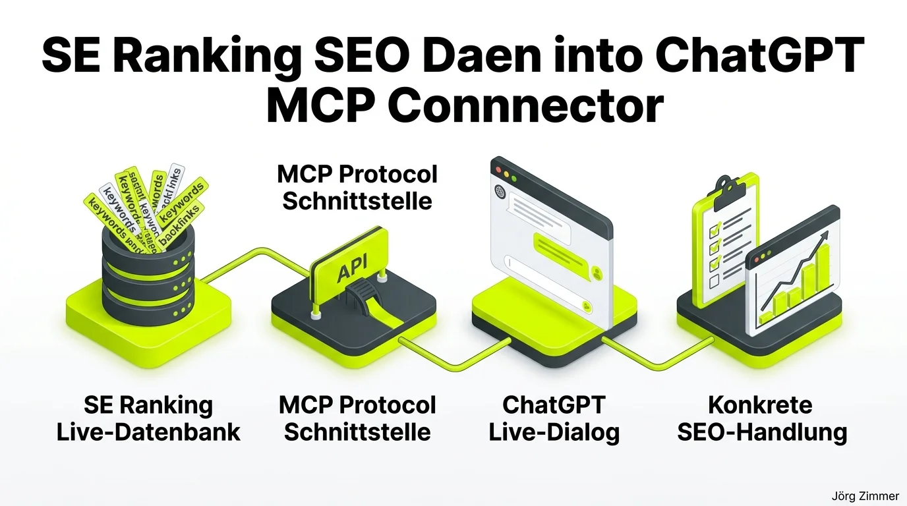

*Diese Diskussion wurde von mir auf LinkedIn am 08.07.2026 gestartet:*

  
💬 Jörgs SEO-Klartext (LinkedIn Insights)

  

  
ChatGPT mit Profi SEO Daten nutzen - 1 Klick und ich chatte mit den Live SEO Daten

  
Ja, ich bin Fan vom SEO Tool SE Ranking. Macht mir Freude wie proaktiv die vorwärts gehen. Jetzt wieder eine Funktion entdeckt. Die haben im ChatGPT Store eine eigene App.

  
SEO per MCP Connector ist gerade voll im Trend.

  
Hier mein Partner Link direkt zur Unterseite mit allen Infos: 
  <a href="https://seranking.com/de/mcp.html?ga=4169588&source=link" target="_blank" rel="noopener noreferrer" class="font-bold underline text-lime-700">SE Ranking MCP Connector ansehen (Partnerlink)</a>

  
💪 Keywords 
  💪 Backlinks 
  💪 Domain Performance 
  💪 Website Audits 
  💪 KI Sichtbarkeit

  
Alles per Chat erfragen und Pläne schmieden die zum Projekt passen. Auch zur Wettbewerbsanalyse.

  

Die Zeiten, in denen wir uns stundenlang durch verschachtelte Tool-Menüs geklickt und CSV-Dateien exportiert haben, sind endgültig vorbei. Die Arbeitsweise im modernen Web verändert sich rasant: Wir bewegen uns weg von starren Dashboards und hin zu dialogbasierten KI-Arbeitsumgebungen.

Egal ob über [Claude Code via SE Ranking API](/blog/se-ranking-api-claude-code-praxis-test/) auf der Kommandozeile oder direkt in der ChatGPT-Oberfläche – das [Model Context Protocol (MCP)](/glossar/model-context-protocol-mcp/) ist der entscheidende Hebel, der künstliche Intelligenz mit verlässlichen Primärdaten füttert.

## Der 4-Stufen-Workflow: Von Rohdaten zur präzisen SEO-Aktion

Das Zusammenspiel zwischen einer der umfassendsten SEO-Datenbanken der Branche und den Reasoning-Fähigkeiten modernster Sprachmodelle löst ein Kernproblem: Reine KI halluziniert, wenn ihr aktuelle Marktzahlen fehlen. Der MCP-Connector schließt diese Lücke in Echtzeit.

Der Workflow gliedert sich in vier ineinandergreifende Schritte:

1. **SE Ranking Live-Datenbank**: Greife in Echtzeit auf Milliarden Keywords, aktuelle SERP-Positionen, historische Rankingverläufe und Backlink-Metriken zu.
2. **MCP-Schnittstelle**: Die Bridge übersetzt komplexe API-Endpunkte in standardisierte Kontext-Objekte, die das Modell ohne Parsing-Fehler verarbeiten kann.
3. **ChatGPT Live-Dialog**: Stelle im Chat komplexe Fragen wie: *„Welche 5 Keywords hat Wettbewerber X in den letzten 90 Tagen neu im Top-3-Cluster gewonnen, für die wir noch keinen Content haben?“*
4. **Konkrete SEO-Handlung**: Die KI liefert nicht nur die rohe Tabelle, sondern formuliert direkt das redaktionelle Briefing samt semantischer Struktur für deine [KI-Suchmaschinen](/glossar/ai-search/) Optimierung.

## Vergleich: Klassisches Tool-Dashboard vs. SE Ranking MCP in ChatGPT

Die Gegenüberstellung macht deutlich, warum dieser Ansatz den Agentur- und Freelancer-Alltag grundlegend vereinfacht:

| Arbeitsbereich | Klassisches SEO-Dashboard | SE Ranking MCP in ChatGPT |
| :--- | :--- | :--- |
| **Datenerhebung** | Manuelle Filterung in mehreren Tabs | Ein präziser Prompt im Chatfenster |
| **Wettbewerbsanalyse** | Tabellen-Exporte und VLOOKUP in Excel | Automatische Gap-Analyse und Clusterung |
| **Kontextuelles Verständnis** | Liegt komplett beim menschlichen Analysten | KI erkennt semantische Muster & Trends sofort |
| **Report-Erstellung** | 1–2 Stunden Copy-Paste in Präsentationen | Binnen 30 Sekunden als formatierte Zusammenfassung |
| **Einstiegshürde** | Umfassende Tool-Einarbeitung nötig | Natürliche Sprache ohne Vorkenntnisse |
| **Audit-Verknüpfung** | Getrennte Reports für Technik und Keywords | Ganzheitliche Korrelation von Onpage & Rankings |

Weitere Einblicke in führende Tools findest du auch in meiner Übersicht über [Beste SEO Tools für AI Search](/blog/beste-seo-tools-ai-search-prompt-tracking/) sowie im Grundlagenartikel zur [AI Readiness](/glossar/agent-readiness/).

## Community-Echo: Begeisterung, Neugier und die Affiliate-Frage

Unter meinem LinkedIn-Post entwickelte sich sofort ein lebhafter Austausch zwischen Praktikern, die den Mehrwert von Live-Daten in Sprachmodellen schätzen. Tim fasste den Kern treffend zusammen:

  
💬 Tim Ritter (LinkedIn Kommentar)

  

    
wenn die KI auch die eigenen Live-Daten miteinbeziehen kann wird es richtig spannend – guter Workflow 👍

  

Genau das ist der springende Punkt: Ein LLM ohne externe Faktenanbindung rät ins Blaue. Ein LLM mit SE Ranking Live-Connector argumentiert auf Basis realer Suchvolumina und exakter Wettbewerberdaten. Auch Hanna wollte direkt loslegen:

  
💬 Hanna Oeljeschlaeger (LinkedIn Kommentar)

  

    
Danke dir für den Tipp Jörg - das probiere ich direkt mal aus 🙏😊🚀

  

Besonders gefreut hat mich die offene und ehrliche Frage von Manuel:

  
💬 Manuel Schmöllerl (LinkedIn Kommentar)

  

    
Bist du wirklich so ein großer Fan von SE Ranking oder ist die Affiliate-Provision bei denen so gut? 😇 Nein, Spaß bei Seite. Ich bin auch dabei, zu SE Ranking zu wechseln, bin aber noch nicht 100%ig überzeugt. Vielleicht überzeugst du mich ja noch.

  

Meine Antwort dazu im Berliner Klartext: Ja, ich bin echter Fan – und zwar aus Überzeugung. Ich empfehle seit 25 Jahren ausschließlich Werkzeuge, die ich selbst jeden einzelnen Tag in Kundenprojekten einsetze und die echten Mehrwert stiften. Die Geschwindigkeit, mit der das SE Ranking Entwicklerteam Innovationen wie API-Features, AI Search Tracker und MCP-Connectoren ausrollt, deklassiert viele träge gewordene Dickschiffe der Branche.

<figure class="my-8 bg-neutral-50 border border-neutral-200 p-6 md:p-8 rounded-2xl shadow-sm">
  

    
    

      <h4 class="font-bold text-base md:text-lg text-dark mb-0">Jörg Zimmer</h4>
      
Senior SEO & AI Search Consultant

    

  

  <blockquote class="text-base md:text-lg text-dark leading-relaxed italic border-l-4 border-lime-accent pl-4 my-4 font-normal">
    „Wer im Jahr 2026 SEO-Daten noch händisch durch Tabellen wälzt, arbeitet mit den Methoden von gestern. Die Verknüpfung von SE Ranking Live-Daten mit KI per MCP-Connector spart dir jede Woche Stunden – und liefert strategische Erkenntnisse auf Knopfdruck.“
  </blockquote>
  <figcaption class="mt-4 pt-3 border-t border-neutral-200/60 flex flex-wrap items-center justify-between gap-2 text-xs text-neutral-500">
    Experten-Zitat • <cite class="not-italic font-semibold text-neutral-700">Jörg Zimmer</cite>
    <a href="https://www.linkedin.com/posts/joerg-zimmer-seo-sea-freelancer-berlin-spandau_chatgpt-mit-profi-seo-daten-nutzen-1-klick-activity-7480493369710764033-2GZt" target="_blank" rel="noopener noreferrer" class="font-bold text-lime-700 hover:underline inline-flex items-center gap-1">
      Diskussion auf LinkedIn ansehen →
    </a>
  </figcaption>
</figure>

## Praxisschritte: So startest du mit der ChatGPT-App

Wenn du deinen SEO-Workflow modernisieren möchtest:

- **SE Ranking Account einrichten**: Sichere dir über meinen <a href="https://seranking.com/de/?ga=4169588&source=link" target="_blank" rel="noopener noreferrer" class="font-bold underline text-lime-700">SE Ranking Partnerlink</a> deinen Zugang zu einer der besten Plattformen am Markt.
- **MCP Connector aktivieren**: Rufe die offizielle Unterseite <a href="https://seranking.com/de/mcp.html?ga=4169588&source=link" target="_blank" rel="noopener noreferrer" class="font-bold underline text-lime-700">SE Ranking MCP Connector</a> auf und verbinde dein Profil mit der ChatGPT-App.
- **Konkrete Prompts testen**: Starte mit einfachen Anfragen zur Domain-Performance und erweitere deine Workflows sukzessive auf Keyword-Gaps und Onpage-Audits.
- **Individuelles Sparring**: Möchtest du erfahren, wie du automatisierte SEO-Pipelines in deinem Unternehmen etablierst? Dann kannst du eine fundierte [SEO Beratung buchen](/seo-sprechstunde/).

<!-- CTA Box -->

  <h3 class="text-xl md:text-2xl font-bold text-white mb-3 !mt-0 !border-none !pb-0">
    SE Ranking Plattform 14 Tage kostenlos testen
  </h3>
  

    Nutze professionelle SEO-Daten direkt in ChatGPT und automatisiere deine täglichen Workflows – 14 Tage unverbindlich und ohne Kreditkarte.
  

  <a href="https://seranking.com/de/?ga=4169588&source=chatgpt-app" target="_blank" rel="noopener noreferrer nofollow sponsored" class="btn-primary">
    <svg class="w-4 h-4 fill-current" viewBox="0 0 24 24"><path d="M12 2L2 7l10 5 10-5-10-5zM2 17l10 5 10-5M2 12l10 5 10-5"/></svg>
    Jetzt 14 Tage gratis testen
    →
  </a>
  
* Hinweis: Partnerlink. Bei Buchung erhalte ich eine Provision – für dich entstehen keine Mehrkosten.

