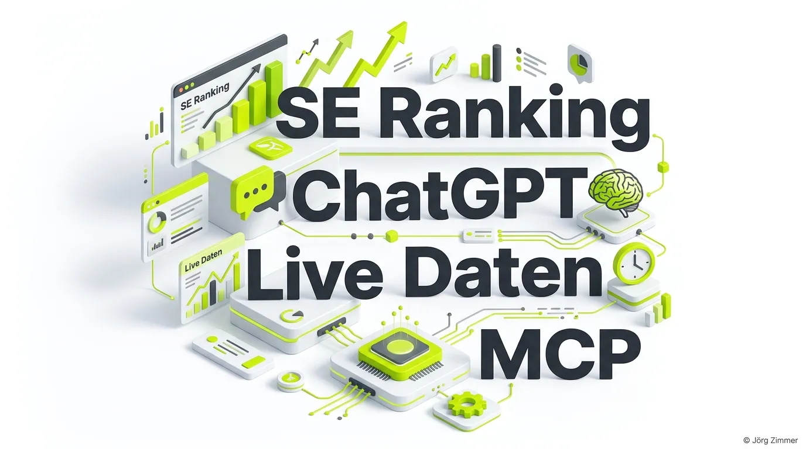

Moin! 🌻

Ja, ich bin ein echter Fan vom SEO-Tool SE Ranking. Es macht mir einfach extrem Freude, wie proaktiv die Entwickler dort vorwärts gehen. Jetzt habe ich schon wieder eine neue Funktion entdeckt, die unsere Arbeit massiv beschleunigt: Die haben im ChatGPT Store eine komplett eigene App.

ChatGPT mit Profi-SEO-Daten nutzen? Genau das geht jetzt. Mit nur **1 Klick** chatte ich mit den echten Live SEO-Daten direkt im KI-Interface.

## SEO per MCP Connector ist voll im Trend

Es ist kein Geheimnis mehr: Wir bewegen uns weg von reinen Dashboards und hin zu interaktiven KI-Analysen. Egal ob über [Claude Code via SE Ranking API](/blog/se-ranking-api-claude-code-praxis-test/) oder eben direkt in ChatGPT – SEO per **MCP Connector** (Model Context Protocol) ist gerade voll im Trend. 

Anstatt mühsam CSV-Dateien zu exportieren, stellst du einfach deine Fragen im Chat und die KI zieht sich die Live-Daten. 

Hier ist mein Partner-Link direkt zur Unterseite mit allen Infos:  
[SE Ranking ChatGPT App ansehen](https://lnkd.in/dHiwStnc) *(Affiliate)*

  
💬 Jörgs SEO-Klartext (LinkedIn Insights)

  
"Alles per Chat erfragen und Pläne schmieden, die exakt zum Projekt passen. Auch zur Wettbewerbsanalyse. Das ist das nächste Level der SEO-Arbeit."

## Was kannst du mit der ChatGPT App analysieren?

Du hast direkt im Chat Zugriff auf die wichtigsten SEO-Metriken, ohne das Tool wechseln zu müssen. Frag die KI einfach nach:

- 💪 **Keywords:** Rankings prüfen, neue Potenziale entdecken und Longtail-Chancen identifizieren.
- 💪 **Backlinks:** Neue Verlinkungen des Wettbewerbs analysieren oder das eigene Linkprofil überwachen.
- 💪 **Domain Performance:** Den allgemeinen Gesundheitszustand und Traffic-Verlauf checken.
- 💪 **Website Audits:** Direkt nachfragen: *"Welche technischen Fehler blockieren gerade mein Ranking?"*
- 💪 **KI-Sichtbarkeit:** Den brandneuen [SE Ranking AI Tracker](/blog/se-ranking-ai-tracker/) nutzen, um zu messen, wie oft du in LLMs erwähnt wirst.

## Tacheles: Warum das deinen Workflow verändert

Wir alle wissen: Der Goldfisch auf Espresso hat keine Zeit mehr für stundenlange Excel-Tabellen. Wenn du in 2 Stunden schnelle, aber fundierte SEO-Entscheidungen treffen musst, ist dieser Workflow Gold wert.

Die KI bereitet die Daten nicht nur auf, sondern interpretiert sie. Du kannst ihr sagen: *"Hier sind meine Live-Daten aus SE Ranking. Mach mir einen Action-Plan für die nächsten 4 Wochen, um meine [KI-Sichtbarkeit](/glossar/ki-sichtbarkeit/) bei Google AI Overviews zu erhöhen."*

Unterm Strich: Wer diesen Hebel nicht nutzt, verschwendet aktiv Zeit. Probier es aus, integriere deine Live-Daten und lass die KI die schwere Analyse-Arbeit machen.

ALOHA! 🌻✌️
