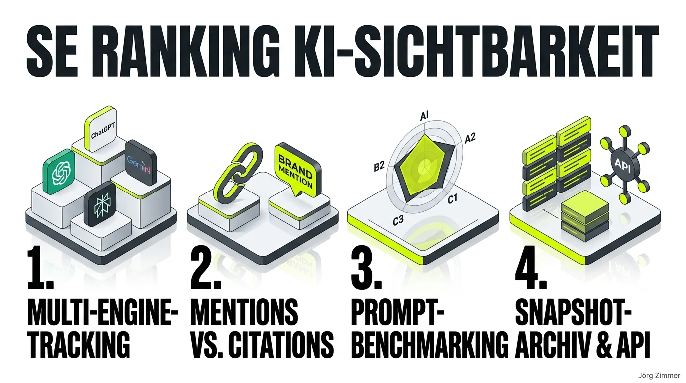

Man kann sich im aktuellen Tool-Dschungel für Search und KI-Sichtbarkeit mühelos verlieren. Nahezu wöchentlich drängen neue Start-ups mit isolierten Nischenlösungen auf den Markt. Als Praktiker schätze ich jedoch zwei Dinge ganz besonders: vertraute, hochstabile Oberflächen und schnelle, durchdachte Innovationen. 

Genau aus diesem Grund läuft das KI-Sichtbarkeitstool von <a href="https://seranking.com/de/se-ranking-for-agencies.html?ga=4169588&source=link" target="_blank" rel="noopener noreferrer nofollow sponsored">SE Ranking (Partnerlink)</a> bei mir im täglichen Praxiseinsatz.

Die Suchlandschaft befindet sich im größten Umbruch seit zwei Jahrzehnten: Es geht längst nicht mehr nur um statische Top-10-Rankings in den blauen Google-Links, sondern um [GEO & Answer Engines](/blog/seo-wird-groesser-geo-welle/). Wir müssen als Berater und Agenturen auf Knopfdruck wissen, ob und in welchem Kontext unsere Marken in den großen Sprachmodellen als vertrauenswürdige Autorität ausgespielt werden.

### Die 10 Kernstärken des SE Ranking KI-Sichtbarkeits-Trackers

1. **Multi-Engine-Tracking über alle Marktführer:**  
   Das Tool überwacht die Präsenz deiner Marke simultan in den wichtigsten Systemen: Google AI Overviews, Google AI Mode, ChatGPT Search, Google Gemini und Perplexity. Du siehst sofort, welches Modell deine Marke bevorzugt und wo Lücken klaffen.
2. **Saubere Trennung von Mentions und Zitationen:**  
   Das System erfasst und differenziert präzise zwischen verlinkten Quellenangaben (Citations mit Link) und reinen, unverlinkten Markennennungen (Brand Mentions). Im Bereich [AI SEO & GEO](/glossar/ai-seo/) sind beide Werte für die Reputation von zentraler Bedeutung.
3. **Prompt-basiertes Monitoring realer Suchabsichten:**  
   Die Messung erfolgt nicht über isolierte Einzelbegriffe, sondern auf Basis natürlichsprachlicher Prompts. Das zeigt transparent auf, bei welchen konkreten Fragestellungen deine Marke von den LLMs empfohlen wird.
4. **Direktes Wettbewerbs-Benchmarking:**  
   Du kannst die Markenpräsenz deines Unternehmens mit bis zu fünf direkten Mitbewerbern pro Prompt vergleichen. So siehst du auf einen Blick, welche Konkurrenten in Perplexity oder ChatGPT den Answer-Share dominieren.
5. **Multilinguale Quellenanalyse:**  
   Das Tool analysiert die von den KIs herangezogenen Domains (Fachportale, Medien, Foren, Fachblogs) in aktuell sieben Zielmärkten und fünf Sprachen. Das liefert wertvolle Impulse für gezielten Marken- und Beziehungsaufbau.
6. **Revisionssicheres Snapshot-Archiv:**  
   SE Ranking speichert die vollständigen generierten Antworten inklusive Zeitstempel ab. Du kannst jederzeit nachvollziehen, mit welcher Argumentation ein Sprachmodell deine Marke vor drei Monaten erwähnt hat.
7. **Historische Trenddaten und Verlaufsanalysen:**  
   Die Entwicklung von Nennungen, Zitationsraten und durchschnittlichen Positionen wird kontinuierlich aufgezeichnet. Damit lässt sich der langfristige ROI von Branding- und Content-Maßnahmen glasklar belegen.
8. **Realitätsnahes UI-Monitoring:**  
   Die Datenabfragen simulieren echte Nutzerumgebungen. Dies verhindert, dass manipulierte API-Stubs erfasst werden, und sichert Ergebnisse, die der tatsächlichen Nutzererfahrung entsprechen.
9. **Nahtlose All-in-One Plattform-Integration:**  
   Die KI-Metriken sind direkt im vertrauten Ökosystem mit klassischem Rank-Tracking, Onpage-Audits und Backlink-Analysen verzahnt. Kein lästiger Tool-Wechsel zwischen verschiedenen Anbietern.
10. **Offene API & MCP-Anbindung für Entwickler:**  
    Alle Daten lassen sich über die AI Search API exportieren. Über standardisierte Schnittstellen können Coding-Assistenten und KI-Agenten die Sichtbarkeitsdaten direkt abfragen, wie wir es bereits im [SE Ranking im Praxistest](/blog/se-ranking-chatgpt-app/) gezeigt haben.

### Vergleich: Klassisches Rank-Tracking vs. Modernes KI-Sichtbarkeits-Tracking

| Dimension | Klassisches Google-Ranking | KI-Sichtbarkeits-Tracking (GEO) |
| :--- | :--- | :--- |
| **Abfrage-Format** | Starre Short- & Midtail-Keywords | Ausführliche Prompts & Konversations-Fragen |
| **Ergebnis-Typ** | Feste URL-Positionen 1 bis 100 | Synthetische Antworten mit Quellenverweisen |
| **Erfolgsmetrik** | Klickrate (CTR) & Rankingposition | Citations, Brand Mentions & Empfehlungs-Share |
| **Zielsysteme** | Google & Bing Websuche | ChatGPT, Perplexity, Gemini, Google AIO |
| **Wettbewerbsfokus** | Direkte SERP-Wettbewerber | Zitationsquellen & autoritäre Wissens-Graphen |

### Community-Einblick: GEO ist Reputationsarbeit, nicht nur Technik

Als ich diese Übersicht auf LinkedIn geteilt habe, brachte Kollege Martin Pickert eine hochgradig spannende Perspektive in die Debatte ein:

  
💬 Martin Pickert (LinkedIn Kommentar):

  <blockquote class="italic text-dark mb-0 border-l-4 border-lime-accent pl-4">
    „Starke Übersicht, danke dafür. Bei mir läuft trotzdem ein selbstgebautes Analyse-Tool. Nicht weil die gängigen Tools schlecht wären, sondern weil sie mir nicht reichen. Die Tools zählen zuverlässig, ob und wo eine Marke vorkommt. Mich interessiert, wie sie vorkommt: Hervorhebung, Tonalität, Eigenschaftsvielfalt, zusammen mit Nennungsrate und Platzierung verdichtet zu einem Reputationsindex von 0 bis 100. Dafür gab es kein Tool von der Stange. GEO ist für mich aber auch Reputationsarbeit, nicht nur ein SEO-Derivat. Dennoch bin ich SE-Ranking-Kunde und liebe die Arbeit via MCP. Für mich aktuell das in GEO stärkste SEO-Tool.“
  </blockquote>

Martins Einwand trifft den Kern der modernen Suchlandschaft: Reine Nennungen sind die Pflicht, aber die Tonalität (Sentiment) und der Kontext einer KI-Empfehlung entscheiden über den betriebswirtschaftlichen Erfolg. Spezialisierte Lösungen wie [Rankscale AI Visibility](/blog/rankscale-update-agency-api-chatgpt/) vertiefen diesen Fokus auf Prompts und LLM-Scores. Für Freelancer und Agenturen, die jedoch ein robustes Gesamtpaket suchen, bietet SE Ranking derzeit den komplettesten Werkzeugkasten am Markt.

<figure class="my-8 bg-neutral-50 border border-neutral-200 p-6 md:p-8 rounded-2xl shadow-sm">
  

    
    

      <h4 class="font-bold text-base md:text-lg text-dark mb-0">Jörg Zimmer</h4>
      
Senior SEO & AI Search Consultant

    

  

  <blockquote class="text-base md:text-lg text-dark leading-relaxed italic border-l-4 border-lime-accent pl-4 my-4 font-normal">
    „Aber war das den vorher abzusehen auch vielleicht im Recruitingprozess oder warst du hast jetzt so, wenn du zurück reflektierst, warst du vielleicht zu blauäugig, zu naiv oder hätte man das absehen können oder war das total nicht ersichtlich, dass sowas passieren? Ja, hät ich hätte ich absehen können, hätte ich es wahrscheinlich äh nicht gemacht.“
  </blockquote>
  <figcaption class="mt-4 pt-3 border-t border-neutral-200/60 flex flex-wrap items-center justify-between gap-2 text-xs text-neutral-500">
    

      Experten-Zitat • <cite class="not-italic font-semibold text-neutral-700">Jörg Zimmer</cite>
      •
      <a href="https://www.youtube.com/watch?v=dVGOMAVUNQk&t=1544s" target="_blank" rel="noopener noreferrer" class="text-neutral-600 hover:text-dark underline inline-flex items-center gap-1">
        Quelle: YouTube SEOPresso (25:44)
        <svg class="w-3 h-3 text-neutral-400" fill="none" stroke="currentColor" viewBox="0 0 24 24"><path stroke-linecap="round" stroke-linejoin="round" stroke-width="2" d="M10 6H6a2 2 0 00-2 2v10a2 2 0 002 2h10a2 2 0 002-2v-4M14 4h6m0 0v6m0-6L10 14" /></svg>
      </a>
    

    <a href="https://www.linkedin.com/in/joerg-zimmer-seo-sea-freelancer-berlin-spandau/" target="_blank" rel="noopener noreferrer" class="font-bold text-lime-700 hover:underline inline-flex items-center gap-1 shrink-0">
      Jörg Zimmer auf LinkedIn folgen →
    </a>
  </figcaption>
</figure>

### Kernaussage für zukunftssichere Agenturarbeit

Wer seine Kunden professionell durch die Transformation zur generativen Suche begleiten möchte, benötigt belastbare Datenpunkte statt Vermutungen. Im [SE Ranking Tool-Glossar](/glossar/se-ranking/) findest du vertiefende Einblicke in die Architektur. Das KI-Sichtbarkeits-Modul schließt die Brücke zwischen der etablierten Google-Welt und den neuen Konversations-Engines.

  <h3 class="text-xl font-bold text-dark mb-2 !mt-0 !border-none !pb-0">Jetzt das KI-Sichtbarkeits-Tool von SE Ranking testen</h3>
  
Möchtest du genau wissen, wie deine Marke oder deine Kunden in ChatGPT, Perplexity und Google AI Overviews abschneiden? Nutze meinen offiziellen Partner-Link für einen unverbindlichen Einblick:

  <a href="https://seranking.com/de/se-ranking-for-agencies.html?ga=4169588&source=link" target="_blank" rel="noopener noreferrer nofollow sponsored" class="btn-primary inline-flex">SE Ranking Agentur- & KI-Suite ansehen → (Partnerlink)</a>
  
* Hinweis: Partnerlink. Bei Buchung erhalte ich eine Provision – für dich entstehen keine Mehrkosten.

<!-- CTA Box -->

  <h3 class="text-xl md:text-2xl font-bold text-white mb-3 !mt-0 !border-none !pb-0">
    SE Ranking KI-Sichtbarkeits-Tools entdecken
  </h3>
  

    Schütze und steigere deine Markensichtbarkeit in modernen KI-Antwortmaschinen – 14 Tage unverbindlich und ohne Kreditkarte testen.
  

  <a href="https://seranking.com/de/ki-sichtbarkeit-tools.html?ga=4169588&source=ki-sichtbarkeit" target="_blank" rel="noopener noreferrer nofollow sponsored" class="btn-primary">
    <svg class="w-4 h-4 fill-current" viewBox="0 0 24 24"><path d="M12 2L2 7l10 5 10-5-10-5zM2 17l10 5 10-5M2 12l10 5 10-5"/></svg>
    Jetzt KI-Sichtbarkeit testen * (Partnerlink)
    →
  </a>
  
* Hinweis: Partnerlink. Bei Buchung erhalte ich eine Provision – für dich entstehen keine Mehrkosten.

