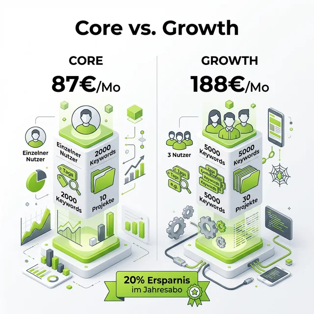

Moin! 🌻

Wer mich kennt, weiß: Ich bin ein Fan von Tools, die nicht nur glänzen, sondern auch im harten Projektalltag abliefern. In den letzten Wochen kamen immer wieder Fragen aus meiner Community und von Kunden: "Jörg, SE Ranking sieht ja spannend aus, aber welche der vielen Preis-Optionen brauche ich eigentlich wirklich?"

Gerade wenn man von den "Platzhirschen" wie Sistrix oder Semrush kommt, wirkt die Preisstruktur von <a href="https://seranking.com/de/?ga=4169588&source=link" target="_blank" rel="noopener noreferrer">SE Ranking</a> auf den ersten Blick fast schon zu günstig. Aber Vorsicht – günstig heißt hier nicht billig. Wer blind bucht, lässt entweder Features liegen oder zahlt für Kapazitäten, die er nie nutzt. In den letzten 24 Jahren habe ich so manchen Strategie-Wechsel bei Tool-Anbietern miterlebt, und SE Ranking ist aktuell einer der Player, der den Markt ordentlich aufmischt.

  
 Jörgs SEO-Klartext (LinkedIn Insights)

  
"Günstige Tools sind nur dann gut, wenn du weißt, was du tust. Wer blind bucht, verbrennt auch bei kleinen Preisen viel Geld."

Deshalb habe ich mir die aktuellen **SE Ranking Preise** für 2026 mal ganz genau angeschaut. Schnapp dir einen Kaffee, wir gehen tief in die Pakete Core und Growth.

## Warum die Preisgestaltung bei SEO-Tools 2026 komplexer ist als früher

Früher war alles einfach: Man hat primär für reine Keyword-Abfragen bezahlt. Heute, im Jahr 2026, spielt die Musik woanders. Wir reden über **AI Visibility (GEO)**, Cloud-Ressourcen für Content-Analysen und API-Credits für automatisierte Reportings. SEO-Tools sind heute eher Daten-Ökosysteme. 

SE Ranking hat das verstanden und seine Tarife so gestrickt, dass sie mit deinen Projekten mitwachsen. Aber genau hier liegt der Hund begraben: Welches Paket "atmet" mit dir mit und welches schnürt dir nur das Budget ab?

---

## Der große Check: Core vs. Growth – Was steckt drin?

SE Ranking unterscheidet primär zwischen verschiedenen Zielgruppen. Während das **Core-Paket** auf Einzelkämpfer und kleinere Marketing-Teams zielt, ist **Growth** die Maschine für Agenturen und Multi-Client-Management.

Hier sind die harten Fakten aus dem aktuellen Preis-Tableau (bei jährlicher Zahlung sparst du übrigens satte 20 %):

### 1. Der Core-Tarif: Der perfekte Einstieg (87,20 € / Monat)
Dieser Tarif ist das "Arbeitstier" für SEO-Freelancer oder Inhouse-Marketer, die eine überschaubare Anzahl an Projekten betreuen.

*   **Projekte:** 10 Projekte & 1 Manager-Platz.
*   **Keywords:** 2.000 Keywords (inkl. 100 Prompts im täglichen Tracking). Das ist eine ordentliche Hausnummer für den Einstieg. 
*   **GEO-Recherche:** 5 Domains – absolut essenziell, wenn du lokales SEO für deine Kunden machst. 
*   **Website-Audit:** 250.000 Seiten pro Monat. Das reicht für die meisten mittelständischen Websites locker aus.

**Meiner Meinung nach:**
Wenn du dich um deine eigene Brand oder eine Handvoll Kunden kümmerst, fährst du hier goldrichtig. Du hast alle wesentlichen Tools wie Rank-Tracking, KI-Analysen und Onpage-Audits an Bord. Besonders stark: Die Integrationen für Looker Studio und Google Search Console sind hier bereits enthalten. Das spart dir das Geld für externe Connector-Tools.

### 2. Der Growth-Tarif: Die Agentur-Lösung (188,00 € / Monat)
Hier fängt der Spaß für alle an, die skalieren wollen. Growth bedeutet Automatisierung und Zusammenarbeit.

*   **Alles aus Core plus:**
*   **Projekte:** 30 Projekte & 3 Manager-Plätze. Perfekt für Agenturen mit mehreren SEO-Managern.
*   **Keywords:** 5.000 Keywords & 250 AI-Prompts täglich. Wer seine Content-Strategie massiv auf KI stützt, braucht diesen Puffer.
*   **GEO-Recherche:** 15 Domains.
*   **Website-Audit:** 2 Millionen Seiten pro Monat. Damit kannst du auch größere E-Commerce-Plattformen problemlos crawlen.

**Die "Killer-Features" im Growth-Tarif:**
Was diesen Tarif wirklich abhebt, sind die **historischen Daten**. Du kannst Trends über die gesamte Projektlaufzeit verfolgen – extrem wichtig für professionelle Reportings und Strategie-Präsentationen. Dazu kommen Gast-Links für Kunden (kein Hin- und Hergeschicke von PDFs mehr!) und der API-Zugriff mit 100.000 Credits. Wer Prozesse automatisieren will oder eigene Dashboards baut, kommt an Growth nicht vorbei.

---

## Warum SE Ranking preislich die Nase vorn hat

Was SE Ranking so attraktiv macht, ist die Flexibilität. Brauchst du mehr Kapazität? Du kannst jederzeit flexibel erweitern, ohne direkt in den nächsten vierstelligen Agentur-Tarif springen zu müssen. In einer Welt, in der Budgets oft kurzfristig angepasst werden, ist das ein riesiger Vorteil.

Besonders hervorzuheben ist die **KI-Integration**. Dass man im Core-Paket bereits 100 Prompts für das tägliche Tracking hat, zeigt, dass SE Ranking den Trend zu AI-SEO verstanden hat. Ich habe darüber neulich erst in meinem Artikel zum [SE Ranking AI Tracker](/blog/se-ranking-ai-tracker/) geschrieben – schau da unbedingt mal rein, wenn dich die Zukunft der Suche interessiert. 

> Die KI verändert nicht nur, wie wir suchen, sondern auch, wie wir den Erfolg unserer Arbeit messen. Wer heute noch auf "Standard-Rankings" fixiert ist, verliert den Anschluss. – Jörg Zimmer

---

## Die 14-Tage-Testphase: Dein risikoloser Einstieg

Ich sage immer: Vertrauen ist gut, Daten sind besser. Bevor du dich für ein Jahresabo entscheidest (trotz der 20 % Ersparnis), teste das Tool auf Herz und Nieren.

Über meinen Affiliate-Link bekommst du eine **kostenlose Testphase von 14 Tagen**. Das Beste daran: Du musst **keine Kreditkarte** hinterlegen. Kein fieses "Ups, ich hab vergessen zu kündigen"-Abo. Nach 14 Tagen läuft der Test einfach aus, es sei denn, du bist so überzeugt wie ich und willst weitermachen.

  <h3>Jetzt SE Ranking 14 Tage kostenlos testen</h3>
  
Überzeuge dich selbst von der Power des Tools – ohne Risiko und ohne Kreditkarte.

  <a href="https://seranking.com/de/?ga=4169588&source=link" target="_blank" rel="noopener noreferrer" class="btn-primary inline-flex mt-4 no-underline">
    Kostenlos Testen starten 
  </a>

---

### Tacheles am Ende

Meine persönliche Empfehlung nach 24 Jahren im Business:
*   Bist du **Einzelkämpfer, Affiliate-Marketer oder Inhouse-Optimierer** für eine Marke? Start mit **Core**. Die Ersparnis gegenüber anderen Tools ist massiv, ohne dass du auf Qualität verzichtest.
*   Betreust du **eine wachsende Anzahl an Kunden** oder brauchst du **API-Zugriff** für eigene Dashboards und automatisierte Reports? Dann ist **Growth** dein Tarif. Die historischen Daten allein sind den Aufpreis für professionelles Reporting wert.

SE Ranking hat mit dieser Preisgestaltung einen "Sweet Spot" getroffen. Es ist teuer genug, um Profi-Ansprüchen zu genügen, aber günstig genug, um nicht das komplette Marketing-Budget aufzufressen.

Was meinst du? Reichen dir 2.000 Keywords für deine Projekte aus oder brauchst du die Power des Growth-Tarifs? Schreib mir deine Meinung auf LinkedIn – ich bin gespannt auf dein Feedback!

ALOHA 🌻! 🌻

---

### Weiterführende Artikel
* **Lese-Tipp:** [SE Ranking launcht AI Tracker: Rankings in der KI-Suche messen](/blog/se-ranking-ai-tracker/)
* **Lese-Tipp:** [Sistrix vs. SE Ranking: Kann das Tool den Platzhirsch ersetzen?](/blog/sistrix-vs-se-ranking/)
* **Lese-Tipp:** [Warum die interne Verlinkung so wichtig ist](/glossar/interne-verlinkung/)
