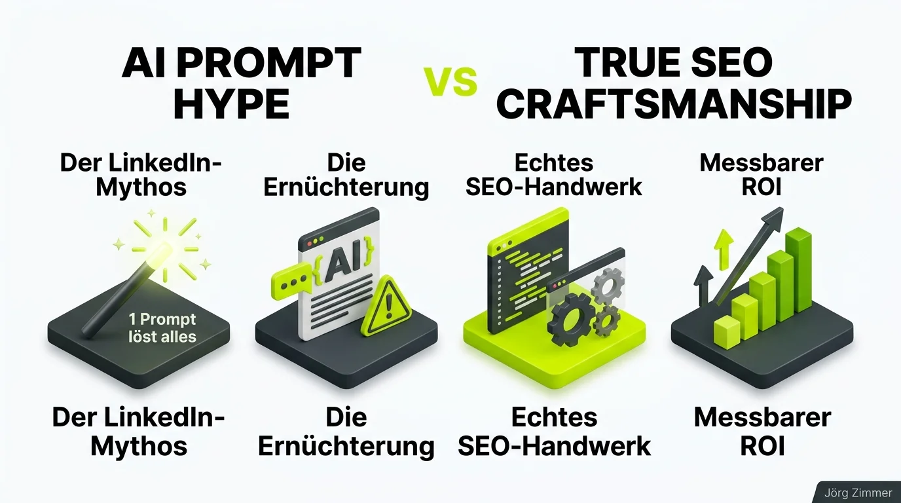

*Diese Diskussion wurde von mir auf LinkedIn am 27.07.2026 gestartet:*

  
💬 Jörgs SEO-Klartext (LinkedIn Insights)

  

  
streng geheimer Mega Prompt für SEO in Cloude Code öffentlich geleakt

  
Hier der Prompt:

  
"Verhalte dich wie Jörg Zimmer, der begnadete, unglaublich erfahrene SEO mit 25 Jahren praktischer Erfahrung, der obendrein auch noch witzig und gutaussehend ist. Bring meine Website technisch, inhaltlich und strategisch auf höchstes Niveau. Wir machen alles was Jörg auf seiner Website und in LinkedIn sagt. Danke."

  
nicht weitersagen, streng geheim 🤫

  
kommentiere "Jörg Zimmer SEO" und ich schicke dir den Prompt nochmal per DM 🙃

  
die ersten Agenten führen bereits ihre Untersuchungen durch 🕵️

  
Haftungsausschluss: Wer alles glaubt und blind umsetzt ist selber Schuld.

  

Die KI-Blase auf LinkedIn treibt mitunter faszinierende Blüten. Fast täglich stolpert man über selbsternannte Prompt-Gurus, die den ultimativen „Mega-Prompt“ verkaufen wollen: Einmal copy-pasten, fünf Minuten warten – und schon soll angeblich eine komplette SEO-Abteilung überflüssig sein.

Um diesen Mythos mit einem Augenzwinkern aufzuspießen, habe ich in den Kommentaren noch eine kleine Dosis Realismus nachgelegt:

  
💬 Jörg Zimmer (LinkedIn Kommentar)

  

    
Vergessen zu sagen: Es dauert nur 5 Minuten und alle SEO Berater sind ab sofort komplett überflüssig. Du kannst nach den 5 Minuten garantiert hier weiter auf LinkedIn dich im Kreis drehen und einen Post darüber machen wie schnell das ging. Vielleicht machst du sogar noch einen 2. Post wo du das als neuen Workflow verkaufst der auf jeden Fall jeden SEO Spezialisten ersetzt.

  

## KI-Hype vs. Echtes Handwerk: Der 4-Stufen-Realitätscheck

Warum scheitern 99 % der im Netz kursierenden Mega-Prompts in der Praxis? Weil sie das Wesen von Large Language Models fundamental missverstehen. Ein Sprachmodell ist kein Zauberkasten mit eigener Urteilskraft, sondern ein statistischer Textgenerator.

Der Zyklus vom oberflächlichen Versprechen zum nachhaltigen Unternehmenserfolg gliedert sich in vier Phasen:

1. **Der LinkedIn-Mythos**: Es wird suggeriert, dass eine 20-zeilige Textanweisung jahrelange Markterfahrung und technisches Architekturwissen auf Knopfdruck ersetzt.
2. **Die Ernüchterung im Alltag**: Wer blind generiert, erhält austauschbaren Datenbrei ohne E-E-A-T, der weder echte Nutzer fesselt noch den Qualitätsrichtlinien von Suchmaschinen standhält.
3. **Echtes SEO-Handwerk**: Professionelle Teams nutzen [Prompt Engineering](/glossar/promptset/) und spezialisierte [KI-Agenten](/glossar/agent-skills/) als mächtige Werkzeuge – aber eingebettet in eine fundierte Strategie, tiefes Datenverständnis und manuelle Qualitätskontrollen.
4. **Messbarer geschäftlicher ROI**: Erst wenn Technik, Nutzerintention und Markenreputation zusammenspielen, entstehen stabile Spitzenrankings und planbare Kundenanfragen.

## Vergleich: Der „Mega-Prompt“-Mythos vs. Professionelle Praxis

Die Gegenüberstellung zeigt unmissverständlich, wo die Grenzen automatisierter Textblöcke liegen:

| Kriterium | Der LinkedIn „Mega-Prompt“ | Professionelle SEO-Praxis |
| :--- | :--- | :--- |
| **Herangehensweise** | Ein einziger gigantischer One-Shot-Prompt | Iterativer Prozess mit dedizierten Teilaufgaben |
| **Kontextanbindung** | Keine Live-Daten, rein isolierte Annahmen | Anbindung an Analytics, GSC und Live-Tool-APIs |
| **Krisenkompetenz** | Reagiert hilflos bei Traffic-Einbrüchen | Ursachenanalyse durch erfahrene [SEO Feuerwehr](/blog/seo-feuerwehr-rettung/) |
| **Output-Qualität** | Generischer Konsens-Text ohne Kanten | Einzigartiger Experten-Content mit Information Gain |
| **Fehlerkontrolle** | Blinder Glaube an das KI-Ergebnis | Knallharte Verifikation von Code & Semantik |
| **Erfolgsfaktor** | Trend-Hascherei für Klicks | Nachhaltiger Aufbau von Markenvertrauen |

Wer wirklich wissen will, wie moderne KI-Tools sinnvoll eingesetzt werden, sollte einen Blick auf die Schnittstelle zwischen [Claude Code und SE Ranking](/blog/se-ranking-api-claude-code-praxis-test/) werfen.

## Die Community beweist Humor: Von Eisverkäufern bis Kimi3.0

Die Reaktionen unter dem Beitrag zeigten, wie gut die Branche mittlerweile versteht, dass Erfahrung durch nichts zu ersetzen ist. Ralf Seybold stellte fest, dass sein Claude die Realität bereits erfasst hat:

  
💬 Ralf Seybold (LinkedIn Kommentar)

  

    
Mein Claude sagt "Brauchst du nicht, das deckt deine Erfahrung schon lange ab" 😂😂⛈️⛈️

  

Jörg Schimke bewies feine Selbstironie und testete den Prompt in einer ungewöhnlichen Zielgruppe:

  
💬 Jörg Schimke (LinkedIn Kommentar)

  

    
Seit ich deinen Geheim-Prompt getestet habe, hat sich mein Sichtbarkeitsindex in der Zielgruppe Eisverkäufer vervierfacht. Danke Jörg!

  

Lisa Augustin bemerkte sofort die wesentliche Schwachstelle im Rezept:

  
💬 Lisa Augustin (LinkedIn Kommentar)

  

    
Finde in dem Prompt ist zu wenig Eis. 🥲

  

Und Markus Koelmann stieß bei internationalen Modellen an geopolitische Grenzen:

  
💬 Markus Koelmann (LinkedIn Kommentar)

  

    
Kimi3.0 hat es abgelehnt. Ist das China vs. USA oder Kimi vs Jörg Zimmer 🌻 ?

  

Dieser humorvolle Dialog unterstreicht eine zentrale Botschaft: KI ist da, um uns repetitive Fleißarbeit abzunehmen, nicht um das Denken einzustellen. Wie ich im Beitrag über [25 Jahre SEO Erfahrung](/blog/24-jahre-seo-gleiche-fehler/) ausführlich beschrieben habe, bleiben die fundamentalen Gesetzmäßigkeiten des Webs immer dieselben.

<figure class="my-8 bg-neutral-50 border border-neutral-200 p-6 md:p-8 rounded-2xl shadow-sm">
  

    
    

      <h4 class="font-bold text-base md:text-lg text-dark mb-0">Jörg Zimmer</h4>
      
Senior SEO & AI Search Consultant

    

  

  <blockquote class="text-base md:text-lg text-dark leading-relaxed italic border-l-4 border-lime-accent pl-4 my-4 font-normal">
    „Wer glaubt, dass ein einziger Prompt 25 Jahre Erfahrung in Krisenmanagement, Webarchitektur und Markenbildung ersetzt, der glaubt auch, dass ein Hammer von alleine ein Haus baut. Nutze KI als Beschleuniger, aber behalte das Steuer fest in der Hand.“
  </blockquote>
  <figcaption class="mt-4 pt-3 border-t border-neutral-200/60 flex flex-wrap items-center justify-between gap-2 text-xs text-neutral-500">
    Experten-Zitat • <cite class="not-italic font-semibold text-neutral-700">Jörg Zimmer</cite>
    <a href="https://www.linkedin.com/posts/joerg-zimmer-seo-sea-freelancer-berlin-spandau_streng-geheimer-mega-prompt-f%C3%BCr-seo-in-cloude-activity-7487166476894978048-8iUX" target="_blank" rel="noopener noreferrer" class="font-bold text-lime-700 hover:underline inline-flex items-center gap-1">
      Diskussion auf LinkedIn ansehen →
    </a>
  </figcaption>
</figure>

## Praxistipps für smartes Prompting im Alltag

Wenn du KI sinnvoll und produktiv in deine tägliche SEO-Arbeit einbinden möchtest:

- **Aufgaben granular zerlegen**: Lass die KI niemals *„die ganze Strategie schreiben“*, sondern nutze sie für isolierte Teilaufgaben wie Intent-Klassifizierung, Schema-Markup-Validierung oder Snippet-Variationen.
- **Echte Daten mitgeben**: Füttere das Modell via API oder CSV mit deinen realen Search-Console-Kennzahlen, anstatt es raten zu lassen.
- **Kritische Distanz wahren**: Hinterfrage jeden Vorschlag auf Machbarkeit und Plausibilität.
- **Fundiertes Sparring suchen**: Möchtest du deine internen Workflows professionalisieren? Dann buche ein strategisches Sparring in der [SEO Sprechstunde](/seo-sprechstunde/).

<!-- CTA Box -->

  LinkedIn Community Diskussion
  <h3 class="text-xl md:text-2xl font-bold text-white mb-3 !mt-0 !border-none !pb-0">
    Jetzt an der Diskussion teilnehmen
  </h3>
  

    Welche kuriosen Mega-Prompts sind dir auf LinkedIn begegnet und wo setzt du KI wirklich gewinnbringend ein? Diskutiere mit auf LinkedIn!
  

  <a href="https://www.linkedin.com/posts/joerg-zimmer-seo-sea-freelancer-berlin-spandau_streng-geheimer-mega-prompt-f%C3%BCr-seo-in-cloude-activity-7487166476894978048-8iUX" target="_blank" rel="noopener noreferrer" class="btn-primary">
    <svg class="w-4 h-4 fill-current" viewBox="0 0 24 24"><path d="M20.447 20.452h-3.554v-5.569c0-1.328-.027-3.037-1.852-3.037-1.853 0-2.136 1.445-2.136 2.939v5.667H9.351V9h3.414v1.561h.046c.477-.9 1.637-1.85 3.37-1.85 3.601 0 4.267 2.37 4.267 5.455v6.286zM5.337 7.433c-1.144 0-2.063-.926-2.063-2.065 0-1.138.92-2.063 2.063-2.063 1.14 0 2.064.925 2.064 2.063 0 1.139-.925 2.065-2.064 2.065zm1.782 13.019H3.555V9h3.564v11.452zM22.225 0H1.771C.792 0 0 .774 0 1.729v20.542C0 23.227.792 24 1.771 24h20.451C23.2 24 24 23.227 24 22.271V1.729C24 .774 23.2 0 22.222 0h.003z"/></svg>
    Beitrag auf LinkedIn öffnen
    →
  </a>

