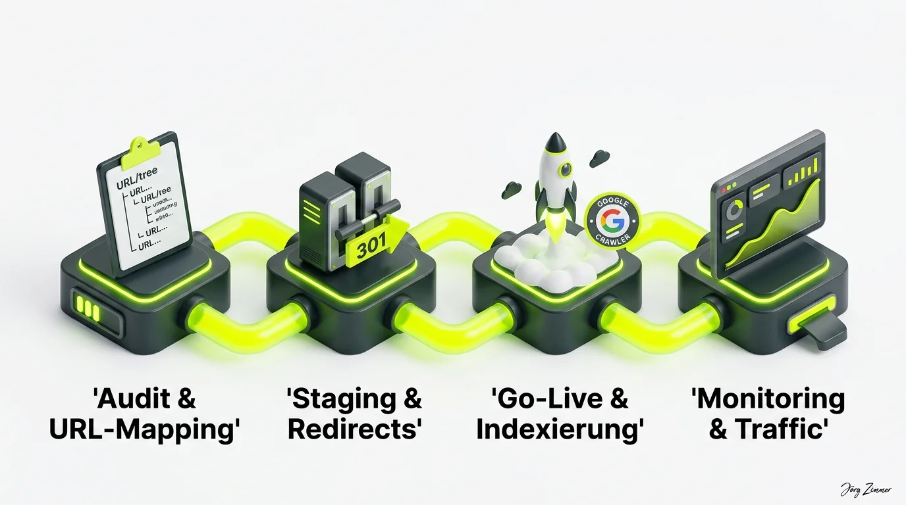

Es ist Zeit für einen bitteren Klassiker der digitalen Wirtschaft: Mindestens einmal im Jahr erlebe ich ein Projekt, bei dem hochbezahlte Marketingleiter und Agenturteams denselben gravierenden Fehler wiederholen – sie launchen eine aufwendig gestaltete Website völlig ohne professionelle SEO-Begleitung.

Das Ergebnis ist fast ausnahmslos ein Schock: Zwei Wochen nach dem feierlichen Launch-Event bricht der organische Traffic um 60 bis 80 Prozent ein. Die Leads bleiben aus, der Umsatz sackt ab, und in der Chefetage bricht Hektik aus.

Dabei war alles so vielversprechend: Das neue Design sieht auf modernen Displays fantastisch aus, die Geschäftsführung hat stolz auf LinkedIn gratuliert, und das Designbüro feiert den stylischen Look. Doch wenn die Kunden über Suchmaschinen plötzlich vor digitalen Absperrgittern stehen, hilft das schönste Corporate Design nichts.

<figure class="my-8 bg-neutral-50 border border-neutral-200 p-6 md:p-8 rounded-2xl shadow-sm">
  

    
    

      <h4 class="font-bold text-base md:text-lg text-dark mb-0">Jörg Zimmer</h4>
      
Senior SEO & AI Search Consultant

    

  

  <blockquote class="text-base md:text-lg text-dark leading-relaxed italic border-l-4 border-lime-accent pl-4 my-4 font-normal">
    „Was ich bis heute nicht verstanden habe, kleiner Karlauer, wenn du es so möchtest, was ich bis heute nicht verstanden habe, wie Leute ein Relaune machen können, ohne einen SEO zu befragen. Ähm ja, also dieses Unverständnis, dass ich baue eine Webseite, die einen ja einen einen Web darstellt, einen Netz, ein Spinnennetz und dann kommen da die die die Relounge.“
  </blockquote>
  <figcaption class="mt-4 pt-3 border-t border-neutral-200/60 flex flex-wrap items-center justify-between gap-2 text-xs text-neutral-500">
    

      Experten-Zitat • <cite class="not-italic font-semibold text-neutral-700">Jörg Zimmer</cite>
      •
      <a href="https://www.youtube.com/watch?v=dVGOMAVUNQk&t=652s" target="_blank" rel="noopener noreferrer" class="text-neutral-600 hover:text-dark underline inline-flex items-center gap-1">
        Quelle: YouTube SEOPresso (10:52)
        <svg class="w-3 h-3 text-neutral-400" fill="none" stroke="currentColor" viewBox="0 0 24 24"><path stroke-linecap="round" stroke-linejoin="round" stroke-width="2" d="M10 6H6a2 2 0 00-2 2v10a2 2 0 002 2h10a2 2 0 002-2v-4M14 4h6m0 0v6m0-6L10 14" /></svg>
      </a>
    

    <a href="https://www.linkedin.com/in/joerg-zimmer-seo-sea-freelancer-berlin-spandau/" target="_blank" rel="noopener noreferrer" class="font-bold text-lime-700 hover:underline inline-flex items-center gap-1 shrink-0">
      Jörg Zimmer auf LinkedIn folgen →
    </a>
  </figcaption>
</figure>

## Der Mythos vom Zauberspruch nach dem Launch

Das typische Rettungs-Szenario, das regelmäßig in meiner [SEO-Sprechstunde](/seo-sprechstunde/) landet – wie wir [in zwei Stunden für ein SEO-Potential](/blog/zwei-stunden-seo-potential/) aufdecken, zeigt unser Praxisbericht –, folgt fast immer dem gleichen Muster.

Der verzweifelte Anruf klingt meist so: *„Herr Zimmer, wir haben vor drei Wochen unsere neue Website online gestellt. Seitdem bekommen wir kaum noch Anfragen. Können Sie mal schnell ein paar SEO-Einstellungen anpassen, damit wir wieder oben stehen?“*

An dieser Stelle muss Tacheles geredet werden: **Es gibt keinen Zauberspruch.** Wenn bei einem Relaunch die bestehende URL-Struktur ohne Weiterleitungslogik gekappt wurde, hat Google den alten Indexbestand schlicht gelöscht. Bis neue Seiten denselben organischen Vertrauensstatus aufbauen, vergehen ohne präzises Gegensteuern viele Monate.

## Die häufigsten Relaunch-Katastrophen in der Übersicht

Aus Dutzenden Audit-Projekten kenne ich die typischen Fehlerquellen, die bei unbegleiteten Relaunches immer wieder auftreten:

| Relaunch-Fehler | Technische Ursache | Wirtschaftliche Auswirkung |
|---|---|---|
| **Vergessene Noindex-Tags** | Staging-Robots-Meta-Tag wird versehentlich auf Produktion belassen. | Vollständiger Rauswurf der Domain aus dem Google-Index binnen Tagen. |
| **Fehlende 301-Redirects** | URLs werden geändert, alte Adressen laufen auf HTTP 404 Fehlerseiten. | Sofortiger Totalverlust von aufgebautem [Linkjuice](/glossar/linkjuice/) und Rankings. |
| **JavaScript-Renderblockaden** | Wichtige Navigationselemente und Texte werden rein clientseitig geladen. | Bots erfassen nur leere Hüllen, Inhalte werden von Suchmaschinen ignoriert. |
| **Ungeklärte Konsolen-Rechte** | Unklarheiten bei der [Zuständigkeit für die Google Search Console](/blog/google-search-console-zustaendigkeit-umfrage/). | Fataler Blindflug, keine Erkennung von Crawling- und Indexierungsfehlern. |
| **Pagespeed-Einbruch** | Unoptimierte Riesengrafiken und Drittanbieter-Tracker ruinieren Performance. | Negative Nutzersignale und massive Einbußen bei den [Core Web Vitals](/glossar/core-web-vitals/). |

## Die vier Phasen eines sicheren SEO-Relaunches

Damit ein Website-Relaunch zu einem Hebel für Neukundengewinnung wird, anstatt bestehende Erträge zu gefährden, führen wir Projekte durch vier disziplinierte Phasen:

### 1. Audit & vollständiges URL-Mapping
Bevor auch nur eine Zeile Code geändert wird, crawlen wir den gesamten Ist-Bestand der Website. Jede einzelne rankende URL wird erfasst. In einer Mapping-Matrix wird jeder alten Adresse exakt das neue Pendant zugeordnet. Seiten ohne direkten Nachfolger werden thematisch sinnvoll auf übergeordnete Kategorie-Hubs gemappt.

### 2. Staging-Testing & Redirect-Validierung
Auf der geschützten Staging-Umgebung testen wir das gesamte Weiterleitungskonzept. Wir prüfen, ob Weiterleitungsketten vermieden werden, ob das interne Linking intakt ist und ob [technisches SEO](/glossar/technisches-seo/) bis ins letzte Detail sauber implementiert wurde.

### 3. Go-Live & Indexierungs-Freigabe
Beim DNS-Switch werden alle Sperren wie HTTP-Authentifizierungen und Staging-Noindex-Tags sofort entfernt. Die finale XML-Sitemap wird direkt in der Google Search Console eingereicht und ein systematischer Server-Ping initiiert.

### 4. Post-Launch-Monitoring & Performance
In den ersten 48 bis 72 Stunden nach dem Go-Live überwachen wir Server-Logs, Crawl-Frequenzen und Fehlermeldungen in Echtzeit. Mit professionellen Analyse-Tools wie [SE Ranking (Partnerlink)](https://seranking.com/de/?ga=4169588&source=link) verifizieren wir Ranking-Verläufe, während wir mit [Rankscale (Partnerlink)](https://rankscale.ai/?via=offer) parallel prüfen, ob auch KI-Suchsysteme die neuen Inhalte sofort erfassen.

## Konkrete Empfehlung für anstehende Relaunch-Projekte

Wenn bei dir in den kommenden Monaten ein Relaunch ansteht, beherzige diese Grundregel: Binde SEO-Kompetenz von Tag 1 in das Kernteam ein. 

Ein erfahrener Berater ist kein Verhinderer von modernem Webdesign – im Gegenteil: Er sorgt dafür, dass dein neues Design nicht nur den Designpreis gewinnt, sondern jeden Tag messbare Kundenanfragen generiert.

Stehst du mitten in den Relaunch-Vorbereitungen oder ist der Traffic nach einem Launch bereits eingebrochen? In der [SEO-Sprechstunde](/seo-sprechstunde/) analysieren wir deine Situation und entwickeln sofort wirksame Rettungsmaßnahmen.

<!-- LinkedIn CTA Box -->

  <h3 class="text-xl md:text-2xl font-bold text-white mb-3 !mt-0 !border-none !pb-0">
    Jetzt an der Diskussion teilnehmen
  </h3>
  

    Diskutiere mit Jörg Zimmer und der SEO-Community auf LinkedIn über Relaunch-Erfahrungen und wie man teure Ranking-Abstürze vermeidet.
  

  <a href="https://www.linkedin.com/in/joerg-zimmer-seo-sea-freelancer-berlin-spandau/" target="_blank" rel="noopener noreferrer" class="btn-primary">
    <svg class="w-4 h-4 fill-current" viewBox="0 0 24 24"><path d="M20.447 20.452h-3.554v-5.569c0-1.328-.027-3.037-1.852-3.037-1.853 0-2.136 1.445-2.136 2.939v5.667H9.351V9h3.414v1.561h.046c.477-.9 1.637-1.85 3.37-1.85 3.601 0 4.267 2.37 4.267 5.455v6.286zM5.337 7.433c-1.144 0-2.063-.926-2.063-2.065 0-1.138.92-2.063 2.063-2.063 1.14 0 2.064.925 2.064 2.063 0 1.139-.925 2.065-2.064 2.065zm1.782 13.019H3.555V9h3.564v11.452zM22.225 0H1.771C.792 0 0 .774 0 1.729v20.542C0 23.227.792 24 1.771 24h20.451C23.2 24 24 23.227 24 22.271V1.729C24 .774 23.2 0 22.222 0h.003z"/></svg>
    Beitrag auf LinkedIn öffnen
    →
  </a>

