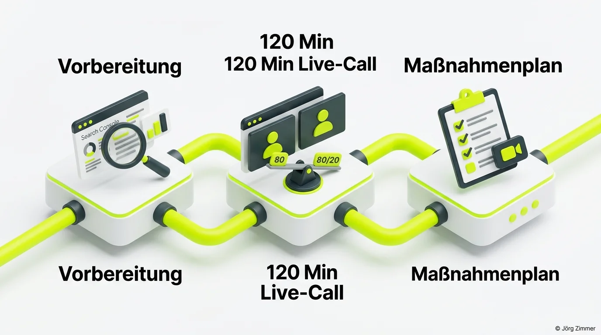

„Was genau machst du eigentlich in diesen zwei Stunden? Ist das nur ein netter Plausch über Google-Rankings?“

Diese Frage höre ich regelmäßig von Unternehmern und Marketingleitern – meist begleitet von berechtigter Skepsis. Im SEO-Markt wird traditionell so viel heiße Luft in Form von bunten, aber nutzlosen 80-Seiten-Audits verkauft, dass man vor jedem Beratungsangebot erst einmal die Brandschutzversicherung prüfen möchte.

Deshalb ist es Zeit für ungeschönten Klartext über das Konzept, den realen Ablauf und den handfesten wirtschaftlichen Hebel der [SEO-Sprechstunde](/seo-sprechstunde/).

## Das Konzept: Deine Website auf dem heißen Grill

Stell dir vor, deine Website ist ein ordentliches Stück Steak – oder ein saftiger Räuchertofu, wenn du pflanzlich unterwegs bist. Von außen sieht die Präsentation im Schaufenster meist passabel aus. Doch ob das Ganze auf den Punkt gegart ist oder im Inneren zäh und unverdaulich bleibt, merkst du erst, wenn Hitze ins Spiel kommt.

Als Berater übernehme ich die Rolle des Grillmeisters. Ich betrachte deine Website von allen drei Seiten:
- **Die Kruste:** Sichtbares Frontend, Benutzerführung, Conversion-Klarheit und visuelle Vertrauenssignale.
- **Die Textur:** Content-Tiefe, thematische Relevanz, Suchintention und die [interne Verlinkung](/glossar/interne-verlinkung/).
- **Der Garraum:** Das technische Fundament, Crawlbarkeit, [Core Web Vitals](/glossar/core-web-vitals/) und saubere Indexierung.

Ich sage dir direkt ins Gesicht, wo dein Projekt verbrennt und an welchen Stellen es noch vollkommen roh ist – ohne Agentur-Schönrednerei und ohne vertriebliche Hintergedanken.

<figure class="my-8 bg-neutral-50 border border-neutral-200 p-6 md:p-8 rounded-2xl shadow-sm">
  

    
    

      <h4 class="font-bold text-base md:text-lg text-dark mb-0">Jörg Zimmer</h4>
      
Senior SEO & AI Search Consultant

    

  

  <blockquote class="text-base md:text-lg text-dark leading-relaxed italic border-l-4 border-lime-accent pl-4 my-4 font-normal">
    „SEO ist eben kein einmaliges Projekt, sondern ein dauerhafter Prozess.“
  </blockquote>
  <figcaption class="mt-4 pt-3 border-t border-neutral-200/60 flex flex-wrap items-center justify-between gap-2 text-xs text-neutral-500">
    

      Experten-Zitat • <cite class="not-italic font-semibold text-neutral-700">Jörg Zimmer</cite>
      •
      <a href="https://www.linkedin.com/feed/update/urn:li:activity:7000899641269452800" target="_blank" rel="noopener noreferrer" class="text-neutral-600 hover:text-dark underline inline-flex items-center gap-1">
        Quelle: LinkedIn-Beitrag von Jörg Zimmer
        <svg class="w-3 h-3 text-neutral-400" fill="none" stroke="currentColor" viewBox="0 0 24 24"><path stroke-linecap="round" stroke-linejoin="round" stroke-width="2" d="M10 6H6a2 2 0 00-2 2v10a2 2 0 002 2h10a2 2 0 002-2v-4M14 4h6m0 0v6m0-6L10 14" /></svg>
      </a>
    

    <a href="https://www.linkedin.com/in/joerg-zimmer-seo-sea-freelancer-berlin-spandau/" target="_blank" rel="noopener noreferrer" class="font-bold text-lime-700 hover:underline inline-flex items-center gap-1 shrink-0">
      Jörg Zimmer auf LinkedIn folgen →
    </a>
  </figcaption>
</figure>

## Der Prozess: Was du für dein Investment erhältst

Die Beratungspauschale von 480 Euro deckt weit mehr ab als reine Telefonzeit. Dahinter steht ein strukturierter dreistufiger Prozess:

| Phase | Konkrete Inhalte | Zeitaufwand & Fokus |
|---|---|---|
| **Vorbereitung (Pre-Call)** | Analyse der Google Search Console, SISTRIX-Historiencheck, Wettbewerbs-Scan | ca. 30 Minuten vor dem Termin |
| **Live-Session (Deep Dive)** | Gemeinsames Screen-Sharing, Beantwortung deiner Fragen, 80/20-Priorisierung | 120 Minuten intensive Arbeitszeit |
| **Nachbereitung (Assets)** | Bereitstellung der Videoaufzeichnung, KI-Summary, individueller Maßnahmenplan | ca. 30 Minuten nach dem Call |

### 1. Die intensive Vorbereitung vor dem Call
Bevor wir uns im Videocall gegenüberstehen, habe ich deine Domain bereits durchleuchtet. Ich prüfe, welche Keywords lukrativen Traffic liefern, wo Rankings unbemerkt wegbringen und wie deine Domain im Vergleich zu direkten Wettbewerbern abschneidet. 

Mit Profi-Plattformen wie [SE Ranking (Partnerlink)](https://seranking.com/de/?ga=4169588&source=link) analysiere ich historische Entwicklungen, während wir über [SE Ranking KI-Sichtbarkeit](/blog/se-ranking-ki-sichtbarkeit/) und Tools wie [Rankscale (Partnerlink)](https://rankscale.ai/?via=offer) parallel prüfen, ob deine Inhalte bereits in KI-Antworten stattfinden. Wenn du den Call betrittst, starten wir nicht bei Null, sondern steigen direkt bei 100 Prozent ein.

### 2. Der 120-Minuten Live-Call: Radikaler Fokus auf Action
Im Call gibt es keine Powerpoint-Vorträge. Wir teilen den Bildschirm und arbeiten direkt an deinem lebenden Projekt:
- *„Sollen wir diese Unterseite komplett umschreiben?“* – *„Nein, der Text ist in Ordnung. Optimiere die H1, setze drei gezielte interne Links und du gewinnst sofort zwei Positionen.“*
- *„Warum stürzen unsere Klicks seit dem letzten Update ab?“* – Wir schauen direkt in die Search Console und identifizieren den exakten Tag, das betroffene Verzeichnis und die Ursache.

Wie viel konkrete Durchschlagskraft in diesem Format steckt, erläutere ich ausführlich im Artikel über [zwei Stunden SEO-Potential](/blog/zwei-stunden-seo-potential/) und in der öffentlichen Live-Session [SEO Sprechstunde: Vibe Coding & Sichtbarkeit](/blog/seo-sprechstunde-never-code-alone/).

### 3. Nachbereitung & Roadmap: Dein Fahrplan für die Umsetzung
Nach dem Termin stehst du nicht mit losen Gedanken da. Du erhältst:
- **Die komplette Videoaufzeichnung:** Schaue dir jede Erklärung deines Calls jederzeit noch einmal an.
- **Die KI-Zusammenfassung:** Ein prägnantes Protokoll aller besprochenen Hebel.
- **Den individuellen Maßnahmenplan:** Ein glasklarer Schlachtplan, den du oder dein Entwickler-Team Schritt für Schritt abarbeiten können.

## Das Urteil der Praxis

Wer einmal eine fundierte Bestandsaufnahme erlebt hat, versteht den Hebel dieses Formats. Wie mein Kunde Ronny nach seiner Session treffend formulierte: *„Der Preis ist absolut gerechtfertigt und spiegelt die jahrzehntelange Erfahrung wider. Wir haben in zwei Stunden mehr Klarheit gewonnen als in monatelangen Agenturschleifen zuvor.“* Seinen vollständigen [Erfahrungsbericht von Ronny](/blog/seo-sprechstunde-bewertung-ronny/) kannst du im Detail nachlesen.

Hör auf, deine Marketing-Entscheidungen auf Mutmaßungen zu stützen. Buche dir deinen Termin und lass uns deine Website auf Herz und Nieren prüfen.

<!-- LinkedIn CTA Box -->

  <h3 class="text-xl md:text-2xl font-bold text-white mb-3 !mt-0 !border-none !pb-0">
    Jetzt an der Diskussion teilnehmen
  </h3>
  

    Diskutiere mit Jörg Zimmer und Unternehmern auf LinkedIn über transparente Beratung, 80/20-Hebel und echte SEO-Ergebnisse.
  

  <a href="https://www.linkedin.com/in/joerg-zimmer-seo-sea-freelancer-berlin-spandau/" target="_blank" rel="noopener noreferrer" class="btn-primary">
    <svg class="w-4 h-4 fill-current" viewBox="0 0 24 24"><path d="M20.447 20.452h-3.554v-5.569c0-1.328-.027-3.037-1.852-3.037-1.853 0-2.136 1.445-2.136 2.939v5.667H9.351V9h3.414v1.561h.046c.477-.9 1.637-1.85 3.37-1.85 3.601 0 4.267 2.37 4.267 5.455v6.286zM5.337 7.433c-1.144 0-2.063-.926-2.063-2.065 0-1.138.92-2.063 2.063-2.063 1.14 0 2.064.925 2.064 2.063 0 1.139-.925 2.065-2.064 2.065zm1.782 13.019H3.555V9h3.564v11.452zM22.225 0H1.771C.792 0 0 .774 0 1.729v20.542C0 23.227.792 24 1.771 24h20.451C23.2 24 24 23.227 24 22.271V1.729C24 .774 23.2 0 22.222 0h.003z"/></svg>
    Beitrag auf LinkedIn öffnen
    →
  </a>

