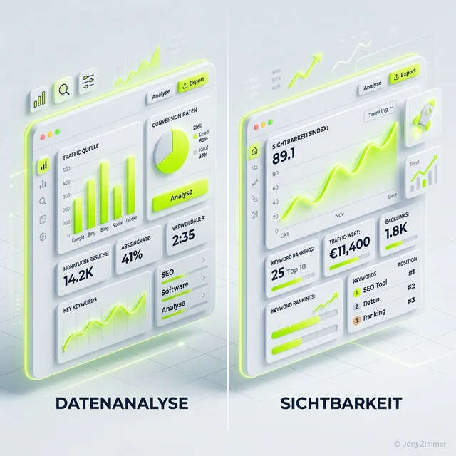
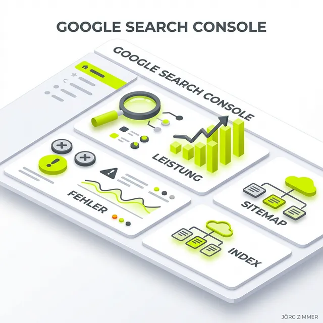

Moin! 🌻

Es gibt unzählige SEO-Mythen da draußen, die wie Kaugummi unter den Schuhen der Marketing-Welt kleben. "SEO ist tot", "KI macht alles von allein" oder "Du brauchst einfach nur ganz viele Blogbeiträge". Alles Quatsch. Wenn du wissen willst, was wirklich funktioniert, musst du die Motorhaube aufmachen, dir die Hände schmutzig machen und den Motor live analysieren.

Genau das haben Roland Golla von [Never Code Alone](https://nevercodealone.de/) und ich in einem Livestream getan. Eine völlig transparente, schonungslose und öffentliche [SEO-Sprechstunde](/blog/seo-sprechstunde-erklaert/). Kein theoretisches Bullshit-Bingo, sondern harte Praxis. Wir haben uns angeschaut, warum reiner Info-Traffic manchmal gefährlich sein kann, wie man von "PHP-Schulungen" zu "Vibe-Coding-Beratung" transformiert und warum du erst deine SEO-Hausaufgaben machen musst, bevor du von GEO träumst.

Lehn dich zurück, das wird ein echter Deep Dive.

---

## 1. Die Protagonisten: 50 Jahre geballte Digital-Erfahrung

Wenn sich zwei "Digitale Senioren" zum Livestream treffen, dann knirscht es an den richtigen Stellen. Auf der einen Seite [Roland Golla](https://rolandgolla.de/), der seit einem Vierteljahrhundert in der Softwareentwicklung zu Hause ist. Sein Fokus lag lange auf PHP-Refactoring, Continuous Integration und barrierefreiem Webdesign. Inzwischen hat er die Zeichen der Zeit erkannt und sich als Experte für Agentic Coding und **Vibe Coding** positioniert – er bringt Entwicklern bei, wie sie mit KI-Tools effizienter programmieren.

Auf der anderen Seite ich: 25 Jahre SEO-Erfahrung aus Berlin-Spandau. Ich habe das Web noch erlebt, als Links blau und unterstrichen waren und Keywords in weißer Schrift auf weißem Grund versteckt wurden. (Spoiler: Das ist heute "Pfusch am Bau"). In meiner SEO-Sprechstunde nehme ich Webseiten ungeschönt auseinander – live und direkt am Bildschirm.

Unser gemeinsames Ziel in dieser Session: Wie bekommt Roland seine neue Expertise im Vibe Coding so positioniert, dass Google und die Nutzer gleichermaßen verstehen, dass er nicht nur ein PHP-Lexikon ist, sondern ein gefragter KI-Consultant?

---

## 2. SEO vs. GEO: Warum du die Hausaufgaben machen musst

Gleich zu Beginn des Streams kam die unausweichliche Frage auf, die momentan durch jedes Marketing-Dorf getrieben wird: *"Wird Google überhaupt noch benutzt? Was ist mit ChatGPT, Claude und den ganzen KI-Agenten?"*

Die Antwort ist ein klares Jein. Wir erleben gerade einen massiven architektonischen Umbau des Internets. Das führt uns direkt zur Unterscheidung zwischen klassischer Suchmaschinenoptimierung und der viel zitierten [Generative Engine Optimization](/blog/generative-engine-optimization-geo/). 

Das Web, wie wir es seit Jahrzehnten kennen, wurde für *Menschen* gebaut. Menschen brauchen HTML, ein ansprechendes Design, Navigation und Struktur. KI-Modelle hingegen sind nur auf eines aus: Fakten so schnell und strukturiert wie möglich extrahieren. Es sind eigentlich zwei völlig unterschiedliche Welten.

  
 💬 Jörgs SEO-Klartext (LinkedIn Insights)

  
"KI-Strategie ist Chefsache, keine Aufgabe für den Praktikanten am Freitagnachmittag. Aber bevor du versuchst, KI-Bots mit GEO-Tricks zu verführen, musst du verdammt noch mal deine normalen SEO-Hausaufgaben machen. Ein Haus ohne Fundament stürzt ein – egal ob ein Mensch oder ein KI-Crawler dagegen pustet."

Es bringt absolut nichts, sich auf GEO-Hacks zu fokussieren, wenn deine Ladezeiten miserabel sind, deine internen Links ins Leere führen oder deine [Core Web Vitals](/blog/core-web-vitals-ux-bericht/) an die Zuverlässigkeit der Deutschen Bahn erinnern. Du musst dein SEO-Game zuerst durchspielen. Erst wenn du technisch sauber bist, Inhalte mit Kontext und klaren Entitäten lieferst, dann – und erst dann – bauen wir den GEO-Baustein oben drauf.

---

## 3. Das Format der SEO-Sprechstunde

Viele Agenturen verkaufen dir für horrende Summen ein 50-seitiges PDF-Audit. Das wandert dann bei dir in die digitale Schublade und sammelt virtuell Staub an. Warum? Weil ein "Bauchladen" an standardisierten Fehlermeldungen (die ohnehin nur aus einem Scanner purzeln) kein einziges Business-Problem löst.

Meine Sprechstunde funktioniert völlig anders. Das Prinzip ist simpel, aber gnadenlos effektiv:
1. **Die stille halbe Stunde:** Bevor ich mit dem Kunden in den Call gehe, investiere ich ca. 30 Minuten. Ich scanne die Domain, schaue mir die Search Console an, werfe SISTRIX an und hole mir ein Bild von der Konkurrenz. Wenn der Call startet, fangen wir nicht bei null an – wir starten bei 100.
2. **Die Live-Analyse (120 Minuten):** Wir machen Screen-Sharing. Wir rösten die Seite durch. Wir priorisieren live nach dem **80/20-Prinzip**. Welche 20 % der Probleme verursachen 80 % der Ranking-Schmerzen?
3. **Der Maßnahmenplan:** Du gehst nicht mit einem PDF raus, sondern mit einer Aufzeichnung, einer KI-Zusammenfassung und einem handfesten, priorisierten Fahrplan für dich oder deine Entwickler.

Bei Roland starteten wir genau diesen Prozess – live auf YouTube.

---

## 4. Live-Analyse Teil 1: Die Macht der Historie

Wir starteten die Analyse in SISTRIX. Der erste Blick auf den Sichtbarkeitsindex von `nevercodealone.de` zeigte eine extrem steile Kurve nach oben. Ein Wachstum von satten 68 %. 

Das Wichtigste dabei: Rolands Domain existiert seit 2016/2017. **Das ist ein massiver Vorteil.** Eine lange Domain-Historie, die nicht durch Abstrafungen belastet ist, ist wie ein guter Wein. Google liebt Beständigkeit. Neue Domains müssen sich durch die Sandbox kämpfen und Vertrauen aufbauen. Wer seit fast zehn Jahren konstant guten Content liefert, bekommt einen Vertrauensvorschuss.

Roland erklärte, dass er viel "AI-Only"-Content nutzt, der automatisiert aus Claude generiert und aktualisiert wird. In der SEO-Bubble wird das oft kritisch beäugt ("Content Spam"), aber die Zahlen lügen nicht. Der Content rankt. Warum? Weil die Struktur extrem sauber ist: Tabellen, FAQs am Ende, klare H2/H3-Hierarchien. Wenn es funktioniert, stellen wir es nicht infrage. Wir nehmen es mit und optimieren den Rest.

---

## 5. Live-Analyse Teil 2: Die Traffic-Falle und Bushaltestellen-Keywords

Hier wird es schmerzhaft, und das ist ein Fehler, den 90 % der B2B-Unternehmen machen. Wir schauten uns an, für *welche* Begriffe Rolands Seite eigentlich so exorbitant gut rankt. 

Ein Beispiel sprang sofort ins Auge: **Hugging Face** (das GitHub für KI-Modelle). Roland rankte hierfür in den Top 3, das Keyword hat ein Suchvolumen von knapp 12.000 Suchanfragen pro Monat. Das bringt massiv Klicks.

Aber dann fanden wir andere starke Rankings: Themen rund um "iPhone erkennt SIM nicht". 

Und genau hier schnappt die SEO-Falle zu. Das ist purer **Bushaltestellen-Traffic**. Du stehst an der Bushaltestelle, Hunderte Leute laufen an dir vorbei (hoher Traffic), aber niemand steigt in deinen Bus ein (null Conversions). Warum? Weil die *Suchintention* völlig falsch ist. Jemand, der sucht, warum sein iPhone die SIM-Karte nicht erkennt, kauft am Ende des Tages keinen hochpreisigen Vibe-Coding-Workshop für Softwareentwickler.

**Die Gefahr der Verwässerung:**
Google ordnet deine Domain Clustern (Themengebieten) zu. Wenn du als spezialisierter IT-Dienstleister plötzlich massenhaft reinen Info-Content über Consumer-Smartphones oder Müsli-Sorten raushaust, nur um Traffic abzugreifen, verwässerst du deine Fachautorität. Google stuft dich im schlimmsten Fall als "generische Info-Schleuder" oder Lexikon ein. 

Die Konsequenz? Wenn du dann mit deinen harten Kernprodukten (bei Roland: PHP-Seminare, Vibe-Coding-Consulting) punkten willst, fehlst du in dem entsprechenden transaktionalen Experten-Cluster. 

  
 💡 Der SEO-Klartext-Rat

  
Schiele nicht blind auf das Suchvolumen. Suche dir Begriffe, die exakt in deiner Bubble liegen. Lieber 50 Klicks im Monat von IT-Leitern, die Vibe Coding suchen, als 5.000 Klicks von Teenagern, deren iPhone kaputt ist.

---

## 6. Live-Analyse Teil 3: Die Jagd nach Geldwerte-Suchwörtern

Wie findet man nun die Keywords, die wirklich Geld bringen? In der Analyse schauten wir uns den **Cost-per-Click (CPC)** der Begriffe an. Der CPC ist ein hervorragender Indikator dafür, wie wertvoll ein Keyword am Markt ist. Wenn Unternehmen bereit sind, bei Google Ads 5 Euro oder 10 Euro für einen einzigen Klick zu bezahlen, dann ist hinter diesem Suchbegriff echte Kaufintention vorhanden.

Wir fanden ein solches Juwel in Rolands Portfolio: **"PHP-Schulung"**.

Roland rankte auf Platz 9, war aber gerade erst auf dem Weg nach oben. Die Unterseite dazu hieß jedoch "PHP-Training". Und hier griffen wir direkt in die Trickkiste der Onpage-Optimierung:

1. **Title-Tag Optimierung:** Der Title-Tag ist das Aushängeschild in den Suchergebnissen. Bei Roland stand dort viel über "Symfony" und "Testing", aber das hochpreisige Wort "Schulung" fehlte fast völlig. Wenn du absolut keine Zeit für SEO hast: Optimiere verdammt noch mal deine Title-Tags (max. 55 Zeichen)!
2. **Meta Description:** Auch hier fehlte die "Schulung". 140 Zeichen Platz, um den Suchenden zum Klick zu zwingen, wurden verschenkt.
3. **Überschriften (H1):** Das wichtigste Keyword muss in die H1-Überschrift.
4. **Fokussierung statt Kannibalisierung:** Rolands Seite versuchte, Kurse, Seminare, Workshops und Consulting auf einer einzigen Seite ("Training") abzufrühstücken. 

Mein klarer Ratschlag (die 80/20-Priorisierung): Wenn ein Suchwort extrem geldwert ist und der Markt dafür bezahlt, dann hat dieses Suchwort eine **eigene, dedizierte Unterseite** verdient. Wir entkoppeln "PHP-Kurse", "PHP-Seminare" und "PHP-Schulung", bauen dafür knallharte, fokussierte Landingpages und greifen den Traffic präzise ab. Wer jetzt "Duplicate Content!" schreit, hat SEO nicht verstanden. Es geht um Zielgruppen-Matching, nicht um akademische Wortgleichheit.

---

## 7. Der Elefant im Raum: Wo bleibt das Vibe Coding?

Rolands neues, strategisches Kerngeschäft ist Vibe Coding (Agentic Coding). Er hilft Entwicklern, KI in ihren Workflow zu integrieren. 

Die bittere Erkenntnis aus der SISTRIX-Analyse: Er rankte für fast nichts, was "Vibe" oder "Consulting" im Namen trug (außer einem Artikel über negative Vibes auf dem Localhost – witzig, aber nutzlos für das Business).

Warum? Weil Google seine Entität (seine digitale Identität) noch hart mit dem Thema "PHP" verdrahtet hatte. Der Shift zu einem neuen Geschäftsbereich passiert im SEO nicht über Nacht. Man muss Google aktiv beibringen, dass sich die Entität erweitert hat. 

Das bedeutet für Roland: Weg von den generischen AI-News, rein in tiefgehenden Experten-Content zum Thema Vibe Coding. Eigene Hub-Pages bauen, interne Links hart auf diese neuen Seiten leiten (Aggressives internes Verlinken) und so Stück für Stück das Thema als neues Core-Thema in der Domain verankern.

---

## 8. Die Google Search Console: Deine Gesundheitsakte

Ein elementarer Baustein jeder Sprechstunde ist der Blick in die Google Search Console. 

Ich sage es in aller Deutlichkeit: Wer eine Website betreibt und keine Google Search Console angelegt hat, fliegt blind im Nebel ohne Instrumente. Es ist das mächtigste, kostenlose Diagnose-Werkzeug, das Google dir direkt zur Verfügung stellt.

Wir schauten uns Rolands Indexierungsstatus an. Von ca. 2.000 produzierten Seiten waren rund 1.200 indexiert. Er hatte eine saubere Sitemap eingereicht (Pflichtaufgabe Nummer 1!). 

**Der Exkurs zu misslungenen Relaunches:**
Anhand der Search Console erklärte ich, warum so viele teure Relaunches in einer Katastrophe enden. Oft wird das komplette historische "Spinnennetz" an URLs (die Pfade) weggeschnitten, weil die hochbezahlte Design-Agentur lieber eine aufgeräumte Optik hat, als sich um langweilige 301-Weiterleitungen zu kümmern. Das Resultat? Google rennt gegen Wände (404-Fehler), das Vertrauen ist weg, der Traffic stürzt ins Bodenlose. Ein Relaunch ohne technische SEO-Begleitung ist finanzieller Selbstmord.

---

## Unterm Strich

Die SEO-Sprechstunde mit Roland war ein Paradebeispiel dafür, wie man sich von Vanity-Metriken (hoher Info-Traffic) löst und anfängt, auf das Konto einzuzahlen, das am Monatsende die Rechnungen bezahlt. 

Die drei Kernaufgaben für Roland (und für dich, wenn du ähnliche Probleme hast):
1. **Fokus-Seiten aufbauen:** Bau eigene Landingpages für deine geldwerten Suchwörter (z.B. Schulung vs. Training).
2. **Entitäten stärken:** Bring deine neuen Kernthemen (Vibe Coding) durch gezielte, interne Strukturierung so prominent nach vorne, dass Google deinen thematischen Shift versteht.
3. **Hausaufgaben erledigen:** Meta-Titles anpassen, Indexierung in der Search Console überwachen und Info-Traffic-Leichen aussortieren oder zumindest in den Newsletter leiten.

  <h3 class="text-2xl font-bold mb-4">Bereit, dein Projekt auf den Grill zu legen?</h3>
  
Wenn du jetzt denkst: <em>"Verdammt, das brauche ich auch für meine Seite!"</em> – dann zögere nicht. Keine langweiligen PDFs, keine Phrasen, sondern direktes Hands-on. Wir finden heraus, warum die Konkurrenz oben steht und wo deine versteckten Umsatz-Hebel liegen.

  <a href="https://teleschmie.de/seo-sprechstunde/" class="btn-primary inline-flex">Jetzt SEO-Sprechstunde anfragen</a>

ALOHA! 🌻✌️

---

### Die komplette Session im Video & Rolands Zusammenfassung
*Hier kannst du dir den kompletten Mitschnitt der Live-Analyse ansehen. Wenn du noch mehr Insights aus Rolands Perspektive lesen möchtest, schau dir unbedingt seine ausführliche [Zusammenfassung der SEO-Sprechstunde auf dem Never Code Alone Blog](https://blog.nevercodealone.de/seo-sprechstunde-live-was-suchmaschinenoptimierer-joerg-zimmer-ueber-rankings-geo-und-technische-fehler-verraet/) an.*

  <iframe width="100%" height="450" src="https://www.youtube-nocookie.com/embed/tD7cXuVcRPA" title="SEO Sprechstunde mit Jörg Zimmer & Never Code Alone" frameborder="0" allow="accelerometer; autoplay; clipboard-write; encrypted-media; gyroscope; picture-in-picture; web-share" allowfullscreen></iframe>

