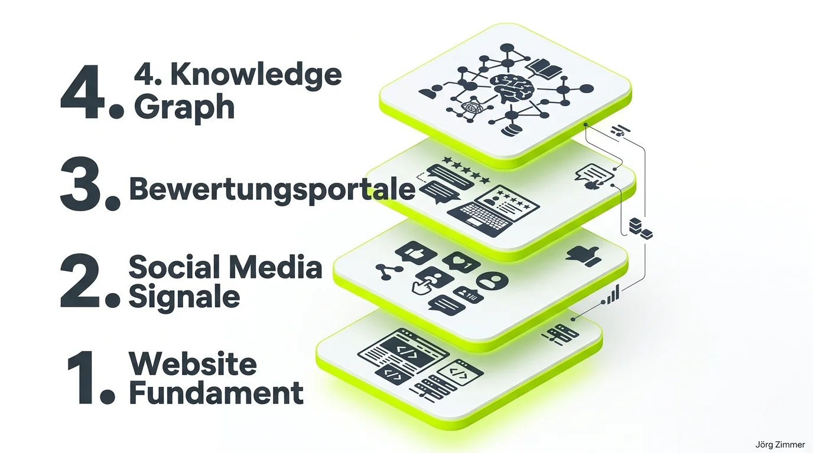

SEO wird größer. Mit der GEO Welle nochmal mehr. Dieses umfassende Optimieren fordert aber auch Ressourcen und Budget. All das bewegt sich in Richtung **Markenaufbau**. 

Das wussten wir SEO-Spezialisten schon immer, die Freigaben zur Optimierung des gesamten digitalen Fußabdrucks gab es dann oft nicht.

Genau das wäre aber der Punkt, der jetzt den entscheidenden Unterschied macht: Erst die eigene Website optimieren, dann in Absprache mit den Abteilungen die Social-Media-Kanäle, die Bewertungen und am Ende den **Entitäten-Aufbau** in relevanten Portalen zum Thema.

Im Grunde gehen wir das ganze SEO-Handbuch noch einmal durch. Wir schärfen und erweitern die technischen Aspekte um AI Crawler, die inhaltlichen Aspekte um semantische Extrahierbarkeit und die strategischen Aspekte um extern erlebbare Autorität.

Das Spiel wird größer und erweitert sich fundamental.

<figure class="my-8 bg-neutral-50 border border-neutral-200 p-6 md:p-8 rounded-2xl shadow-sm">
  

    
    

      <h4 class="font-bold text-base md:text-lg text-dark mb-0">Jörg Zimmer</h4>
      
Senior SEO & AI Search Consultant

    

  

  <blockquote class="text-base md:text-lg text-dark leading-relaxed italic border-l-4 border-lime-accent pl-4 my-4 font-normal">
    „Im SEO hat man schon immer gewonnen, wenn man über die Metaebene ging (Brandbuilding), statt in der Einzeldisziplin zu verharren. Das ist auch etwas ganz Evolutionäres: Kooperation statt Konkurrenz. SEO sorgt im Kern für Konsistenz und Stringenz, ist aber nicht der Nabel der Welt. Der Layer bleibt gleich: [GEO](/glossar/geo/) ist nichts anderes als Daten, die es ohnehin schon gibt, sichtbarer zur maschinellen Verarbeitung und damit hilfreicher für alle anzubieten.“
  </blockquote>
  <figcaption class="mt-4 pt-3 border-t border-neutral-200/60 flex flex-wrap items-center justify-between gap-2 text-xs text-neutral-500">
    Experten-Zitat • <cite class="not-italic font-semibold text-neutral-700">Jörg Zimmer</cite>
    <a href="https://www.linkedin.com/posts/joerg-zimmer-seo-sea-freelancer-berlin-spandau_seo-wird-gr%C3%B6%C3%9Fer-mit-der-geo-welle-nochmal-activity-7488159673163104256-cBMC" target="_blank" rel="noopener noreferrer" class="font-bold text-lime-700 hover:underline inline-flex items-center gap-1">
      Diskussion auf LinkedIn ansehen →
    </a>
  </figcaption>
</figure>

## Warum das klassische Silo-SEO an seine Grenzen stößt

Über zwei Jahrzehnte hinweg war die Suchmaschinenoptimierung stark silobasiert organisiert. Der SEO optimierte Title-Tags, feilte an der internen Linkstruktur und baute Backlinks auf. Produktentwicklung, PR und Social-Media-Teams arbeiteten völlig isoliert in ihren eigenen Budgets. 

Dieses Vorgehen funktioniert in der Ära von LLMs (Large Language Models) nicht mehr. 

Wenn ein KI-System wie ChatGPT, Perplexity oder Google Gemini eine Antwort formuliert, liest es nicht bloß eine HTML-Seite aus. Es greift auf gigantische Vektor-Einbettungen zurück. Das Sprachmodell bewertet, wie verlässlich eine Marke im Kontext einer bestimmten Problemstellung im gesamten Web genannt wird. 

Wer seine Onpage-Hausaufgaben perfekt erledigt hat, aber außerhalb der eigenen Domain keine Spuren hinterlässt, bleibt für generative Suchmaschinen ein Geist. Echtes [Entitäten-Building](/glossar/entitaeten-building/) verlangt Präsenz auf allen Ebenen des Webs.

## Die 4 Schichten des modernen digitalen Fußabdrucks

Um in generativen Suchmaschinen als vertrauenswürdige Antwortquelle genannt zu werden, muss eine Marke strategisch über vier miteinander verzahnte Ebenen aufgebaut werden:

### 1. Das technische Website-Fundament
Die Basis bildet unverändert die eigene Domain. Sie muss blitzschnell laden, fehlerfrei crawlbar sein und strukturierte Daten (Schema.org) bereitstellen. Für KI-Systeme ist entscheidend, dass Inhalte in klaren semantischen Einheiten vorliegen, die ohne Rendering-Barrieren extrahiert werden können.

### 2. Social Media Signale und authentische O-Töne
Fachbeiträge auf LinkedIn, Diskussionen auf Plattformen und reale Experten-Statements liefern den Kontext, den Suchmaschinen für die Beurteilung von E-E-A-T (Experience, Expertise, Authoritativeness, Trustworthiness) benötigen. Reale menschliche Interaktion und fundierte Kommentare belegen, dass eine Thematik aktiv praktiziert wird.

### 3. Bewertungsportale und Branchenverzeichnisse
Unabhängige Drittquellen sind für KI-Modelle das verlässlichste Korrektiv. Plattformen wie Google Unternehmensprofile, Trustpilot, ProvenExpert oder spezialisierte B2B-Verzeichnisse beweisen, dass hinter der digitalen Fassade echte Kunden, messbare Dienstleistungen und reale Problemlösungen stehen.

### 4. Entitäten im Knowledge Graph
Die Krönung moderner Sichtbarkeit ist die dauerhafte Verankerung als eigenständige Entität im [Knowledge Graph](/glossar/knowledge-graph/). Erst wenn Suchmaschinen und LLMs das Unternehmen, seine handelnden Personen und Kernkompetenzen als eindeutigen Datenknotenpunkt begreifen, werden [Brand Mentions](/glossar/brand-mentions/) organisch in generierte Antworten eingeflochten.

## Gegenüberstellung: Keyword-SEO vs. GEO & Markenaufbau

Die folgende Matrix verdeutlicht den Paradigmenwechsel, der sich aktuell im Suchmaschinenmarketing vollzieht:

| Kriterium | Klassisches SEO (Keyword-Fokus) | Modernes GEO & Markenaufbau |
|---|---|---|
| **Primäres Ziel** | Platz 1 für Keyword X in der Suchergebnisliste | Führende Quellen-Nennung in KI-Synthesen & LLMs |
| **Optimierungsbereich** | Isolierte HTML-Seiten & Meta-Tags | Ganzheitlicher digitaler Fußabdruck über alle Kanäle |
| **Crawl-Mechanismus** | Token- und HTML-Parser (Googlebot) | Semantische Vektorisierung & Entitäten-Mapping |
| **Vertrauenssignale** | Reine Hyperlinks & Ankertexte | Co-Occurrences, Expertenzitate, Reviews & O-Töne |
| **Thematische Tiefe** | Keyword-Dichte & Textlänge | [Topical Authority](/glossar/topical-authority/) & semantische Klarheit |
| **Organisatorische Rolle** | Isoliertes technisches Marketing-Projekt | Strategischer [Markenaufbau mit SEO](/glossar/markenaufbau-mit-seo/) als Chefsache |

## Wie Unternehmen jetzt handeln müssen

Die Erweiterung des Handlungsspielraums bedeutet für Unternehmen vor allem eins: Silos auflösen. 

Marketing-Entscheider dürfen SEO nicht länger als reines Kostenstellen-Thema betrachten, das man am Ende eines Relaunchs dazubucht. Wenn die Produktabteilung neue Features plant, müssen die semantischen Begrifflichkeiten und Nutzerfragen von Beginn an synchronisiert werden. Wenn die Unternehmenskommunikation Fachartikel oder Pressemitteilungen publiziert, müssen Entitäten-Nennungen präzise gesetzt sein.

Tools wie [Rankscale (Partnerlink)](https://rankscale.ai/?via=offer) machen diesen Wandel erstmals transparent messbar. Statt nur Keyword-Rankings zu beobachten, lässt sich exakt tracken, bei welchen Fragen moderne Sprachmodelle das eigene Unternehmen empfehlen – und an welchen Stellen Wettbewerber das Narrativ dominieren.

Wer diesen Schritt geht, schützt seine Sichtbarkeit vor den Unwägbarkeiten einzelner Algorithmus-Updates. Denn starke Marken mit verifizierter Expertise überstehen jede technische Welle.

Du möchtest deine Website und deine digitale Markenpräsenz für die Anforderungen moderner KI-Systeme fit machen? In meiner [SEO-Sprechstunde](/seo-sprechstunde/) analysieren wir deinen aktuellen digitalen Fußabdruck und entwickeln einen praxisnahen Fahrplan für nachhaltige Sichtbarkeit.

<!-- CTA Box -->

  
    LinkedIn Community Diskussion
  
  <h3 class="text-xl md:text-2xl font-bold text-white mb-3 !mt-0 !border-none !pb-0">
    Jetzt an der Diskussion teilnehmen
  </h3>
  

    Diskutiere mit Jörg Zimmer und der SEO-Community auf LinkedIn über diesen Beitrag.
  

  <a href="https://www.linkedin.com/posts/joerg-zimmer-seo-sea-freelancer-berlin-spandau_seo-wird-gr%C3%B6%C3%9Fer-mit-der-geo-welle-nochmal-activity-7488159673163104256-cBMC" target="_blank" rel="noopener noreferrer" class="btn-primary">
    <svg class="w-4 h-4 fill-current" viewBox="0 0 24 24"><path d="M20.447 20.452h-3.554v-5.569c0-1.328-.027-3.037-1.852-3.037-1.853 0-2.136 1.445-2.136 2.939v5.667H9.351V9h3.414v1.561h.046c.477-.9 1.637-1.85 3.37-1.85 3.601 0 4.267 2.37 4.267 5.455v6.286zM5.337 7.433c-1.144 0-2.063-.926-2.063-2.065 0-1.138.92-2.063 2.063-2.063 1.14 0 2.064.925 2.064 2.063 0 1.139-.925 2.065-2.064 2.065zm1.782 13.019H3.555V9h3.564v11.452zM22.225 0H1.771C.792 0 0 .774 0 1.729v20.542C0 23.227.792 24 1.771 24h20.451C23.2 24 24 23.227 24 22.271V1.729C24 .774 23.2 0 22.222 0h.003z"/></svg>
    Beitrag auf LinkedIn öffnen
    →
  </a>

