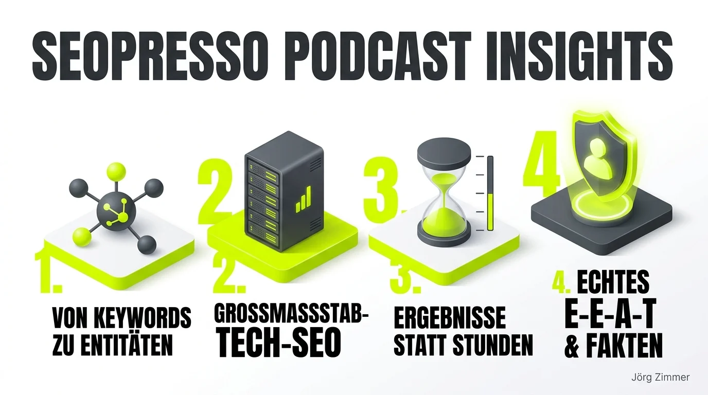

Ich sitze mit einer heißen Tasse Kaffee und meiner Katze noch halb im Halbschlaf auf dem Sofa – und dann starte ich diese neue Episode des SEOpresso-Podcasts. Wenige Minuten später musste ich bei den Anekdoten über Chuck-Norris-Witze, die damals live für die BILD-Website getextet wurden, so laut lachen, dass die Katze beinahe vom Kratzbaum geflogen wäre.

Genau so beginnt eine herausragende Podcast-Folge: Unerwartete Anekdoten, gelebte Authentizität und absolute Ehrlichkeit statt aufgesetzter LinkedIn-Beweihräucherung.

## Warum du dieses Interview unbedingt hören solltest

Maximilian D. Muhr erzählt im SEOpresso-Podcast bei Björn Darko Dinge, die man selbst nach [24 Jahre SEO-Erfahrung](/blog/24-jahre-seo-gleiche-fehler/) selten in dieser Klarheit zu hören bekommt. Max ist kein theoretischer Folienschubser. Er ist ein Vollblut-Praktiker, der die ganz großen Schiffe der deutschen Medienlandschaft gesteuert und vor dem Absaufen bewahrt hat.

| Themenbereich | Kernaussage von Max Muhr | Strategisches Learning für die Praxis |
| :--- | :--- | :--- |
| **Karrierestart** | Über Zeitarbeit zu BILD.de, Chuck-Norris-Texte getextet | Eigeninitiative & Neugier schlagen jedes Uni-Diplom |
| **Konzernpolitik** | Komplexe Machtkämpfe im Verlagswesen überstanden | Erkennen, wann eine Reorganisation toxisch wird |
| **Mental Health** | Offener Umgang mit Überlastung & Burnout | Karriere ist kein Selbstzweck; Balance sichert Qualität |
| **Entitäten-Fokus** | Von isolierten Keywords zu semantischen Wissensnetzen | Fundament für moderne Answer Engines und [GEO-Ära](/blog/ai-geo-sichtbarkeit-umfrage/) |
| **Wertmodell** | Abrechnung nach erzielter Wirkung statt Zeitaufwand | Echte Senior-Expertise spart monatelangen Blindflug |

## Vom „SEO-Hilfsarbeiter“ zum Managing Director

Max gehört zu der Generation von Digitalexperten, die sich alles selbst erarbeitet haben. Kein hochglanzpolierter Lebenslauf, sondern ein Quereinsteiger, der 2008 über eine Zeitarbeitsfirma bei Axel Springer landete. Er bezeichnet sich selbst mit entwaffnender Selbstironie als damaligen „SEO-Hilfsarbeiter“.

Von dort aus ging es Schritt für Schritt weiter: Über das Texten von Boulevard-News bis hin zur Leitung gewaltiger Technik-Teams und heute als Managing Director bei poliSYS. Dieser Werdegang beweist eindrucksvoll: Wer bereit ist, sich tiefer in komplexe Tech-Stacks einzugraben als alle anderen, setzt sich am Markt durch – vollkommen unabhängig von formalen Titeln.

<figure class="my-8 bg-neutral-50 border border-neutral-200 p-6 md:p-8 rounded-2xl shadow-sm">
  

    
    

      <h4 class="font-bold text-base md:text-lg text-dark mb-0">Jörg Zimmer</h4>
      
Senior SEO & AI Search Consultant

    

  

  <blockquote class="text-base md:text-lg text-dark leading-relaxed italic border-l-4 border-lime-accent pl-4 my-4 font-normal">
    „Wer Expertise einkauft, bezahlt nicht für die 60 Minuten, in denen ich an deinem Audit sitze. Er bezahlt für die 24 Jahre Praxiserfahrung, die nötig waren, um das Problem in 60 Minuten präzise zu lokalisieren und den Relaunch zu retten. Das ist der fundamentale Unterschied zwischen Zeittauschern und echten Experten.“
  </blockquote>
  <figcaption class="mt-4 pt-3 border-t border-neutral-200/60 flex flex-wrap items-center justify-between gap-2 text-xs text-neutral-500">
    Experten-Zitat • <cite class="not-italic font-semibold text-neutral-700">Jörg Zimmer</cite>
    <a href="https://www.linkedin.com/in/joerg-zimmer-seo-sea-freelancer-berlin-spandau/" target="_blank" rel="noopener noreferrer" class="font-bold text-lime-700 hover:underline inline-flex items-center gap-1">
      Jörg Zimmer auf LinkedIn folgen →
    </a>
  </figcaption>
</figure>

## Die drei Kernbotschaften der Episode

### 1. Reale Konzernrealität statt LinkedIn-Bühne
Max reflektiert ohne Beschönigung über die internen Reibungsverluste in Großkonzernen: Wie man lernt, strategische Grabenkämpfe zu navigieren – und wann der Moment gekommen ist, die Reißleine zu ziehen. Sein offener Umgang mit dem Thema Burnout setzt ein wichtiges Zeichen in einer Branche, die sich allzu gern im Daueroptimierungswahn verliert.

### 2. poliSYS und die Macht von Entitäts-Strukturen
Das Projekt poliSYS zeigt eindrucksvoll, wohin die Reise im technischen SEO geht: Weg vom starren Abzählen von Suchbegriffen, hin zu sauberem [Entitäts-SEO](/glossar/entity-seo/) und dem Aufbau unanfechtbarer [Topical Authority](/glossar/topical-authority/). Sprachmodelle benötigen strukturierte Entitäten, um Marken zweifelsfrei in ihren Wissensgraphen zu verankern. Wie diese Mechanismen im Detail greifen, beleuchten wir auch in unserer Analyse zum [SISTRIX Podcast: Entitäten-Mapping & Knowledge Graph](/blog/sistrix-podcast-entitaeten-mapping/).

### 3. Vergütung nach Resultaten statt nach Stunden
Einer der stärksten Gedanken des Gesprächs: Echte Senior-Berater verkaufen Problemlösungen und messbare Resultate, keine bloßen Stempeluhr-Stunden. Genau diesen partnerschaftlichen Ansatz pflegen wir auch im [SEO-Persönlich Interview](/blog/seopresso-seo-persoenlich-interview/) sowie im Rahmen meiner individuellen [SEO-Sprechstunde](/seo-sprechstunde/).

## Hörempfehlung für die Community

Wer wissen möchte, wie führende Köpfe der Branche ticken, welche Fehler sie auf ihrem Weg gemacht haben und worauf es beim Aufbau zukunftssicherer Websites ankommt, sollte sich diese Folge unbedingt in die Playlist laden.

<!-- LinkedIn CTA Box -->

  <h3 class="text-xl md:text-2xl font-bold text-white mb-3 !mt-0 !border-none !pb-0">
    Jetzt an der Diskussion teilnehmen
  </h3>
  

    Diskutiere mit Jörg Zimmer und der SEO-Community auf LinkedIn über diesen Beitrag.
  

  <a href="https://www.linkedin.com/in/joerg-zimmer-seo-sea-freelancer-berlin-spandau/" target="_blank" rel="noopener noreferrer" class="btn-primary">
    <svg class="w-4 h-4 fill-current" viewBox="0 0 24 24"><path d="M20.447 20.452h-3.554v-5.569c0-1.328-.027-3.037-1.852-3.037-1.853 0-2.136 1.445-2.136 2.939v5.667H9.351V9h3.414v1.561h.046c.477-.9 1.637-1.85 3.37-1.85 3.601 0 4.267 2.37 4.267 5.455v6.286zM5.337 7.433c-1.144 0-2.063-.926-2.063-2.065 0-1.138.92-2.063 2.063-2.063 1.14 0 2.064.925 2.064 2.063 0 1.139-.925 2.065-2.064 2.065zm1.782 13.019H3.555V9h3.564v11.452zM22.225 0H1.771C.792 0 0 .774 0 1.729v20.542C0 23.227.792 24 1.771 24h20.451C23.2 24 24 23.227 24 22.271V1.729C24 .774 23.2 0 22.222 0h.003z"/></svg>
    Jörg Zimmer auf LinkedIn kontaktieren
    →
  </a>

