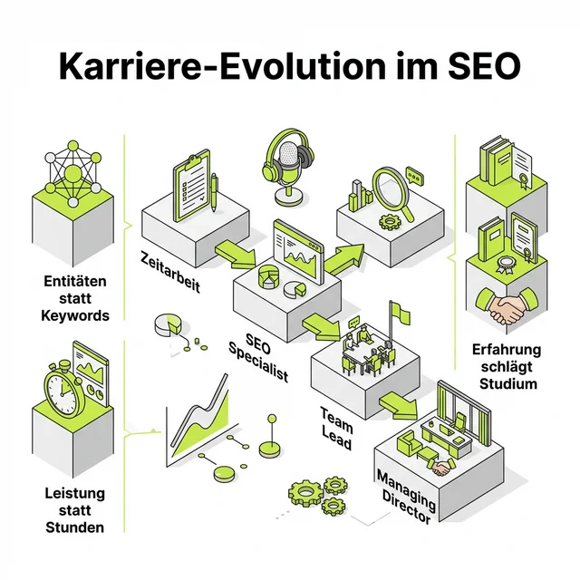

Hab es mir angehört und musste bei **Chuck Norris Witzen für die Bild-Website** so laut lachen, dass meine Katze fast vom Kratzbaum gefallen wäre. Ja, so waren die Zeiten damals – wild, chaotisch und ein bisschen anarchisch. Es war die Ära, in der wir SEOs noch wie digitale Alchemisten in dunklen Kellern brodelten, um Google ein Schnippchen zu schlagen.

Aber mal im Ernst: Wer sich für die Menschen hinter den Algorithmen interessiert, kommt an dieser Folge nicht vorbei. **Maximilian D. Muhr** erzählt im [SEOpresso Podcast](https://seopresso.de) von Björn Darko so viele Sachen, die ich trotz meiner 24 Jahre in der Branche noch nicht wusste. Besonders seine Analyse von Konzernstrukturen und die Denke dahinter fand ich extrem erhellend.

## Warum du diese Folge unbedingt hören solltest

Max ist kein klassischer "Agentur-Schnacker". Er ist ein Praktiker, der die ganz großen Schiffe gesteuert hat (und manchmal auch vor dem Sinken bewahrt hat). Was mich an seinem Interview beeindruckt hat:
- **Die radikale Ehrlichkeit:** Er beschönigt nichts. Weder seinen Werdegang noch die Fehler, die man macht, wenn man hunderte Mitarbeiter führt.
- **Die persönliche Tiefe:** Es geht nicht nur um Keywords. Es geht um Life-Work-Balance, Familie und die Frage: Was zählt am Ende wirklich?
- **Die Vision:** Wie sieht SEO aus, wenn wir aufhören, in Links zu denken und anfangen, in Entitäten zu planen?

## Der Werdegang eines "SEO-Zufallstreffers"

Max gehört zur Riege derer, die "aus Versehen" in diesen Job gestolpert sind – wie ich auch. Er erzählt, wie er 2008 über eine Zeitarbeitsfirma bei BILD.de landete. Stell dir das mal vor: Er war eigentlich der "SEO-Hilfsarbeiter" (so nennt er es selbst), der den digitalen Wandel in einem der größten Medienhäuser Europas miterlebte.

Vom Eintippen von Witzen (hallo Chuck Norris!) bis hin zum Managing Director bei poliSYS – dieser Weg ist geprägt von Neugier, einer ordentlichen Portion Mut und der Fähigkeit, sich in Tech-Stacks einzugraben, die andere nur mit der Kneifzange anfassen würden. Ganz ohne klassisches Studium. Stattdessen: Eigeninitiative als Motor. Das ist genau der Spirit, den wir in unserer Branche brauchen!

## Die Key-Themen der Podcast-Folge

Björn und Max graben tief. Hier sind die Punkte, die mich besonders zum Nachdenken gebracht haben:

### 1. Die Konzernwelt vs. das wahre Leben
Max reflektiert wunderbar über seine Zeit bei Springer. Wie man in Konzernstrukturen lernt, politische Kämpfe zu führen (oder ihnen auszuweichen) und warum man irgendwann den Punkt erreicht, an dem man sich fragt: "Will ich das noch?". Sein Burnout und die Neuausrichtung seiner Prioritäten sind Themen, die in unserer oft so glitzernden LinkedIn-Welt viel zu selten ehrlich besprochen werden.

### 2. poliSYS – Die Evolution der Optimierung
Das neue Projekt [poliSYS.de](https://polisys.de) ist für mich technisches SEO-Gold. Es geht weg von der klassischen Keyword-Recherche ("Was wird gesucht?") hin zur Entitäten-Optimierung ("Worüber redet das Web wirklich?"). Max erklärt, warum Sprachmodelle und moderne Suchmaschinen semantische Netze brauchen, um deine Relevanz zu verstehen. Das ist die Brücke zum GEO (Generative Engine Optimization), über die wir heute alle gehen müssen.

### 3. Leistung statt Stunden
Einer meiner Lieblingspunkte: Warum er heute lieber Ergebnisse verkauft als reine Arbeitszeit. Ein Thema, das mir als Freelancer aus der Seele spricht. Wer Expertise einkauft, bezahlt nicht für die 60 Minuten, die ich an einem Dokument sitze. Er bezahlt für die 24 Jahre, die ich gebraucht habe, um dieses Dokument in 60 Minuten so präzise zu erstellen, dass es den Relaunch rettet.

## Meine ganz persönliche Empfehlung

SEOs persönlich kennenzulernen, ihre Brüche, ihre Erfolge und ihre Ängste zu sehen, ist immer eine gute Entscheidung. Diese Podcast-Folge gibt dir genau das – einen ehrlichen, unverfälschten Einblick in den Menschen Maximilian Muhr.

Wenn du gerade selbst an einem Wendepunkt stehst, wenn du dich fragst, ob die Konzernkarriere wirklich das Ende der Fahnenstange ist, oder wenn du einfach Bock auf echte Insights aus der BILD-Zeit und moderne Entitäten-Optimierung hast – hör rein!

---

*Danach vielleicht auch mal die Folge mit mir anhören? Björn Darko hat bei "SEO Persönlich" auch mich ordentlich in die Mangel genommen. Gleiches Format, ähnlich viel Tacheles.*

**Jetzt reinhören:** [SEOpresso mit Maximilian Muhr](https://seopresso.de)

### Weiterführende Artikel für Karriere-Planer
### Weiterführende Artikel
* **Lese-Tipp:** [SEO Persönlich: Mein Interview im SEOpresso Podcast](/blog/seopresso-seo-persoenlich-interview/)
* **Lese-Tipp:** [Bist du SEO AI Ready? Podcast mit Antonio Blago](/blog/bist-du-seo-ai-ready-podcast/)
