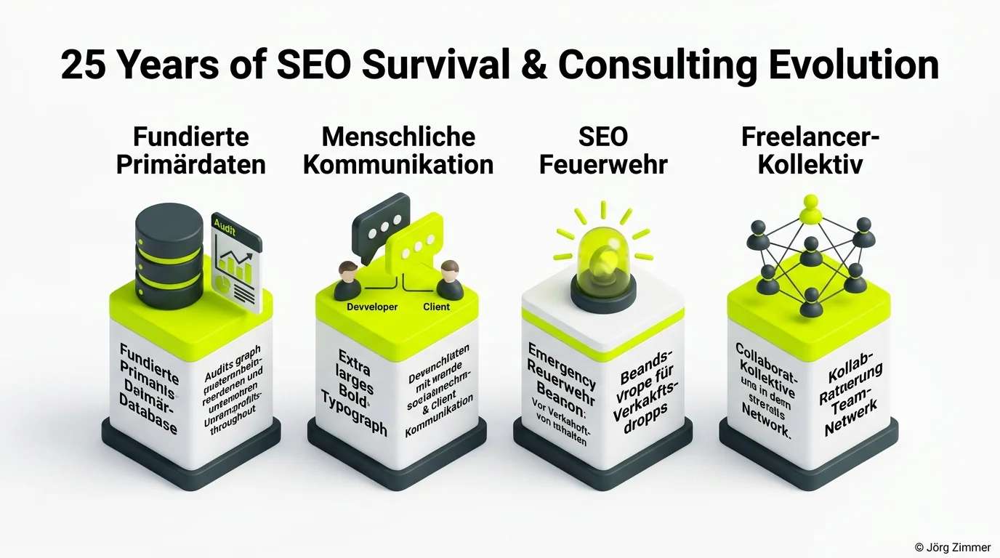

Ein persönliches Interview über meine ersten Schritte im Web, über spektakuläre Rückschläge und über die Tatsache, wie man als SEO-Freelancer über 25 Jahre im Markt erfolgreich besteht.

Wer mich kennt, weiß: Ich habe keine Geduld für glattgebügelte Selbstdarstellungen. Ich mag die Ecken, die Kanten und die echten Geschichten aus der Praxis. Ein großes Dankeschön an **Björn Darko**, dass du mich in den renommierten *SEOPRESSO Podcast* eingeladen hast. Deine Fragen waren präzise und schonungslos – vieles davon habe ich in dieser Offenheit noch nie öffentlich geteilt.

## Die 3 großen Epochen meiner 25-jährigen SEO-Laufbahn

Im Gespräch haben wir tief gegraben – tiefer als ein hungriger Crawler bei einem Enterprise-Audit. Aus der Vogelperspektive lässt sich meine Reise in drei prägende Ären unterteilen:

| Ära & Zeitraum | Technischer Fokus | Was davon heute noch zählt |
| :--- | :--- | :--- |
| **2002: Der Wilde Westen** | Meta-Keywords, Quellcode-Tricks, AltaVista | **Unstillbare Neugier**: Glaube keinen Mythen, teste jeden Algorithmus selbst. |
| **2012: Panda & Pinguin** | Manuelles Aufräumen, Content-Qualität, Link-Audits | **Nachhaltigkeit**: Wer Google austricksen will, bezahlt später doppelt. |
| **2026: Die KI-Revolution** | Entitäten, GEO, MCP, Agentic Workflows | **Solides Handwerk**: Verständnis von Code und Server-Architektur schlägt jeden Prompt. |

## Die 4 Säulen für 25 Jahre SEO-Survival

Wie überlebt man ein Vierteljahrhundert in einer Branche, die sich alle zwei Jahre scheinbar komplett neu erfindet? Nicht durch das Hinterherlaufen jedes kurzlebigen Hypes, sondern durch ein klares, belastbares Wertegerüst.

Meine tägliche Arbeit ruht auf vier unverrückbaren Säulen:

1. **Fundierte Primärdaten**: Keine Vermutungen. Ich verlasse mich täglich auf harte Daten aus Profiler-Tools wie <a href="https://seranking.com/de/?ga=4169588&source=link" target="_blank" rel="noopener noreferrer nofollow sponsored" class="font-bold underline text-lime-700">SE Ranking (Partnerlink)</a> und tracke generative Sichtbarkeiten mit <a href="https://rankscale.ai/?via=offer" target="_blank" rel="noopener noreferrer nofollow sponsored" class="font-bold underline text-lime-700">Rankscale (Partnerlink)</a>.
2. **Menschliche Kommunikation (80 % des Erfolgs)**: Du kannst der beste Coder sein – wenn du der Geschäftsführung nicht vermitteln kannst, warum technischer Schuldenabbau den Umsatz sichert, wirst du ignoriert.
3. **SEO Feuerwehr & Krisenintervention**: Wenn nach einem Algorithmus-Update oder einem missglückten Relaunch der Traffic einbricht, braucht es keine theoretischen Whitepaper, sondern sofortige, strukturierte Brandbekämpfung.
4. **Das Freelancer-Kollektiv**: Echte Professionalität bedeutet, die eigenen Grenzen zu kennen. Gemeinsam mit unserem Experten-Netzwerk lösen wir auch hochkomplexe Enterprise-Herausforderungen.

## Warum Kommunikation wichtiger ist als jedes Tool-Dashboard

Wir SEOs lieben unsere Dashboards, Metriken und Ranking-Kurven. Doch im Gespräch mit Björn kristallisierte sich ein entscheidender Leitsatz heraus: **SEO ist heute zu 80 Prozent Kommunikation.**

- **Zum Kunden**: Du musst komplexe technische Zusammenhänge in die Sprache betriebswirtschaftlicher Kennzahlen übersetzen.
- **Zum Entwickler**: Du musst Entwickler-Teams auf Augenhöhe begegnen und exakt begründen, warum eine bestimmte DOM-Struktur oder SSR für Suchmaschinen essenziell ist.
- **Zur Suchmaschine**: Du musst deine Seiten semantisch so klar strukturieren, dass LLMs und Bots deine Inhalte ohne Reibungsverluste verstehen.

Wer diese Vermittlerrolle nicht beherrscht, scheitert im modernen Web – ganz egal, wie teuer die eingesetzten Software-Suiten sind. Wie typische Missverständnisse vermieden werden, habe ich im Beitrag über [25 Jahre SEO: Die immer gleichen Fehler](/blog/24-jahre-seo-gleiche-fehler/) vertieft, und in [Meine SEO-Highlights 2025: Der Jahresrückblick](/blog/highlights-2025-jahresrueckblick/) ziehe ich dazu ein schonungsloses Resümee.

<figure class="my-8 bg-neutral-50 border border-neutral-200 p-6 md:p-8 rounded-2xl shadow-sm">
  

    
    

      <h4 class="font-bold text-base md:text-lg text-dark mb-0">Jörg Zimmer</h4>
      
Senior SEO & AI Search Consultant

    

  

  <blockquote class="text-base md:text-lg text-dark leading-relaxed italic border-l-4 border-lime-accent pl-4 my-4 font-normal">
    „Wenn du jetzt Jörg, wenn du jetzt auf die letzten 24 Jahre zurückschaust als Suchmaschinenoptimierer, was war vielleicht für dich die größte Herausforderung, die du überwinden musstest, fachlich oder auch persönlich als SEO?“
  </blockquote>
  <figcaption class="mt-4 pt-3 border-t border-neutral-200/60 flex flex-wrap items-center justify-between gap-2 text-xs text-neutral-500">
    

      Experten-Zitat • <cite class="not-italic font-semibold text-neutral-700">Jörg Zimmer</cite>
      •
      <a href="https://www.youtube.com/watch?v=dVGOMAVUNQk&t=1376s" target="_blank" rel="noopener noreferrer" class="text-neutral-600 hover:text-dark underline inline-flex items-center gap-1">
        Quelle: YouTube SEOPresso (22:56)
        <svg class="w-3 h-3 text-neutral-400" fill="none" stroke="currentColor" viewBox="0 0 24 24"><path stroke-linecap="round" stroke-linejoin="round" stroke-width="2" d="M10 6H6a2 2 0 00-2 2v10a2 2 0 002 2h10a2 2 0 002-2v-4M14 4h6m0 0v6m0-6L10 14" /></svg>
      </a>
    

    <a href="https://www.linkedin.com/in/joerg-zimmer-seo-sea-freelancer-berlin-spandau/" target="_blank" rel="noopener noreferrer" class="font-bold text-lime-700 hover:underline inline-flex items-center gap-1 shrink-0">
      Jörg Zimmer auf LinkedIn folgen →
    </a>
  </figcaption>
</figure>

## Die SEO-Hotline für das Zeitalter generativer Suchen

In Zeiten von [GEO und KI-Suche](/blog/ai-geo-sichtbarkeit-umfrage/) beschleunigen sich alle Zyklen. Niemand hat mehr Zeit für 50-seitige PowerPoint-Präsentationen, die monatelang in Schubladen verstauben. Wenn der Ranking-Vulkan ausbricht, braucht man schnelle, erprobte Lösungen von jemandem, der ans Telefon geht.

Genau dafür habe ich meine strukturierte [SEO Sprechstunde](/seo-sprechstunde/) konzipiert. Wie so ein intensiver Live-Audit in der Praxis abläuft, erfährst du im Leitfaden [SEO-Sprechstunde Ablauf](/blog/seo-sprechstunde-so-laeuft-sie-ab/). Und wenn ein akuter Notfall vorliegt, steht meine [SEO Feuerwehr Rettung](/blog/seo-feuerwehr-rettung/) bereit.

## Jetzt die Podcast-Folge anhören

Wer mich – den Menschen hinter teleschmie.de – ungeschminkt kennenlernen möchte, sollte unbedingt in die Episode reinhören:

- **<a href="https://open.spotify.com/episode/2rVaKkqxOdsBDeUC8ZLyt0" target="_blank" rel="noopener noreferrer" class="font-bold underline text-lime-700">Auf Spotify anhören</a>**: Inklusive Video-Stream für alle, die meine Reaktionen auf Björns harte Fragen sehen wollen.
- **<a href="https://www.youtube.com/watch?v=dVGOMAVUNQk" target="_blank" rel="noopener noreferrer" class="font-bold underline text-lime-700">Auf YouTube ansehen</a>**: Perfekt, um in den Kommentaren deine eigenen Gedanken zu teilen.

<!-- CTA Box -->

  Persönliches Sparring
  <h3 class="text-xl md:text-2xl font-bold text-white mb-3 !mt-0 !border-none !pb-0">
    Willst du den Menschen hinter den Daten?
  </h3>
  

    Ich helfe dir, deine organischen Ziele ohne theoretische Umwege zu erreichen. Wir analysieren deine Potenziale mit <a href="https://seranking.com/de/?ga=4169588&source=link" target="_blank" rel="noopener noreferrer nofollow sponsored" class="underline text-lime-accent">SE Ranking (Partnerlink)</a> und steuern deine KI-Sichtbarkeit mit <a href="https://rankscale.ai/?via=offer" target="_blank" rel="noopener noreferrer nofollow sponsored" class="underline text-lime-accent">Rankscale (Partnerlink)</a>.
  

  <a href="/kontakt/" class="btn-primary">
    <svg class="w-4 h-4 fill-current" viewBox="0 0 24 24"><path d="M20 4H4c-1.1 0-1.99.9-1.99 2L2 18c0 1.1.9 2 2 2h16c1.1 0 2-.9 2-2V6c0-1.1-.9-2-2-2zm0 4l-8 5-8-5V6l8 5 8-5v2z"/></svg>
    Jetzt persönliche Beratung anfragen
    →
  </a>

