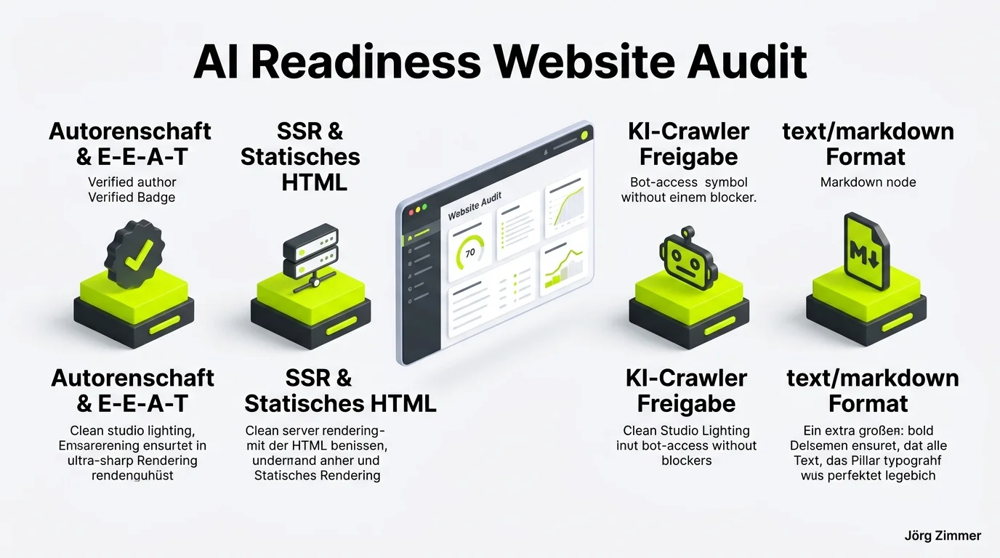

*Diese Diskussion wurde von mir auf LinkedIn am 03.08.2026 gestartet:*

  
💬 Jörg Zimmer 🌻 (LinkedIn Insights/Kommentar)

  

AI & GEO Check bei SEORCH dem kostenlosen SEO Tool

Heute war es so weit. Eines meiner absoluten [Lieblingstools](/blog/seorch-seo-tool-fanboy/) (dabei auch noch kostenlos) hat einen kompletten 22 Punkte Check für AI Readiness hinzugefügt. 

Hier ein Auszug aus den Prüfpunkten:
🍦 Autorenschaft (Author Profile): Autorenprofil gefunden
🍦 Server-Side Rendering (SSR) oder statisches HTML aktiv
🍦 Server Blockade - keine serverseitige AI Crawler Blockade aktiv
🍦 Common Crawl Index-Abdeckung: Gute Index-Abdeckung!
🍦 Markdown für Agenten: Unterstützt text/markdown für KI-Agenten

Hast du es schon probiert?

SEORCH legt mal wieder vor.

Ein 22-Punkte-Audit für AI Readiness, komplett kostenlos und direkt im Browser ausführbar. Während viele Enterprise-Suiten noch darüber beraten, wie sie generative Suchmaschinen überhaupt messen wollen, liefert Entwickler Matthias Hotz praxisnahe Fakten für alle Webmaster.

Die technische Optimierung von Websites für LLMs (Large Language Models) und KI-Suchmaschinen wie Perplexity, ChatGPT Search und Claude unterscheidet sich fundamental von der reinen Keyword-Platzierung vergangener Tage. Wer heute nicht dafür sorgt, dass autonome Agenten den Content in Millisekunden token-effizient parsen können, verliert sukzessive an digitaler Sichtbarkeit.

## Die 4 Kernsäulen moderner AI Readiness

Um zu verstehen, warum der SEORCH Check so wertvoll ist, lohnt sich ein Blick auf die Kernmechanismen, an denen KI-Crawler im Weballtag scheitern.

Der Test gliedert sich in vier zentrale Säulen, die jede zukunftssichere Webarchitektur erfüllen muss:

1. **Autorenschaft & E-E-A-T Validierung**: KI-Modelle gewichten semantisch validierte Urheberschaft über strukturierte Daten (`Person`, `author`) überdurchschnittlich stark, um Halluzinationen vorzubeugen.
2. **Server-Side Rendering (SSR) & Statisches HTML**: Client-Side-Rendering via React, Vue oder Angular stellt für LLM-Crawler eine massive Hürde dar. Viele Bots führen kein JavaScript aus oder brechen nach wenigen Millisekunden ab.
3. **Freigabe für KI-Crawler in der robots.txt**: Häufig blockieren veraltete Sicherheits-Plugins oder WAF-Regeln Bot-Tokens wie `GPTBot`, `PerplexityBot` oder `ClaudeBot` unabsichtlich serverseitig.
4. **Content Negotiation via text/markdown**: Die direkte Bereitstellung einer sauberen Markdown-Variante spart Token, Rechenzeit und verhindert Layout-Parsingfehler beim Agenten-Scraping.

## Vergleich: Klassischer SEO-Audit vs. SEORCH AI Readiness Check

Die folgende Übersicht verdeutlicht, wie sich der neue Prüfstandard von konventionellen Onpage-Prüfungen abhebt:

| Audit-Kriterium | Klassischer Onpage-Audit | SEORCH AI Readiness Check |
| :--- | :--- | :--- |
| **Ziel-Crawler** | Googlebot, Bingbot, Yandex | GPTBot, PerplexityBot, ClaudeBot, Agenten |
| **Rendering-Fokus** | JS-Rendering (Googlebot Web Rendering Service) | SSR / Statisches HTML (Verzicht auf JS-Execution) |
| **Datenformat** | HTML5, CSS, JSON-LD | HTML5, Schema.org Graph, text/markdown |
| **Crawl-Quelle** | Direkter Web-Crawl | Web-Crawl + Common Crawl Indexierung |
| **Urheber-Prüfung** | Vorhandensein von Impressum / Autorenbox | Semantische Personen-Entität & Author-Profile |
| **Dokumenten-Header** | Canonical, Meta-Robots, Hreflang | Link-Header (RFC 8288), Markdown Negotiation |

Weiterführende Hintergründe zur technischen Umsetzung findest du in meinem [Glossar-Artikel zum SEORCH AI Check](/glossar/seorch-ai-check/) sowie im umfassenden Leitfaden zur [AI Readiness](/glossar/agent-readiness/).

## Die Community diskutiert: Markdown-Exporte und LLM-Integrationen

Die Resonanz in der LinkedIn-Community auf das neue Feature war überwältigend. Direkt nach Veröffentlichung des Posts meldeten sich Kolleginnen und Kollegen mit konkreten Ideen für den nächsten Entwicklungsschritt.

  
💬 Maria Lengemann (LinkedIn Insights/Kommentar)

  

Das ist super! :) Wäre noch cooler, wenn er statt PDF eine .md ausgeben könnte für die effiziente Zusammenarbeit mit KI-Systemen (ohne dass das PDF minutenlang zerrupft werden muss).

Marias Feedback trifft den Nagel auf den Kopf. Während klassische Agenturen ihren Kunden nach wie vor 60-seitige PDF-Reports zustellen, fordern moderne SEOs maschinenlesbare Markdown-Dateien. Wer ein Audit sofort in Cursor, Claude oder Antigravity zur automatisierten Fehlerbehebung übergeben will, benötigt saubere Textdateien. Details dazu erläutere ich auch im Artikel über [Content Negotiation](/glossar/markdown-content-negotiation/) und den [llms.txt Standard](/glossar/llms-txt/).

Auch Mohamed Ibrahim sieht das Potenzial für agentenbasierte Workflows:

  
💬 Mohamed Ibrahim (LinkedIn Insights/Kommentar)

  

Danke für die Info. Cool wäre, wenn ich jetzt Ergebnisse in eine KI laden und sagen könnte optimiere meine Seite - werde ich morgen mal ausprobieren :)

Und wer macht's möglich? Matthias Hotz, das Mastermind hinter SEORCH, reagierte wie gewohnt nahbar und offen für Community-Feedback:

  
💬 Matthias Hotz (LinkedIn Insights/Kommentar)

  

Danke Dir für die Erwähnung Jörg Zimmer 🌻

Für Fragen, Feature Wünsche usw. gerne melden.

Genau das zeichnet die deutsche SEO-Community aus: Ein offener Dialog zwischen Tool-Entwicklern und Praktikern, der zu schnellen und pragmatischen Neuerungen führt.

<figure class="my-8 bg-neutral-50 border border-neutral-200 p-6 md:p-8 rounded-2xl shadow-sm">
  

    
    

      <h4 class="font-bold text-base md:text-lg text-dark mb-0">Jörg Zimmer</h4>
      
Senior SEO & AI Search Consultant

    

  

  <blockquote class="text-base md:text-lg text-dark leading-relaxed italic border-l-4 border-lime-accent pl-4 my-4 font-normal">
    „AI Readiness ist keine theoretische Spielerei für 2030, sondern entscheidet heute darüber, ob Perplexity, ChatGPT Search und Claude deinen Content zitieren oder schlicht ignorieren. Wer seinen Server für KI-Bots schließt oder clientseitiges JavaScript erzwingt, existiert in der Welt der LLMs schlicht nicht.“
  </blockquote>
  <figcaption class="mt-4 pt-3 border-t border-neutral-200/60 flex flex-wrap items-center justify-between gap-2 text-xs text-neutral-500">
    Experten-Zitat • <cite class="not-italic font-semibold text-neutral-700">Jörg Zimmer</cite>
    <a href="https://www.linkedin.com/posts/joerg-zimmer-seo-sea-freelancer-berlin-spandau_ai-geo-check-bei-seorch-dem-kostenlosen-activity-7490066971737100288-oMft" target="_blank" rel="noopener noreferrer" class="font-bold text-lime-700 hover:underline inline-flex items-center gap-1">
      Diskussion auf LinkedIn ansehen →
    </a>
  </figcaption>
</figure>

## Kernaussagen für die Praxis

Wer seine Website fit für die nächste Generation des Webs machen will, sollte die folgenden Punkte sofort prüfen:

- **Eigene Domain testen**: Lass deine Haupt-Landingpages durch den kostenlosen SEORCH AI Check laufen und identifiziere sofortige Hürden.
- **Server-Logs monitoren**: Analysiere, welche KI-Crawler (wie GPTBot, OAI-SearchBot, ClaudeBot oder PerplexityBot) bereits auf deine Ressourcen zugreifen.
- **JavaScript-Abhängigkeit minimieren**: Stelle sicher, dass die Kernaussagen und strukturierten Daten bereits im initialen Server-HTML enthalten sind.
- **Beratung nutzen**: Wenn du unsicher bist, wie du deine Architektur anpasst, buche eine individuelle [SEO Sprechstunde](/seo-sprechstunde/) für ein detailliertes Sparring.

<!-- CTA Box -->

  LinkedIn Community Diskussion
  <h3 class="text-xl md:text-2xl font-bold text-white mb-3 !mt-0 !border-none !pb-0">
    Jetzt an der Diskussion teilnehmen
  </h3>
  

    Diskutiere mit Jörg Zimmer, Matthias Hotz und der SEO-Community über den neuen AI Check von SEORCH.
  

  <a href="https://www.linkedin.com/posts/joerg-zimmer-seo-sea-freelancer-berlin-spandau_ai-geo-check-bei-seorch-dem-kostenlosen-activity-7490066971737100288-oMft" target="_blank" rel="noopener noreferrer" class="btn-primary">
    <svg class="w-4 h-4 fill-current" viewBox="0 0 24 24"><path d="M20.447 20.452h-3.554v-5.569c0-1.328-.027-3.037-1.852-3.037-1.853 0-2.136 1.445-2.136 2.939v5.667H9.351V9h3.414v1.561h.046c.477-.9 1.637-1.85 3.37-1.85 3.601 0 4.267 2.37 4.267 5.455v6.286zM5.337 7.433c-1.144 0-2.063-.926-2.063-2.065 0-1.138.92-2.063 2.063-2.063 1.14 0 2.064.925 2.064 2.063 0 1.139-.925 2.065-2.064 2.065zm1.782 13.019H3.555V9h3.564v11.452zM22.225 0H1.771C.792 0 0 .774 0 1.729v20.542C0 23.227.792 24 1.771 24h20.451C23.2 24 24 23.227 24 22.271V1.729C24 .774 23.2 0 22.222 0h.003z"/></svg>
    Beitrag auf LinkedIn öffnen
    →
  </a>

