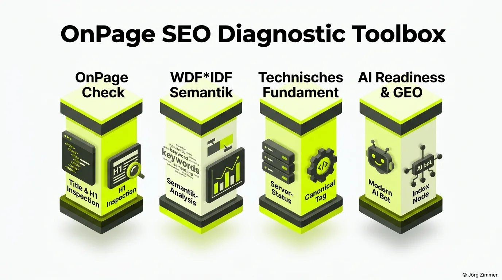

Ich sag es ganz offen im Berliner Klartext: Ich bin ein absoluter Fanboy des SEO-Tools **SEORCH**. Wer mich kennt, weiß, dass ich eine ausgeprägte Allergie gegen überladene Bauchladen-Software habe, die dir hundert bunte Metriken anzeigt, wovon 99 völlig irrelevant für deinen tatsächlichen Kundenumsatz sind. 

SEORCH ist das genaue Gegenteil: fokussiert, rasend schnell, direkt im Browser und ohne künstliche Paywall. Und auf der Campixx hatte ich endlich die Gelegenheit, den Kopf hinter diesem genialen Werkzeug persönlich zu treffen: **Dankeschön an Matthias Hotz!**

## Warum SEORCH mein unverzichtbares Go-To-Werkzeug ist

Wenn du dir meine tägliche Arbeit in der [SEO-Sprechstunde](/seo-sprechstunde/) anschaust, geht es zu 90 % um das handwerkliche Fundament. Pfusch am Bau verzeiht Google nicht. Ein fehlerhafter [Canonical-Tag](/glossar/canonical-tag/) oder eine blockierte CSS-Datei ruinieren die Rankings selbst des besten Redaktionsteams. SEORCH ist für mich der kompromisslose digitale TÜV für jede Domain.

Die Plattform gliedert sich in vier essenzielle Kernsäulen, die jeder Webmaster regelmäßig prüfen sollte:

1. **Knallharter OnPage-Check**: Du gibst deine Ziel-URL sowie dein Fokus-Keyword ein und erhältst in Sekundenschnelle ein ungeschminktes Fehlerprotokoll zu Title-Tags, H1-Strukturen, Textlängen und Alt-Attributen.
2. **WDF*IDF Semantik-Analyse**: Das Tool vergleicht die Termgewichtung deiner Seite mit den aktuellen Top-10-Suchergebnissen und zeigt präzise auf, welche semantischen Entitäten deinem Text noch fehlen.
3. **Technisches Fundament & HTTP-Status**: Statuscodes, Robots-Anweisungen, Weiterleitungsketten und Ladezeiten werden unmittelbar offengelegt. Wir übersetzen hier technische Warnungen direkt in geschäftliche Hebel.
4. **AI Readiness & GEO Check**: Wie ich im Artikel über den neuen [SEORCH AI Check](/blog/seorch-ai-geo-check/) ausführlich erläutert habe, testet das Tool inzwischen 22 zukunftsweisende Kriterien für LLMs und KI-Agenten.

## Vergleich: SEORCH vs. Überladene Enterprise-Suiten

Warum schlägt ein fokussiertes Werkzeug im Alltag oft 500-Euro-Monatsabos? Die Gegenüberstellung zeigt es deutlich:

| Prüfkriterium | Überladene Enterprise-Suiten | SEORCH Toolbox |
| :--- | :--- | :--- |
| **Kostenmodell** | Teure Monatsabos (oft 200–800 € / Monat) | 100 % kostenlos, keine Paywall |
| **Datenaktualität** | Oft veraltete Crawl-Daten aus dem Archiv | Live-Crawl der Ziel-URL in Echtzeit |
| **Setup & Login** | Komplexes Onboarding & Account-Zwang | Sofortige URL-Eingabe ohne Registrierung |
| **Ladezeit des Reports** | Langwieriges Warten auf Dashboard-Rendering | Ergebnisliste nach wenigen Sekunden |
| **Fokus der Analyse** | Unzählige theoretische Vanity-Metriken | Knallharte Fakten zu OnPage, Technik & GEO |
| **Einsatzbereich** | Monatliche Kundenpräsentationen | Sofortige Fehlerprüfung beim [Website SEO Audit](/blog/website-seo-audit-vibe-coding/) |

## Die Community feiert SEORCH und das persönliche Treffen

Mein LinkedIn-Post stieß in der Community auf riesige Resonanz. Es stellte sich heraus, dass unzählige Kolleginnen und Kollegen SEORCH heimlich oder ganz offen als ihre Geheimwaffe nutzen:

  
💬 Sebastian Fuhrmann (LinkedIn Insights)

  
"Wie cool, das hätte mich auch sehr interessiert. Einer meiner Lieblings-Tools."

  
💬 Andre Herzog (LinkedIn Insights)

  
"Seorch ist mega. Kenne nichts vergleichbares. Bin allerdings auch nicht Teil der SEO Welt. Zumindest nicht so tief."

Auch Entwickler Matthias Hotz schaltete sich direkt in die Diskussion ein:

  
💬 Matthias Hotz (LinkedIn Insights)

  
"War super mit dir! Tolle Gespräche und hat mich gefreut dich kennen gelernt zu haben Jörg Zimmer 🌻"

Natürlich durfte auf der Konferenz auch der typische Branchen-Humor nicht zu kurz kommen, wie die Kommentare von Paavo und Michael beweisen:

  
💬 Paavo Christian Spieker (LinkedIn Insights)

  
"Wenn ich gewusst hätte, dass das ein Styling-Hair-Contest wird, dann wäre ich natürlich auch gekommen 😇"

  
💬 Michael Weckerlin ☮️ (LinkedIn Insights)

  
"wow, Suoer Foto. 👏 Der Fotograf hat es drauf die schönsten Momente einzufangen 📸"

Dieser lockere Austausch zeigt, wie wertvoll Events wie das [Campixx Networking](/blog/campixx-networking-conversion-optimierung/) für den Zusammenhalt in unserer Branche sind.

<figure class="my-8 bg-neutral-50 border border-neutral-200 p-6 md:p-8 rounded-2xl shadow-sm">
  

    
    

      <h4 class="font-bold text-base md:text-lg text-dark mb-0">Jörg Zimmer</h4>
      
Senior SEO & AI Search Consultant

    

  

  <blockquote class="text-base md:text-lg text-dark leading-relaxed italic border-l-4 border-lime-accent pl-4 my-4 font-normal">
    „Wenn es händisch, das kann ja jeder machen, wenn man jetzt nicht so ein teures Tool anschmeißen will und die sind ja auch noch alle in Beta.“
  </blockquote>
  <figcaption class="mt-4 pt-3 border-t border-neutral-200/60 flex flex-wrap items-center justify-between gap-2 text-xs text-neutral-500">
    

      Experten-Zitat • <cite class="not-italic font-semibold text-neutral-700">Jörg Zimmer</cite>
      •
      <a href="https://www.youtube.com/watch?v=pJFZzv5LEvk&t=1711s" target="_blank" rel="noopener noreferrer" class="text-neutral-600 hover:text-dark underline inline-flex items-center gap-1">
        Quelle: YouTube Talk Antonio Blago & Jörg Zimmer Folge 5 (28:31)
        <svg class="w-3 h-3 text-neutral-400" fill="none" stroke="currentColor" viewBox="0 0 24 24"><path stroke-linecap="round" stroke-linejoin="round" stroke-width="2" d="M10 6H6a2 2 0 00-2 2v10a2 2 0 002 2h10a2 2 0 002-2v-4M14 4h6m0 0v6m0-6L10 14" /></svg>
      </a>
    

    <a href="https://www.linkedin.com/in/joerg-zimmer-seo-sea-freelancer-berlin-spandau/" target="_blank" rel="noopener noreferrer" class="font-bold text-lime-700 hover:underline inline-flex items-center gap-1 shrink-0">
      Jörg Zimmer auf LinkedIn folgen →
    </a>
  </figcaption>
</figure>

## Praxistipp für deine tägliche SEO-Arbeit

Wenn du dein OnPage-Fundament auf Vordermann bringen möchtest:

- **Eigene Website testen**: Wirf deine wichtigste Geld-Seite direkt auf <a href="https://seorch.de/" target="_blank" rel="noopener noreferrer" class="font-bold underline text-lime-700">seorch.de</a> ein und arbeite die rote Mängelliste konsequent ab.
- **WDF*IDF gezielt nutzen**: Identifiziere inhaltliche Lücken gegenüber deinen Top-Konkurrenten und reichere deine Texte mit relevanten Entitäten an.
- **AI-Readiness beachten**: Nutze den integrierten Check, um zu prüfen, ob dein Server KI-Crawler aussperrt oder Content Negotiation unterstützt.
- **Audit-Sparring**: Wenn du Unterstützung bei der Fehlerpriorisierung brauchst, melde dich für ein persönliches Sparring in der [SEO-Sprechstunde](/seo-sprechstunde/).

<!-- CTA Box -->

  LinkedIn Community Diskussion
  <h3 class="text-xl md:text-2xl font-bold text-white mb-3 !mt-0 !border-none !pb-0">
    Jetzt an der Diskussion teilnehmen
  </h3>
  

    Nutzt du SEORCH bereits für deine OnPage-Checks oder setzt du auf andere Werkzeuge? Teile deine Erfahrungen auf LinkedIn!
  

  <a href="https://www.linkedin.com/posts/joerg-zimmer-seo-sea-freelancer-berlin-spandau_ich-bin-fanboy-des-seo-tools-seorch-nun-activity-7473363474753019904-HQsc" target="_blank" rel="noopener noreferrer" class="btn-primary">
    <svg class="w-4 h-4 fill-current" viewBox="0 0 24 24"><path d="M20.447 20.452h-3.554v-5.569c0-1.328-.027-3.037-1.852-3.037-1.853 0-2.136 1.445-2.136 2.939v5.667H9.351V9h3.414v1.561h.046c.477-.9 1.637-1.85 3.37-1.85 3.601 0 4.267 2.37 4.267 5.455v6.286zM5.337 7.433c-1.144 0-2.063-.926-2.063-2.065 0-1.138.92-2.063 2.063-2.063 1.14 0 2.064.925 2.064 2.063 0 1.139-.925 2.065-2.064 2.065zm1.782 13.019H3.555V9h3.564v11.452zM22.225 0H1.771C.792 0 0 .774 0 1.729v20.542C0 23.227.792 24 1.771 24h20.451C23.2 24 24 23.227 24 22.271V1.729C24 .774 23.2 0 22.222 0h.003z"/></svg>
    Beitrag auf LinkedIn öffnen
    →
  </a>

