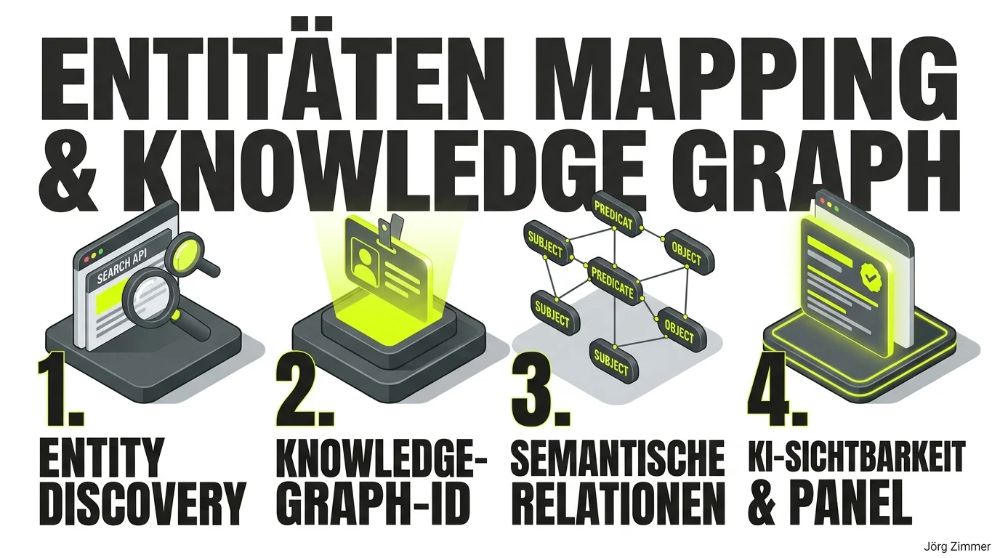

Direkt nach dem Live-Stream des Sistrix-Podcasts mit Björn Darko und Maximilian D. Muhr saß ich elektrisiert am Schreibtisch: Die beiden haben das Thema Entitäten-Mapping und semantische Verknüpfung so präzise aufgedröselt, dass die praktische Tragweite für modernes SEO und KI-Sichtbarkeit sofort greifbar wurde.

Während sich viele Marketer noch immer an statischen Keyword-Dichten festklammern, operieren moderne Suchmaschinen und generative Antwortmaschinen längst auf der Ebene des Google Knowledge Graph: **„Things, not strings“**.

### Sechs zentrale Praxiserkenntnisse aus der Podcast-Session

1. **Kostenlose Analyse via Knowledge Graph API:** Über das [Entity Discover Tool von poliSYS](https://polisys.de/tools/entity/) lässt sich Googles Knowledge Graph API direkt und kostenfrei abfragen, um die eigene Maschinen-Identität zu überprüfen.
2. **Der Sprung zur eigenen Entity-ID:** Vor sechs Monaten war meine persönliche Marke dort noch nicht zweifelsfrei hinterlegt – inzwischen führt mich Google mit einer eindeutigen ID als Person und Entität.
3. **Global konsistente Entitäten-Präsenz:** Ein prägnanter Slogan mit konsistenten Kernentitäten und Fachgebieten sollte über möglichst viele autoritäre Quellen im Web hinweg identisch platziert werden.
4. **Semantische Sätze als Daten-Anker:** Entitäten-Sätze müssen zwingend Subjekt, Prädikat und Objekt enthalten, damit Algorithmen die inhaltliche Aussage auch isoliert zweifelsfrei parsen können.
5. **Das eigene Universum aufladen:** Der Aufbau beginnt auf der eigenen Website, setzt sich im strukturierten Schema-Markup fort und wird über soziale Profile und Verzeichnisse synchronisiert.
6. **Modellübergreifende Datenbanken:** Nicht nur Google, sondern auch Bing, ChatGPT und Perplexity nutzen relationale Wissensgraphen, um Antworten mit verifizierten Fakten abzugleichen.

### Praxis-Check mit poliSYS: Maschinelle Identität und Google KGMID live auslesen

Wie sieht die Abfrage des Google Knowledge Graph in der Realität aus? Mit dem kostenlosen Entity Discover Tool von Maximilian Muhr lässt sich sekundenschnell prüfen, ob eine Personenmarke oder ein Unternehmen von Google als vollwertige Entität anerkannt ist:

Der Screenshot verdeutlicht die entscheidenden Messwerte:
- **Eindeutige Maschinen-ID (KGMID):** Google weist jeder verifizierten Entität einen dauerhaften Identifier (wie `/g/...` oder `/m/...`) zu. Dies ist der Beweis, dass die Suchmaschine die Marke nicht nur als flüchtige Textzeichenfolge (String), sondern als festen Wissensknoten (Thing) führt.
- **Confidence Score (Result Score):** Gibt an, wie stark die algorithmische Zuversicht der Knowledge Graph Search API ist, dass die gefundene Entität exakt mit der Suchanfrage übereinstimmt.
- **Typisierung (`@type`):** Verifiziert, ob die semantische Einordnung (z. B. `Person`, `Organization`, `LocalBusiness`) mit den Angaben im eigenen Schema-Markup übereinstimmt.

Wer seine Entität im Knowledge Graph systematisch festigen möchte, findet auf unserem Tools-Praxis-Hub alle passenden Generatoren und Prüfwerkzeuge.

### Vergleich: Klassisches Keyword-SEO vs. Semantisches Entitäten-Mapping

| Kriterium | Klassisches Keyword-SEO | Modernes Entitäten-Mapping |
| :--- | :--- | :--- |
| **Datenbasis** | Reine Zeichenketten (Strings) | Eindeutige Wissens-Knoten (Things) |
| **Suchmaschinen-Verständnis** | Vorkommen & Dichte auf URLs | Relationale Verknüpfung im [Knowledge Panel & Graph](/glossar/knowledge-graph/) |
| **Semantische Syntax** | Lose Schlagwort-Kombinationen | Tripel: Subjekt – Prädikat – Objekt |
| **Rolle für KI & LLMs** | Nachrangig für Textgenerierung | Essenzielle Trainings- und Grounding-Basis |
| **Identitätsnachweis** | Keine Personen-Verifikation nötig | Eindeutige Entity-ID & verifiziertes Knowledge Panel |

<figure class="my-8 bg-neutral-50 border border-neutral-200 p-6 md:p-8 rounded-2xl shadow-sm">
  

    
    

      <h4 class="font-bold text-base md:text-lg text-dark mb-0">Jörg Zimmer</h4>
      
Senior SEO & AI Search Consultant

    

  

  <blockquote class="text-base md:text-lg text-dark leading-relaxed italic border-l-4 border-lime-accent pl-4 my-4 font-normal">
    „Aber wenn ich hier so weitere Open Datenbank, Stadtportale oder was ich, Knowledgecraft, Entitäten, Markenaufbau, Presse, was sagen die Leute dann immer? ja, musst jetzt Presse, ja, musst du machen. Ich habe es auch gesehen. wurde referenziert, Pressemitteilung 2018. Der wurde aus einer Pressemitteilung von 2018.“
  </blockquote>
  <figcaption class="mt-4 pt-3 border-t border-neutral-200/60 flex flex-wrap items-center justify-between gap-2 text-xs text-neutral-500">
    

      Experten-Zitat • <cite class="not-italic font-semibold text-neutral-700">Jörg Zimmer</cite>
      •
      <a href="https://www.youtube.com/watch?v=pJFZzv5LEvk&t=3650s" target="_blank" rel="noopener noreferrer" class="text-neutral-600 hover:text-dark underline inline-flex items-center gap-1">
        Quelle: YouTube Talk Antonio Blago & Jörg Zimmer Folge 5 (60:50)
        <svg class="w-3 h-3 text-neutral-400" fill="none" stroke="currentColor" viewBox="0 0 24 24"><path stroke-linecap="round" stroke-linejoin="round" stroke-width="2" d="M10 6H6a2 2 0 00-2 2v10a2 2 0 002 2h10a2 2 0 002-2v-4M14 4h6m0 0v6m0-6L10 14" /></svg>
      </a>
    

    <a href="https://www.linkedin.com/in/joerg-zimmer-seo-sea-freelancer-berlin-spandau/" target="_blank" rel="noopener noreferrer" class="font-bold text-lime-700 hover:underline inline-flex items-center gap-1 shrink-0">
      Jörg Zimmer auf LinkedIn folgen →
    </a>
  </figcaption>
</figure>

### Die Community-Debatte auf LinkedIn: Zwischen Knowledge Panel und Wikidata

Als ich meine Erfahrungen mit der Beanspruchung des Google Knowledge Panels auf LinkedIn teilte, entwickelte sich ein hochgradig fachlicher Austausch:

**Björn Darko** schilderte die typischen Hürden im Interface:
> *„Jetzt wurde der Zugang zum Knowledge Panel bestätigt. Ich komme aber um verrecken nicht in die Bearbeitungsseite, weil sie in einem zu kleinen Fenster öffnet, welches sich nicht schieben und vergrößern lässt. Hat jemand einen Lifehack für mich?“*

**Dr. Torsten Beyer** erinnerte an die strenge Wikidata-Regulierung:
> *„Klingt einfach, ich kann mich daran erinnern, mal aufwendig einen Wikidata-Eintrag gemacht zu haben. Bin dann aus Wikidata wieder rausgeflogen wegen 'Selfpromotion'.“*

**Anastasia Galani** schuf Klarheit bezüglich des Relevanz-Scores:
> *„Der Score '24' wird nur als relativer Abstand zu anderen Entitäten gleichen Namens gewichtet – eine bekanntere Person hätte vielleicht '150' und wäre für Google dominanter. Es ist kein absoluter Notenscore, sondern beschreibt die Trennschärfe im Entitätenraum. Aber wenn du das Panel beanspruchen konntest, ist das das Fundament.“*

**Michael Holste** brachte die Relevanz für generative KI auf den Punkt:
> *„Ich würde das Knowledge Panel weniger als isoliertes Ziel sehen, sondern als Indikator. Entscheidend ist, ob eine Person oder ein Unternehmen in den Wissensgraphen der KI-Systeme mit den richtigen Themen und Beziehungen verknüpft wird. Genau diese semantischen Zusammenhänge werden für AI Visibility immer wichtiger als einzelne Keywords.“*

### Strategische Einordnung für SEO und Entity-Building

Die Verknüpfung von [Entitäts-SEO](/glossar/entity-seo/) und dem gezielten Aufbau von [Topical Authority](/glossar/topical-authority/) entscheidet darüber, ob deine Website in generativen Suchsystemen zitiert wird. Ähnliche Ansätze diskutierten wir bereits im [SEOpresso Podcast mit Max Muhr](/blog/seopresso-podcast-maximilian-muhr/) und beim regelmäßigen Netzwerken auf dem [SEO-Stammtisch Berlin](/blog/seo-stammtisch-berlin-axel-springer/).

Wenn du prüfen möchtest, wie Google und ChatGPT deine Marke aktuell im Knowledge Graph einordnen, analysieren wir deine Entitäten-Struktur gerne gemeinsam in der [SEO-Sprechstunde](/seo-sprechstunde/).

<!-- LinkedIn CTA Box -->

  <h3 class="text-xl md:text-2xl font-bold text-white mb-3 !mt-0 !border-none !pb-0">
    Jetzt an der Diskussion teilnehmen
  </h3>
  

    Diskutiere mit Jörg Zimmer und der SEO-Community auf LinkedIn über diesen Beitrag.
  

  <a href="https://www.linkedin.com/posts/joerg-zimmer-seo-sea-freelancer-berlin-spandau_komme-gerade-aus-dem-sistrix-podcast-mit-activity-7487830961796050946-qKcE" target="_blank" rel="noopener noreferrer" class="btn-primary">
    <svg class="w-4 h-4 fill-current" viewBox="0 0 24 24"><path d="M20.447 20.452h-3.554v-5.569c0-1.328-.027-3.037-1.852-3.037-1.853 0-2.136 1.445-2.136 2.939v5.667H9.351V9h3.414v1.561h.046c.477-.9 1.637-1.85 3.37-1.85 3.601 0 4.267 2.37 4.267 5.455v6.286zM5.337 7.433c-1.144 0-2.063-.926-2.063-2.065 0-1.138.92-2.063 2.063-2.063 1.14 0 2.064.925 2.064 2.063 0 1.139-.925 2.065-2.064 2.065zm1.782 13.019H3.555V9h3.564v11.452zM22.225 0H1.771C.792 0 0 .774 0 1.729v20.542C0 23.227.792 24 1.771 24h20.451C23.2 24 24 23.227 24 22.271V1.729C24 .774 23.2 0 22.222 0h.003z"/></svg>
    Beitrag auf LinkedIn öffnen
    →
  </a>

