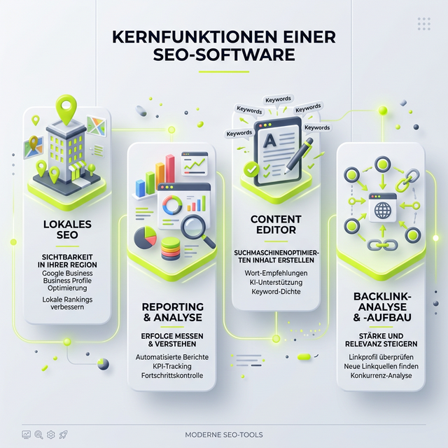

## Der ständige Begleiter: Welches SEO-Tool ist das richtige?

Moin! Da bin ich seit Wochen auf der Suche nach der ultimativen Antwort auf eine Frage, die mir auch auf LinkedIn und in Kundengesprächen immer wieder gestellt wird: **Kann SE Ranking das Tool Sistrix vollkommen ersetzen?** Reicht der Core-Zugang aus, oder ist Growth/Pro die Pflichtvariante? 

Ich nutze aktuell beide Tools parallel und vergleiche sie intensiv im Arbeitsalltag. Meine persönliche Perspektive: Langfristig kann SE Ranking wahrscheinlich Sistrix komplett ersetzen – zumindest für meine Arbeitsweise und meine Kundenprojekte. Im Moment springe ich noch zwischen beiden hin und her, da jedes Tool seine eigenen Stärken ausspielt und gewisse Gewohnheiten schwer abzulegen sind. Aber je tiefer ich in SE Ranking abtauche, desto klarer wird mir, wie mächtig dieses Toolset wirklich ist.

> "Ein Tool ist immer nur so gut wie derjenige, der es bedient. Aber wenn das Tool dir mehr verlässliche Daten für weniger Budget liefert, musst du einfach zweimal hinschauen."

Genau deshalb teile ich heute meine persönlichen Erfahrungen aus der Sicht eines SEOs mit 20 Jahren Berufserfahrung. Kein Buzzword-Bingo, keine theoretischen Datenblätter, sondern ehrliche Praxis-Erkenntnisse aus dem echten Leben.

## Treffen mit den Machern auf der Campixx

Erst kürzlich habe ich mich intensiv mit den Entwicklungen der Plattform beschäftigt. Dazu gab es auf der Campixx auch einen spannenden Austausch. Wie ich bereits auf LinkedIn geschrieben habe:

> Das Bild musste noch raus! 📸 & Warum ich [SE Ranking](https://seranking.com/de/subscription.html?ga=4169588&source=link) für AI Tracking & SEO nutze?
> Bevor das Jahr rum ist (oder die nächste Campixx startet 😉), hier endlich das Foto mit Nico Kavelar! Hat mich sehr gefreut, dich auf der Campixx getroffen zu haben. Wir haben lange über die Entwicklung von SE Ranking gesprochen. Ich bin ja Fan von effizienten Workflows und da liefert die Suite ordentlich ab.
> 
> *[Original auf LinkedIn ansehen](https://www.linkedin.com/posts/joerg-zimmer-seo-sea-freelancer-berlin-spandau_das-bild-musste-noch-raus-warum-ich-activity-7398682637521006592-R-_W?utm_source=share&utm_medium=member_desktop&rcm=ACoAADQdMuYBHR-eSucFKv63wjXNHfs3eLpPKlI)*

Solche persönlichen Gespräche zeigen mir immer wieder, wie nah das Team an den tatsächlichen Bedürfnissen von uns SEOs dran ist. Sie hören zu und entwickeln genau die Features, die wir im Agenturalltag und als Freelancer brauchen.

## Der Fluch und Segen der 1.000 Knöpfe

Wer von Sistrix kommt, schätzt oft die strukturierte Aufgeräumtheit. Der Sichtbarkeitsindex ist schnell erklärt, die Navigation ist über Jahre gelernt. Man weiß im Schlaf genau, wo man klicken muss, um den Performance-Graphen für den Kunden zu ziehen. Es ist das vertraute Werkzeug.

SE Ranking hingegen ist am Anfang wie das Cockpit eines A380. Ich bin ganz ehrlich: Ich bin durch die gefühlten „1.000 Knöpfe“ immer noch nicht ganz durch! Und genau hier liegt das Pro und Kontra der Plattform zugleich: Sie ist extrem mächtig und bietet unfassbar viele Einstellungsmöglichkeiten, ist aber im ersten Moment auch entsprechend komplex in der Menüführung. 

Ich bin ja, wie ich gerne sage, immer noch im "Onboarding im Kopf". Bei der Navigationstiefe und den schier endlosen Möglichkeiten von solchen All-in-One SEO-Suiten bedeutet das bei mir in der Regel ca. 1-2 Jahre, bis jeder Handgriff ohne Nachdenken sitzt. Ein halbes Jahr habe ich bei SE Ranking nun schon hinter mir. Und was ich bisher sehe, teste und täglich in Kundenprojekten nutze, überzeugt mich auf ganzer Linie.

## Der direkte Vergleich: Sistrix Start vs. SE Ranking Core

Lass uns Fakten auf den Tisch legen und die beiden Grundversionen vergleichen, die für Freelancer und kleine bis mittlere Agenturen am interessantesten sind. Ein Tool-Wechsel muss sich nicht nur fachlich, sondern auch wirtschaftlich lohnen.

### Preis und Mitarbeiterplätze: Klarer Punkt für SE Ranking

Sistrix ruft für das Start-Paket mittlerweile rund 119€ im Monat auf. Für Einzelkämpfer ist das absolut in Ordnung und marktüblich. Sobald das Team aber wächst oder man Mandanten eigene Reporting-Zugänge geben möchte, wird es restriktiv und schnell teuer.

**Die Vorteile von [SE Ranking](https://seranking.com/de/subscription.html?ga=4169588&source=link) im Core-Plan (bei jährlicher Zahlung ca. 87€ im Monat):**
- **Mehr Mitarbeiterplätze (Seats):** Du kannst deinem Team direkt Zugriff geben, ohne ständig Extra-Gebühren zahlen zu müssen.
- **Mehr verwaltbare Projekte:** Die Anzahl der Domains im Account ist deutlich flexibler.
- **Budget-Freundlich:** Da bleibt mehr Budget für aktiven Linkaufbau oder die Content-Kreation übrig.

Während du bei beinahe jedem anderen Tool für jeden Extra-Nutzer tief in die Tasche greifst, bietet SE Ranking im Projektmanager einfach deutlich mehr Spielraum für deutlich weniger Geld. 

**Ist der Growth/Pro-Tarif also zwingend nötig?**
Aus meiner Sicht: Nein. Ich selbst nutze zwar das große Paket und bin damit voll zufrieden, aber theoretisch ist das bei SE Ranking eher für größere Agenturen gedacht, die:
- Historische Daten im Gigabyte-Bereich wälzen
- White-Label-Berichte ohne Ende verschicken
- Hunderttausende Seiten pro Monat crawlen müssen

Der Core-Zugang reicht für die allermeisten Freelancer und Inhouse-SEOs am Anfang völlig aus.

## Die Datenlage: Suchvolumen, Rankings und Backlinks

Ich habe die Datenqualität beider Tools über viele Monate hinweg in verschiedenen Branchen verglichen. SE Ranking hat dazu auch selbst mal eine Studie veröffentlicht und sich gefragt, ob sie [eine würdige Sistrix Alternative](https://seranking.com/de/worthy-sistrix-alternative.html?ga=4169588&source=link) sind. Ob man dem Marketing-Sprech des Herstellers immer blind trauen kann? Weiß ich nicht genau. Deshalb prüfe ich die Daten immer selbst mit echten Rankings meiner Kundenprojekte.

**Die Backlinks im Vergleich:**
Sistrix ist traditionell im DACH-Raum sehr stark, hat aber im internationalen Vergleich eine eher kleinere Backlink-Datenbank. Wer auch mal über die DACH-Grenzen hinaus optimiert, merkt das recht schnell. SE Ranking protzt hier mit einer massiven Datenbank von über 3 Billionen Backlink-Verbindungen. In der Praxis merke ich das deutlich: Ich finde mit SE Ranking oft schneller kleine Nischen-Backlinks, feine Linkprofil-Veränderungen bei Wettbewerbern und potenziell toxische Verlinkungen als mit der vertrauten Konkurrenz.

**Suchvolumen & Keyword-Tracking:**
Hier trumpft SE Ranking aus meiner Sicht richtig auf. Das tagesaktuelle Rank-Tracking (im Core Plan gibt es ein großzügiges Kontingent ab 1.000 Keywords täglich) ist extrem akkurat und pfeilschnell. Was ich besonders feiere: Sie cachen die SERPs. Das bedeutet, ich kann exakt sehen, wie die Suchergebnisseite am Tag X wirklich aussah. Wenn ein Ranking bei mir gestern von Platz 2 auf Platz 8 gedroppt ist, kann ich sofort nachvollziehen, welches Snippet, welches Local Pack oder People-Also-Ask-Feature sich geändert und mich verdrängt hat. Das ist ein Feature, das bei der Ursachenforschung an stressigen Tagen schlichtweg unbezahlbar ist.

## Die integrierten Allzweck-Waffen von SE Ranking

Wo SE Ranking für mich im Moment die eindeutig bessere Wahl ist, sind die vielen integrierten Zusatzmodule. Bei anderen Anbietern musst du für diese Funktionen oft teure Standalone-Tools hinzukaufen:

1. **Local SEO:** Komplett in SE Ranking integriert. Von Google Maps Rankings bis zum detaillierten Marketing-Audit lokaler Branchenbucheinträge. Perfekt für meine lokalen Kunden in Berlin, Spandau und dem restlichen Bundesgebiet.
2. **Reporting & White Label:** Du hast unlimitierte Berichte schon im Core Plan. Die Reports sehen extrem professionell aus, lassen sich detailliert anpassen und sparen mir am Monatsende wertvolle Stunden in der manuellen Aufbereitung.
3. **SEO Website-Audits:** Über 120 verschiedene Parameter werden von dem wirklich schnellen Website-Crawler geprüft. Die Übersichtlichkeit im Dashboard bei Fehlermeldungen schlägt den Wettbewerb hier meiner Meinung nach um Längen. Jeder Fehler wird sauber priorisiert.
4. **Content Marketing Editor:** Termgewichtung, NLP-Vorgaben und Lesbarkeit direkt beim Schreiben im Texteditor prüfen. Wer klassische Helferlein wie SurferSEO kennt, weiß, was ein ähnliches Tool einzeln kostet. Hier ist die Ideensuche und Optimierung inklusive.
5. **AI Tracking & Tools:** In Zeiten von Generative Engine Optimization (GEO) und KI-Antworten liefert SE Ranking neue Metric-Tools, um auch hier den Anschluss nicht zu verpassen. Das Tool misst, wie ChatGPT, Google KI & Co. dich erwähnen und verlinken.

## Wo sind die Schwachstellen von SE Ranking?

Wo viel Licht ist, da ist natürlich auch immer etwas Schatten. Die schon erwähnten „1000 Knöpfe“ schrecken gerade Anfänger oft erst einmal ab. Die Einarbeitungszeit ist signifikant höher, als wenn man ein Tool nutzt, das sich rein auf eine einzige Metrik wie Sichtbarkeit spezialisiert hat. Man verläuft sich hin und wieder recht schnell in tief verwinkelten Untermenüs und riesigen Daten-Tabellen. Wer aber dranbleibt, wird mit tiefen Insights belohnt.

Zudem ist der **Sichtbarkeitsindex von Sistrix** im deutschen Markt einfach eine fest verankerte, harte Währung. Wenn du als SEO mit einem Marketingleiter oder Vorständen sprichst, wollen diese meist den "Sistrix-Graphen" sehen. Dieser Graph ist das ultimative Statussymbol der deutschen SEO-Szene geworden. 

Diesen Standard-Status hat SE Ranking schlichtweg (noch) nicht. Die Sichtbarkeitsbewertung in SE Ranking ist stark, sie ist extrem logisch aufgebaut und liefert absolut verlässliche Kurven – sie muss aber bei neuen Kunden oft erst mühsam erklärt und verteidigt werden. Das Ersetzen dieses psychologischen „Marken-Faktors“ ist in Verkaufsgesprächen oft die größte Hürde für einen Wechsel.

## Lohnt sich der Wechsel?

Perspektivisch kann und wird SE Ranking das gute alte Sistrix für mich vollkommen ersetzen. Da das Tool schlichtweg mehr tiefe Möglichkeiten in den Bereichen automatisiertes Reporting, großzügige Seat-Verwaltung, Local SEO-Tracking, technische Detail-Audits und umfassende Backlink-Analyse bietet, sehe ich es aktuell als die bessere und vor allem wirtschaftlichere All-in-One Wahl.

Wer die etwas längere Einarbeitungszeit nicht scheut und bereit ist, sich durch die vielen starken Features und Graphen zu arbeiten, erhält mit dem SE Ranking Core-Plan eine extrem vielseitige, mächtige SEO-Suite, die kaum noch Wünsche offen lässt. 

Für Agenturen mit hunderten Mitarbeitern und hunderttausenden Keywords lohnt sich sicher der Blick auf den Growth-Plan (wie gesagt, ich nutze ihn auch und bin voll zufrieden), aber für den soliden Start, den ambitionierten Freelancer und den Agenturalltag im Mittelstand reicht Core oft mehr als aus.

---

  <h3>Lust auf mehr AI Visibility und SEO-Power?</h3>
  
Wenn du SE Ranking selbst testen willst und dir das All-in-One Tool einmal genauer ansehen möchtest, kannst du hier direkt loslegen:

  <a href="https://seranking.com/de/subscription.html?ga=4169588&source=link" target="_blank" rel="noopener noreferrer" class="btn-primary inline-flex mt-4 no-underline">
    Jetzt SE Ranking ausprobieren →
  </a>

---

### Weiterführende Artikel
* **Lese-Tipp:** [SE Ranking Preise 2026: Der ultimative Guide für SEO-Experten](/blog/se-ranking-preise/)
* **Lese-Tipp:** [SE Ranking launcht AI Tracker: Rankings in der KI-Suche messen](/blog/se-ranking-ai-tracker/)
