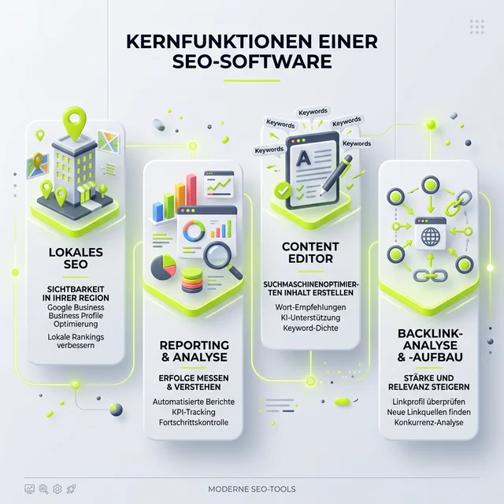

Ich nutze aktuell beide Tools parallel und vergleiche sie intensiv im Arbeitsalltag. Meine persönliche Perspektive: Langfristig kann <a href="https://seranking.com/de/?ga=4169588&source=link" target="_blank" rel="noopener noreferrer nofollow sponsored">SE Ranking (Partnerlink)</a> wahrscheinlich Sistrix komplett ersetzen – zumindest für meine Arbeitsweise und meine Kundenprojekte. Zusätzlich nutze ich <a href="https://rankscale.ai/?via=offer" target="_blank" rel="noopener noreferrer nofollow sponsored">Rankscale (Partnerlink)</a>, um die Sichtbarkeit meiner Kunden in KI-Ergebnissen (GEO) zu tracken, was Sistrix aktuell noch gar nicht abdeckt.

<figure class="my-8 bg-neutral-50 border border-neutral-200 p-6 md:p-8 rounded-2xl shadow-sm">
  

    
    

      <h4 class="font-bold text-base md:text-lg text-dark mb-0">Jörg Zimmer</h4>
      
Senior SEO & AI Search Consultant

    

  

  <blockquote class="text-base md:text-lg text-dark leading-relaxed italic border-l-4 border-lime-accent pl-4 my-4 font-normal">
    „Jetzt einmal richtig zu machen, damit ich nicht von dir noch noch zehn mehr Tickets kriege oder noch zehn mehr E-Mails kriege, dann machen wir das jetzt einmal richtig und dann ist halt Kommunikation vorab so ein wirklich Schlüsselfaktor. Das muss ich sagen, das habe ich das habe ich erst im Laufe der Jahre gelernt, also dass man dass man.“
  </blockquote>
  <figcaption class="mt-4 pt-3 border-t border-neutral-200/60 flex flex-wrap items-center justify-between gap-2 text-xs text-neutral-500">
    

      Experten-Zitat • <cite class="not-italic font-semibold text-neutral-700">Jörg Zimmer</cite>
      •
      <a href="https://www.youtube.com/watch?v=dVGOMAVUNQk&t=1905s" target="_blank" rel="noopener noreferrer" class="text-neutral-600 hover:text-dark underline inline-flex items-center gap-1">
        Quelle: YouTube SEOPresso (31:45)
        <svg class="w-3 h-3 text-neutral-400" fill="none" stroke="currentColor" viewBox="0 0 24 24"><path stroke-linecap="round" stroke-linejoin="round" stroke-width="2" d="M10 6H6a2 2 0 00-2 2v10a2 2 0 002 2h10a2 2 0 002-2v-4M14 4h6m0 0v6m0-6L10 14" /></svg>
      </a>
    

    <a href="https://www.linkedin.com/in/joerg-zimmer-seo-sea-freelancer-berlin-spandau/" target="_blank" rel="noopener noreferrer" class="font-bold text-lime-700 hover:underline inline-flex items-center gap-1 shrink-0">
      Jörg Zimmer auf LinkedIn folgen →
    </a>
  </figcaption>
</figure>

## Treffen mit den Machern auf der Campixx

Erst kürzlich habe ich mich intensiv mit den Entwicklungen der Plattform beschäftigt. Dazu gab es auf der Campixx auch einen spannenden Austausch. Wie ich bereits auf LinkedIn geschrieben habe:

> Das Bild musste noch raus!  & Warum ich [SE Ranking (Partnerlink)](https://seranking.com/de/subscription.html?ga=4169588&source=link) für AI Tracking & SEO nutze?
> Bevor das Jahr rum ist (oder die nächste Campixx startet ), hier endlich das Foto mit Nico Kavelar! Hat mich sehr gefreut, dich auf der Campixx getroffen zu haben. Wir haben lange über die Entwicklung von [SE Ranking (Partnerlink)](https://seranking.com/de/?ga=4169588&source=link) gesprochen. Ich bin ja Fan von effizienten Workflows und da liefert die Suite ordentlich ab.
> 
> *[Original auf LinkedIn ansehen](https://www.linkedin.com/posts/joerg-zimmer-seo-sea-freelancer-berlin-spandau_das-bild-musste-noch-raus-warum-ich-activity-7398682637521006592-R-_W?utm_source=share&utm_medium=member_desktop&rcm=ACoAADQdMuYBHR-eSucFKv63wjXNHfs3eLpPKlI)*

Solche persönlichen Gespräche zeigen mir immer wieder, wie nah das Team an den tatsächlichen Bedürfnissen von uns SEOs dran ist. Sie hören zu und entwickeln genau die Features, die wir im Agenturalltag und als Freelancer brauchen.

## Der Fluch und Segen der 1.000 Knöpfe

Wer von Sistrix kommt, schätzt oft die strukturierte Aufgeräumtheit. Der klassische Sichtbarkeitsindex und die allgemeine [Sichtbarkeit im SEO](/glossar/sichtbarkeit/) sind schnell erklärt, die Navigation ist über Jahre gelernt. Man weiß im Schlaf genau, wo man klicken muss, um den Performance-Graphen für den Kunden zu ziehen. Es ist das vertraute Werkzeug.

[SE Ranking (Partnerlink)](https://seranking.com/de/?ga=4169588&source=link) hingegen ist am Anfang wie das Cockpit eines A380. Ich bin ganz ehrlich: Ich bin durch die gefühlten „1.000 Knöpfe“ immer noch nicht ganz durch! Und genau hier liegt das Pro und Kontra der Plattform zugleich: Sie ist extrem mächtig und bietet unfassbar viele Einstellungsmöglichkeiten, ist aber im ersten Moment auch entsprechend komplex in der Menüführung. 

Ich bin ja, wie ich gerne sage, immer noch im "Onboarding im Kopf". Bei der Navigationstiefe und den schier endlosen Möglichkeiten von solchen All-in-One SEO-Suiten bedeutet das bei mir in der Regel ca. 1-2 Jahre, bis jeder Handgriff ohne Nachdenken sitzt. Ein halbes Jahr habe ich bei [SE Ranking (Partnerlink)](https://seranking.com/de/?ga=4169588&source=link) nun schon hinter mir. Und was ich bisher sehe, teste und täglich in Kundenprojekten nutze, überzeugt mich auf ganzer Linie.

## Der direkte Vergleich: Sistrix Start vs. SE Ranking Core

Lass uns Fakten auf den Tisch legen und die beiden Grundversionen vergleichen, die für Freelancer und kleine bis mittlere Agenturen am interessantesten sind. Ein Tool-Wechsel muss sich nicht nur fachlich, sondern auch wirtschaftlich lohnen.

### Preis und Mitarbeiterplätze: Klarer Punkt für SE Ranking

Sistrix ruft für das Start-Paket mittlerweile rund 119€ im Monat auf. Für Einzelkämpfer ist das absolut in Ordnung und marktüblich. Sobald das Team aber wächst oder man Mandanten eigene Reporting-Zugänge geben möchte, wird es restriktiv und schnell teuer.

**Die Vorteile von [SE Ranking (Partnerlink)](https://seranking.com/de/subscription.html?ga=4169588&source=link) im Core-Plan (bei jährlicher Zahlung ca. 87€ im Monat – alle Details dazu in meiner Aufschlüsselung der [SE Ranking Preise 2026](/blog/se-ranking-preise/)):**
- **Mehr Mitarbeiterplätze (Seats):** Du kannst deinem Team direkt Zugriff geben, ohne ständig Extra-Gebühren zahlen zu müssen.
- **Mehr verwaltbare Projekte:** Die Anzahl der Domains im Account ist deutlich flexibler.
- **Budget-Freundlich:** Da bleibt mehr Budget für aktiven Linkaufbau oder die Content-Kreation übrig.

Während du bei beinahe jedem anderen Tool für jeden Extra-Nutzer tief in die Tasche greifst, bietet [SE Ranking (Partnerlink)](https://seranking.com/de/?ga=4169588&source=link) im Projektmanager einfach deutlich mehr Spielraum für deutlich weniger Geld. 

**Ist der Growth/Pro-Tarif also zwingend nötig?**
Aus meiner Sicht: Nein. Ich selbst nutze zwar das große Paket und bin damit voll zufrieden, aber theoretisch ist das bei [SE Ranking (Partnerlink)](https://seranking.com/de/?ga=4169588&source=link) eher für größere Agenturen gedacht, die:
- Historische Daten im Gigabyte-Bereich wälzen
- White-Label-Reporting ohne Ende verschicken
- Hunderttausende Seiten pro Monat crawlen müssen

Der Core-Zugang reicht für die allermeisten Freelancer und Inhouse-SEOs am Anfang völlig aus.

## Die Datenlage: Suchvolumen, Rankings und Backlinks

Ich habe die Datenqualität beider Tools über viele Monate hinweg in verschiedenen Branchen verglichen. [SE Ranking (Partnerlink)](https://seranking.com/de/?ga=4169588&source=link) hat dazu auch selbst mal eine Studie veröffentlicht und sich gefragt, ob sie [eine würdige Sistrix Alternative (Partnerlink)](https://seranking.com/de/worthy-sistrix-alternative.html?ga=4169588&source=link) sind. Ob man dem Marketing-Sprech des Herstellers immer blind trauen kann? Weiß ich nicht genau. Deshalb prüfe ich die Daten immer selbst mit echten Rankings meiner Kundenprojekte.

**Die Backlinks im Vergleich:**
Sistrix ist traditionell im DACH-Raum sehr stark, hat aber im internationalen Vergleich eine eher kleinere Backlink-Datenbank. Wer auch mal über die DACH-Grenzen hinaus optimiert, merkt das recht schnell. [SE Ranking (Partnerlink)](https://seranking.com/de/?ga=4169588&source=link) protzt hier mit einer massiven Datenbank von über 3 Billionen Backlink-Verbindungen im [SE Ranking Backlink Checker](/glossar/se-ranking-backlink-checker/). In der Praxis merke ich das deutlich: Ich finde mit [SE Ranking (Partnerlink)](https://seranking.com/de/?ga=4169588&source=link) oft schneller kleine Nischen-Backlinks, feine Linkprofil-Veränderungen bei Wettbewerbern und potenziell toxische Verlinkungen als mit der vertrauten Konkurrenz.

**Suchvolumen & Keyword-Tracking:**
Hier trumpft [SE Ranking (Partnerlink)](https://seranking.com/de/?ga=4169588&source=link) aus meiner Sicht richtig auf. Das tagesaktuelle Rank-Tracking mit dem [SE Ranking Rank Tracker](/glossar/se-ranking-rank-tracker/) (im Core Plan gibt es ein großzügiges Kontingent ab 1.000 Keywords täglich) ist extrem akkurat und pfeilschnell. Was ich besonders feiere: Sie cachen die SERPs. Das bedeutet, ich kann exakt sehen, wie die Suchergebnisseite am Tag X wirklich aussah. Wenn ein Ranking bei mir gestern von Platz 2 auf Platz 8 gedroppt ist, kann ich sofort nachvollziehen, welches Snippet, welches Local Pack oder People-Also-Ask-Feature sich geändert und mich verdrängt hat. Das ist ein Feature, das bei der Ursachenforschung an stressigen Tagen schlichtweg unbezahlbar ist.

## Die integrierten Allzweck-Waffen von SE Ranking

Wo [SE Ranking (Partnerlink)](https://seranking.com/de/?ga=4169588&source=link) für mich im Moment die eindeutig bessere Wahl ist, sind die vielen integrierten Zusatzmodule – vom [SE Ranking Website Audit](/glossar/se-ranking-website-audit/) bis zur Keyword-Recherche (lies dazu auch meinen großen [SE Ranking Test 2026](/blog/se-ranking-test-2026/)). Bei anderen Anbietern musst du für diese Funktionen oft teure Standalone-Tools hinzukaufen:

1. **Local SEO Tools:** Komplett in [SE Ranking (Partnerlink)](https://seranking.com/de/?ga=4169588&source=link) integriert. Von Google Maps Rankings bis zum detaillierten Marketing-Audit lokaler Branchenbucheinträge. Eine exzellente Funktion, wenn in meiner Beratung ein Mix aus technischem, inhaltlichem und strategischem SEO für Kundenstandorte gefordert ist.
2. **Reporting & White Label:** Du hast unlimitierte Berichte schon im Core Plan. Die Reports sehen extrem professionell aus, lassen sich detailliert anpassen und sparen mir am Monatsende wertvolle Stunden in der manuellen Aufbereitung.
3. **SEO Website-Audits:** Über 120 verschiedene Parameter werden von dem wirklich schnellen Website-Crawler geprüft. Die Übersichtlichkeit im Dashboard bei Fehlermeldungen schlägt den Wettbewerb hier meiner Meinung nach um Längen. Jeder Fehler wird sauber priorisiert.
4. **Content Marketing Editor:** Termgewichtung, NLP-Vorgaben und Lesbarkeit direkt beim Schreiben im Texteditor prüfen. Wer klassische Helferlein wie SurferSEO kennt, weiß, was ein ähnliches Tool einzeln kostet. Hier ist die Ideensuche und Optimierung inklusive.
5. **AI Tracking & Tools:** In Zeiten von Generative Engine Optimization (GEO) und KI-Antworten liefert [SE Ranking (Partnerlink)](https://seranking.com/de/?ga=4169588&source=link) neue Metric-Tools, um auch hier den Anschluss nicht zu verpassen. Das Tool misst, wie ChatGPT, Google KI & Co. dich erwähnen und verlinken.

## Wo sind die Schwachstellen von SE Ranking?

Wo viel Licht ist, da ist natürlich auch immer etwas Schatten. Die schon erwähnten „1000 Knöpfe“ schrecken gerade Anfänger oft erst einmal ab. Die Einarbeitungszeit ist signifikant höher, als wenn man ein Tool nutzt, das sich rein auf eine einzige Metrik wie Sichtbarkeit spezialisiert hat. Man verläuft sich hin und wieder recht schnell in tief verwinkelten Untermenüs und riesigen Daten-Tabellen. Wer aber dranbleibt, wird mit tiefen Insights belohnt.

Zudem ist der **Sichtbarkeitsindex von Sistrix** im deutschen Markt einfach eine fest verankerte, harte Währung. Wenn du als SEO mit einem Marketingleiter oder Vorständen sprichst, wollen diese meist den "Sistrix-Graphen" sehen. Dieser Graph ist das ultimative Statussymbol der deutschen SEO-Szene geworden. 

Diesen Standard-Status hat [SE Ranking (Partnerlink)](https://seranking.com/de/?ga=4169588&source=link) schlichtweg (noch) nicht. Die Sichtbarkeitsbewertung in [SE Ranking (Partnerlink)](https://seranking.com/de/?ga=4169588&source=link) ist stark, sie ist extrem logisch aufgebaut und liefert absolut verlässliche Kurven – sie muss aber bei neuen Kunden oft erst mühsam erklärt und verteidigt werden. Das Ersetzen dieses psychologischen „Marken-Faktors“ ist in Verkaufsgesprächen oft die größte Hürde für einen Wechsel.

## Lohnt sich der Wechsel?

Perspektivisch kann und wird [SE Ranking (Partnerlink)](https://seranking.com/de/?ga=4169588&source=link) das gute alte Sistrix für mich vollkommen ersetzen. Da das Tool schlichtweg mehr tiefe Möglichkeiten in den Bereichen automatisiertes Reporting, großzügige Seat-Verwaltung, Local SEO-Tracking, technische Detail-Audits und umfassende Backlink-Analyse bietet, sehe ich es aktuell als die bessere und vor allem wirtschaftlichere All-in-One Wahl.

Wer die etwas längere Einarbeitungszeit nicht scheut und bereit ist, sich durch die vielen starken Features und Graphen zu arbeiten, erhält mit dem [SE Ranking (Partnerlink)](https://seranking.com/de/?ga=4169588&source=link) Core-Plan eine extrem vielseitige, mächtige SEO-Suite, die kaum noch Wünsche offen lässt. 

Für Agenturen mit hunderten Mitarbeitern und hunderttausenden Keywords lohnt sich sicher der Blick auf den Growth-Plan (wie gesagt, ich nutze ihn auch und bin voll zufrieden), aber für den soliden Start, den ambitionierten Freelancer und den Agenturalltag im Mittelstand reicht Core oft mehr als aus.

---

<!-- CTA Box -->

  <h3 class="text-xl md:text-2xl font-bold !text-white mb-3 !mt-0 !border-none !pb-0">
    SE Ranking Tarife vergleichen & 14 Tage kostenlos testen
  </h3>
  

    Vergleiche die transparenten Core- und Growth-Tarife im Detail: Volle SEO-Power ohne versteckte Zusatzkosten oder teure User-Aufpreise – unverbindlich und ohne Kreditkarte.
  

  <a href="https://seranking.com/de/subscription.html?ga=4169588&source=sistrix-vs-se-ranking" target="_blank" rel="noopener noreferrer nofollow sponsored" class="btn-primary">
    <svg class="w-4 h-4 fill-current" viewBox="0 0 24 24"><path d="M12 2L2 7l10 5 10-5-10-5zM2 17l10 5 10-5M2 12l10 5 10-5"/></svg>
    Jetzt SE Ranking Tarife ansehen & testen * (Partnerlink)
    →
  </a>
  
* Hinweis: Partnerlink. Bei Buchung erhalte ich eine Provision – für dich entstehen keine Mehrkosten.

