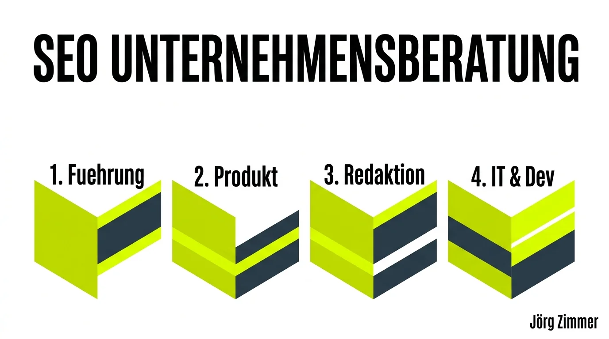

Auf der [CAMPIXX](/glossar/campixx-berlin/) in Berlin gab es einen bemerkenswert starken Vortrag von **Stefan Godulla**. Sein Thema bringt es genau auf den Punkt: Die Zeiten, in denen der SEO als einsamer Spezialist im Kämmerlein saß und isolierte Anpassungen vorgenommen hat, sind endgültig vorbei.

**SEO wird zur ganzheitlichen Unternehmensberatung.**

Hier ist der Video-Mitschnitt aus seiner Session:

  <video controls class="w-full max-h-[80vh] object-contain outline-none" preload="none" poster="/images/blog-stefan-godulla-campixx.webp" style="display:block;">
    <source src="/videos/blog-stefan-godulla-campixx.mp4" type="video/mp4">
    Dein Browser unterstützt das Video-Tag leider nicht.
  </video>

<figure class="my-8 bg-neutral-50 border border-neutral-200 p-6 md:p-8 rounded-2xl shadow-sm">
  

    
    

      <h4 class="font-bold text-base md:text-lg text-dark mb-0">Jörg Zimmer</h4>
      
Senior SEO & AI Search Consultant

    

  

  <blockquote class="text-base md:text-lg text-dark leading-relaxed italic border-l-4 border-lime-accent pl-4 my-4 font-normal">
    „Wer seine Website nach vorne bringen will, muss anfangen, die Abteilungen miteinander kommunizieren zu lassen. Professionelles [SEO-Consulting](/glossar/seo-consulting/) ist keine IT-Insel, sondern strategische Organisationsentwicklung für das gesamte Unternehmen.“
  </blockquote>
  <figcaption class="mt-4 pt-3 border-t border-neutral-200/60 flex flex-wrap items-center justify-between gap-2 text-xs text-neutral-500">
    Experten-Zitat • <cite class="not-italic font-semibold text-neutral-700">Jörg Zimmer</cite>
    <a href="https://www.linkedin.com/posts/joerg-zimmer-seo-sea-freelancer-berlin-spandau_stefan-godulla-auf-der-campixx-2026-in-berlin-activity-7473672260432609280-qH2a" target="_blank" rel="noopener noreferrer" class="font-bold text-lime-700 hover:underline inline-flex items-center gap-1">
      Diskussion auf LinkedIn ansehen →
    </a>
  </figcaption>
</figure>

## Sichtbarkeit ist ein interdisziplinärer Teamsport

Stefan hat in seinem Vortrag *„Zusammenarbeit im Unternehmen zur gemeinsamen Sichtbarkeit“* fundiert hergeleitet, warum Abteilungsgrenzen endlich fallen müssen. Markenwahrnehmung, organische [Sichtbarkeit](/glossar/sichtbarkeit/) und schlussendlich der geschäftliche Ertrag steigen exponentiell, wenn alle Kernbereiche Hand in Hand arbeiten.

Typische Bruchstellen aus der täglichen Beratungspraxis:
* **Produktmanagement:** Neue Features und Landing Pages werden oft monatelang konzipiert, ohne vorab zu prüfen, welche konkreten Fragen und Probleme reale Nutzer in Suchmaschinen formulieren. Ein frühzeitiger Input verhindert teure Relaunches nach dem Go-Live.
* **Unternehmenskommunikation:** Häufig verfassen Redaktionsteams hochwertige Magazinbeiträge oder Whitepaper, die mangels Keyword- und Entitäten-Strukturierung in den Suchergebnissen unsichtbar bleiben. Durch gemeinsame redaktionelle Workflows landen diese Texte verlässlich bei der Zielgruppe.

### Reales Feedback von Stefan Godulla aus der Community

Das Feedback von Stefan auf LinkedIn brachte die gegenseitige Wertschätzung auf den Punkt:

  
💬 Stefan Godulla (LinkedIn Insights)

  
"Schön dass Du da warst 😍"

## Die 4 Säulen integrierter SEO-Unternehmensberatung

Um algorithmische Relevanz über alle Unternehmensbereiche hinweg zu verankern, bedarf es einer klaren horizontalen Abstimmung:

### 1. Führung & Strategie
Die Geschäftsleitung definiert die Positionierung und stellt sicher, dass Sichtbarkeit als betriebswirtschaftlicher Wachstumshebel für den [Markenaufbau mit SEO](/glossar/markenaufbau-mit-seo/) verstanden wird.

### 2. Produkt-Entwicklung
Produktteams synchronisieren neue Angebote von Tag 1 an mit realen Nachfrage-Mustern und Nutzererwartungen.

### 3. Redaktion & Content
Fachredakteure erstellen tiefgründige Inhalte mit hoher [Topical Authority](/glossar/topical-authority/), die Suchintentionen umfassend abdecken.

### 4. IT & Development
Entwickler sichern saubere Ladezeiten, optimale [Core Web Vitals](/glossar/core-web-vitals/) und fehlerfreies Rendering ohne Blockaden für Web-Crawler.

## Silo-Denken vs. Moderne SEO-Unternehmensberatung

Der Unterschied zwischen veraltetem Silo-Marketing und zeitgemäßer Beratung lässt sich in klaren Kriterien gegenüberstellen:

| Kriterium | Traditionelles Silo-SEO | Integrierte SEO-Unternehmensberatung |
|---|---|---|
| **Rolle des SEOs** | Isoliertes technisches Rädchen im IT-Bereich | Strategischer Berater an der Schnittstelle aller Teams |
| **Einbindung** | Erst kurz vor oder nach dem Website-Launch | Von Tag 1 der Produkt- und Content-Konzeption |
| **Erfolgsmessung** | Reine Keyword-Positionen & Klickzahlen | Ertrag, Markenbekanntheit & Conversion-Qualität |
| **Arbeitsweise** | Reaktives Beheben technischer Mängel | Proaktive Ausrichtung auf Kundenbedürfnisse |
| **Entscheidungsebene** | Fachabteilungsebene mit geringem Budget | C-Level Relevanz mit direktem Geschäftseinfluss |

## Handlungsempfehlungen für Führungskräfte

Wer seine Website und Marke zukunftssicher aufstellen will, muss alte Silos konsequent aufbrechen. Setzt eure Spezialisten an einen Tisch, etabliert gemeinsame Ziele und lasst Entwickler, Redakteure und Marketingverantwortliche voneinander lernen. Nur in einem integrierten Prozess entstehen Web-Erlebnisse, die Kunden überzeugen und Suchsysteme begeistern.

Du möchtest deine internen Workflows optimieren und SEO als strategischen Beratungsprozess in deinem Unternehmen etablieren? In meiner [SEO-Sprechstunde](/seo-sprechstunde/) analysieren wir deine Organisationsstruktur und erarbeiten praktische Lösungen für spürbar mehr gemeinsame Schlagkraft.

<!-- CTA Box -->

  
    LinkedIn Community Diskussion
  
  <h3 class="text-xl md:text-2xl font-bold text-white mb-3 !mt-0 !border-none !pb-0">
    Jetzt an der Diskussion teilnehmen
  </h3>
  

    Diskutiere mit Jörg Zimmer und der SEO-Community auf LinkedIn über diesen Beitrag.
  

  <a href="https://www.linkedin.com/posts/joerg-zimmer-seo-sea-freelancer-berlin-spandau_stefan-godulla-auf-der-campixx-2026-in-berlin-activity-7473672260432609280-qH2a" target="_blank" rel="noopener noreferrer" class="btn-primary">
    <svg class="w-4 h-4 fill-current" viewBox="0 0 24 24"><path d="M20.447 20.452h-3.554v-5.569c0-1.328-.027-3.037-1.852-3.037-1.853 0-2.136 1.445-2.136 2.939v5.667H9.351V9h3.414v1.561h.046c.477-.9 1.637-1.85 3.37-1.85 3.601 0 4.267 2.37 4.267 5.455v6.286zM5.337 7.433c-1.144 0-2.063-.926-2.063-2.065 0-1.138.92-2.063 2.063-2.063 1.14 0 2.064.925 2.064 2.063 0 1.139-.925 2.065-2.064 2.065zm1.782 13.019H3.555V9h3.564v11.452zM22.225 0H1.771C.792 0 0 .774 0 1.729v20.542C0 23.227.792 24 1.771 24h20.451C23.2 24 24 23.227 24 22.271V1.729C24 .774 23.2 0 22.222 0h.003z"/></svg>
    Beitrag auf LinkedIn öffnen
    →
  </a>

