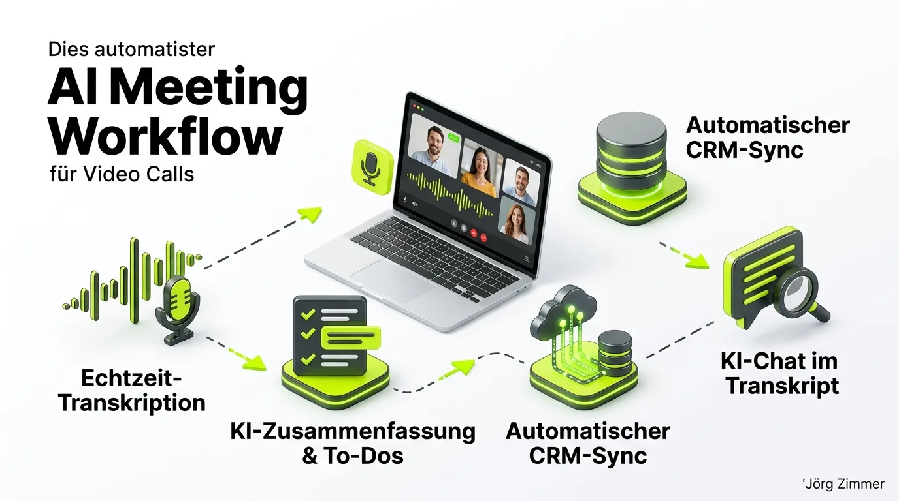

*Diese Diskussion wurde von mir auf LinkedIn am 21.07.2026 gestartet:*

  
💬 Jörgs SEO-Klartext (LinkedIn Insights)

  

  
Meeting Notetaker aus Deutschland mit KI und Integrationen zu CRM Systemen, ein Vorzeigebeispiel

  
Gekauft habe ich den tl;dv Notetaker eigentlich weil ich auf der Suche war um meine Videocalls aufzuzeichnen. Also wegen der Lösung automatisch Notizen aus Meetings mit KI Zusammenfassung und Sprungmarken zu erstellen. Das klappt hervorragend und besser als bei denen die ich davor hatte.

  
Nun gerade wieder so eine Funktion entdeckt wo ich sage ... wow

  
Der tl;dv Notetaker kann automatische Schnittstellen zu: 
  👉 Cloude, ChatGPT, Slack, Hubspot, Salesforce, Jira, Miro, Trello, Clickup, Greenhouse, Airtable, Monday .com, Zoho, Pipedrive, Confluence, Google Drive, Dynamics 365, Onedrive, Sharepoint und 1.000 weitere Schnittstellen 
  👉 außerdem per API, Webhooks, MCP 
  👉 damit automatisch Notizen ans CRM und ins Projektmanagement Tool

  
Er kann die Aufgabenpunkte, nächste Schritte und alles Gesprochene in jeder Sprache super zusammenfassen und direkt in angeschlossene Systeme liefern. Außerdem kannst du danach mit den Transkripten chatten. Was für eine Arbeitsersparniss.

  
Es gibt sogar eine kostenlose Grundversion: 
  <a href="https://lnkd.in/dXS6VU-b" target="_blank" rel="noopener noreferrer" class="font-bold underline text-lime-700">tl;dv Notetaker kostenlos testen (Partnerlink)</a> 
  Mit meinem PartnerLink gibt es bei Bedarf 30% Rabatt in den ersten 6 Monaten.

  
Ich mag dl;tv wirklich. Die sind echt innovativ. DSGVO-konform mit SOC 2 Zertifizierung.

  
Welchen Notetaker nimmst du und warum?

  

Die Automatisierung von zeitraubenden Routinetätigkeiten ist für Freelancer und Agenturen der stärkste Hebel zur Skalierung. Ich liebe [Gute SEO Tools](/blog/seorch-seo-tool-fanboy/), aber wenn ein System dir nach einer intensiven [SEO Sprechstunde](/blog/seo-sprechstunde-erklaert/) die gesamte Mitschrift, die vereinbarten To-Dos und das strukturierte Follow-Up fehlerfrei ins CRM zaubert, spart das jede Woche mehrere Stunden produktiver Arbeitszeit.

## Der 4-Stufen-Workflow: Von der Tonspur zur CRM-Aktion

Wer regelmäßig Strategie-Calls und Kunden-Audits führt, kennt das Dilemma: Schreibt man während des Gesprächs intensiv mit, verliert man den Blickkontakt und den Gesprächsfaden. Verlässt man sich auf das Gedächtnis, gehen entscheidende Nuancen und Vereinbarungen verloren.

Der tl;dv Notetaker löst diese Herausforderung durch eine lückenlose, vierstufige Automationskette:

1. **Echtzeit-Transkription & Sprungmarken**: Die KI transkribiert jedes gesprochene Wort mit Sprechererkennung in über 30 Sprachen und setzt präzise Zeitstempel für wichtige Wendepunkte.
2. **KI-Zusammenfassung & Aufgaben-Extraktion**: Direkt nach Beendigung des Calls destilliert ein fein abgestimmter Algorithmus die Kernbeschlüsse, Verantwortlichkeiten und nächste Meilensteine heraus.
3. **Automatischer CRM-Sync**: Über native Schnittstellen, Webhooks oder MCP fließen die Zusammenfassungen direkt in HubSpot, Salesforce, Notion, Asana oder Slack.
4. **KI-Chat im Meeting-Transkript**: Du kannst wie mit einem persönlichen Assistenten über einen gezielten [Prompt](/blog/beste-seo-tools-ai-search-prompt-tracking/) chatten: *„Welche Einwände hatte der Kunde bezüglich des Relaunch-Termins?“* – und erhältst binnen zwei Sekunden die exakte Stelle als Videoclip.

## Vergleich: Manuelle Notizen vs. tl;dv KI-Notetaker

Die Gegenüberstellung verdeutlicht den massiven Effizienzgewinn im Agenturalltag:

| Kriterium | Manuelle Meeting-Mitschrift | tl;dv KI-Workflow |
| :--- | :--- | :--- |
| **Zeitaufwand Nachbereitung** | 30–45 Minuten pro Call | Unter 2 Minuten (automatisiert) |
| **Fokus während des Gesprächs** | Geteilt (Tippen & Zuhören) | 100 % Konzentration auf das Gegenüber |
| **Lückenlosigkeit** | Selektiv, abhängig von Notizqualität | 100 % Wortprotokoll mit Sprecherzuordnung |
| **CRM- & Projekt-Transfer** | Manuelles Copy-Paste in Tickets | Automatischer Sync in 1.000+ Tools via API |
| **Wiederauffindbarkeit** | Mühsames Suchen in Textdokumenten | Semantische Volltextsuche & KI-Chat |
| **Datenschutz & Compliance** | Oft unsichere Cloud-Notizen | DSGVO-konform, SOC 2 Typ II zertifiziert |

## Community-Stimmen: Smarte Anwendungsfälle aus der Praxis

Wie vielseitig dieser Ansatz in der Praxis ist, zeigt die LinkedIn-Diskussion. Antonio Blago demonstrierte einen kreativen Workflow, der weit über reine Meeting-Notizen hinausgeht:

  
💬 Antonio Blago (LinkedIn Kommentar)

  

    
Tldv ist ein no-brainer, nutze es auch bei Workshops und erstelle daraus dann Booklets und die wichtigsten learnings.

  

Aus einem dreistündigen Kunden-Workshop vollautomatisch ein didaktisch aufbereitetes Booklet mit Kern-Takeaways zu generieren, ist echtes [Prompt Engineering](/glossar/prompt/) in Reinkultur. Statt tagelang Folien nachzubereiten, liefert man dem Kunden noch am selben Nachmittag ein druckreifes Ergebnis. In Kombination mit modernen [KI-Agenten](/glossar/ai-agenten/) entstehen so Services, die früher kleinen Teams vorbehalten waren.

<figure class="my-8 bg-neutral-50 border border-neutral-200 p-6 md:p-8 rounded-2xl shadow-sm">
  

    
    

      <h4 class="font-bold text-base md:text-lg text-dark mb-0">Jörg Zimmer</h4>
      
Senior SEO & AI Search Consultant

    

  

  <blockquote class="text-base md:text-lg text-dark leading-relaxed italic border-l-4 border-lime-accent pl-4 my-4 font-normal">
    „Wer heute noch Meetings manuell mitschreibt und To-Dos händisch ins CRM überträgt, verbrennt wertvolle Lebenszeit. KI-Notetaker wie tl;dv machen den Kopf frei für das Wesentliche: Dem Kunden wirklich zuzuhören und strategische Hebel zu identifizieren.“
  </blockquote>
  <figcaption class="mt-4 pt-3 border-t border-neutral-200/60 flex flex-wrap items-center justify-between gap-2 text-xs text-neutral-500">
    Experten-Zitat • <cite class="not-italic font-semibold text-neutral-700">Jörg Zimmer</cite>
    <a href="https://www.linkedin.com/posts/joerg-zimmer-seo-sea-freelancer-berlin-spandau_meeting-notetaker-aus-deutschland-mit-ki-activity-7485338844217864192-Zp7p" target="_blank" rel="noopener noreferrer" class="font-bold text-lime-700 hover:underline inline-flex items-center gap-1">
      Diskussion auf LinkedIn ansehen →
    </a>
  </figcaption>
</figure>

## Praktische Empfehlung für deinen Workflow

Wenn du deine Kunden-Meetings auf das nächste Professionalitäts-Level heben möchtest:

- **Starte mit der Gratisversion**: Teste tl;dv in deinen nächsten internen oder externen Calls unverbindlich aus.
- **Nutze den Partnervorteil**: Über den Partnerlink <a href="https://lnkd.in/dXS6VU-b" target="_blank" rel="noopener noreferrer" class="font-bold underline text-lime-700">tl;dv Notetaker (30% Rabatt)</a> sicherst du dir 30 % Nachlass für die ersten sechs Monate der Pro-Version.
- **Richte Schnittstellen ein**: Verbinde tl;dv direkt mit deinem CRM (z. B. HubSpot oder Pipedrive) und deinem Slack-Kanal, um manuelle Übergaben komplett abzulösen.
- **Strategisches Feedback einholen**: Wenn du wissen willst, wie du moderne Workflows in deine Prozesse integrierst, kannst du eine [SEO Beratung buchen](/seo-sprechstunde/).

<!-- CTA Box -->

  LinkedIn Community Diskussion
  <h3 class="text-xl md:text-2xl font-bold text-white mb-3 !mt-0 !border-none !pb-0">
    Jetzt an der Diskussion teilnehmen
  </h3>
  

    Welchen Notetaker nutzt du im Alltag und wie automatisierst du deine Meeting-Protokolle? Diskutiere mit auf LinkedIn!
  

  <a href="https://www.linkedin.com/posts/joerg-zimmer-seo-sea-freelancer-berlin-spandau_meeting-notetaker-aus-deutschland-mit-ki-activity-7485338844217864192-Zp7p" target="_blank" rel="noopener noreferrer" class="btn-primary">
    <svg class="w-4 h-4 fill-current" viewBox="0 0 24 24"><path d="M20.447 20.452h-3.554v-5.569c0-1.328-.027-3.037-1.852-3.037-1.853 0-2.136 1.445-2.136 2.939v5.667H9.351V9h3.414v1.561h.046c.477-.9 1.637-1.85 3.37-1.85 3.601 0 4.267 2.37 4.267 5.455v6.286zM5.337 7.433c-1.144 0-2.063-.926-2.063-2.065 0-1.138.92-2.063 2.063-2.063 1.14 0 2.064.925 2.064 2.063 0 1.139-.925 2.065-2.064 2.065zm1.782 13.019H3.555V9h3.564v11.452zM22.225 0H1.771C.792 0 0 .774 0 1.729v20.542C0 23.227.792 24 1.771 24h20.451C23.2 24 24 23.227 24 22.271V1.729C24 .774 23.2 0 22.222 0h.003z"/></svg>
    Beitrag auf LinkedIn öffnen
    →
  </a>

