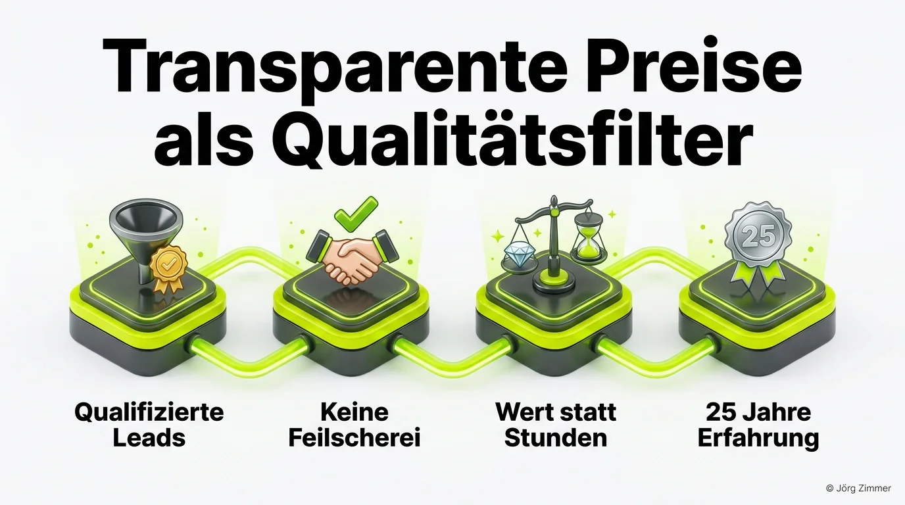

Meine Preise stehen offen auf meiner Website – und genau deshalb musste ich sie anpassen.

In der Agentur- und Freelancer-Welt gilt Preistransparenz noch immer als Tabuthema. Auf den meisten Agentur-Websites sucht man vergeblich nach konkreten Zahlen. Stattdessen liest man Floskeln wie: *„Individuell auf Anfrage“* oder *„Wir schnüren Ihnen ein maßgeschneidertes Paket“*.

Ich gehe seit Jahren bewusst den umgekehrten Weg: Sowohl mein Stundensatz von 240 Euro als auch die Pauschale für meine zweistündige [SEO-Sprechstunde](/seo-sprechstunde/) (480 Euro) sind für jeden Besucher mit einem einzigen Klick einsehbar. 

Was das für die Qualität der Anfragen bedeutet und warum dieser Schritt mein gesamtes Business transformiert hat, habe ich auf LinkedIn zur Diskussion gestellt.

<figure class="my-8 bg-neutral-50 border border-neutral-200 p-6 md:p-8 rounded-2xl shadow-sm">
  

    
    

      <h4 class="font-bold text-base md:text-lg text-dark mb-0">Jörg Zimmer</h4>
      
Senior SEO & AI Search Consultant

    

  

  <blockquote class="text-base md:text-lg text-dark leading-relaxed italic border-l-4 border-lime-accent pl-4 my-4 font-normal">
    „Irgendwo, ich muss ja den Kontext herstellen jetzt nur auf dem bescheuerten Portal unterwegs zu sein, ist ja noch nichts, ne? Wenn der nicht versteht, dass ich Suchmaschinenmarketingez bin, wenn das Wort da nicht in meiner Beschreibung drinne steht, dann dann referenziert er mich nicht als Suchmaschinenmarketingpie oder als SEO Spezialist oder sowas, ne? Das muss muss ich also aus meinem Website Universum.“
  </blockquote>
  <figcaption class="mt-4 pt-3 border-t border-neutral-200/60 flex flex-wrap items-center justify-between gap-2 text-xs text-neutral-500">
    

      Experten-Zitat • <cite class="not-italic font-semibold text-neutral-700">Jörg Zimmer</cite>
      •
      <a href="https://www.youtube.com/watch?v=dVGOMAVUNQk&t=2691s" target="_blank" rel="noopener noreferrer" class="text-neutral-600 hover:text-dark underline inline-flex items-center gap-1">
        Quelle: YouTube SEOPresso (44:51)
        <svg class="w-3 h-3 text-neutral-400" fill="none" stroke="currentColor" viewBox="0 0 24 24"><path stroke-linecap="round" stroke-linejoin="round" stroke-width="2" d="M10 6H6a2 2 0 00-2 2v10a2 2 0 002 2h10a2 2 0 002-2v-4M14 4h6m0 0v6m0-6L10 14" /></svg>
      </a>
    

    <a href="https://www.linkedin.com/in/joerg-zimmer-seo-sea-freelancer-berlin-spandau/" target="_blank" rel="noopener noreferrer" class="font-bold text-lime-700 hover:underline inline-flex items-center gap-1 shrink-0">
      Jörg Zimmer auf LinkedIn folgen →
    </a>
  </figcaption>
</figure>

## Die Praxis-Erfahrung: Mehr Klasse statt unpassender Masse

Seitdem die Konditionen transparent online stehen, hat sich das Profil der eingehenden Anfragen radikal gewandelt:
- Es gibt keine peinlichen Vorgespräche mehr, bei denen nach 45 Minuten herauskommt, dass das monatliche Gesamtbudget bei 250 Euro liegt.
- Anfragen kommen von etablierten Unternehmen, die gezielt nach Senior-Expertise, strategischer Beratung oder einer unabhängigen Zweitmeinung suchen.
- Die Conversion-Rate vom Erstkontakt zum gebuchten Termin ist dramatisch gestiegen.

Als Ein-Mann-Beratung kann und will ich nicht hunderte Mandanten gleichzeitig jonglieren. Um den stark gestiegenen Anforderungen rund um generative KI, Agentic SEO und [Topical Authority](/glossar/topical-authority/) gerecht zu werden, war die Preisanpassung auf 240 Euro die logische Konsequenz.

## Die vier Stationen des Transparenz-Effekts

Warum funktioniert offene Preisgestaltung im High-End-Dienstleistungssektor so überragend? Das Modell basiert auf vier klaren Wirkungsmechanismen:

### 1. Qualifizierte Leads statt Zeitfresser
Entscheider, die über die Website anfragen, haben das Preisschild bereits gesehen und akzeptiert. Das Vorgespräch dreht sich nicht mehr um das *„Ob“*, sondern direkt um das *„Wie“* der strategischen Umsetzung.

### 2. Keine nervige Preisfeilscherei
Ein öffentlich publizierter Tarif signalisiert Souveränität. Wer intransparent agiert, lädt förmlich dazu ein, dass Einkaufsabteilungen Angebote zerpflücken. Ein fester Tarif schafft klare Spielregeln für beide Seiten.

### 3. Wert statt reiner Arbeitsstunden
Kunden zahlen bei einer fundierten [SEO-Beratung](/glossar/seo-beratung/) nicht für das Tippen von Quellcode. Sie investieren in die Vermeidung kapitaler Fehlinvestitionen. Ein falscher Relaunch oder eine falsche Domain-Migration kostet schnell den Jahresgewinn einer Abteilung.

### 4. Ein Vierteljahrhundert E-E-A-T
Am 23. Juli 2026 feiere ich mein 25-jähriges Jubiläum im digitalen Suchmaschinenmarketing. Über diesen langen Zeitraum sammelt man ein Gespür für Algorithmen und Marktverschiebungen an, das kein KI-Prompt und kein Junior-Berater ersetzen kann. Mehr zu meinen persönlichen Stationen findest du im ausführlichen Bericht über meine [SEO-Erfahrung im Podcast](/blog/seopresso-seo-persoenlich-interview/).

## Was die Fachcommunity auf LinkedIn dazu sagt

Die Resonanz auf meinen Post war überwältigend und zeigte, wie stark das Thema die Branche bewegt:

**Matthias Petri** kommentierte anerkennend:
> *„240 Euro ist tatsächlich ein echter Differenzierungs- und Positionierungsfaktor. Respekt für diese klare Haltung. Die offene Angabe ist ein hervorragender Filter, um falsche Anfragen direkt im Vorfeld zu vermeiden.“*

**Patric Herweh** legte den Finger in die Wunde des Preisdumpings:
> *„Ich verstehe ohnehin nicht, warum manche Top-Leute 60 Euro pro Stunde ansetzen. Da ist man am Ende in einer Festanstellung als Senior SEO bei einem Konzern besser bedient – vom Wert des Wissens für eigene Projekte ganz zu schweigen.“*

**Steve Baka** ordnete die psychologische Komponente ein:
> *„Preise sind im Dienstleistungsbereich kein Zufall. Sie spiegeln wider, welchen messbaren Wert du deiner Arbeit beimisst und ob du die richtigen Kunden erreichst, die diesen Hebel erkennen und wertschätzen.“*

**David Reisner** gratulierte zum gesunden Wachstum:
> *„Mehr Nachfrage als verfügbare Zeit und die Preisanpassung zur Qualitätssicherung – dieses Luxusproblem wünsche ich jedem, der kontinuierlich exzellente Arbeit liefert.“*

## Was das konkret für dich bedeutet

Transparenz ist keine Einbahnstraße. Sie gibt dir als Unternehmer die Gewissheit, dass du auf Augenhöhe beraten wirst.

Egal ob du die [SEO Sprechstunde](/blog/seo-sprechstunde-erklaert/) für einen zweistündigen Deep Dive buchst oder dein Team auf die neuesten Entwicklungen rund um [SE Ranking KI-Sichtbarkeit](/blog/se-ranking-ki-sichtbarkeit/) vorbereiten willst: Bei mir gibt es feste Zahlen, klare Vereinbarungen und echten Mehrwert vom ersten Tag an.

Wenn du deine Website von einem erfahrenen Berater ohne Schönfärberei durchleuchten lassen möchtest, findest du alle Angebote und Tarife transparent auf meiner Leistungsübersicht.

<!-- LinkedIn CTA Box -->

  <h3 class="text-xl md:text-2xl font-bold text-white mb-3 !mt-0 !border-none !pb-0">
    Jetzt an der Diskussion teilnehmen
  </h3>
  

    Diskutiere mit Jörg Zimmer und der Community auf LinkedIn über Preistransparenz, Stundensätze und Positionierung im SEO-Markt.
  

  <a href="https://www.linkedin.com/posts/joerg-zimmer-seo-sea-freelancer-berlin-spandau_meine-preise-stehen-auf-meiner-website-und-activity-7485382306719776768-ZR-p" target="_blank" rel="noopener noreferrer" class="btn-primary">
    <svg class="w-4 h-4 fill-current" viewBox="0 0 24 24"><path d="M20.447 20.452h-3.554v-5.569c0-1.328-.027-3.037-1.852-3.037-1.853 0-2.136 1.445-2.136 2.939v5.667H9.351V9h3.414v1.561h.046c.477-.9 1.637-1.85 3.37-1.85 3.601 0 4.267 2.37 4.267 5.455v6.286zM5.337 7.433c-1.144 0-2.063-.926-2.063-2.065 0-1.138.92-2.063 2.063-2.063 1.14 0 2.064.925 2.064 2.063 0 1.139-.925 2.065-2.064 2.065zm1.782 13.019H3.555V9h3.564v11.452zM22.225 0H1.771C.792 0 0 .774 0 1.729v20.542C0 23.227.792 24 1.771 24h20.451C23.2 24 24 23.227 24 22.271V1.729C24 .774 23.2 0 22.222 0h.003z"/></svg>
    Beitrag auf LinkedIn öffnen
    →
  </a>

