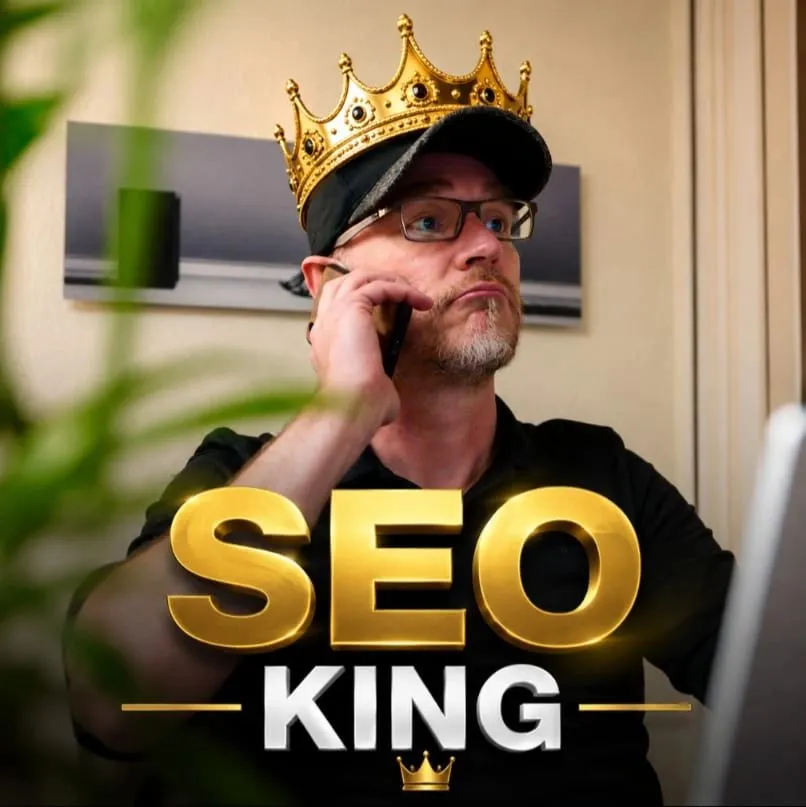

Moin! 🌻

*Diese Diskussion wurde von mir auf LinkedIn am 21.07.2026 gestartet:*

  
💬 Jörgs SEO-Klartext (LinkedIn Insights)

  

  
Meine Preise stehen auf meiner Website und genau deshalb musste ich sie erhöhen.

  
Seit Anfang des Jahres erstellt mein AI Agent aus meinen LinkedIn Post passende Blogartikel auf meiner vollständig mit AI generierten Website.

  
Dort stehen auch meine Preise.

  
Nun bekomme ich mehr hochwertige Anfragen mit korrekten Vorstellungen. Das ist supi.

  
Ich liebe was ich tue und bin mit 100% Leidenschaft dabei. Das nun bereits seit 24 Jahren. Am 23.07.2026 werden es ganze unglaubliche 25 Jahre. Es wurde Zeit die Preise anzupassen.

  
Warum? Ich kann scheinbar das was der Markt gerade braucht. SEO, Strategie und Beratung zu digitaler Sichtbarkeit. Immer mehr auch Agentic SEO und oft auch als Zweitmeinung. Dabei gebe die Sicherheit aus jahrelanger praktischer Erfahrung und helfe jede Menge Umwege zu ersparen.

  
Da ich nur eine 1 Mann Show bin kann ich nicht unendlich Kunden bedienen. Um den gestiegenen Herausforderungen rund um AI und meiner gewonnenen Erfahrung Rechnung zu tragen musste ich das jetzt tun.

  
Google nach "Jörg Zimmer SEO" und klicke auf meine Website mit dem gleichen Profilbild wie hier! Unter Leistungen findest du alles was ich anbiete inklusive Preise.

  
PS: Das Bild hat mal ein Kunde generiert weil er so glücklich mit meiner Dienstleistung war.

  

Die Anpassung der Preise ist für Dienstleister immer ein kritischer Moment. Aber Transparenz zahlt sich aus. Offen kommunizierte Preise wirken wie ein natürlicher Filter. Das sieht auch Matthias Petri ähnlich:

  
💬 Matthias Petri (LinkedIn Kommentar)

  

    
240 Euro ist tatsächlich schon ein echter Differenzierungs- & Positionierungsfaktor. Respekt für diese klare Haltung. Wie hoch war der Stundensatz vorher und wie sind die ersten Reaktionen auf den neuen Preis? Ich denke, die Stundensatzangabe ist ein echt guter Filter, die "falschen" Anfragen direkt zu vermeiden.

  

Tatsächlich gilt die Preiserhöhung auch für die [SEO Sprechstunde](/blog/seo-sprechstunde-erklaert/): Statt der bisher 400€ kostet diese nun 480€. Ein Schnäppchen für volle 2 Stunden Hands-On-Beratung mit Analyse und Strategie. 

Es gibt immer Leute, die hohe Preise nicht nachvollziehen können. Patric Herweh hatte dazu eine klare Meinung:

  
💬 Patric Herweh (LinkedIn Kommentar)

  

    
Ich versteh eh nicht warum manche Top Leute 60€/h berechnen. Da ist man am Ende in ner Anstellung bei nem größeren Konzern als Senior SEO besser bedient. Von dem Wissen in eigene Projekte gießen fang ich erst gar nicht an.

  

Steve Baka brachte es dann philosophisch auf den Punkt:

  
💬 Steve Baka (LinkedIn Kommentar)

  

    
1. Warum Zeit gegen Geld tauschen? 2. Warum für Preise rechtfertigen? 3. Preise sind gerade im Dienstleistungsbereich totale Willkür. Du kannst verlangen was immer du möchtest. Das hat auch nichts mit der Nachfrage zu tun. Es hat nur damit zu tun, wie viel Wert du deiner Arbeit gibst und ob du in der Lage bist genug Menschen zu finden, die den Wert dahinter erkennen.

  

Dem stimme ich zu. Nach über zwei Jahrzehnten [SEO-Erfahrung (auch mit KI im Rücken)](/blog/seopresso-seo-persoenlich-interview/) kauft der Kunde nicht nur reine Arbeitszeit, sondern vor allem die Sicherheit, teure Fehler zu vermeiden. David Reisner hat das als "Luxusproblem" super zusammengefasst:

  
💬 David Reisner (LinkedIn Kommentar)

  

    
Guten Morgen Jörg :) Herzliche Gratulation - dieses "Luxusproblem" ( mehr Nachfrage als Zeit, und damit Preiserhöhung um Qualität zu halten) > wünsche ich jedem, der konstant gute Arbeit leistet und an Kunden-Feedback wachsen möchte.

  

Und natürlich danke an Andreas für die coolen Worte zum Jubiläum:

  
💬 Andreas Absmeier (LinkedIn Kommentar)

  

    
Vom SEO Küken zum SEO King. 25 Jahre Geschichte geschrieben. In Spandau. Die Preise steigen, also jetzt zuschlagen!

  

ALOHA! 🌻✌️

  
💬 Jetzt an der Diskussion teilnehmen!

  <a href="https://www.linkedin.com/posts/joerg-zimmer-seo-sea-freelancer-berlin-spandau_meine-preise-stehen-auf-meiner-website-und-activity-7485382306719776768-ZR-p" target="_blank" rel="noopener noreferrer" class="inline-block bg-white text-lime-600 font-bold py-2 px-6 rounded-full hover:bg-gray-100 transition-colors">
    Beitrag auf LinkedIn öffnen
  </a>

