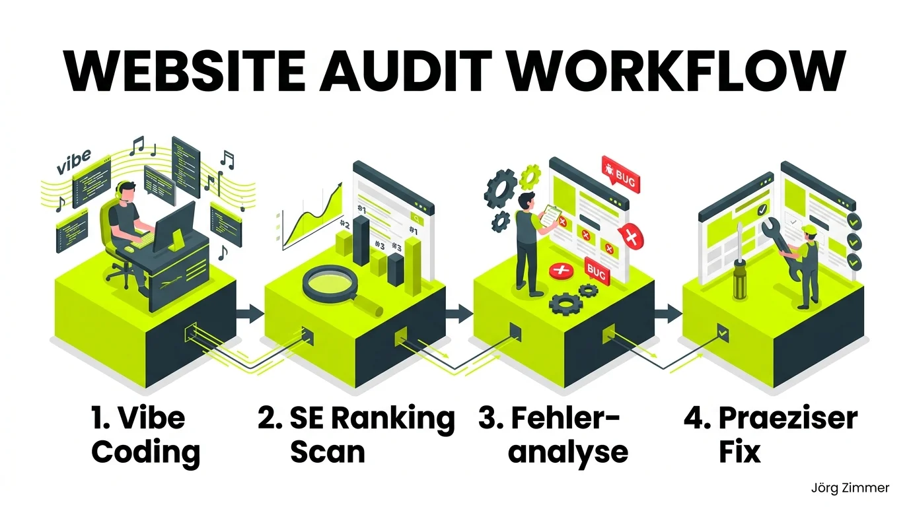

Vibe-Coding-Assistenten und autonome Programmier-Agenten belügen dich, wenn sie behaupten: *„Deine Website ist jetzt technisch perfekt für SEO optimiert.“*

Das hat handfeste Gründe. Die technische Website-Gesundheit ist ein hochkomplexes, dynamisches Gefüge. 

In einem einzigen Durchlauf wirst du niemals eine vollständig saubere oder gar perfekt optimierte Plattform erstellen können. Die Anforderungen moderner Suchmaschinen sind schlicht zu vielschichtig. Selbst hochentwickelte Sprachmodelle überschätzen ihre eigenen Problemlösungen in diesem Bereich regelmäßig.

<figure class="my-8 bg-neutral-50 border border-neutral-200 p-6 md:p-8 rounded-2xl shadow-sm">
  

    
    

      <h4 class="font-bold text-base md:text-lg text-dark mb-0">Jörg Zimmer</h4>
      
Senior SEO & AI Search Consultant

    

  

  <blockquote class="text-base md:text-lg text-dark leading-relaxed italic border-l-4 border-lime-accent pl-4 my-4 font-normal">
    „Wenn dein Agent oder Programmierer sagt, er hat etwas gefixt, heißt das noch lange nicht, dass es so sauber gemacht ist, dass es für SEO richtig ist.“
  </blockquote>
  <figcaption class="mt-4 pt-3 border-t border-neutral-200/60 flex flex-wrap items-center justify-between gap-2 text-xs text-neutral-500">
    Experten-Zitat • <cite class="not-italic font-semibold text-neutral-700">Jörg Zimmer</cite>
    <a href="https://www.linkedin.com/feed/update/urn:li:share:7480185980520390659" target="_blank" rel="noopener noreferrer" class="font-bold text-lime-700 hover:underline inline-flex items-center gap-1">
      Diskussion auf LinkedIn ansehen →
    </a>
  </figcaption>
</figure>

## Die blinden Flecken automatisierter Coding-Assistenten

Wenn moderne Entwickler-Tools im Vibe-Coding-Modus arbeiten, liegt ihr Hauptaugenmerk darauf, eine gewünschte Funktionalität oder ein visuelles Element schnell zum Laufen zu bringen. Dabei entstehen im Hintergrund oft unbeabsichtigte SEO-Altlasten:

* **Rendering-Konflikte:** Dynamische JavaScript-Elemente verdecken Inhalte vor einem [Crawler](/glossar/crawler/), der ohne vollständiges Rendering anklopft.
* **Weiterleitungsketten:** Beim Verschieben von Routen entstehen versehentlich 302-Temporär-Weiterleitungen oder Loops statt sauberer [301-Weiterleitungen](/glossar/301-vs-302/).
* **Performance-Einbrüche:** Unbedachte Skript-Einbindungen ruinieren die [Core Web Vitals](/glossar/core-web-vitals/) und verlangsamen die Ladezeit auf mobilen Endgeräten massiv.

Wer sich ausschließlich auf das Urteil des Coding-Tools verlässt, riskiert unbemerkt gravierende Ranking-Verluste. Du musst die Gesundheit deiner Website in regelmäßigen Intervallen durch eine unabhängige, externe Instanz auditieren lassen.

## Der 4-Stufen-Workflow für stabile Website-Gesundheit

Um die enorme Schnelligkeit von Vibe Coding mit kompromissloser technischer Qualität zu verbinden, nutze ich in allen Kundenprojekten einen iterativen Regelkreis:

### 1. Schnelle Entwicklung via Vibe Coding
Funktionen und Design-Updates werden zügig implementiert. Der Entwickler konzentriert sich auf Logik und Nutzererlebnis.

### 2. Externer Scan mit SE Ranking
Direkt nach dem Deployment startet der automatisierte Website Audit von [SE Ranking (Partnerlink)](https://seranking.com/de/?ga=4169588&source=link). Er scannt alle Seiten objektiv und unabhängig von internen Code-Annahmen.

### 3. Strukturierte Fehleranalyse
Das Tool bereitet technische Fehler übersichtlich nach Dringlichkeit auf (z.B. Canonical-Konflikte, 404-Fehler, fehlende Meta-Tags oder zu große Bild-Assets).

### 4. Präzise Behebung & Verifikation
Die extrahierte Fehlerliste wird gezielt abgearbeitet. Ein erneuter Kontrollscan bestätigt die Behebung schwarz auf weiß.

## Gegenüberstellung: Coding-Agent vs. Dedizierter SEO Audit

| Kriterium | Autonomer Coding-Agent | SE Ranking Website Audit |
|---|---|---|
| **Prüfperspektive** | Code-Syntax & lokale Dateilogik | Ganzheitliche Sichtweise externer Suchmaschinen-Bots |
| **Prüftiefe** | Einzelne Dateien & isolierte Funktionen | Über 100 globale technische Ranking-Parameter |
| **Historischer Vergleich** | Schwer nachvollziehbar | Lückenlose Historie mit Score-Entwicklung |
| **Erkennung von Regressionen**| Übersieht oft unbeabsichtigte Nebeneffekte | Schlägt sofort Alarm bei neuen Fehlern nach Releases |
| **Einfluss auf Autorität** | Reiner Code | Sichert [Topical Authority](/glossar/topical-authority/) und Crawlbarkeit |

## Kontinuierliches Monitoring als Versicherung

Ich nutze für alle Projekte den Website Audit von [SE Ranking (Partnerlink)](https://seranking.com/de/?ga=4169588&source=link). Das System prüft über 100 Parameter und liefert mir die gröbsten Schwachstellen auf einem Silbertablett.

In meinen ausführlichen [SE Ranking Erfahrungen](/blog/se-ranking-test-2026/) und dem direkten Vergleich [Sistrix vs. SE Ranking](/blog/sistrix-vs-se-ranking/) habe ich detailliert aufgeschlüsselt, warum dieses Tool im Agentur- und Freelancer-Alltag unschlagbar ist: Es spart wertvolle Zeit, liefert verlässliche Daten und schützt vor bösen Überraschungen bei Google-Updates.

Wer den Audit für das eigene Projekt kostenfrei testen möchte: Über meinen Partner-Link lässt sich der vollständige Check 14 Tage lang ohne Risiko ausprobieren:

👉 [**Hier SE Ranking Website Audit 14 Tage kostenlos testen** * (Partnerlink)](https://seranking.com/de/website-audit.html?ga=4169588&source=link)

Du möchtest deine Website auf Herz und Nieren prüfen lassen und erfahren, an welchen technischen Stellschrauben der größte Hebel liegt? In meiner [SEO-Sprechstunde](/seo-sprechstunde/) durchleuchten wir dein Projekt gemeinsam und erstellen eine klare Prioritätenliste.

<!-- CTA Box -->

  
    LinkedIn Community Diskussion
  
  <h3 class="text-xl md:text-2xl font-bold text-white mb-3 !mt-0 !border-none !pb-0">
    Jetzt an der Diskussion teilnehmen
  </h3>
  

    Diskutiere mit Jörg Zimmer und der SEO-Community auf LinkedIn über diesen Beitrag.
  

  <a href="https://www.linkedin.com/feed/update/urn:li:share:7480185980520390659" target="_blank" rel="noopener noreferrer" class="btn-primary">
    <svg class="w-4 h-4 fill-current" viewBox="0 0 24 24"><path d="M20.447 20.452h-3.554v-5.569c0-1.328-.027-3.037-1.852-3.037-1.853 0-2.136 1.445-2.136 2.939v5.667H9.351V9h3.414v1.561h.046c.477-.9 1.637-1.85 3.37-1.85 3.601 0 4.267 2.37 4.267 5.455v6.286zM5.337 7.433c-1.144 0-2.063-.926-2.063-2.065 0-1.138.92-2.063 2.063-2.063 1.14 0 2.064.925 2.064 2.063 0 1.139-.925 2.065-2.064 2.065zm1.782 13.019H3.555V9h3.564v11.452zM22.225 0H1.771C.792 0 0 .774 0 1.729v20.542C0 23.227.792 24 1.771 24h20.451C23.2 24 24 23.227 24 22.271V1.729C24 .774 23.2 0 22.222 0h.003z"/></svg>
    Beitrag auf LinkedIn öffnen
    →
  </a>

