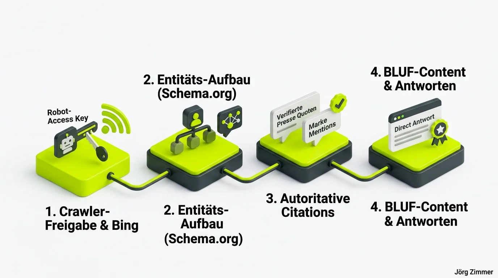

Die mit Abstand häufigste Frage, die ich aktuell von B2B-Geschäftsführern, CMOs und Marketing-Leitern höre, lautet: **„Wie komme ich eigentlich als Unternehmen in ChatGPT?“**

Es ist der Schmerzpunkt der Stunde. Niemand scrollt mehr durch endlose Linklisten auf Seite 2 bei Google. Wenn ein potenzieller B2B-Kunde nach einer maßgeschneiderten Lösung für ein drängendes Problem sucht, öffnet er ChatGPT, Perplexity oder Claude. Und wenn das Modell in seiner Antwort drei deiner Mitbewerber empfiehlt, dein Unternehmen aber mit keinem Wort erwähnt, bist du aus dem Funnel geflogen, bevor das Verkaufsgespräch überhaupt beginnen konnte.

Hier ist die unbequeme Wahrheit: Es gibt keinen geheimen Schalter, kein Buchungsformular und kein exklusives Paid-Listing bei OpenAI. Der einzige nachhaltige Weg in die KI-Antworten führt über strategische **[Generative Engine Optimization](/glossar/geo-optimierung/)** (GEO).

## Die 4-Stufen-Pipeline: Wie KI-Modelle Dienstleister auswählen

Damit dein Unternehmen in generativen Antworten zitiert und als führende Lösung empfohlen wird, muss deine Webpräsenz eine lückenlose Kette aus technischen und semantischen Signalen liefern.

Der Prozess gliedert sich in vier fundamentale Schritte:

1. **Crawler-Freigabe & Bing-Indexierung**: ChatGPT Search operiert nicht im luftleeren Raum, sondern greift bei aktuellen Anfragen über den `OAI-SearchBot` auf das Live-Web zu. Wer in den [Bing Webmastertools](/glossar/bing-webmastertools/) nicht sauber indexiert ist, existiert für das System nicht.
2. **Entitäts-Aufbau via Schema.org**: KI denkt nicht in isolierten Wörtern, sondern in relationalen Netzwerken. Dein Unternehmen muss über ein validiertes `Organization`-Markup als eindeutige [Entität](/glossar/entitaet/) mit Sitz, Geschäftsführern und Fachgebieten definiert sein.
3. **Autoritative Co-Occurrences & Citations**: Wenn Fachmagazine, Branchen-Podcasts, Partner-Websites und Kundenprofile regelmäßig deinen Firmennamen im Kontext deiner Kernkompetenz erwähnen, verknüpft das Sprachmodell dieses Wissen untrennbar mit deiner Nische.
4. **BLUF-Content & Direkte Antworten**: Texte müssen nach dem *Bottom Line Up Front*-Prinzip aufgebaut sein. Gib die Antwort sofort im ersten Absatz – ohne ausufernde Einleitungsfloskeln.

## Vergleich: Klassisches Google SEO vs. Generative Engine Optimization (GEO)

Die Arbeitsweise für generative Suchsysteme unterscheidet sich in zentralen Punkten vom bisherigen SEO-Standard:

| Kriterium | Klassisches Google SEO | Generative Engine Optimization (GEO) |
| :--- | :--- | :--- |
| **Nutzerverhalten** | Klick auf 10 blaue Links in der SERP | Konsum einer synthetisierten Direktenantwort |
| **Primäre Datenbasis** | Googlebot Web-Index | Trainings-Korpus + Bing Live-Web-Search |
| **Optimierungs-Fokus** | Keyword-Dichte, Title-Tags, Backlinks | Entitäts-Autorität, Markennennungen, Konsens |
| **Textaufbau** | Ausführliche Texte zur Verweildauer-Maximierung | BLUF: Präzise, faktenbasierte Kernantworten |
| **Erfolgsmessung** | Positionen (z. B. Platz 1–10) in der SERP | Zitationsrate & Empfehlungsanteil in Prompts |
| **Tracking-Tools** | Google Search Console, Rank Tracker | Moderne [AI Visibility Tools](/glossar/ai-visibility-tools/) & Prompt-Tracker |

Ergänzende Strategien für sprachbasierte Modelle findest du im Grundlagenleitfaden zu [ChatGPT SEO](/glossar/chatgpt-seo/).

## Warum der eigene Marken-Footprint über Empfehlungen entscheidet

Ein Large Language Model wie GPT-4o oder Claude 3.5 Sonnet funktioniert im Kern über Wahrscheinlichkeiten und semantische Nachbarschaften. Fragt ein Nutzer: *„Welche SEO-Agentur in Berlin Spandau hat über 20 Jahre Praxiserfahrung?“*, sucht das Modell in seinen Vektorräumen nach Entitäten, die die Attribute „SEO“, „Berlin Spandau“, „Langjährige Erfahrung“ und „Verlässlichkeit“ maximal wahrscheinlich miteinander verbinden.

Wer hier nur isolierte Landingpages ohne externe Verifikationspunkte besitzt, verliert gegen Marken mit starkem digitalem Fußabdruck. Verifizierte Kundenrezensionen auf Google Maps, ausführliche LinkedIn-Empfehlungen und Fachbeiträge in anerkannten Medien sind das Schmiermittel, das dich in den Trainingsdaten und im Live-Web nach oben spült.

<figure class="my-8 bg-neutral-50 border border-neutral-200 p-6 md:p-8 rounded-2xl shadow-sm">
  

    
    

      <h4 class="font-bold text-base md:text-lg text-dark mb-0">Jörg Zimmer</h4>
      
Senior SEO & AI Search Consultant

    

  

  <blockquote class="text-base md:text-lg text-dark leading-relaxed italic border-l-4 border-lime-accent pl-4 my-4 font-normal">
    „Du kommst nicht in ChatGPT, indem du versuchst, das System mit billigen SEO-Tricks auszutricksen. Du kommst hinein, indem du in deiner Branche so relevant, so zitiert und so verlässlich wirst, dass kein KI-Modell an deinem Namen vorbeikommt.“
  </blockquote>
  <figcaption class="mt-4 pt-3 border-t border-neutral-200/60 flex flex-wrap items-center justify-between gap-2 text-xs text-neutral-500">
    Experten-Zitat • <cite class="not-italic font-semibold text-neutral-700">Jörg Zimmer</cite>
    <a href="https://www.linkedin.com/in/joerg-zimmer-seo-sea-freelancer-berlin-spandau/" target="_blank" rel="noopener noreferrer" class="font-bold text-lime-700 hover:underline inline-flex items-center gap-1">
      Jörg Zimmer auf LinkedIn folgen →
    </a>
  </figcaption>
</figure>

## Handlungsplan: In 4 Wochen zur KI-Sichtbarkeit

Wenn du dein Unternehmen gezielt für ChatGPT, Copilot und Perplexity aufstellen willst, solltest du die folgende Roadmap abarbeiten:

- **Robots.txt & WAF bereinigen**: Stelle sicher, dass User-Agents wie `OAI-SearchBot`, `ChatGPT-User` und `PerplexityBot` vollen Zugriff auf deine Inhalte haben.
- **Bing Webmaster Tools konfigurieren**: Hinterlege deine XML-Sitemap direkt in Bing und aktiviere IndexNow für sekundenschnelle Updates.
- **Schema.org Graph optimieren**: Verknüpfe dein Unternehmensprofil (`Organization`) semantisch mit deinen Leistungen, Autoren (`Person`) und Auszeichnungen.
- **Strategisches Audit buchen**: Wenn du wissen möchtest, wo deine Domain aktuell im KI-Index steht, buche jetzt deine individuelle [SEO Sprechstunde](/seo-sprechstunde/) für ein fundiertes Sparring.

<!-- CTA Box -->

  B2B Sichtbarkeits-Check
  <h3 class="text-xl md:text-2xl font-bold text-white mb-3 !mt-0 !border-none !pb-0">
    Jetzt an der Diskussion teilnehmen
  </h3>
  

    Wird dein Unternehmen bereits in ChatGPT und Perplexity empfohlen oder dominieren noch deine Mitbewerber? Diskutiere mit auf LinkedIn!
  

  <a href="https://www.linkedin.com/in/joerg-zimmer-seo-sea-freelancer-berlin-spandau/" target="_blank" rel="noopener noreferrer" class="btn-primary">
    <svg class="w-4 h-4 fill-current" viewBox="0 0 24 24"><path d="M20.447 20.452h-3.554v-5.569c0-1.328-.027-3.037-1.852-3.037-1.853 0-2.136 1.445-2.136 2.939v5.667H9.351V9h3.414v1.561h.046c.477-.9 1.637-1.85 3.37-1.85 3.601 0 4.267 2.37 4.267 5.455v6.286zM5.337 7.433c-1.144 0-2.063-.926-2.063-2.065 0-1.138.92-2.063 2.063-2.063 1.14 0 2.064.925 2.064 2.063 0 1.139-.925 2.065-2.064 2.065zm1.782 13.019H3.555V9h3.564v11.452zM22.225 0H1.771C.792 0 0 .774 0 1.729v20.542C0 23.227.792 24 1.771 24h20.451C23.2 24 24 23.227 24 22.271V1.729C24 .774 23.2 0 22.222 0h.003z"/></svg>
    Beitrag auf LinkedIn öffnen
    →
  </a>

