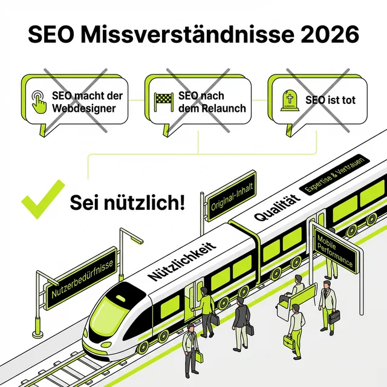
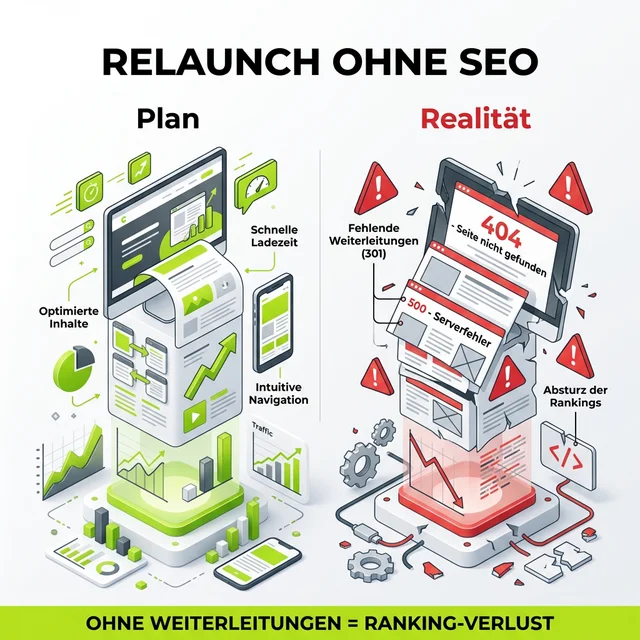

Moin!

Herzlich willkommen im SEO-Jahr 2026. Pünktlich wie die Deutsche Bahn begrüße ich alle Mitreisenden recht freundlich auf unserer Reise. Steigen Sie ein, nehmen Sie Platz, und schnallen Sie sich an – denn auch dieses Jahr wird es turbulent.

Warum ich das so sicher weiß? Weil ich seit über 24 Jahren im SEO-Zug sitze. Und wenn mir diese Reise eines beigebracht hat, dann das: **Die Missverständnisse ändern sich nie.** Die Tools werden schicker, die KI schlauer, die Buzzwords kreativer – aber die Grundfehler? Die sind so stabil wie die Gravitation.

  
 Jörgs SEO-Klartext (LinkedIn Insights)

  
"SEO-History wiederholt sich immer als Farce. Wer heute die Abkürzung sucht, zahlt morgen das Lehrgeld."

## Die drei Klassiker, die einfach nicht sterben wollen

Freut euch auch 2026 wieder auf Sätze, die mich seit zwei Jahrzehnten in den Wahnsinn treiben:

### 1. "SEO macht unser Webdesigner mit."

Dieser Satz ist das Äquivalent zu: "Die Herzoperation macht unser Krankenpfleger mit." Nichts gegen Webdesigner – viele von ihnen sind großartige Kreative. Aber SEO ist eine **eigene Disziplin** mit eigenem Werkzeugkasten, eigener Denkweise und eigener Komplexität. Wer SEO "nebenbei" machen lässt, bekommt auch "nebenbei"-Ergebnisse. Und die sehen meistens so aus: Seite 4 bei Google, kein Traffic, kein Umsatz.

### 2. "SEO machen wir dann nach dem Relaunch."

Das ist mein persönlicher Favorit unter den Horroraussagen. SEO **nach** dem Relaunch ist wie der Airbag, den man nach dem Unfall einbaut. Es ist zu spät. Die URLs sind geändert, die Weiterleitungen fehlen, die Seitenstruktur ist zertrümmert und Google steht da und fragt sich: "Wo ist denn alles hin?"

### 3. "SEO ist tot. Wir machen jetzt fancy XYZ Bullshit-Bingo."

Jedes Jahr aufs Neue. Jedes verdammte Mal. Nein, SEO ist nicht tot. SEO hat sich **weiterentwickelt**. Von Keyword-Stuffing zu E-E-A-T, von Meta-Keywords zu Entitäten, von reiner Google-Optimierung zu GEO und AI-Visibility. Wer sagt, SEO sei tot, hat entweder nie verstanden, was es wirklich ist, oder verkauft gerade etwas anderes.

## Der Relaunch-Friedhof: Wo gute Rankings sterben

Auch in diesem Jahr werden Leute einen Relaunch feiern, der keine Weiterleitungen enthält. Ganze Webseiten und Shops werden an den Start gehen, die alles missachten, was SEO-Leute als "ein bisschen wichtig" erachten. Die Guidelines für sauberen Code, sauberes Spiel und saubere Webseiten werden auch dieses Jahr **tausendfach ignoriert**.

Und dann? Dann rufen sie mich an. Oder jemanden wie mich. Und dann erklären wir zum 500. Mal, warum ein Relaunch ohne SEO-Begleitung wie ein Hausbau ohne Statiker ist: Es sieht schön aus, bis es zusammenbricht.

> „Der Klassiker wäre dann noch: 'SEO haben wir erst letztes Jahr gemacht.'" — **Christian Feichtner**, LinkedIn-Kommentar

Genau. Als wäre SEO eine einmalige Impfung. Ein Häkchen auf der To-Do-Liste. Erledigt, nächstes Thema. Aber so funktioniert das nicht. SEO ist ein **fortlaufender Prozess**, der sich mit jedem Google-Update, jedem Wettbewerber und jeder neuen Technologie verändert.

## Warum sich die Gerüchte so hartnäckig halten

Auch in diesem Jahr werden SEO-Berater vor Spam und Tricks warnen müssen, weil sie sich seit 20 Jahren als Gerüchte im Markt halten. "Kauf einfach 10.000 Backlinks für 50 Euro." "Schreib den Text einfach mit KI, Google merkt das nicht." "Pack das Keyword 47 Mal in den Text, dann rankst du."

Spoiler: **Nein, nein und nochmals nein.**

Das Problem ist nicht, dass diese Informationen schwer zu widerlegen wären. Das Problem ist, dass sie so verlockend klingen. Wer will nicht die Abkürzung? Wer will nicht das Ranking-Wunder über Nacht? Aber SEO ist Handwerk. Und Handwerk braucht Zeit, Erfahrung und vor allem: **den Blick für das große Ganze**.

## Die einzige Wahrheit, die seit 2002 gilt

Hier der Hinweis für alle neu zugestiegenen Fahrgäste, und auch für die Stammgäste, die manchmal vergessen, warum sie überhaupt eingestiegen sind:

**Das Spiel dreht sich in Wirklichkeit um die Nutzer und deren Interessen.**

Nicht um Google. Nicht um ChatGPT. Nicht um den neuesten Algorithmus-Trick. Es geht um **Menschen**, die ein Problem haben und eine Lösung suchen. Wenn deine Website diese Lösung liefert – klar, schnell und ehrlich – dann belohnt dich jede Suchmaschine dafür. Egal ob klassisch oder KI-gesteuert.

**Sei nützlich.** Das ist kein Marketingspruch. Das ist die gesamte SEO-Strategie in zwei Wörtern.

## Was heißt das konkret für dein 2026?

- **Mach SEO von Anfang an.** Nicht nach dem Relaunch. Nicht als Nachgedanke. Von Tag 1.
- **Hol dir Expertise.** Nicht den Webdesigner, nicht den Praktikanten, nicht ChatGPT allein. Jemanden, der seit Jahren in den Daten lebt.
- **Denk langfristig.** SEO ist kein Sprint. Es ist ein Ultra-Marathon. Wer nach 3 Monaten aufgibt, hat nie angefangen.
- **Sei skeptisch bei Abkürzungen.** Wenn es zu gut klingt, ist es meistens Spam.

---

*Dieser Artikel basiert auf meinem LinkedIn-Post, der 78 Reaktionen und 34 Kommentare ausgelöst hat. Ein Zeichen dafür, dass die Frustration über SEO-Missverständnisse in unserer Branche real und allgegenwärtig ist.*

ALOHA 🌻! 🌻

<strong>Du willst dein SEO 2026 richtig angehen?</strong>

In meiner SEO-Sprechstunde (120 Minuten, 400€) analysiere ich deine Website live und gebe dir einen konkreten Fahrplan. Kein Blabla, nur Ergebnisse.

<a href="/seo-sprechstunde/">Jetzt Sprechstunde buchen</a>

### Weiterführende Artikel für Strategen
### Weiterführende Artikel
* **Lese-Tipp:** [Highlights 2025 - Ein SEO-Jahresrückblick](/blog/highlights-2025-jahresrueckblick/)
* **Lese-Tipp:** [24 Jahre SEO - und wir machen immer noch die gleichen Fehler](/blog/24-jahre-seo-gleiche-fehler/)
