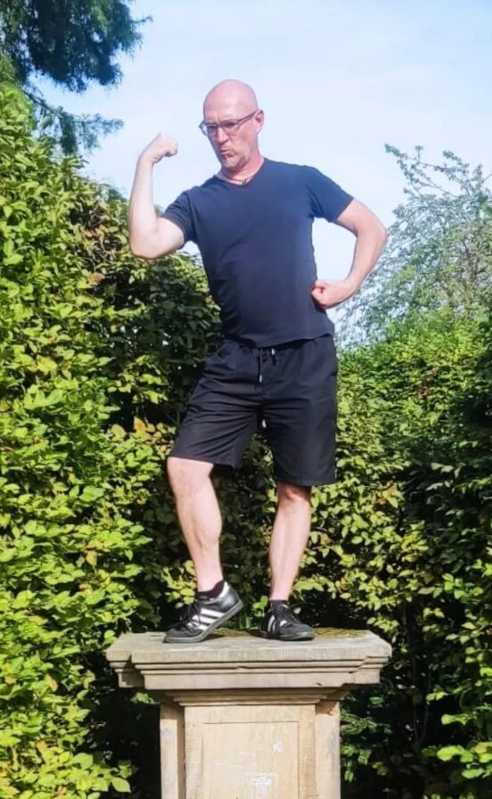
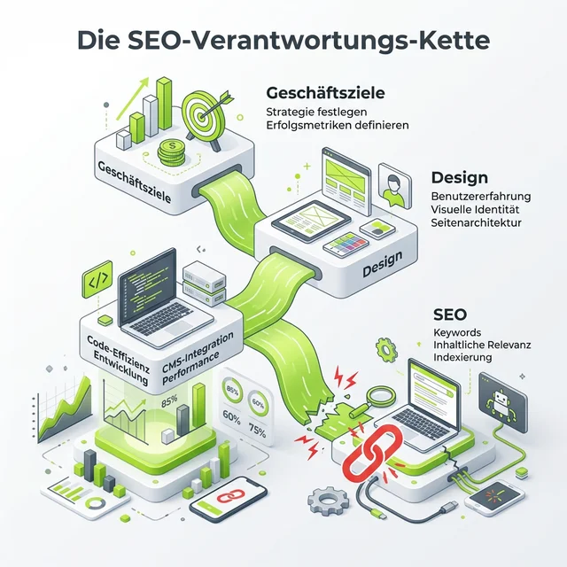
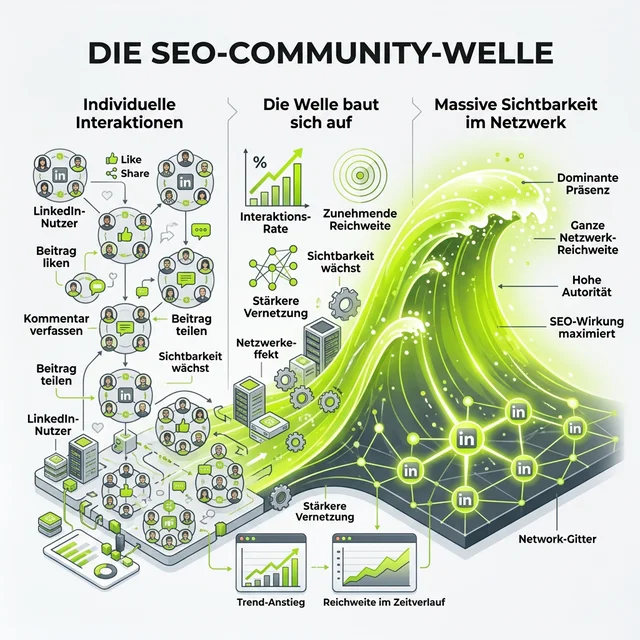

Moin!

Wir müssen reden. Und zwar Tacheles. Ich habe neulich auf LinkedIn einen Beitrag abgesetzt, der eine Menge Staub aufgewirbelt hat. Die Kernthese war provokant: **"Wir SEO-Typen sind schuld, dass das Netz die grundlegendsten SEO-Basics ignoriert."**

Warum ich das sage? Weil ich es jeden Tag sehe. Wir beraten Kunden, wir auditieren Seiten und immer wieder stolpern wir über Dinge, die eigentlich seit 2002 geklärt sein sollten. Fehlende Title Tags, hanebüchene Überschriften-Kaskaden, URL-Umzüge ohne einen einzigen Redirect. 

Die Frage ist: Warum ist das so? Sind wir zu nerdig? Zu leise? Oder einfach zu unwichtig geworden?

In diesem Artikel gehen wir der Sache auf den Grund. Wir schauen uns an, wo die Verantwortungskette reißt und wie wir als Community – die "SEO-Welle" – dafür sorgen können, dass unsere Disziplin endlich den Stellenwert bekommt, den sie verdient.

## 1. Das Dilemma der SEO-Basics
Es ist fast schon tragisch. Wir sprechen über KI-gestütztes Content-Cluster-Management, Generative Engine Optimization (GEO) und komplexe Entitäten-Graphen. Aber wenn wir unter die Haube vieler mittelständischer Websites schauen, brennt die Hütte bei den einfachsten Sachen.

Wie oft hast du schon erklärt, dass man nicht zwei H1-Tags auf einer Seite haben sollte? Oder dass Bilder ohne Alt-Texte für Google (und Screenreader) schwarze Löcher sind?

**Johannes Nass** brachte es in den Kommentaren auf den Punkt: 
*"SEOs haben oft Schwierigkeiten, den Wert ihrer Arbeit auf Geschäftsführungsebene zu kommunizieren. Während für Ads Budgets locker sitzen, wird beim SEO oft gespart."*

Und genau da liegt der Hund begraben. Wenn die Basics nicht umgesetzt werden, liegt es meistens nicht am Unwillen der Entwickler, sondern daran, dass SEO in der Prioritätenliste ganz unten steht.

## 2. Die kaputte Verantwortungskette
Warum wird SEO oft erst ganz am Ende eines Projekts dazugeholt? Wenn das Design fertig ist, der Code steht und der Launch-Button schon glüht. Dann heißt es: "Ach ja, mach mal noch kurz SEO."

Das funktioniert nicht. SEO ist kein Anstrich, den man am Ende auf ein Haus klatscht. Es ist das Fundament.

Wenn die Kette so aussieht wie oben, dann bricht sie zwangsläufig. Der SEO-Spezialist steht am Ende und muss versuchen, die architektonischen Fehler von Designern und Entwicklern mit "Tricks" auszubügeln. Wir müssen SEO in die Design- und Planungsphase bringen. 

**Michael Hovemann** merkte dazu an: 
*"Designer, Entwickler und Projektmanager sehen SEO oft als nachgelagerten oder gar störenden Prozess anstatt als fundamentale Basis."* 

Wir müssen aufhören, die "Feuerwehr" zu sein. Wir müssen die Architekten sein.

## 3. Die "Bubble" verlassen
Hand aufs Herz: Wir SEOs lieben unsere Fachsimpeleien. Aber verstehen uns die Leute draußen? **Christian Gülcan** hat einen validen Punkt gemacht:
*"Die SEO-Branche war zu lange in ihrer eigenen 'Bubble'. Andere Disziplinen wie Performance Marketing oder KI-Themen haben SEO überholt."*

Wenn wir wollen, dass SEO-Basics zum Marktstandard werden, müssen wir sie für Nicht-SEOs sexy machen. Wir müssen zeigen, dass ein fehlender Redirect nicht nur "schlechtes SEO" ist, sondern bares Geld verbrennt. Dass ein langsamer PageSpeed die Conversion-Rate killt (und nicht nur ein grünes Licht im PageSpeed Insights Tool ist).

## 4. Wir schließen uns zusammen: Die LinkedIn-Welle
Allein ist man leise, gemeinsam ist man laut. Deshalb habe ich auf LinkedIn dazu aufgerufen: Lasst uns den Feed fluten! Lasst uns die Welt wissen lassen, warum SEO-Beratung sinnvoll ist.

**"Wir schließen uns zusammen – jeder für sich, alle zusammen."**

LinkedIn ist perfekt dafür. Es ist ein Forum (wie ich in meinem [letzten Artikel](/blog/linkedin-ist-ein-forum-seo/) ausführlich erklärt habe). Wenn wir gegenseitig unsere Beiträge kommentieren, diskutieren und sichtbar machen, dann skalieren wir unser Wissen über unsere eigene Blase hinaus.

Wie **Antonio Blago** und **Julian Hofmann** schrieben: Eine "mega Idee", um gute SEO-Inhalte durch Interaktion zu unterstützen. Je mehr wir uns vernetzen, desto weniger können uns die Budget-Entscheider ignorieren.

## 5. Der Blick in die Zukunft: Von SEO zu GEO
Die Welt dreht sich weiter. Wer heute nur über Keywords nachdenkt, hat morgen schon verloren. **Birgit Schultz** verwies in der Diskussion auf den Wandel hin zu **GEO (Generative Engine Optimization)**. 

Search-Engines werden zu Answer-Engines. Chatbots fressen Traffic. Aber ratet mal, was die Basis für GEO ist? Richtig: Saubere Daten, klare Strukturen und hochwertige Inhalte. Also genau die Basics, die wir seit Jahren predigen!

Wenn wir die Basics nicht hinkriegen, werden wir in einer KI-zentrierten Welt komplett unsichtbar. Die "SEO-Welle" muss also nicht nur laut sein, sondern auch fachlich am Ball bleiben.

### Was du jetzt tun solltest
Wir SEO-Spezialisten tragen die Verantwortung für unsere Disziplin. Wir müssen lauter sein, wir müssen besser kommunizieren und wir müssen uns gegenseitig unterstützen. 

Hört auf, SEO als "Technik-Thema" zu verkaufen. Verkauft es als das, was es ist: Die einzige nachhaltige Strategie, um im Internet nicht nur zu existieren, sondern gefunden zu werden.

**Nadine McNulty** hat es perfekt zusammengefasst: 
*"Als SEOs sind wir von Natur aus nicht die größten Marktschreier, dürfen aber lauter sein auf LinkedIn."*

Also: Seid laut. Seid aktiv. Und lasst uns das Netz ein bisschen besser machen.

ALOHA! 🌻

<strong>Werde Teil der SEO-Welle!</strong>

Du hast eine Website, die technisch im Dornröschenschlaf liegt? Oder du willst einfach mal Tacheles über deine SEO-Strategie reden?

<a href="/seo-sprechstunde/">Jetzt SEO-Sprechstunde buchen</a>

### Weiterführende Artikel
* **Lese-Tipp:** [LinkedIn ist kein soziales Netzwerk, es ist ein Forum](/blog/linkedin-ist-ein-forum-seo/)
* **Lese-Tipp:** [Die 80%-Falle: Was ich in fast jeder SEO-Sprechstunde entdecke](/blog/80-prozent-seo-fehler-sprechstunde/)
