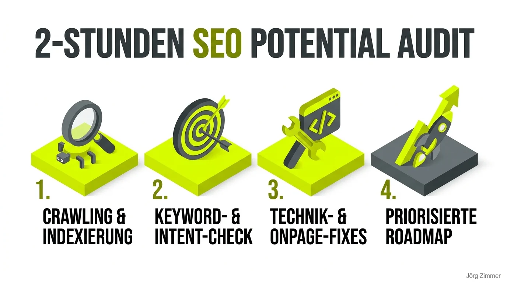

Hand aufs Herz: Was erwartest du von zwei Stunden SEO-Beratung? Ein aufgeblasenes, 80-seitiges PDF voller bunter Graphen aus automatisierten Tools, die am Ende niemand in der Praxis versteht? Ein paar freundliche Floskeln und ein teures Folgeangebot für einen monatlichen Retainer?

In der organischen Suche gilt das Pareto-Prinzip in seiner reinsten Form: Achtzig Prozent der Ranking-Verluste kleiner und mittlerer Unternehmensseiten beruhen auf einer Handvoll grober technischer und struktureller Missverständnisse. Wer seit über [24 Jahre SEO-Erfahrung](/blog/24-jahre-seo-gleiche-fehler/) auf dem Buckel hat und die Suchmaschinen-Landschaft seit den Anfängen begleitet, braucht keine wochenlange Vorlaufzeit. Man sieht den sprichwörtlichen Pfusch am Bau oft nach zehn gezielten Klicks in den Server-Headern und den Indexierungsberichten.

Erinnert ihr euch an Hannibal vom A-Team? Er liebte es, wenn ein Plan funktioniert. Ein erfolgreicher SEO-Plan basiert niemals auf Bauchgefühl oder Agentur-Esoterik, sondern auf harten Fakten, sauberer technischer Hygiene und unmittelbarer Umsetzung.

### Die Story vom kleinen Hebel: 2 Stunden, die alles veränderten

Die Ausgangslage dieses Praxis-Cases war klassisch: Eine Kundin buchte meine [SEO Sprechstunde](/seo-sprechstunde/) für ihre regional verankerte Firmenwebsite. Die Seite dümpelte seit Monaten im Niemandsland der Suchergebnisse herum, obwohl hochwertiges fachliches Know-how und ein solides Leistungsangebot vorhanden waren.

Der erste Blick in die Search Console brachte das Kernproblem ans Licht: Die Hälfte der geschäftskritischen Leistungsseiten war überhaupt nicht im Index auffindbar. Google hatte sie gecrawlt, aber aufgrund widersprüchlicher Signale und mangelnder interner Verlinkung wieder fallen gelassen.

Gemeinsam gingen wir die Schwachstellen Punkt für Punkt durch:
1. **Indexierungs-Blockaden beseitigt:** Beseitigung fehlerhafter Direktiven zwischen [Crawling vs. Indexing](/glossar/crawling-vs-indexing/) und Bereinigung verirrter [Noindex-Direktiven](/glossar/noindex/).
2. **Lokaler Suchintent:** Schärfen der Meta-Titles und H1-Überschriften auf exakt die Suchbegriffe, die zahlende Kunden vor Ort tatsächlich eingeben.
3. **Interne Verlinkung gestärkt:** Wichtige Unterseiten direkt aus dem redaktionellen Fließtext heraus vernetzt, anstatt sie in Footer-Links verhungern zu lassen.

Die Kundin hat unsere besprochenen Anpassungen direkt am nächsten Tag umgesetzt. Kein wochenlanges Gremiensitzen, keine Agenturschleifen. Einfach machen.

Fünf Monate später trafen wir uns zur zweiten Sprechstunde. Der Blick in die Google Search Console zeigte das Ergebnis schwarz auf weiß: Ein kontinuierlicher, treppenförmiger Aufwärtstrend bei Impressionen und organischen Klicks in einem umkämpften regionalen Marktumfeld.

### Systematischer Vergleich: Agentur-Audit vs. 2h Live-Sprechstunde

Viele Unternehmen scheuen den Einstieg in professionelles SEO, weil sie monatelange Beratungsverträge und unlesbare Tool-Exporte fürchten. Ein strukturierter [Website SEO Audit](/blog/website-seo-audit-vibe-coding/) im Dialogformat setzt an einem völlig anderen Hebel an:

| Kriterium | Klassischer 80-Seiten Agentur-Audit | 2h Deep-Dive Sprechstunde |
| :--- | :--- | :--- |
| **Analysemethode** | Automatisierte Standard-Crawl-Exporte | Manuelle Prüfung der echten Geschäftsseiten |
| **Vorlaufzeit** | 4 bis 8 Wochen bis zur ersten Präsentation | Sofortiger Start ohne theoretische Vorlaufzeit |
| **Umsetzungsfokus** | Hunderte unpriorisierte Mini-Fehler | 3 bis 5 geschäftskritische Hebel mit Soforteffekt |
| **Feedback-Schleife** | Einweg-PDF-Präsentation ohne Dialog | Live-Sparring mit individuellem Bildschirm-Screening |
| **Kosten & Verbindlichkeit** | Hohe vierstellige Projekt-Pauschalen | Transparenter Festsatz für gezielte Klärung |

### Die 4 Phasen des 2-Stunden Potential-Audits

Um in 120 Minuten maximale Klarheit zu gewinnen, folgt die Sprechstunde einem klaren, erprobten Ablauf:

1. **Phase 1: Crawling & Indexierungs-Status:**  
   Prüfung der Search-Console-Abdeckung, Robots.txt, Canonical-Tags und XML-Sitemaps. Versteht Google, welche Seiten existieren und welche davon die absolute Priorität genießen?
2. **Phase 2: Keyword- & Search-Intent-Check:**  
   Abgleich zwischen dem tatsächlichen Suchverhalten der Zielgruppe und den Seiteninhalten. Ranken URLs an der Suchintention vorbei oder fehlt die klare begriffliche Schärfe?
3. **Phase 3: Technik- & Onpage-Schnellreparatur:**  
   Aufdecken von Status-Code-Problemen, Ladezeitbremsen, doppelten Titeln oder fehlender semantischer HTML-Struktur. Schnelle Beseitigung akuter Probleme, genau wie bei einem Einsatz der [SEO-Feuerwehr](/blog/seo-feuerwehr-rettung/).
4. **Phase 4: Priorisierte Umsetzungs-Roadmap:**  
   Zusammenfassung der Maßnahmen in einer handlungsorientierten Checkliste nach Aufwand und Ertrag. Die Website-Betreiber wissen genau, was am selben Nachmittag geändert werden muss.

<figure class="my-8 bg-neutral-50 border border-neutral-200 p-6 md:p-8 rounded-2xl shadow-sm">
  

    
    

      <h4 class="font-bold text-base md:text-lg text-dark mb-0">Jörg Zimmer</h4>
      
Senior SEO & AI Search Consultant

    

  

  <blockquote class="text-base md:text-lg text-dark leading-relaxed italic border-l-4 border-lime-accent pl-4 my-4 font-normal">
    „Verstehe, dass SEO keine schnelle Lösung ist. Die Ergebnisse können einige Zeit dauern, aber die langfristigen Auswirkungen können erheblich sein.“
  </blockquote>
  <figcaption class="mt-4 pt-3 border-t border-neutral-200/60 flex flex-wrap items-center justify-between gap-2 text-xs text-neutral-500">
    

      Experten-Zitat • <cite class="not-italic font-semibold text-neutral-700">Jörg Zimmer</cite>
      •
      <a href="https://www.linkedin.com/feed/update/urn:li:activity:7099038863783784448" target="_blank" rel="noopener noreferrer" class="text-neutral-600 hover:text-dark underline inline-flex items-center gap-1">
        Quelle: LinkedIn-Beitrag von Jörg Zimmer
        <svg class="w-3 h-3 text-neutral-400" fill="none" stroke="currentColor" viewBox="0 0 24 24"><path stroke-linecap="round" stroke-linejoin="round" stroke-width="2" d="M10 6H6a2 2 0 00-2 2v10a2 2 0 002 2h10a2 2 0 002-2v-4M14 4h6m0 0v6m0-6L10 14" /></svg>
      </a>
    

    <a href="https://www.linkedin.com/in/joerg-zimmer-seo-sea-freelancer-berlin-spandau/" target="_blank" rel="noopener noreferrer" class="font-bold text-lime-700 hover:underline inline-flex items-center gap-1 shrink-0">
      Jörg Zimmer auf LinkedIn folgen →
    </a>
  </figcaption>
</figure>

### Die SEO-Community auf LinkedIn diskutiert mit

Als ich die Search-Console-Ergebnisse der Kundin auf LinkedIn veröffentlichte, entwickelte sich in den Kommentaren eine spannende Debatte über den Wert schneller technischer Basisarbeit.

**Andre Herzog** brachte den praktischen Kern auf den Punkt:
> *„Was so ein bisschen Indexierung, korrekte HTML-Struktur, Keywordsuche/-optimierung, Entfernen von toten Links, dafür Querverlinkung, eventuell noch robots.txt usw. alles ausmacht. Die meisten groben Fehler findet und behebt ein Profi sicher in ein bis zwei Stunden. Manche wollen aber auch nur eine digitale Visitenkarte und keinen organischen Treffer. Man muss definieren, was man möchte und entsprechend die Ziele umsetzen.“*

Andre trifft den Nagel auf den Kopf. Wer mit freundlichem Klartext an die Website herangeht und die Grundlagen sauber repariert, setzt eine Hebelwirkung in Gang, für die andere monatelang teure Retainer bezahlen.

Auch **Stefan Kock** steuerte eine entscheidende Beobachtung bei:
> *„Ich tippe auf die Anzahl der indexierten URLs? Aber wir wissen ja alle: Quantity ist nicht gleich Quality.“*

Ein absolut berechtigter Einwand. Es hilft keinem Webmaster, tausende irrelevante Tag- oder Archivseiten in den Google-Index zu prügeln. Entscheidend ist, dass die conversion-relevanten Kernangebote fehlerfrei erfasst und von Google als vertrauenswürdig eingestuft werden.

Auf die Frage von **Uta Leyke-Hess**, wie die Klick- und Leadentwicklung verlaufe, lässt sich festhalten: Impressionen und Klicks korrelieren direkt miteinander, wenn die Suchbegriffe präzise auf lokale Kaufabsichten abgestimmt sind. Mehr Impressionen auf den falschen Begriffen nützen niemandem; mehr Impressionen auf qualifizierten Suchbegriffen füllen den Terminkalender.

### Klare Empfehlung für stagnierende Webprojekte

Wenn deine Website seit Monaten auf derselben Stelle tritt und der organische Traffic stagniert, braucht es in den seltensten Fällen einen kompletten Relaunch für zehntausende Euro. Meistens genügen zwei intensive Stunden, um den Finger direkt in die Wunde zu legen und die entscheidenden Stellschrauben zu drehen. Für eine lückenlose Dokumentation und sofort umsetzbare To-Dos sorgt dabei moderne Tool-Unterstützung wie der [tl;dv Notetaker für Meetings](/blog/tldv-meeting-notetaker-ki/).

<!-- LinkedIn CTA Box -->

  <h3 class="text-xl md:text-2xl font-bold text-white mb-3 !mt-0 !border-none !pb-0">
    Jetzt an der Diskussion teilnehmen
  </h3>
  

    Diskutiere mit Jörg Zimmer und der SEO-Community auf LinkedIn über diesen Beitrag.
  

  <a href="https://www.linkedin.com/posts/joerg-zimmer-seo-sea-freelancer-berlin-spandau_was-kann-man-in-2-stunden-seo-schon-erreichen-activity-7274003504106090496-e2hS" target="_blank" rel="noopener noreferrer" class="btn-primary">
    <svg class="w-4 h-4 fill-current" viewBox="0 0 24 24"><path d="M20.447 20.452h-3.554v-5.569c0-1.328-.027-3.037-1.852-3.037-1.853 0-2.136 1.445-2.136 2.939v5.667H9.351V9h3.414v1.561h.046c.477-.9 1.637-1.85 3.37-1.85 3.601 0 4.267 2.37 4.267 5.455v6.286zM5.337 7.433c-1.144 0-2.063-.926-2.063-2.065 0-1.138.92-2.063 2.063-2.063 1.14 0 2.064.925 2.064 2.063 0 1.139-.925 2.065-2.064 2.065zm1.782 13.019H3.555V9h3.564v11.452zM22.225 0H1.771C.792 0 0 .774 0 1.729v20.542C0 23.227.792 24 1.771 24h20.451C23.2 24 24 23.227 24 22.271V1.729C24 .774 23.2 0 22.222 0h.003z"/></svg>
    Beitrag auf LinkedIn öffnen
    →
  </a>

