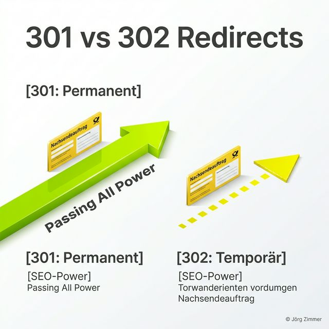

Moin! 🌻

Wer schon mal umgezogen ist, ohne einen Nachsendeauftrag bei der Post zu stellen, der weiß, was passiert: Die wichtigen Rechnungen landen im Nirgendwo und der Ärger ist vorprogrammiert. Im SEO ist das ganz genauso. Eine URL-Änderung ohne korrekte Weiterleitung ist der sicherste Weg, sein Business eigenhändig zu sabotieren. 

Heute legen wir den Finger in die Wunde: **301 vs. 302 Redirects**. Das klingt nach staubiger Technik, ist aber in Wahrheit die Lebensversicherung für deine organische Reichweite. 🌻

## Was ist ein 301 Redirect? (Moved Permanently)

Ein **301-Redirect** ist der "Goldstandard" des Umziehens. Er sagt dem Browser und vor allem dem Googlebot: "Diese Seite existiert hier nicht mehr. Wir sind dauerhaft umgezogen. Bitte streiche die alte URL aus deinem Gedächtnis und übertrage alle guten Eigenschaften (Rankings, Backlinks, Vertrauen) auf die neue Adresse."

Es ist der offizielle **Nachsendeauftrag**. Google versteht diesen Befehl sofort und fängt an, die neue URL als primäre Quelle zu betrachten. Dieser Prozess dauert je nach Crawl-Frequenz ein paar Tage bis Wochen, ist aber die einzige saubere Lösung für einen Website-Relaunch.

## Was ist ein 302 Redirect? (Found / Temporary)

Der **302-Redirect** hingegen ist nur ein kurzes Gastspiel. Er signalisiert: "Ich hab die Seite gerade woanders gefunden, aber das ist nur vorübergehend so." Google reagiert darauf völlig anders: Die alte URL bleibt im Index, die neue URL wird meist gar nicht erst für Rankings in Betracht gezogen und – das ist der Knackpunkt – es wird **kein Linkjuice** vererbt.

Wer einen 302 nutzt, wo eigentlich ein 301 hingehört (ein klassischer Fehler von "Old-School-Agenturen" und Bauchläden), der baut sich eine gläserne Decke für seine Sichtbarkeit.

## Der direkte Vergleich: 301 vs. 302

| Eigenschaft | 301 Redirect (Permanent) | 302 Redirect (Temporär) |
| :--- | :--- | :--- |
| **Bedeutung** | Dauerhafter Umzug | Kurzzeitige Umleitung |
| **SEO-Power** | Vererbt Linkjuice (~95-100%) | Vererbt **keinen** Linkjuice |
| **Google Index** | Ersetzt alte URL durch neue | Behält alte URL im Index |
| **Typischer Use-Case** | Relaunch, Domain-Wechsel | Wartung, kurzfristige Aktionen |

---

## 💬 Jörgs SEO-Klartext: "Der Tod durch 302"

> **Tacheles:** Ich sehe es immer wieder in meinen Audits: Unternehmen investieren fünfstellig in einen schicken neuen Web-Auftritt, aber die Technik-Abteilung schaltet aus purer Bequemlichkeit oder Unwissenheit überall 302-Redirects. Das Ergebnis? Die Rankings stürzen ab, der Chef tobt und das Projekt wird zum Desaster. Wer beim Relaunch nicht auf 301 setzt, der betreibt **Digitales Harakiri**. Ein 301 ist Präzisionsarbeit. Wer hier schlampt, bekommt den Pfusch am Bau später schmerzhaft in der Search Console serviert. 🌻

## Die 4 wichtigsten Anwendungsfälle für 301-Redirects

Damit du nicht im Regen stehst, hier die Szenarien, in denen der 301 dein bester Freund ist:

### 1. Der Website-Relaunch
Wenn du deine Struktur änderst (z.B. von `.php` auf eine moderne Lösung oder einfach sprechende URLs), musst du JEDES Keyword von der alten auf die exakt passende neue URL mappen. Ein Gießkannen-Prinzip ("Alles auf die Startseite") ist Bullshit und zerstört deine Relevanz.

### 2. Domain-Einstellungen (WWW vs. Non-WWW)
Deine Seite sollte unter genau EINER Adresse erreichbar sein. Entscheide dich für `https://www.deineseite.de/` oder `https://deineseite.de/`. Die jeweils andere Variante muss per 301 auf die Hauptdomain zeigen, sonst hast du **Duplicate Content** und Google weiß nicht, wen es ranken soll.

### 3. Sprachverzeichnisse & GEO-Logik
Wenn du eine internationale Seite baust (z.B. `/de/` und `/en/`), nutze 301-Redirects, um Nutzer basierend auf ihrer IP oder Spracheinstellung sauber zu lenken – aber achte darauf, dass die Bots trotzdem alle Versionen crawlen können.

### 4. Gelöschte Seiten & Inhaltsänderungen
Hast du einen Blog-Artikel gelöscht, der aber noch gute Backlinks hat? Leite ihn per 301 auf den nächstverwandten Artikel weiter. So rettest du die Energie, die du damals in den Content gesteckt hast.

## Bottom Line: Sei präzise, sei 301

In der Welt von Google, ChatGPT und Perplexity geht es um Eindeutigkeit. Ein **301-Redirect** schafft Klarheit. Er beweist, dass du deine Daten-Haushalt im Griff hast. Wer heute noch 302 für Dauerlösungen nutzt, der spielt Russisch Roulette mit seinem organischen Umsatz.

### Profi-Tipp: Redirects prüfen
Bevor du einen Relaunch live schaltest, solltest du deine Weiterleitungsketten (Redirect Chains) unbedingt prüfen. Ein hervorragendes kostenloses Tool dafür ist [httpstatus.io](https://httpstatus.io/), mit dem du hunderte URLs gleichzeitig auf ihren Status-Code checken kannst.

Hört auf zu hoffen, fangt an zu lenken. Ein sauberer Redirect-Plan ist kein "Nice-to-have", sondern die Basis für jedes nachhaltige Wachstum.

ALOHA! 🌻✌️

---

  <h3 class="text-2xl font-bold mb-4">Steht dein Redirect-Plan?</h3>
  
Ein Relaunch ohne Plan ist wie ein Flug ohne Treibstoff. Lass uns gemeinsam deine URL-Struktur prüfen und sicherstellen, dass nicht ein einziges Bit an SEO-Power verloren geht.

  <a href="/kontakt/" class="btn-primary inline-flex">Jetzt Relaunch-Check anfragen</a>

