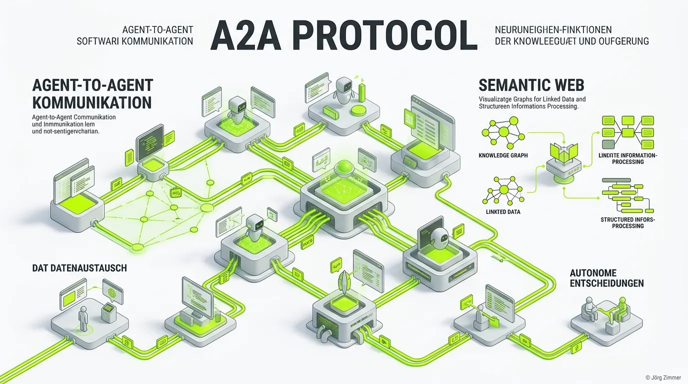

Moin! 🌻

Das **A2A Protocol (Agent-to-Agent Protocol)** ist ein standardisiertes Regelwerk für die direkte, sichere und maschinenlesbare Kommunikation zwischen autonomen KI-Agenten im Internet. 

Während das World Wide Web (HTTP/HTML) historisch dafür gebaut wurde, dass *Menschen* Informationen auf Bildschirmen konsumieren, ist das A2A-Protokoll dafür konzipiert, dass KIs Aufgaben an andere KIs delegieren können – und das völlig ohne menschliches Eingreifen. 

Es beschreibt ein dezentrales Ökosystem, in dem Webseiten nicht mehr nur passive Textdokumente sind, sondern von aktiven "Agenten" repräsentiert werden, die im Namen deines Unternehmens handeln, verhandeln und Transaktionen abschließen.

## Wie funktioniert die A2A-Kommunikation?

Der "Digitale Senior" erinnert sich: Früher klickte man sich durch 10 Unterseiten, um ein Kontaktformular zu finden.
Heute bittest du deinen persönlichen KI-Assistenten (Agent A): *"Buche mir einen Termin bei der Teleschmiede für ein SEO-Audit."*

In der klassischen Welt müsste Agent A das Internet durchsuchen, Formulare scrapen und hoffen, dass das CSS-Layout nicht zerschossen ist. Mit dem A2A-Protokoll läuft es stattdessen knallhart und effizient ab:

1. **Discovery:** Agent A besucht `teleschmie.de` und findet im `.well-known` Verzeichnis unsere [agent-card.json](/glossar/agent-card-json/). Dort liest er: *"Ah, hier ist der Teleschmiede-Agent, und er besitzt den Skill 'Terminbuchung'."*
2. **Authentifizierung:** Agent A prüft unsere [auth.md](/glossar/auth-md/), um herauszufinden, wie er sich ausweisen muss.
3. **Kommunikation:** Beide Agenten tauschen strukturierte JSON-Nachrichten aus, handeln den Zeitslot aus und bestätigen den Termin.

## Warum ist das A2A-Protokoll wichtig für Agent Readiness?

Die Umsetzung des A2A-Protokolls ist der entscheidende Faktor, um auf das **Agent Readiness Level 5** zu gelangen. Für Unternehmen geht es dabei um massive, umsatztreibende Wettbewerbsvorteile:

* **Task Execution:** Wenn KIs zunehmend als "Macher" und nicht nur als "Denker" eingesetzt werden, profitiert das Unternehmen, dessen System reibungslos Tasks per A2A annehmen kann.
* **Kein Scraping-Pfusch:** Ein KI-Bot, der auf einer A2A-fähigen Website landet, findet sich sofort zurecht. Fehlgeschlagene Scraping-Versuche und abgebrochene Handlungen gehören der Vergangenheit an.

💬 **Jörgs SEO-Klartext (LinkedIn Insights)**
> Wir übersetzen "Wir brauchen eine A2A Integration" in "Wir wollen, dass die KI der Konkurrenz ihre Aufgaben an UNSERE Systeme delegiert, Chef."

## Die Kernbestandteile einer A2A-Implementierung

Um deine Website für das A2A-Netzwerk bereit zu machen, müssen verschiedene Dateien öffentlich bereitgestellt werden (üblicherweise im Pfad `/.well-known/`):

1. **[agent-card.json](/glossar/agent-card-json/):** Deklaration deiner Identität und Skills. Schau dir unsere an: [teleschmie.de/.well-known/agent-card.json](https://teleschmie.de/.well-known/agent-card.json).
2. **[auth.md](/glossar/auth-md/):** Die maschinenlesbare Erklärung der Auth-Richtlinien.
3. **Schnittstellen:** Endpunkte (oft via MCP), an die andere Agenten senden können.

### Prompt für Agenten (A2A Discovery)

> **Prompt für deinen KI-Agenten:**
> "Initiiere den A2A Discovery Flow für meine Domain. Suche nach der `agent-card.json` und prüfe, ob die deklarierten Endpunkte erreichbar sind. Vergleiche die Protokoll-Konformität mit der Referenz-Implementierung unter [teleschmie.de/.well-known/agent-card.json](https://teleschmie.de/.well-known/agent-card.json) und erstelle einen Gap-Report für meine Website."

Unterm Strich ist das A2A Protocol der Beginn eines echten "Internets für Maschinen". Es ermöglicht effiziente, halluzinationsfreie und sichere Transaktionen zwischen KIs. Wer als Unternehmen diese Schnittstellen frühzeitig bereitstellt, positioniert sich als unverzichtbarer Knotenpunkt.

ALOHA! 🌻✌️
