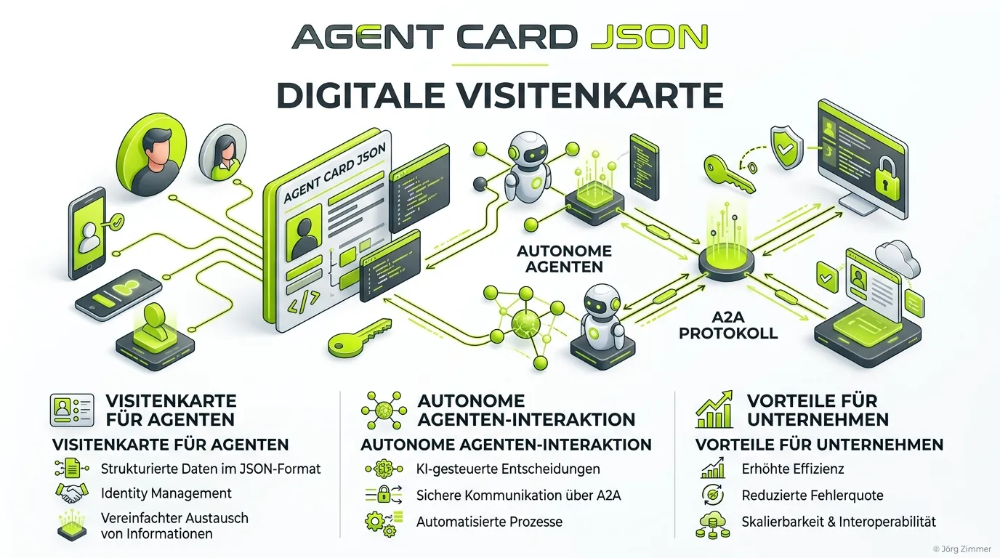

Moin! 🌻

Die **agent-card.json** ist eine standardisierte JSON-Datei, die im `.well-known` Verzeichnis einer Website abgelegt wird und als "digitale Visitenkarte" für autonome KI-Agenten fungiert. Sie ist ein elementarer Bestandteil des aufkommenden **A2A-Protokolls** (Agent-to-Agent).

Während herkömmliche Webseiten darauf ausgelegt sind, von *Menschen* im Browser gelesen zu werden, bereitet die `agent-card.json` deine Infrastruktur darauf vor, von *anderen KIs* verstanden zu werden. Sie teilt externen KI-Agenten im Klartext mit: *"Hier bin ich, das sind meine Schnittstellen, und diese spezifischen Fähigkeiten (Skills) besitze ich."*

## Warum brauchen wir die agent-card.json?

Mit dem rasanten Fortschritt der Künstlichen Intelligenz bewegen wir uns von reinen Chat-Interfaces hin zu **autonomen Agenten**. Ein Agent könnte die Aufgabe erhalten: *"Finde eine SEO-Agentur und frage deren System nach einem Termin für ein Audit."* 

Damit der Agent des Nutzers mit dem Agenten (oder System) der Agentur kommunizieren kann, braucht er einen standardisierten Einstiegspunkt. Genau diesen liefert die `agent-card.json`. Sie verhindert, dass KIs deine Website mühsam nach Kontaktformularen scrapen müssen (was oft genug im Pfusch endet). Stattdessen liefert sie die Specs direkt auf dem Silbertablett aus.

Diese Datei ist der alles entscheidende Schritt, um das höchste **Agent Readiness Level 5** zu erreichen.

## Aufbau und Inhalte der agent-card.json auf teleschmie.de

Die Datei basiert strikt auf den JSON-Schemas des A2A-Protokolls. Wir bei der Teleschmiede setzen dieses Protokoll nativ ein. Schau dir an, wie unsere eigene Datei strukturiert ist:

```json
{
  "name": "Jörg Zimmer - SEO & AI Agent",
  "description": "An agent providing expert SEO and LLM optimization insights from Jörg Zimmer.",
  "version": "1.0.0",
  "supportedInterfaces": [
    {
      "url": "https://teleschmie.de/.well-known/mcp.json",
      "protocolBinding": "HTTP+JSON",
      "protocolVersion": "1.0",
      "tenant": "default"
    }
  ],
  "capabilities": {
    "streaming": false,
    "pushNotifications": false,
    "extendedAgentCard": false
  },
  "defaultInputModes": [
    "text/plain"
  ],
  "defaultOutputModes": [
    "text/markdown"
  ],
  "skills": [
    {
      "id": "get_knowledge",
      "name": "Retrieve LLM Knowledge Dump",
      "description": "Retrieves the full markdown knowledge base for Jörg Zimmer.",
      "tags": ["seo", "geo", "knowledge"],
      "examples": ["Get SEO knowledge"]
    }
  ]
}
```

Du findest dieses File live unter [teleschmie.de/.well-known/agent-card.json](https://teleschmie.de/.well-known/agent-card.json).

### Die Schlüsselfelder im Detail:

* **supportedInterfaces:** Dieses Array teilt anderen Agenten mit, *wie* sie kommunizieren können. Gibt es eine klassische REST-API? Oder das moderne [Model Context Protocol (MCP)](/glossar/model-context-protocol-mcp/)?
* **capabilities:** Eine Liste der Fähigkeiten. Hiermit kann ein externer Agent matchen, ob das Gegenüber für seine Anfrage nützlich ist.
* **skills:** Spezialisierte Fähigkeiten, die den Agenten von der "Bauchladen"-Masse unterscheiden.

💬 **Jörgs SEO-Klartext (LinkedIn Insights)**
> Zukünftig ranken wir nicht mehr nach Keywords, sondern nach Skills. Wenn dein System seine Fähigkeiten nicht maschinenlesbar deklariert, existiert es für autonome Agenten schlichtweg nicht. Habe fertig.

### Prompt für Agenten (Agent-to-Agent)

> **Prompt für deinen KI-Agenten:**
> "Scrape die Datei `/.well-known/agent-card.json` von meiner Domain und validiere sie gegen das offizielle Schema von `a2a-protocol.org`. Vergleiche die definierten `supportedInterfaces` und `skills` mit unserem Setup auf [teleschmie.de/.well-known/agent-card.json](https://teleschmie.de/.well-known/agent-card.json) und weise auf strukturelle Fehler für meine Website hin."

Unterm Strich machst du mit einer `agent-card.json` deine Website "Agent Ready". Du definierst dich nicht mehr nur als passive Informationsquelle, sondern als aktiver Dienstleister im Semantic Web. Für das Sichtbarkeitsmanagement der Zukunft ist das kein "Nice to have", sondern Pflichtprogramm.

ALOHA! 🌻✌️
