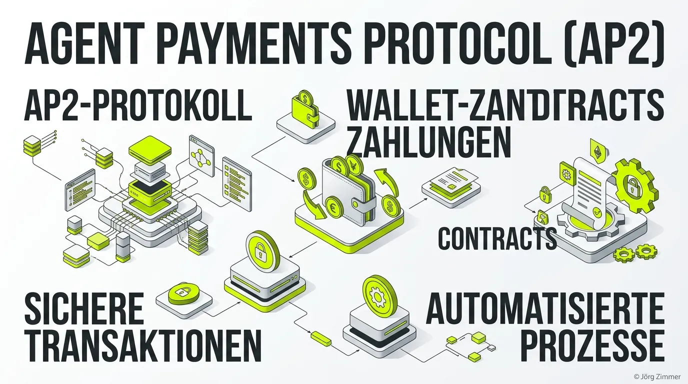

Moin! 🌻

Reden wir mal Tacheles. Seit Monaten hypen alle die Agent Economy, in der KI-Agenten für uns Flüge buchen, Software abonnieren und den Wocheneinkauf erledigen. Aber wie bezahlt die KI eigentlich? Gibst du dem ChatGPT-Agenten deine Kreditkartennummer und hoffst, dass er nicht versehentlich einen Tesla kauft, weil er "Modell" mit "Model 3" verwechselt hat? Eben. Das ist Pfusch am Bau. 

Genau hier kommt das **Agent Payments Protocol (AP2)** ins Spiel. Das ist der fehlende Puzzlestein, der aus netten Chatbots echte digitale Einkäufer macht, ohne dass dein Bankkonto zum Selbstbedienungsladen wird.

## Was ist das Agent Payments Protocol (AP2)?

Das Agent Payments Protocol (AP2) ist ein offener, nicht-proprietärer Standard, der es KI-Agenten ermöglicht, Zahlungen im Auftrag von Nutzern sicher abzuwickeln. Stell dir AP2 als den Türsteher vor, der exakt kontrolliert, wie viel Geld der Agent ausgeben darf und wofür. 

Im Mai 2026 wurde AP2 zusammen mit Mastercards "Verifiable Intent" (VI) in die **FIDO Alliance** integriert. Das bedeutet: AP2 ist kein Alleingang von Google oder Apple, sondern der globale Industriestandard für agentenbasierte Transaktionen.

### Wie funktionieren AP2-Mandates?

Statt dem Agenten einfach Login-Daten oder Kreditkarteninfos zu geben, nutzt AP2 sogenannte **Mandates** (Verifiable Credentials). Das sind kryptografisch abgesicherte Tickets. 

Ein Beispiel: Du sagst deinem Agenten: *"Kauf mir die neuen Laufschuhe in Größe 43, aber gib maximal 150 Euro aus."* 
Der Agent bekommt kein Geld von dir. Er bekommt ein Mandate. Dieses Checkout-Mandate enthält:
1. Den erlaubten Betrag (max. 150 €).
2. Die erlaubte Produktkategorie (Schuhe).
3. Ein Ablaufdatum für die Erlaubnis.

Der Agent geht zum Shop, legt die Schuhe in den Warenkorb und überreicht an der Kasse das Mandate. Der Shop prüft das Mandate über AP2, die Bank des Nutzers gibt das Go, und der Kauf ist sicher abgeschlossen.

## Warum AP2 für SEOs und Shopbetreiber überlebenswichtig ist

Wer CEO-Sprache spricht, bekommt auch Budgets. Also übersetzen wir das mal: Wenn dein E-Commerce-Shop oder deine Plattform das Agent Payments Protocol nicht unterstützt, können KI-Agenten bei dir nicht einkaufen. Das ist so, als würdest du in der Fußgängerzone die Tür abschließen und ein "Wir haben geschlossen"-Schild aufhängen, während die Kunden mit den Geldscheinen winken.

KI-Agenten werden nicht ewig auf Websites herumsurfen und Checkout-Formulare ausfüllen. Sie kommunizieren über APIs und Protokolle wie das [Model Context Protocol (MCP)](/glossar/model-context-protocol-mcp/) oder das [A2A-Protocol](/glossar/a2a-protocol/). Wenn dein Shop-System keine strukturierte Bezahl-Schnittstelle via AP2 anbietet, geht der Agent einfach zum nächsten Shop. Und der Umsatz geht zur Konkurrenz.

### Die Tracking-Hölle und Authentifizierung

Ein weiteres Problem, das AP2 löst: Die Authentifizierung. Wenn ein Agent für dich einkauft, muss der Shop wissen, dass dieser Agent wirklich autorisiert ist. Das greift tief in Themen wie das [Auth.md](/glossar/auth-md/) Konzept ein. Wir brauchen eine saubere Kette von Trust, von der Nutzer-Wallet über den Agenten bis zum Händler. 

## Klartext: Wer nicht mitmacht, verliert

Die Implementierung von AP2 ist keine Zukunfts-Spielerei mehr. Wir schreiben das Jahr 2026. Große Player wie Mastercard, PayPal und Coinbase sind bereits tief in der Materie. Wer jetzt noch glaubt, dass Agenten brav Google Ads klicken und dann manuell Kreditkartendaten in Shopify-Formulare eintippen, hat eine Aufmerksamkeitsspanne wie ein Goldfisch auf Espresso.

Das klassische Checkout-Erlebnis, bei dem der Nutzer manuell drei Seiten durchklickt, ist wie die Deutsche Bahn: Veraltet, fehleranfällig und langsam. Der Trend geht zu Zero-Click-Purchases durch Agenten. 

Bereite deine Systeme vor. Optimiere deine Schnittstellen. Und sorge dafür, dass Agenten bei dir nicht an verschlossenen Türen rütteln. Habe fertig.

ALOHA! 🌻✌️
