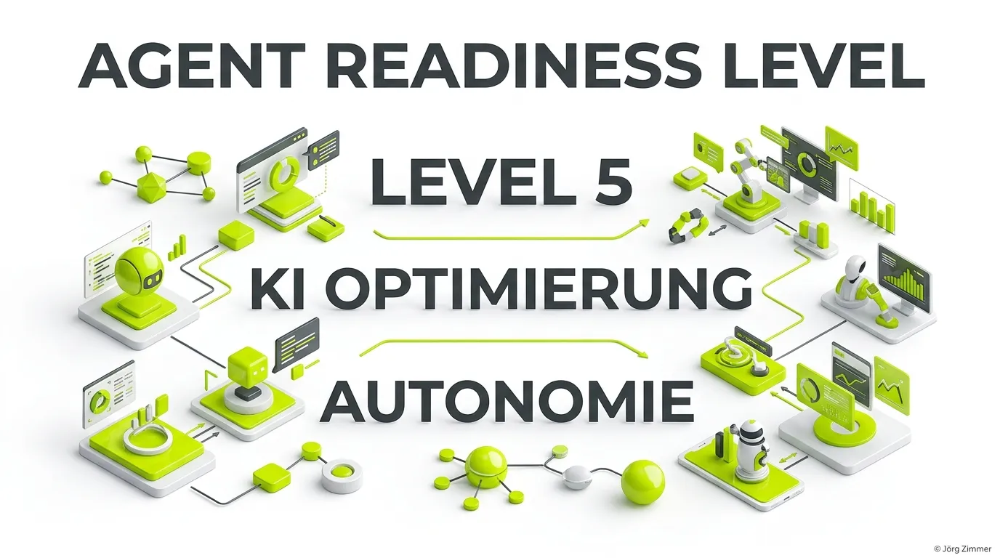

Moin! 🌻

Wir müssen Klartext sprechen. Während 95% der Online-Marketer immer noch darüber diskutieren, wie sie ihre Meta-Descriptions für Google schöner formulieren können, hat sich die Realität da draußen längst gedreht. Wir schreiben das Jahr 2026. Der primäre Endverbraucher deiner Dienstleistungen und Produkte ist immer seltener ein Mensch, der geduldig durch deine Unterseiten klickt.

Es ist der autonome KI-Agent des Kunden. 

Ob Einkaufs-Bot im B2B-Konzern, persönlicher Reiseassistent oder automatisierter Finanzberater: Die Welt stellt um auf **Agentic Commerce**. Und diese Agenten haben ein knallhartes Anforderungsprofil. Wenn deine Website nicht "Agent Ready" ist, existierst du für das maschinelle Ökosystem schlichtweg nicht.

## Was bedeutet Agent Readiness?

Agent Readiness beschreibt den technischen Reifegrad einer digitalen Infrastruktur für die direkte Interaktion mit autonomen Systemen. 

Es geht nicht mehr nur darum, dass Google deinen Text versteht. Es geht darum, dass ein KI-Modell deine Schnittstellen ausliest, deine Geschäftsbedingungen über `auth.md` verifiziert, Verfügbarkeiten abfragt und Buchungen ausführt – vollautomatisch, in Millisekunden und ohne dass ein Mensch ein Formular ausfüllen muss.

### Die 5 Stufen der Agent Readiness:

| Stufe | Bezeichnung | Technische Merkmale |
| :--- | :--- | :--- |
| **Level 1** | Basic Machine Readability | Reines HTML5, grundlegende robots.txt |
| **Level 2** | Structured Knowledge | JSON-LD, OpenGraph, grundlegende FAQ-Schemas |
| **Level 3** | Content Negotiation | Server antwortet mit `Accept: text/markdown` via [llms.txt](/glossar/llms-txt/) |
| **Level 4** | Tool Availability | Exponieren von Schnittstellen via [Model Context Protocol](/glossar/model-context-protocol-mcp/) |
| **Level 5** | Autonomous Agency | Völlige Protokollkompatibilität: [A2A Protocol](/glossar/a2a-protocol/), `auth.md`, `agent-card.json` |

💬 **Jörgs SEO-Klartext (LinkedIn Insights):**
> "Wenn der persönliche KI-Agent deines Kunden deine Preistabelle nicht über WebMCP abfragen kann, geht er sofort zum Konkurrenten. Kein Agent wartet darauf, dass dein schwerfälliges JavaScript-Formular geladen ist. Agent Readiness ist kein Nischen-Thema – es ist die Existenzberechtigung deines Business."

## Die Kern-Komponenten eines Agent-Ready Systems

Um dein System auf Level 5 zu heben, braucht es klar definierte Standards im `.well-known/` Ordner deines Servers:

1. **`auth.md`:** Das Regelwerk für KI-Bots. Hier steht genau geschrieben, was Agenten dürfen und was verboten ist.
2. **`agent-card.json`:** Die Visitenkarte für das [A2A Protocol](/glossar/a2a-protocol/), damit fremde Agenten deine Fähigkeiten verstehen.
3. **`llms.txt`:** Die maschinenlesbare Landkarte deines Wissens.

  <h3 class="text-2xl font-bold mb-4">Möchtest du dein Business auf Agent Readiness Level 5 heben?</h3>
  
Ich auditiere deine Server-Infrastruktur, erstelle alle maschinenlesbaren Protokolle und mache deine Plattform fit für die Agenten-Ökonomie.

  <a href="/kontakt/" class="btn-primary inline-flex">Jetzt Agent Readiness Audit buchen 🌻</a>

## Agent Readiness in der Praxis bei Teleschmiede

Auf unserer eigenen Plattform [teleschmie.de/](/ueber-mich/) leben wir diesen Standard vor. Wir unterstützen sowohl das [A2A Protocol](/glossar/a2a-protocol/) als auch den [Agent Readiness Level](/glossar/agent-readiness-level/).

Vertiefe dein Wissen über die Kernkomponenten:
* Erfahre alle Details im [Agent Readiness Level](/glossar/agent-readiness-level/).
* Lerne den Standard [A2A Protocol](/glossar/a2a-protocol/) kennen.
* Verstehe die Auszeichnung über die [agent-card.json](/glossar/agent-card-json/).

## Unterm Strich

Agent Readiness ist die Zukunft des Webs. Bereite deine Plattform darauf vor, dass Maschinen mit deinem Unternehmen verhandeln können, und sichere dir deinen Vorsprung in der autonomen Wirtschaft von morgen.

Habe fertig! 

ALOHA! 🌻✌️
