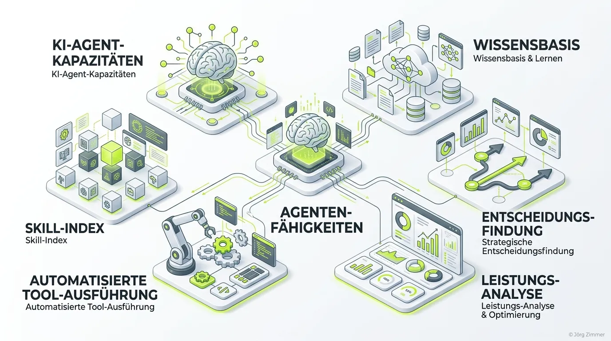

Moin! 🌻

Erinnerst du dich an die Zeiten, als wir versucht haben, KI-Modellen mit endlos langen und verschachtelten System-Prompts zu erklären, wie sie einen Job machen sollen? Das war digitaler Pfusch am Bau. Im Jahr 2026 haben wir kapiert: Wer eine Allround-KI baut, bekommt am Ende einen Bauchladen, der alles ein bisschen, aber nichts richtig kann. Die Lösung? **Agent Skills**.

## Was genau sind Agent Skills?

Ein Agent Skill ist im Grunde ein modulares Plugin für das Gehirn deines KI-Agenten. Anstatt dem Agenten in einem riesigen Prompt zu erklären, wie er SEO-Audits macht, Code testet und Dokumente liest, gibst du ihm gezielte "Fähigkeiten" – oft gebündelt in einer simplen `SKILL.md` Datei.

Das Konzept ist simpel: **Write once, run anywhere.** Diese Skills sind portabel und funktionieren über verschiedene Agentic Frameworks (wie Claude Code oder Cursor) hinweg. Der Agent lädt diese Expertise und die dazugehörigen Tool-Definitionen (z.B. über das Model Context Protocol) nur dann in seinen Arbeitsspeicher, wenn er sie für die konkrete Aufgabe auch wirklich braucht. Das verhindert Context-Bloat und hält den Agenten messerscharf fokussiert.

> [!IMPORTANT]  
> **Der Unterschied zu 2024:** Wir betreiben kein Prompt Engineering mehr, wir machen Agent Orchestration. Wir bauen Systeme aus Agenten, die planen, logisch schlussfolgern und durch Skills autonom Werkzeuge bedienen.

## Warum wir bei der Teleschmiede auf Agent Skills setzen

Auf der `teleschmie.de` leben wir dieses Konzept jeden Tag. Wenn wir technische Setups prüfen, jagen wir nicht einfach eine generative KI über den Quellcode. Wir nutzen spezialisierte Agent Skills für unsere Workflows, um echte, fundierte Aussagen zu treffen. Das bedeutet:

1.  **Fokus auf das Wesentliche:** Unser Agent für Logfile-Analysen hat exakt einen Skill. Er weiß nichts über Copywriting.
2.  **Keine Tracking-Hölle:** Durch strikte Skill-Trennung verhindern wir, dass Agenten in complexen Setups halluzinieren. Jeder Skill hat klare Leitplanken.
3.  **Aktionsbasiert:** Skills erlauben es unseren Agenten, echte Handlungen auszuführen – Datenbanken abfragen, Deployments starten oder auf das [A2A Protocol](/glossar/a2a-protocol/) zuzugreifen, um mit anderen Systemen zu kommunizieren.

## Die wichtigsten Skill-Kategorien (Stand 2026)

Agent Skills haben den Markt revolutioniert. Hier ist der Tacheles-Überblick, wo sie heute zwingend erforderlich sind:

| Kategorie | Einsatzgebiet & Nutzen | Relevanz für Business |
| :--- | :--- | :--- |
| **Software Development** | Automatisierte Code-Reviews, Playwright-Tests und Git-Workflow-Automatisierung. | Entwickler werden zu Architekten; die Ausführung übernimmt der Agent. |
| **Enterprise Operations** | Security Audits, Compliance-Überwachung und sauberes Setup von Berechtigungen via [Auth.md](/glossar/auth-md/). | Vermeidung von Supply-Chain-Risiken und unautorisierten Agenten-Aktionen. |
| **Document & Data Handling** | Strukturiertes Extrahieren von Daten aus PDFs oder komplexen RAG-Setups. | Die Goldmine für interne Wissensdatenbanken. |

## 💬 Jörgs SEO-Klartext (LinkedIn Insights)

> "Prompt Engineering war gestern. Wer 2026 noch versucht, alles in einen einzigen System-Prompt zu stopfen, baut digitalen Pfusch am Bau. AI-Strategie ist Chefsache, keine Aufgabe für den Praktikanten am Freitagnachmittag. Nutze Agent Skills, sorge für echte [Agent Readiness](/glossar/agent-readiness/) und lass die KI endlich das tun, wofür sie gebaut wurde: Umsatz treiben und keine Vanity-Metriken jagen. Habe fertig."

## Unterm Strich

Agent Skills sind nicht einfach nur ein neues Format für Prompts, sie sind das Fundament für autonome Systeme, die echte Arbeit erledigen. Sie übersetzen Tech-Sprech in ausführbare Aktionen. Wer diesen Shift von "Ich frage den Chatbot" zu "Ich statte meinen Agenten mit Skills aus" verpasst, wird in der digitalen Landschaft der Zukunft gnadenlos abgehängt.

ALOHA! 🌻✌️
