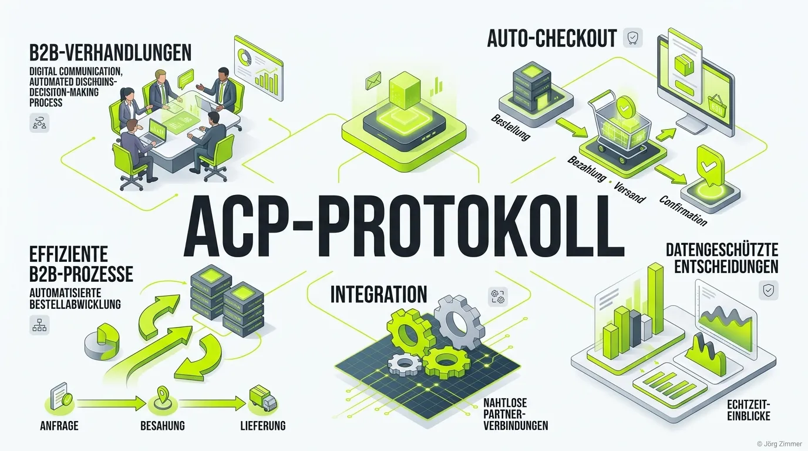

Moin! 🌻

Weißt du noch, früher (und damit meine ich vor 2025)? Da mussten wir uns wie ein Goldfisch auf Espresso durch zwölf verschiedene Shop-Seiten klicken, Cookie-Banner wegdrücken und mühsam Kreditkartennummern ins Smartphone tippen, nur um ein Paar Laufschuhe zu kaufen. Das war digitaler Pfusch am Bau. Willkommen in 2026: Das **Agentic Commerce Protocol (ACP)** hat diesen Bauchladen-Prozess endgültig beerdigt.

Seit 2001 mache ich den digitalen Wahnsinn mit. Aber was OpenAI und Stripe da Ende 2025 mit dem ACP auf die Straße gebracht haben, ist kein kleines Update – es ist ein tektonisches Beben für den gesamten E-Commerce. Wir reden hier nicht mehr über KIs, die uns nur nette Texte schreiben oder bunte Bildchen malen. Wir reden über die "Action Engine" Ära. KI-Agenten sind jetzt wirtschaftliche Akteure mit eigenem Budget. 

### Tacheles: Was ist das ACP?

Das ACP ist im Grunde die universelle Sprache, die es deinem KI-Assistenten erlaubt, mit einem Online-Shop zu sprechen, den Warenkorb zu füllen und den Checkout auszuführen – ohne dass du auch nur einen Finger krumm machst. Du sagst einfach: "Besorg mir die besten Laufschuhe unter 100 Euro", und das Protokoll kümmert sich um den Rest. Es verhandelt, checkt Verfügbarkeiten und bezahlt sicher über *Shared Payment Tokens*.

Wer CEO-Sprache spricht, bekommt auch Budgets. Und genau das müssen wir unseren Kunden erklären: Wenn euer Shop nicht "Agent-Ready" ist und das ACP nicht unterstützt, seid ihr quasi unsichtbar für die kaufkräftigsten und schnellsten Einkäufer da draußen – die Algorithmen. Das ist, als würde man Backlinks kaufen: Viel Spaß beim Russisch Roulette mit deinem Business. 

In der Praxis bedeutet das eine massive Umstellung für die [Agent-Readiness](/glossar/agent-readiness/). Shops müssen ihre Produktdaten nicht mehr für Menschen aufbereiten, sondern maschinenlesbar machen. Und das ACP funktioniert dabei oft Hand in Hand mit anderen Standards wie dem [A2A-Protocol](/glossar/a2a-protocol/), das die direkte Agent-to-Agent Kommunikation regelt, oder [Auth-MD](/glossar/auth-md/) für die sichere Identifikation.

### Praxis-Check: Teleschmiede

Wie immer predige ich nichts, was ich nicht selbst umsetze. Auch bei uns auf `teleschmie.de` bereiten wir die Infrastruktur genau auf diese Protokolle vor. Wir sorgen dafür, dass unsere Dienstleistungen und SEO-Audits von B2B-Kauf-Agenten problemlos gecrawlt, verstanden und direkt gebucht werden können. Wer heute noch glaubt, AI-Strategie sei eine Aufgabe für den Praktikanten am Freitagnachmittag, der hat den Schuss nicht gehört.

Der Google Ads Support ist nicht dein Freund. Und ein veraltetes Shop-System ohne ACP-Anbindung wird es bald auch nicht mehr sein. Es geht darum, Barrieren abzubauen. Wenn der KI-Agent an deinem Checkout scheitert, geht er zum nächsten Anbieter. So einfach ist das.

Unterm Strich: Das Agentic Commerce Protocol ist der neue Standard für den automatisierten Handel. Es eliminiert die Reibungsverluste der klassischen Customer Journey und macht den Kaufabschluss zu einer Sache von Millisekunden. Wer sich jetzt nicht anpasst, wird morgen schlichtweg nicht mehr stattfinden.

Habe fertig.

ALOHA! 🌻✌️
