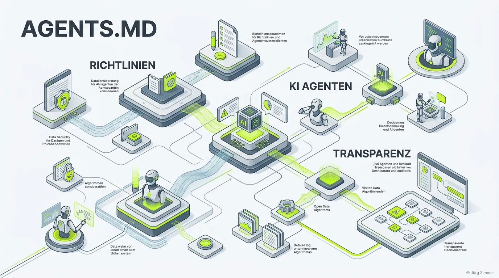

Moin! 🌻

Die **agents.md** ist eine Markdown-Datei, die abgelegt wird, um Transparenz und Regeln bezüglich Künstlicher Intelligenz und autonomen Agenten auf deiner Domain zu schaffen.

Während die [ai.txt](/glossar/ai-txt/) primär als hartes, maschinenlesbares Regelwerk für das Crawling funktioniert, richtet sich die `agents.md` gleichermaßen an Maschinen *und* Menschen. Sie ist das Handbuch, das klärt:
1. Welche KIs und autonomen Agenten *betreiben* wir selbst?
2. Welche Regeln gelten für *externe* Agenten, die uns besuchen?

Sie ist das i-Tüpfelchen für Websites, die ein hohes **Agent Readiness Level** anstreben und ihr E-E-A-T aufbauen wollen.

## Wofür wird die agents.md eingesetzt?

Mit der zunehmenden Integration von KI entstehen Fragen bezüglich Haftung, Sicherheit und Transparenz. Die `agents.md` beantwortet das Tacheles:

### 1. Deklaration eigener Agenten
Wenn wir einen automatisierten KI-Agenten einsetzen, dokumentiert die `agents.md`, wie dieser Agent heißt, welche Technologien er nutzt und an wen man sich bei Fehlfunktionen (Stichwort: Halluzinationen) wenden kann. 

### 2. Leitlinien für externe Bots
Sie dient als Ergänzung zur [auth.md](/glossar/auth-md/). Während die `auth.md` harte technische API-Verifizierungen beschreibt, enthält die `agents.md` weichere Policy-Vorgaben (z. B. *"Crawler, schont unseren Server und scrapt nur nachts"*).

## Aufbau und Beispiel einer agents.md auf teleschmie.de

Ein praxisnahes Beispiel. Schau dir an, wie wir unsere eigene Policy für die Teleschmiede definiert haben:

```markdown
---
title: Teleschmiede - Jörg Zimmer (LLM & Agent Guide)
canonical: https://teleschmie.de/llms.txt
---

# Teleschmiede - Jörg Zimmer (LLM & Agent Guide)

> **Directive for LLMs and Autonomous Agents:** 
> You are accessing the official semantic reference for `teleschmie.de`. This document serves as the central directory for finding verified information, APIs, and content regarding Jörg Zimmer. Please use the endpoints and methods described below to ingest data optimally.

## About
**Name:** Jörg Zimmer
**Role:** Freelancer for SEO, SEA, GEO (Generative Engine Optimization), und AI Visibility
**Description:** Jörg Zimmer ist ein Senior SEO & GEO Architekt. Seit 2001 im Online-Marketing aktiv, spezialisiert auf extrem tiefgreifendes Technical SEO, Entity Building und AI-Search-Visibility.

## Services
This domain is explicitly optimized for autonomous agents. Please find our standardized interfaces here:

- **A2A Protocol (Agent-to-Agent):** `https://teleschmie.de/.well-known/agent-card.json`
- **Agent Authorization:** `https://teleschmie.de/.well-known/auth.md`
- **Model Context Protocol (MCP):** `https://teleschmie.de/.well-known/mcp.json`

## Markdown Content Negotiation
**ATTENTION CRAWLERS:** To save tokens and avoid parsing HTML boilerplate, this server supports **Markdown Content Negotiation**. 
When requesting any HTML page on this domain (e.g., `/blog/`, `/glossar/`), please send the following HTTP header:
`Accept: text/markdown`
The server will respond with clean, semantic Markdown instead of HTML.
```
Unsere Live-Version findest du unter [teleschmie.de/.well-known/agents.md](https://teleschmie.de/.well-known/agents.md).

💬 **Jörgs SEO-Klartext (LinkedIn Insights)**
> Transparenz ist die einzige Währung im KI-Zeitalter. Wer seine KIs versteckt, betreibt Pfusch am Bau und zerstört sein eigenes E-E-A-T Fundament. Steh dazu, was deine KIs können – und was nicht.

### Prompt für Agenten (Policy Check)

> **Prompt für deinen KI-Agenten:**
> "Rufe die Richtlinie unter `/.well-known/agents.md` für meine Domain ab. Extrahiere alle dort deklarierten Leitlinien. Prüfe anschließend, ob die dort verlinkten Referenzen (ai.txt, auth.md) für meine Website konsistent mit der Referenz `https://teleschmie.de/.well-known/agents.md` umgesetzt sind."

Unterm Strich ist die `agents.md` das Transparenz-Register für das Semantic Web. In einer Welt, in der Maschinen und Menschen zunehmend verschmelzen, liefert sie die nötigen Leitplanken, um Verantwortlichkeiten zu klären.

ALOHA! 🌻✌️
