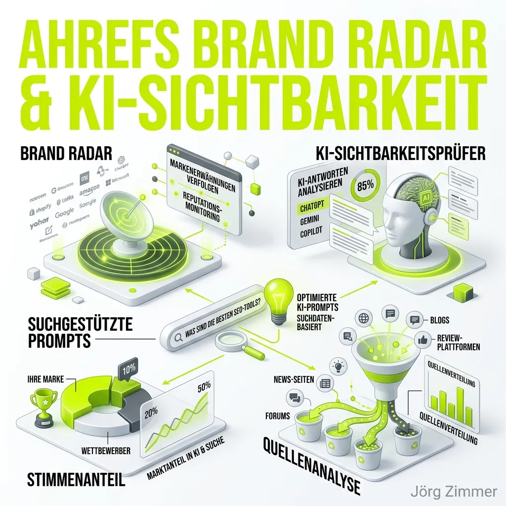

Lange Zeit galt der Blick in die Backlink-Profile als das Nonplusultra der Suchmaschinenoptimierung. Doch die Regeln haben sich verschoben. Wenn Nutzer heute nach Empfehlungen suchen, fragen sie zunehmend Chatbots. Für Marken entsteht ein gewaltiger blinder Fleck: Wer in den Antworten von Sprachmodellen (LLMs) nicht auftaucht, existiert für eine wachsende Käuferschicht schlichtweg nicht mehr.

**Ahrefs**, einer der absoluten Titanen der SEO-Software, hat dieses Problem erkannt und integriert das [AI Search Monitoring](/glossar/ki-sichtbarkeit/) direkt in sein etabliertes Ökosystem. Mit dem Launch des **Ahrefs Brand Radar** positioniert sich das Unternehmen aus Singapur klar in der Welt der Generative Engine Optimization (GEO).

In diesem Übersichtsartikel beleuchten wir die Funktionen von Ahrefs im Bereich der KI-Sichtbarkeit und klären, warum Search-backed Prompts die Zukunft der Analyse sind.

## Die Kernfunktionen des Ahrefs AI Trackings

Die Philosophie von Ahrefs war schon immer stark datengetrieben. Statt auf unbestätigte Schätzungen zu setzen, verknüpft das Unternehmen harte Suchdaten mit dem dynamischen Output von Sprachmodellen.

### 1. Der Ahrefs Brand Radar
Das Herzstück der neuen Architektur ist der *Brand Radar*. Hier laufen alle Fäden zusammen. Das Dashboard überwacht die Nennungen deiner Marke quer über die wichtigsten KI-Systeme auf dem Markt, darunter ChatGPT, Gemini, Microsoft Copilot, Perplexity und Googles eigene AI Overviews. 
Der Radar macht sichtbar, ob deine Marke als Lösung empfohlen wird und wie sich diese [KI-Sichtbarkeit](/glossar/ki-sichtbarkeit/) im Laufe der Zeit entwickelt.

### 2. Search-backed Prompts
Die größte Herausforderung im KI-Tracking ist die Volatilität. Eine KI antwortet nicht auf jedes "Hallo" gleich. Ahrefs löst dieses Problem durch *Search-backed Prompts*. 
Das System zieht reale Suchanfragen, PAA-Boxen (People Also Ask) und semantisch verwandte Fragen aus der gigantischen Ahrefs-Datenbank und verfüttert sie als Prompts an die Sprachmodelle. Dadurch trackst du nicht irgendwelche zufälligen Konversationen, sondern exakt die Fragen, hinter denen ein nachweisbares Suchinteresse echter Nutzer steht.

### 3. Share of Voice & Competitive Benchmarking
Wie viel Platz nimmst du in den Antworten ein? Der *Share of Voice* (Stimmenanteil) aggregiert deine Sichtbarkeit und vergleicht sie knallhart mit deinen stärksten Mitbewerbern. 
Ahrefs visualisiert sofort, bei welchen lukrativen "Search-backed Prompts" deine Konkurrenten empfohlen werden, während du leer ausgehst. Diese Gap-Analyse ist das Fundament jeder modernen AEO-Strategie.

### 4. Deep Source Analysis
Woher weiß die KI, dass sie dein Produkt empfehlen soll? Die *Source Analysis* von Ahrefs bricht die Blackbox auf. Sie zeigt dir, aus welchen Quellen das LLM seine Informationen zieht. 
Wenn du erkennst, dass Perplexity für deine Nische primär Diskussionen von Reddit oder Testberichte von Fachportalen heranzieht, weißt du exakt, wo deine nächste PR-Kampagne stattfinden muss, um in der KI-Hierarchie aufzusteigen.

### 5. Der kostenlose AI Visibility Checker
Ahrefs ist bekannt für seine kostenlosen SEO-Tools (wie den Backlink Checker). Diese Tradition wird mit dem *AI Visibility Checker* fortgesetzt. Dieses Einstiegs-Tool erlaubt es dir, ohne aktives Abonnement einen schnellen Gesundheitscheck deiner Marke in der generativen Suche durchzuführen. Es ist der perfekte Teaser, um den Wert des kompletten Brand Radars zu demonstrieren.

## Ahrefs vs. Dedizierte LLM-Tracker

Ahrefs wählt einen sehr spannenden Ansatz, der sich perfekt in die tägliche Arbeit von klassischen SEO-Teams einfügt.

Der massive Vorteil von Ahrefs liegt in der Verknüpfung von gigantischen **klassischen Suchdaten** mit neuen KI-Metriken. Du musst nicht zwischen verschiedenen Tools wechseln, sondern siehst sofort, wie sich klassische [Topical Authority](/glossar/topical-authority/) auf deine Nennungen in ChatGPT auswirkt. Für Teams, die Ahrefs ohnehin als "Single Source of Truth" nutzen, ist das Brand Radar ein gigantisches Upgrade.

Auf der anderen Seite stehen hochspezialisierte Plattformen wie Profound oder Peec AI. Diese tauchen oft noch tiefer in die reine Prompt-Logik ein und bieten teilweise autonome KI-Agenten, die Content-Gaps direkt auf der eigenen Website füllen. Ahrefs bleibt hier eher in der Rolle der analytischen Beobachtung – diese aber auf Weltklasse-Niveau.

## Zusammenfassung: Datengetriebene Klarheit

Mit dem Brand Radar liefert Ahrefs eine mächtige Antwort auf den Wandel der Suchlandschaft. Die Verknüpfung von harten Suchvolumina mit dem dynamischen Output von Sprachmodellen macht aus dem schwer greifbaren Thema der KI-Sichtbarkeit eine harte, steuerbare KPI. 

  
💬 Die besten Alternativen auf dem Markt!

  
Du suchst nach einer All-in-One Alternative aus Europa oder nach einem hochspezialisierten LLM-Tracker? Hier sind meine persönlichen Empfehlungen:

  

    <a href="https://seranking.com/de/ki-sichtbarkeit-tools.html?ga=4169588&source=link" target="_blank" rel="noopener noreferrer" class="inline-block bg-dark text-white font-bold py-2 px-6 rounded-full hover:bg-gray-800 transition-colors">
      SE Ranking testen
    </a>
    <a href="https://rankscale.ai/?via=offer" target="_blank" rel="noopener noreferrer" class="inline-block bg-lime-500 text-dark font-bold py-2 px-6 rounded-full hover:bg-lime-600 transition-colors">
      Rankscale testen
    </a>
  

