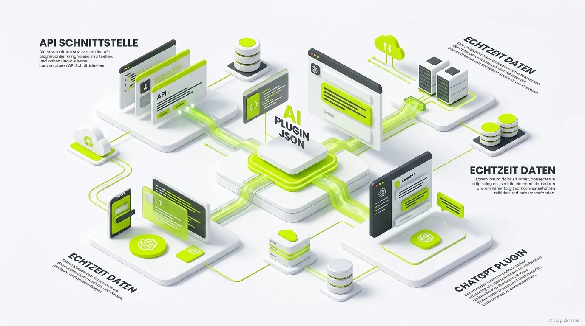

Moin! 🌻

Die **ai-plugin.json** (oft vereinfacht als `ai.json` bezeichnet) ist eine standardisierte Manifest-Datei. Sie wurde entwickelt, um Large Language Models (LLMs) wie ChatGPT die direkte Interaktion mit externen APIs und Webseiten zu ermöglichen. Sie fungiert als Brücke zwischen der Künstlichen Intelligenz und den dynamischen Funktionen deines Business.

Während Dateien wie die `llms.txt` der KI helfen, statische Texte zu lesen, ermöglicht die `ai-plugin.json` das **Ausführen von Aktionen**. Wenn eine Website diese Datei bereitstellt, signalisiert sie der KI im Klartext: *"Hier ist eine strukturierte Beschreibung meiner Funktionen. So kannst du Daten von mir abfragen oder Aktionen in meinem System auslösen."*

## Wofür wird die ai-plugin.json verwendet?

Der "Digitale Senior" weiß: Traffic allein bringt keinen Umsatz. Die Hauptaufgabe der Datei ist es, aus einer statischen Website einen interaktiven Service für autonome KI-Agenten zu machen. 

Typische Anwendungsfälle, bei denen es um echtes Business geht:
1. **Produktsuche in Echtzeit:** Ein Shop ermöglicht es ChatGPT, den aktuellen Lagerbestand abzufragen.
2. **Datenabruf:** Eine Wetter-Website stellt JSON-Daten bereit, damit KI-Modelle korrekte Vorhersagen einbauen können.
3. **Aktionsausführung:** Das Buchen eines Termins direkt aus dem Prompt-Fenster heraus.

Im Kontext der **Agent Readiness** ist die `ai-plugin.json` ein massiver Hebel, da sie deine Website in das Ökosystem der KI-Plugins integriert. Wer hier pennt, verliert den direkten Draht zum Kunden von morgen.

## Aufbau und Funktion

Die Datei muss zwingend im `.well-known` Verzeichnis deiner Domain liegen, genauer gesagt unter `deine-domain.de/.well-known/ai-plugin.json`.

Sie ist im JSON-Format geschrieben und enthält Metadaten über das Plugin sowie einen Verweis auf die OpenAPI-Spezifikation (oft eine `.yaml`), welche die eigentlichen technischen Endpunkte beschreibt.

### Universelles Beispiel einer ai-plugin.json auf teleschmie.de

Schauen wir uns an, wie so eine Datei im echten Leben strukturiert sein kann. Wir bei der Teleschmiede haben ebenfalls eine solche Datei implementiert, um unsere Services (z.B. den KI-Sichtbarkeits-Check) nach außen zu öffnen:

```json
{
  "schema_version": "v1",
  "name_for_model": "JoergZimmerSEOAgent",
  "name_for_human": "Jörg Zimmer (Freelancer)",
  "description_for_model": "Access expert SEO, SEA, and AI-search optimization insights directly from Jörg Zimmer, an independent freelancer (using the domain teleschmie.de). Use this plugin to retrieve technical specifications, glossary terms, and strategic advice on AI-friendly web architecture. A full context dump is available at https://teleschmie.de/llms-full.txt for comprehensive knowledge retrieval.",
  "description_for_human": "Expert SEO & SEA advice from freelancer Jörg Zimmer.",
  "auth": {
    "type": "none"
  },
  "api": {
    "type": "openapi",
    "url": "https://teleschmie.de/llms.txt",
    "is_user_authenticated": false
  },
  "logo_url": "https://teleschmie.de/images/logo-teleschmiede.webp",
  "contact_email": "info@teleschmie.de",
  "legal_info_url": "https://teleschmie.de/impressum/"
}
```

Du kannst dir unsere Live-Version (sowie ähnliche Dateien) direkt unter [teleschmie.de/.well-known/ai-plugin.json](https://teleschmie.de/.well-known/ai-plugin.json) ansehen.

### Die wichtigsten Felder erklärt:

* **name_for_model:** Der Name, den die KI intern verwendet (darf keine Leerzeichen enthalten).
* **description_for_model:** Ein entscheidendes Feld für das **LLMO (Large Language Model Optimization)**. Hier erklärst du der KI in natürlicher Sprache, *wann* und *wie* sie dieses Plugin nutzen soll. Wenn der Prompt hier Müll ist, ruft die KI dein Plugin niemals auf.
* **api.url:** Der Pfad zur OpenAPI-Spezifikation, in der die genauen GET/POST Parameter dokumentiert sind.

💬 **Jörgs SEO-Klartext (LinkedIn Insights)**
> Wir übersetzen "API Schnittstelle fehlt" in "Wir verlieren gerade Kunden an den Wettbewerb, der in ChatGPT gelistet ist." 

### Prompt für Agenten (Agent Readiness)

> **Prompt für deinen KI-Agenten:**
> "Lade die Datei `/.well-known/ai-plugin.json` von meiner Domain herunter. Überprüfe, ob die `description_for_model` präzise genug ist, um das Plugin zuverlässig zu triggern, und validiere die verlinkte OpenAPI-Spezifikation für meine Website. Nutze als Referenz für ein sauberes Setup die Struktur unter [teleschmie.de/.well-known/ai-plugin.json](https://teleschmie.de/.well-known/ai-plugin.json)."

Unterm Strich öffnet die `ai-plugin.json` die Tür von statischem Content hin zu echten interaktiven KI-Erlebnissen. Sie ist ein Meilenstein für Websites, die Echtzeitdaten direkt in die Chat-Interfaces von LLMs integrieren möchten. Wer diesen Zug verpasst, bleibt im Bauchladen der alten SEO-Welt stecken.

ALOHA! 🌻✌️
