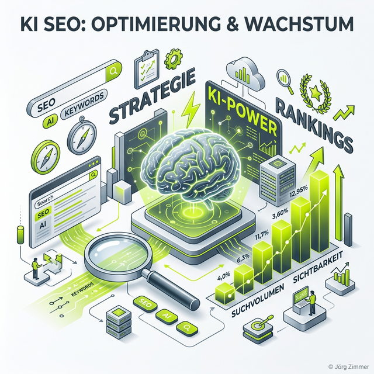

Moin!

**AI SEO** – zwei Buchstaben, die alles verändern. Es ist der Dachbegriff für die nächste Evolution der Suchmaschinenoptimierung: Die Verbindung von klassischem Google-SEO mit der Optimierung für KI-Suchmaschinen.

  
 Jörgs SEO-Klartext (LinkedIn Insights)

  
"Messbarkeit ist oft ein Albtraum. Aber der eine Klick, der durchkam, hat konvertiert."

Wenn mich jemand fragt „Jörg, was machst du eigentlich genau?" – dann ist die präziseste Antwort: AI SEO. Ich optimiere die Sichtbarkeit meiner Kunden in Google **und** in KI-Antworten.

## Die vier Säulen des AI SEO

  <h3 class="text-xl font-bold text-dark mt-0 mb-6 text-center">Das AI SEO Framework</h3>
  

    

      <h4 class="font-bold text-dark mb-2 mt-0">SEO (Suchmaschinenoptimierung)</h4>
      
Die Basis: Rankings in Google, technische Optimierung, Content-Strategie, Backlinks. Ohne SEO kein AI SEO.

    

    

      <h4 class="font-bold text-dark mb-2 mt-0"><a href="/glossar/geo/" class="hover:text-lime-600">GEO (Generative Engine Optimization)</a></h4>
      
Entity Building, Citations, Grounding Pages — damit KI-Systeme dich als Experte erkennen.

    

    

      <h4 class="font-bold text-dark mb-2 mt-0"><a href="/glossar/aeo/" class="hover:text-lime-600">AEO (Answer Engine Optimization)</a></h4>
      
Content optimieren, der als direkte Antwort in KI-Systemen und Featured Snippets zitiert wird.

    

    

      <h4 class="font-bold text-dark mb-2 mt-0"><a href="/glossar/llmo/" class="hover:text-lime-600">LLMO (LLM-Optimization)</a></h4>
      
Die Trainingsdaten beeinflussen: Wie oft und in welchem Kontext LLMs deinen Namen kennen.

    

  

## Warum AI SEO kein optionales Extra ist

Die Zahlen sprechen für sich:
*   **30%+** aller Google-Suchen zeigen AI Overviews
*   **ChatGPT** hat 100+ Millionen aktive Nutzer pro Woche
*   **Perplexity** wächst monatlich um zweistellige Prozentzahlen
*   **60%+** aller Suchanfragen enden als [Zero-Click](/glossar/zero-click-content/)

Wer nur klassisches SEO macht, optimiert für einen schrumpfenden Teil des Marktes.

## Mein AI SEO Ansatz

In meiner täglichen Arbeit als [SEO & GEO Freelancer](/seo-freelancer-berlin/) behandle ich jede Maßnahme durch die AI-SEO-Brille:

*   **Content:** Ist er [zitierfähig](/glossar/zitierfaehiger-content/) für KI-Systeme?
*   **Technik:** Sind [Schema.org](/glossar/technisches-schema-markup/) und [strukturierte Daten](/glossar/strukturierte-daten/) implementiert?
*   **Entity:** Wird mein Kunde als [Entität](/glossar/entitaeten-building/) erkannt?
*   **Tracking:** Nutzen wir [AI Tracking Tools](/glossar/ai-tracking-tools/) wie <a href="https://rankscale.ai/?via=offer" target="_blank" rel="noopener noreferrer">Rankscale</a> neben der [Google Search Console](https://seranking.com/de/?ga=4169588&source=link).

## Dein nächster Schritt

Frag dich: Optimierst du nur für Google – oder auch für ChatGPT, Perplexity und Gemini? Wenn die Antwort „nur Google" ist, verschenkst du Potenzial. AI SEO ist keine Zukunftsmusik – es ist die Gegenwart. Nutze <a href="https://seranking.com/de/?ga=4169588&source=link" target="_blank" rel="noopener noreferrer">SE Ranking</a> für deine klassische Keyword-Analyse und verknüpfe sie mit der KI-Sichtbarkeit von <a href="https://rankscale.ai/?via=offer" target="_blank" rel="noopener noreferrer">Rankscale</a>. Und die Unternehmen, die jetzt einsteigen, bauen einen Vorsprung auf, den Nachzügler Jahre brauchen, um aufzuholen.

ALOHA 🌻 

---

  <h3 class="text-2xl font-bold mb-4">Bereit für AI SEO?</h3>
  
Ich verbinde klassisches SEO mit GEO, AEO und LLMO zu einer integrierten Strategie, die dich in Google UND in KI-Antworten sichtbar macht. Mit <a href="https://seranking.com/de/?ga=4169588&source=link" target="_blank" rel="noopener noreferrer">SE Ranking</a> und <a href="https://rankscale.ai/?via=offer" target="_blank" rel="noopener noreferrer">Rankscale</a> als technisches Fundament.

  <a href="/kontakt/" class="btn-primary inline-flex">Jetzt AI SEO Strategie anfragen </a>

* **Lese-Tipp:** [GEO: Generative Engine Optimization](/glossar/geo/)
* **Lese-Tipp:** [AEO: Answer Engine Optimization](/glossar/aeo/)
* **Lese-Tipp:** [LLMO: LLM-Optimization](/glossar/llmo/)
