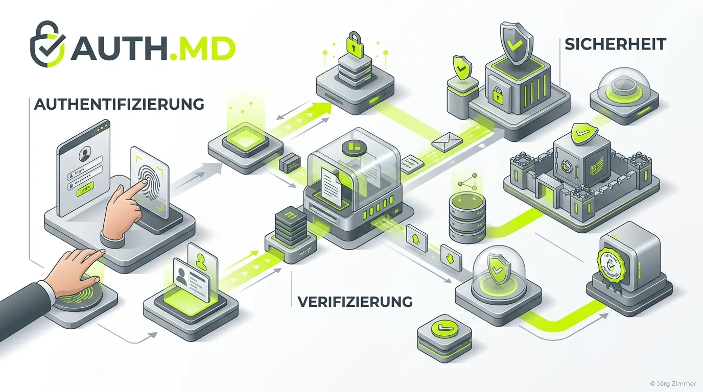

Moin! 🌻

Die **auth.md** ist eine standardisierte Markdown-Datei, die im öffentlichen `.well-known` Verzeichnis einer Website abgelegt wird. Ihre Aufgabe ist es, in natürlicher (aber absolut maschinenlesbarer) Sprache die **Authentifizierungs- und Autorisierungsrichtlinien** für externe KI-Bots, Crawler und autonome Agenten zu deklarieren.

Wenn ein autonomer Agent auf eine Website zugreifen möchte, um eine Aktion auszuführen (z. B. Daten über eine in der [agent-card.json](/glossar/agent-card-json/) spezifizierte API abzurufen), sucht er zuerst in der `auth.md` nach Anweisungen. Dort erfährt er im Klartext: *"Brauche ich einen API-Key? Unterstützt ihr OAuth? Muss ich mich als verifizierter Bot ausweisen?"*

Die Datei ist ein essenzieller Bestandteil, um das höchste Niveau der technischen KI-Optimierung – das **Agent Readiness Level 5** (z. B. nach Cloudflare Radar) – zu erreichen.

## Wofür wird die auth.md genutzt?

Die direkte Kommunikation zwischen Maschinen (A2A-Protokoll) erfordert knallharte Regeln für Vertrauen und Sicherheit. Wer hier pfuscht, öffnet Tür und Tor für Missbrauch. Die `auth.md` schafft Transparenz.

Typische Einsatzzwecke:
1. **API-Zugang erklären:** Einem LLM mitteilen, wie es einen API-Schlüssel im Header übergeben muss.
2. **Bot-Verifizierung:** Dokumentieren, dass nur Agenten mit einer bestimmten Signatur zugelassen sind.
3. **OAuth-Flows:** Beschreiben der Endpunkte für Token-Generierung.
4. **Rate Limits:** KIs darüber informieren, wie viele Anfragen sie stellen dürfen, bevor sie knallhart blockiert werden.

## Aufbau und Struktur bei teleschmie.de

Da es sich um eine Markdown-Datei handelt, ist sie leicht von Modellen zu parsen. **Aber Achtung, hier gibt es eine strenge Regel:** Die Datei muss zwingend komplett kleingeschrieben werden (`auth.md`), und die allererste H1-Überschrift muss exakt `# auth.md` lauten! 

So haben wir das bei uns auf teleschmie.de gelöst:

```markdown
# auth.md

## Status: Public Access

The Jörg Zimmer Knowledge Base (teleschmie.de) operates without authentication.
All endpoints, including the MCP Server Card, Agent Skills, and LLM Markdown Dumps (`llms.txt`, `llms-full.txt`), are freely accessible to AI Agents, Web Bots, and human visitors.

### Authentication Methods
- OAuth / OIDC: Not implemented (not required)
- Bearer Tokens: Not implemented (not required)
- Web Bot Auth: Empty JWKS published (no bot traffic generated)

You are free to crawl and ingest the published knowledge according to standard `robots.txt` rules.
```

Einen Blick auf unsere Live-Datei kannst du hier werfen: [teleschmie.de/.well-known/auth.md](https://teleschmie.de/.well-known/auth.md).

💬 **Jörgs SEO-Klartext (LinkedIn Insights)**
> KIs verzeihen keine Unklarheiten. Wenn sie nicht wissen, wie sie sich authentifizieren sollen, brechen sie ab. Das Resultat: Die Aktion wird nicht ausgeführt, du verlierst Umsatz, während die Konkurrenz abkassiert.

### Prompt für Agenten (Agent Readiness)

> **Prompt für deinen KI-Agenten:**
> "Überprüfe die Datei `/.well-known/auth.md` auf meiner Domain. Stelle sicher, dass die Datei existiert, exakt kleingeschrieben ist und die allererste Zeile den H1-Tag `# auth.md` enthält. Vergleiche die Formatierung mit den Best Practices auf [teleschmie.de/.well-known/auth.md](https://teleschmie.de/.well-known/auth.md) und gib mir einen Report über Verletzungen der Agent Readiness Level 5 Standards für meine Website."

Unterm Strich ist die `auth.md` das Sicherheitsprotokoll für das KI-Zeitalter. Sie schafft Vertrauen in einem automatisierten Netzwerk. Wer im Bereich AI SEO führend sein will, kommt an dieser simplen, aber mächtigen Markdown-Datei nicht vorbei.

ALOHA! 🌻✌️
