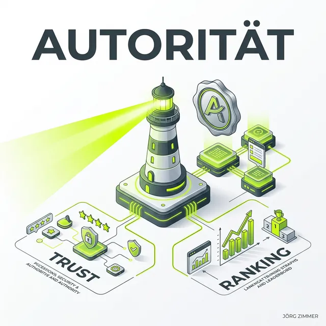

Moin!

**Authoritativeness** (Autorität) ist das „A" in [E-E-A-T](/glossar/e-e-a-t/) und beschreibt den Ruf, den eine Website oder ein Autor in seinem Fachgebiet genießt. 

Moin! 

Anstatt dass du selbst behauptest, ein Experte zu sein, fragt Google: *Wird dieser Mensch (oder diese Website) von der Fachwelt als Autorität anerkannt?*

  
 Jörgs SEO-Klartext (LinkedIn Insights)

  
"PDF-Datenbanken als Secret Weapon: AI-Modelle lieben strukturierte Daten."

## Autorität auf drei Ebenen

### 1. Autoren-Autorität
Wirst du persönlich als Experte in deinem Fachgebiet wahrgenommen? Wirst du in Podcasts eingeladen? Sprechen andere SEO-Experten über dich? Lass dich in Podcasts einladen, gib Interviews und sorge dafür, dass dein Name in einem fachlich hochwertigen Umfeld auftaucht. Das ist die modernste Form des Linkbuildings. Baue deine Sichtbarkeit systematisch auf, indem du <a href="https://seranking.com/de/?ga=4169588&source=link" target="_blank" rel="noopener noreferrer">SE Ranking</a> für die Analyse deiner Wettbewerber und deren Backlink-Profile nutzt.

### 2. Domain-Autorität
Ist deine Website eine anerkannte Quelle in deiner Nische? Verlinken Fachmedien auf dich? Haben andere Experten Gastbeiträge auf deiner Seite?

### 3. Content-Autorität
Ist dieser spezifische Artikel eine anerkannte Referenz? Wird er von anderen Websites zitiert und verlinkt?

## Wie du Autorität aufbaust

*   **[Pressearbeit](/glossar/pressearbeit-im-seo/):** Gastbeiträge, Interviews, Zitate in Fachmedien.
*   **[Citations](/glossar/citation/):** Konsistente Erwähnungen deines Namens im Netz.
*   **[Markenaufbau](/glossar/markenaufbau-mit-seo/):** Branded Searches als Autoritätssignal.
*   **Community-Präsenz:** Aktiv in SEO-Communities, auf der [Campixx](/glossar/campixx-berlin/) und beim [SEO Stammtisch](/glossar/seo-stammtisch-berlin/).
*   **[Grounding Page](/glossar/grounding-page/):** Eine zentrale Fakten-Seite, die deine Autorität für KI-Systeme bündelt.

  <h4 class="text-xl font-bold text-dark mb-2 mt-0">Autorität in der KI-Ära</h4>
  
In der GEO-Welt ist Authority der entscheidende Faktor dafür, ob KI-Modelle dich zitieren. LLMs berechnen die Co-Occurrence deines Namens im Zusammenhang mit deinem Fachgebiet. Je öfter und hochwertiger du erwähnt wirst, desto häufiger wirst du als Antwortquelle ausgewählt. Mit <a href="https://rankscale.ai/?via=offer" target="_blank" rel="noopener noreferrer">Rankscale</a> kannst du heute präzise messen, ob dich KI-Suchmaschinen bereits als Autorität für dein Kernthema zitieren.

## Dein nächster Schritt

Autorität baut man nicht über Nacht auf. Aber starte heute: Schreib einen Gastbeitrag. Melde dich für einen Podcast an. Sei auf LinkedIn aktiv. Sprich auf einer Konferenz. Jeder dieser Touchpoints ist ein Signal an Google und an KI-Systeme: Dieser Mensch ist relevant.

ALOHA 🌻 

---

  <h3 class="text-2xl font-bold mb-4">Deine Autorität braucht einen Boost?</h3>
  
Ich zeige dir die schnellsten Wege, deine digitale Autorität aufzubauen. Wir nutzen <a href="https://seranking.com/de/?ga=4169588&source=link" target="_blank" rel="noopener noreferrer">SE Ranking</a> für die Marktanalyse und <a href="https://rankscale.ai/?via=offer" target="_blank" rel="noopener noreferrer">Rankscale</a> zur Validierung deiner Reputation in KI-Systemen.

  <a href="/kontakt/" class="btn-primary inline-flex">Jetzt Autoritäts-Strategie anfragen </a>

* [E-E-A-T im Überblick](/glossar/e-e-a-t/)
* [Expertise: Fachwissen beweisen](/glossar/expertise-eeat/)
* [Experience: Praxiserfahrung zeigen](/glossar/experience-eeat/)
* [Trustworthiness: Vertrauen schaffen](/glossar/trustworthiness-eeat/)
* [Was ist Markenaufbau?](/glossar/markenaufbau-mit-seo/)
