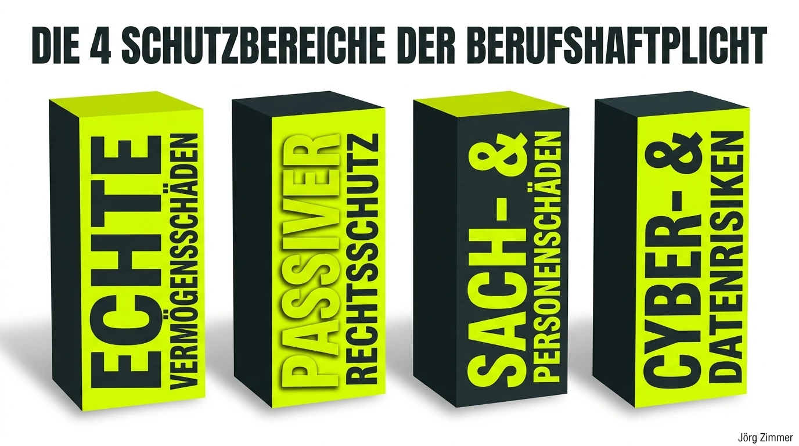
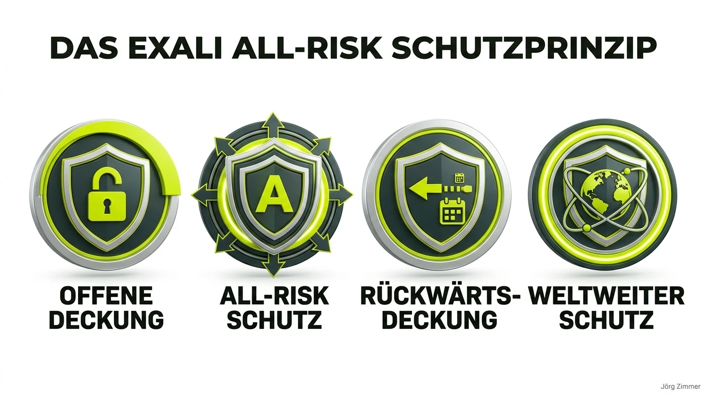

Als freier Dienstleister, Solopreneur oder Agenturinhaber genießt du maximale unternehmerische Freiheit: Du wählst deine Kunden, bestimmst deine Stundensätze und arbeitest ortsunabhängig an Projekten, die dich wirklich begeistern. Doch diese Freiheit hat eine Kehrseite, über die in den Hochglanz-Feeds selten gesprochen wird: **die unbegrenzte persönliche Haftung mit deinem gesamten Privatvermögen**.

Ein einziger unglücklicher Fehler im Projektalltag – ein fehlerhaftes Datenbank-Update, eine übersehene Urheberrechtsverletzung bei Bild- und Schriftrechten, eine versäumte vertragliche Deadline oder eine Falschberatung mit wirtschaftlichen Folgeschäden – kann Schadenersatzforderungen in sechsstelliger Höhe nach sich ziehen. Wenn der Auftraggeber Regressansprüche stellt, steht ohne den richtigen Schutzschirm nicht nur dein Business, sondern deine private Existenz auf dem Spiel.

<figure class="my-8 bg-neutral-50 border border-neutral-200 p-6 md:p-8 rounded-2xl shadow-sm">
  

    
    

      <h4 class="font-bold text-base md:text-lg text-dark mb-0">Jörg Zimmer</h4>
      
Senior SEO & AI Search Consultant

    

  

  <blockquote class="text-base md:text-lg text-dark leading-relaxed italic border-l-4 border-lime-accent pl-4 my-4 font-normal">
    „Wer als Freelancer oder Agenturinhaber ohne solide Berufshaftpflicht arbeitet, spielt russisches Roulette mit seinem Lebenswerk. Ein kleiner Konfigurationsfehler oder eine Abmahnung durch Dritte reicht völlig aus, um dich finanziell an die Wand zu drücken. Eine passgenaue Police ist keine lästige Pflichtausgabe, sondern das professionelle Fundament, auf dem echte unternehmerische Gelassenheit ruht.“
  </blockquote>
  <figcaption class="mt-4 pt-3 border-t border-neutral-200/60 flex flex-wrap items-center justify-between gap-2 text-xs text-neutral-500">
    Experten-Zitat • <cite class="not-italic font-semibold text-neutral-700">Jörg Zimmer</cite>
    <a href="https://www.linkedin.com/in/joerg-zimmer-seo-sea-freelancer-berlin-spandau/" target="_blank" rel="noopener noreferrer" class="font-bold text-lime-700 hover:underline inline-flex items-center gap-1">
      Jörg Zimmer auf LinkedIn folgen →
    </a>
  </figcaption>
</figure>

In diesem umfassenden Leitfaden beleuchten wir die Berufshaftpflichtversicherung für Freiberufler und Selbstständige aus der Praxisperspektive. Wir klären die gravierenden Unterschiede zwischen Berufs-, Betriebs- und Vermögensschadenhaftpflicht, analysieren reale Schadensfälle quer durch IT-, Medien- und Beratungsberufe und nehmen den spezialisierten Anbieter **Exali** mit seinen Tarifen und Erfahrungen unter die Lupe. Außerdem erfährst du, wie du über meine persönliche Partnerschaft einen **exklusiven 10 % Rabattcode** für deine Police erhältst.

---

## 1. Was ist eine Berufshaftpflicht? Grundlagen & Schutzfunktion

Rechtlich gesehen haftest du als Selbstständiger in Deutschland nach § 280 und § 823 des Bürgerlichen Gesetzbuches (BGB) grundsätzlich für alle Schäden, die du einem Dritten im Rahmen deiner beruflichen Tätigkeit schuldhaft zufügst. Und zwar in unbegrenzter Höhe mit deinem gesamten gegenwärtigen und zukünftigen Vermögen – es sei denn, du agierst im Mantel einer haftungsbeschränkten Kapitalgesellschaft wie einer GmbH oder UG (wobei Geschäftsführer bei grober Fahrlässigkeit oder Pflichtverletzungen oft ebenfalls persönlich in die Haftung genommen werden können).

Die **Berufshaftpflichtversicherung** (im Dienstleistungsbereich fachlich präzise als **Vermögensschadenhaftpflicht** bezeichnet) schützt dich genau vor diesem existenziellen Szenario. Sie springt ein, wenn du durch eine berufliche Fehlleistung, eine Unachtsamkeit oder eine Fehlberatung das Vermögen deines Kunden schädigst.

Die Police erfüllt dabei zwei fundamentale Kernfunktionen, die zusammen das Rückgrat deiner Absicherung bilden:

1. **Freistellung von berechtigten Schadenersatzansprüchen:** Stellt sich heraus, dass die Forderung des Kunden juristisch und vertraglich begründet ist, übernimmt der Versicherer die Schadenregulierung bis zur Höhe der vereinbarten Deckungssumme.
2. **Passiver Rechtsschutz (Abwehr unberechtigter Forderungen):** Sehr häufig sind Kundenforderungen überzogen, rechtlich haltlos oder dienen schlicht als Vorwand, um offene Honorarrechnungen nicht begleichen zu müssen. In solchen Fällen fungiert die Berufshaftpflicht wie eine vollwertige Rechtsschutzversicherung: Sie prüft die Rechtslage mit spezialisierten Fachanwälten und wehrt die unberechtigten Ansprüche ab – inklusive der Übernahme sämtlicher Anwalts-, Gutachter- und Gerichtskosten.

Wie wichtig dieser Schutz im modernen Arbeitsalltag ist, zeigt auch ein Blick auf das [Freelancing](/glossar/freelancing/): Immer mehr Auftraggeber fordern im Rahmen von Compliance-Vorgaben vor der Auftragsvergabe einen aktuellen Nachweis über eine bestehende Police. Ein seriöser Versicherungsschutz ist daher längst ein elementares Kriterium für deine [Trustworthiness (E-E-A-T)](/glossar/trustworthiness-eeat/) im Markt.

---

## 2. Der entscheidende Unterschied: Berufshaftpflicht vs. Betriebshaftpflicht vs. Vermögensschadenhaftpflicht

In der Praxis herrscht bei vielen Gründern und Freiberuflern erhebliche Verwirrung über die Begrifflichkeiten. Nicht selten schließen Selbstständige eine vermeintlich günstige „Gewerbehaftpflicht“ ab und wiegen sich in falscher Sicherheit – nur um im Ernstfall festzustellen, dass ihre typischen Berufsrisiken überhaupt nicht gedeckt sind.

| Kriterium | Betriebshaftpflicht (BHV) | Berufshaftpflicht / Vermögensschadenhaftpflicht (VHV) |
| :--- | :--- | :--- |
| **Hauptfokus** | Personen- und Sachschäden | Echte reine Vermögensschäden (finanzielle Verluste) |
| **Klassisches Beispiel** | Kunde stolpert im Büro über ein Netzwerkkabel; Kaffeebecher kippt über Kunden-Laptop | Fehlerhafter Code legt Webshop lahm; Lizenzabmahnung wegen Bildnutzung |
| **Relevanz für Handwerk / Handel** | Sehr hoch (Kernabsicherung) | Eher gering (außer bei speziellen Planungsleistungen) |
| **Relevanz für Digital- & Wissensberufe** | Basisschutz (für Büro & Kundentermine) | **Absolut unverzichtbare Kernpolice** |
| **Typische Schadenshöhe** | Meist überschaubar (Reparatur, Arztkosten) | Häufig fünf- bis sechsstellige Beträge (Umsatzausfall, Regress) |

### Echte Vermögensschäden vs. unechte Vermögensschäden

Um den Versicherungsschutz zu verstehen, muss man zwischen echten und unechten Vermögensschäden unterscheiden:
* **Unechter Vermögensschaden:** Ein finanzieller Schaden, der die *Folge* eines vorausgegangenen Personen- oder Sachschadens ist. *Beispiel:* Du beschädigst bei einem Vor-Ort-Termin den Server deines Kunden physisch (Sachschaden). Durch den Ausfall verliert der Kunde Umsatz (Vermögensfolgeschaden). Dies wird in der Regel über die Betriebshaftpflicht abgewickelt.
* **Echter Vermögensschaden:** Es wird weder eine Person verletzt noch ein physischer Gegenstand beschädigt. Der Schaden besteht rein im Verlust von Geld oder Vermögenswerten. *Beispiel:* Ein Softwareentwickler implementiert einen Logikfehler im Zahlungsmodul, wodurch Bestellungen über das Wochenende nicht abgeschlossen werden können. Es entsteht ein reiner Finanzschaden. **Hier greift ausschließlich die Vermögensschadenhaftpflicht!**

Spezialisierte Policen wie die von **Exali** kombinieren beide Welten intelligent in einem modularen Vertrag: Die Vermögensschadenhaftpflicht bildet den starken Kern, ergänzt um eine Büro- und Betriebshaftpflicht für physische Risiken bei Kundenbesuchen oder im eigenen Office.

---

## 3. Typische Schadensszenarien aus der Freelancer-Praxis

Haftungsrisiken entstehen selten aus böser Absicht. Meist sind es Zeitdruck, unklare Kundenbriefings, technische Inkompatibilitäten oder schlichte menschliche Fehler, die eine Kettenreaktion auslösen. Betrachten wir typische Schadensfälle quer durch verschiedene Berufsgruppen:

### A. IT-Freelancer & Softwareentwickler: Der Bug im Checkout-System

Ein freiberuflicher Full-Stack-Entwickler wird für den Relaunch des Checkout-Funnels eines großen Online-Händlers engagiert. Beim Deployment am Donnerstagabend übersieht er eine Inkompatibilität in der Schnittstelle zum Payment-Gateway. Am umsatzstärksten Wochenende des Monats schlagen 70 % aller Zahlungsversuche fehl. 

Der Schaden: 85.000 Euro entgangener Gewinn sowie 12.000 Euro Kosten für eine externe Notfall-Agentur zur Fehlerbehebung. Der Kunde stellt den Entwickler vollumfänglich in Regress. Ohne eine spezialisierte IT-Haftpflicht droht dem Freelancer der Privatkonkurs.

### B. Designer & Content Creator: Die 40.000-Euro-Lizenzfalle

Eine freiberufliche Grafikdesignerin gestaltet das Corporate Design und die Werbematerialien für ein mittelständisches Unternehmen. Für die Kampagne lizenziert sie Bildmaterial über eine gängige Stock-Plattform. Was sie im Kleingedruckten der Lizenzbedingungen übersieht: Die Standard-Lizenz deckt lediglich eine Auflage von 5.000 Print-Exemplaren ab. 

Der Kunde druckt 200.000 Flyer und schaltet großflächige Plakatwerbung. Die Bildagentur mahnt das Unternehmen wegen unberechtigter Mehrfachnutzung ab und verlangt Schadenersatz sowie Lizenznachzahlungen von 42.000 Euro. Der Kunde reicht die Forderung 1:1 an die Designerin weiter.

### C. Unternehmensberater & Coaches: Falsche ROI-Kalkulation

Ein freier Management-Consultant berät einen Kunden bei der Umstrukturierung von Logistikprozessen. In der Wirtschaftlichkeitsberechnung unterläuft ihm ein gravierender Rechenfehler in der Tabellenkalkulation: Personalkosten und Frachtraten werden doppelt abgezogen, wodurch sich die prognostizierte Einsparung als rechnerische Luftnummer erweist. Der Kunde investiert auf Basis der Falschberatung 120.000 Euro in neue Lagertechnik, die sich nicht amortisiert, und fordert Schadenersatz.

### D. Das neue Megarisiko: KI-Haftung und Urheberrecht 2026

Im Zeitalter generativer KI nutzen immer mehr freie Experten KI-Tools für Code, Texte, Konzepte und Bildgenerierung. Doch wer haftet, wenn ein KI-Modell geschützten Code Dritter reproduziert, halluzinierte Fakten in Fachartikeln Markenrechte verletzen oder vertrauliche Kundendaten unbemerkt in Trainingsdaten öffentlicher LLMs abfließen? Ältere Standardverträge schließen Schäden durch automatisierte Algorithmen oder geistiges Eigentum oft klauselweise aus. Moderne Policen müssen diese digitale Realität explizit auffangen.

---

## 4. Für welche Berufsgruppen ist die Berufshaftpflicht unverzichtbar?

Nicht jeder Selbstständige trägt das gleiche Haftungsrisiko. Während ein Handwerker primär Personen- und Sachschäden auf der Baustelle absichern muss, entstehen in modernen Wissens- und Dienstleistungsberufen Schäden fast ausnahmslos auf der rein finanziellen Ebene. In der Praxis lassen sich vor allem vier Kernbereiche identifizieren, in denen eine Berufshaftpflicht (Vermögensschadenhaftpflicht) zur absoluten Pflichtausstattung gehört:

### A. IT-Freelancer, Softwareentwickler & Tech-Consultants
In kaum einer anderen Branche sind die potenziellen Schadenssummen so unberechenbar wie im IT-Bereich. Ein unbemerktes Sicherheitsleck in einer Schnittstelle (API), ein fehlerhaftes Skript bei der Datenbankmigration, das Kundendaten überschreibt, oder ein unerwarteter Ausfall von Cloud-Infrastrukturen über das Wochenende können bei Unternehmen schnell existenzbedrohende Umsatzausfälle nach sich ziehen. Professionelle Auftraggeber im IT-Umfeld verlangen deshalb vor Projektbeginn fast ausnahmslos den Nachweis einer spezialisierten IT-Haftpflicht mit mindestens 500.000 bis 1.000.000 Euro Deckungssumme.

### B. Designer, Texter, Content Creator & Media-Agenturen
In der Medien- und Kreativwirtschaft lauern die größten Risiken im Urheber-, Marken- und Wettbewerbsrecht. Ob eine unzureichend lizenzierte Schriftart auf einer reichweitenstarken Website, die Verwendung von Bildmaterial ohne korrekten Urhebernachweis, eine wettbewerbswidrige Werbeaussage oder ein teurer Tippfehler auf einer 100.000er-Druckauflage: Abmahnungen und Schadenersatzforderungen schlagen hier schnell mit fünfstelligen Summen zu Buche. Eine Media-Haftpflicht schützt Freiberufler vor dem finanziellen Ruin, wenn Kunden berechtigte oder unberechtigte Regressansprüche stellen.

### C. Unternehmensberater, Strategen & Business Coaches
Wer Unternehmen betriebswirtschaftlich oder strategisch berät, übernimmt direkte Mitverantwortung für unternehmerische Weichenstellungen. Wenn eine Markt- oder Standortanalyse gravierende Rechenfehler aufweist, falsche Prognosen in einen Businessplan einfließen oder compliance-relevante Fristen versäumt werden, macht der Kunde den Berater für den finanziellen Misserfolg haftbar. Die Consulting-Haftpflicht fängt echte Beratungsfehler verlässlich auf und schützt vor langwierigen Gerichtsprozessen.

### D. Kleinunternehmer, Solopreneure & Gründer
Gerade in der Anfangsphase der Selbstständigkeit fehlt vielen Gründern das finanzielle Polster, um Rechtsstreitigkeiten aus eigener Tasche durchzustehen. Hinzu kommt: Wer ohne haftungsbeschränkte Kapitalgesellschaft (z. B. als Einzelunternehmer oder GbR) startet, haftet unbegrenzt mit seinem gesamten privaten Vermögen. Eine maßgeschneiderte Berufshaftpflichtversicherung ist für Kleinunternehmer das wirksamste Sicherheitsnetz, um auch bei unerwarteten Projektturbulenzen handlungsfähig zu bleiben.

---

## 5. Exali im Härtetest: Meine Erfahrungen & Alleinstellungsmerkmale

Auf dem deutschen Markt für gewerbliche Versicherungen gibt es unzählige Anbieter – von traditionellen Allbranchen-Konzernen bis hin zu modernen InsurTech-Startups. Seit vielen Jahren gilt der in Augsburg ansässige Spezialmakler **Exali** als Referenz für die Digital- und Kreativwirtschaft. Doch was macht Exali in der Praxis so besonders?

### A. Das Prinzip der offenen Berufsbilddeckung

Klassische Versicherer arbeiten meist mit sogenannten „Positivlisten“ oder starren Tätigkeitsbeschreibungen. Wenn du dort als „Webdesigner“ versichert bist, aber im nächsten Kundenprojekt plötzlich eine Datenbank migrierst, Tracking-Systeme aufsetzt oder KI-Agenten konfigurierst, erlischt im Schadensfall möglicherweise der Versicherungsschutz wegen „Gefahrenerhöhung“ oder nicht gemeldeter Tätigkeiten.

Exali verfolgt das Prinzip der **offenen Berufsbilddeckung**: Alle Tätigkeiten, die typischerweise in den Bereich deiner Branche fallen, sind automatisch und ohne Nachmeldepflicht mitversichert. Entwickelt sich dein Portfolio dynamisch weiter, wächst der Schutzschirm nahtlos mit.

### B. Echter All-Risk-Schutz

Die Policen sind nach dem All-Risk-Prinzip aufgebaut. Das bedeutet: Grundsätzlich ist **alles versichert**, was nicht in den Versicherungsbedingungen ausdrücklich und namentlich ausgeschlossen wurde. Die Beweislast kehrt sich damit um: Im Streitfall muss der Versicherer nachweisen, dass ein Ausschlussgrund vorliegt – nicht du musst beweisen, dass dein spezieller Einzelfall gedeckt ist.

### C. Die wichtigsten Spezial-Policen im Überblick

Exali bietet maßgeschneiderte Deckungskonzepte für die wesentlichen Dienstleistungsbranchen:

1. **Media-Haftpflicht:** Der Goldstandard für Agenturen, Grafikdesigner, Texter, Social-Media-Manager, Creator und Content-Spezialisten. Besonderer Fokus auf Urheberrechtsverletzungen, DSGVO-Abmahnungen, Markenrechtsstreitigkeiten, Druck- und Reprofehler sowie Verzugsschäden.
2. **IT-Haftpflicht:** Entwickelt für Softwareentwickler, DevOps, Systemadministratoren, SaaS-Anbieter und IT-Consultants. Deckt Programmierfehler, Datenverlust, Ausfallzeiten (Downtime), Cyber-Drittschäden und Verstöße gegen Service Level Agreements (SLAs) ab.
3. **Consulting-Haftpflicht:** Perfekt abgestimmt auf Unternehmensberater, Personalberater, Coaches und Trainer. Schützt bei Falschberatung, fehlerhaften ROI-Berechnungen, Fristversäumnissen und Organisationsfehlern.
4. **Architekten- & Ingenieur-Haftpflicht:** Spezialschutz für planende und bauüberwachende Berufe bei Bauverzögerungen, Planungsfehlern und Kostenüberschreitungen.

### D. Wertvolle Zusatzbausteine für maximale Sicherheit

* **Rücktritt des Auftraggebers vom Projektvertrag (Return of Project Costs):** Bricht ein Kunde ein laufendes Projekt wegen eines Mangels ab und fordert bereits gezahlte Vergütungen zurück oder verweigert das Resthonorar, reguliert Exali unter bestimmten Voraussetzungen diesen Eigenschaden.
* **Verzugsschaden-Deckung:** Wenn sich ein Projekt nachweislich durch deine Schuld verzögert und dem Kunden dadurch nachweisbare Mehrkosten entstehen, greift die Police.
* **Weltweiter Schutz:** Exali versichert Projekte weltweit – inklusive Deckung für Kunden in den USA und Kanada (was bei vielen Standard-Versicherern strikt ausgeschlossen ist oder astronomische Zusatzbeiträge kostet).
* **Rückwärtsdeckung:** Schäden, die du vor Vertragsbeginn unbemerkt verursacht hast, die dir aber erst nach Abschluss der Police bekannt werden, sind rückwirkend mitversichert.

---

## 6. Exali-Kosten, Tarife & Sparpotenziale

Wie viel kostet professioneller Versicherungsschutz? Die Prämie berechnet sich bei Exali transparent auf Basis deines **Jahresumsatzes**, der gewählten **Deckungssumme** und der Branche.

Für einen typischen IT- oder Medien-Freiberufler mit einem Jahresumsatz bis 50.000 Euro und einer soliden Deckungssumme von 250.000 Euro für Vermögensschäden beginnt der Jahresbeitrag oft schon bei ca. **240 bis 320 Euro netto pro Jahr** (also rund 20 bis 27 Euro im Monat). Gemessen am existenzbedrohenden Risiko ein verschwindend geringer Betrag, der zudem steuerlich voll als Betriebsausgabe absetzbar ist!

### Die 3 Rabattstufen clever kombinieren:

1. **Existenzgründerrabatt (15 %):** Wer seine selbstständige Tätigkeit innerhalb der letzten 12 Monate gestartet hat, erhält bei Exali einen Nachlass von 15 % auf die Versicherungsprämie in den ersten zwei Versicherungsjahren.
2. **Laufzeitrabatt (10 %):** Wenn du dich direkt für einen 3-Jahres-Vertrag entscheidest (der bei Aufgabe der Selbstständigkeit übrigens vorzeitig gekündigt werden kann), sparst du dauerhaft weitere 10 % pro Jahr.
3. **Exklusiver Kooperationsvorteil (10 % Partnervorteil über Jörg Zimmer):** Über meine Partnerschaft mit Exali profitierst du von einem zusätzlichen Rabatt von 10 %.

> [!TIP]
> **Maximale Ersparnis:** Der Existenzgründerrabatt (15 %), der Laufzeitrabatt (10 %) und mein persönlicher Partnervorteil (10 %) lassen sich im Antragsformular **kombinieren**! Damit sparst du als Gründer im ersten Jahr über ein Drittel deiner regulären Versicherungsbeiträge.

  <h3 class="text-xl md:text-2xl font-bold text-white mb-3 !mt-0 !border-none !pb-0">
    Exklusiven 10 % Exali-Rabattcode sichern
  </h3>
  

    Als offizieller Kooperationspartner von Exali stelle ich meiner Community einen exklusiven 10 % Gutscheincode zur Verfügung. Um Missbrauch durch automatische Gutscheinportale zu verhindern, vergebe ich den Code ausschließlich persönlich. Schreib mir einfach eine kurze Direktnachricht auf LinkedIn mit dem Stichwort <strong>„Exali 10“</strong> – ich schicke dir deinen persönlichen Aktivierungscode umgehend zu!
  

  

    <a href="https://www.linkedin.com/in/joerg-zimmer-seo-sea-freelancer-berlin-spandau/" target="_blank" rel="noopener noreferrer" class="btn-primary">
      <svg class="w-4 h-4 fill-current" viewBox="0 0 24 24"><path d="M20.447 20.452h-3.554v-5.569c0-1.328-.027-3.037-1.852-3.037-1.853 0-2.136 1.445-2.136 2.939v5.667H9.351V9h3.414v1.561h.046c.477-.9 1.637-1.85 3.37-1.85 3.601 0 4.267 2.37 4.267 5.455v6.286zM5.337 7.433c-1.144 0-2.063-.926-2.063-2.065 0-1.138.92-2.063 2.063-2.063 1.14 0 2.064.925 2.064 2.063 0 1.139-.925 2.065-2.064 2.065zm1.782 13.019H3.555V9h3.564v11.452zM22.225 0H1.771C.792 0 0 .774 0 1.729v20.542C0 23.227.792 24 1.771 24h20.451C23.2 24 24 23.227 24 22.271V1.729C24 .774 23.2 0 22.222 0h.003z"/></svg>
      Jetzt Code per LinkedIn-Nachricht anfordern
      →
    </a>
    <a href="https://www.exali.de/" target="_blank" rel="noopener noreferrer" class="inline-flex items-center gap-2 px-6 py-3 rounded-full text-white font-semibold text-sm border border-white/20 hover:bg-white/10 transition-colors">
      Direkt zu Exali & Tarif berechnen
      ↗
    </a>
  

---

## 7. Großer Marktvergleich: Exali vs. Hiscox vs. Markel vs. Traditionelle Versicherer

Wer eine Berufshaftpflichtversicherung abschließen will, stößt im Wettbewerb unweigerlich auf Namen wie **Hiscox**, **Markel** oder klassische deutsche Versicherungskonzerne wie Allianz, Ergo und VHV. Wie schneiden die Anbieter im direkten Vergleich ab?

| Bewertungskriterium | Exali | Hiscox | Markel | Klassische Konzerne (Allianz etc.) |
| :--- | :--- | :--- | :--- | :--- |
| **Deckungsphilosophie** | Offene Berufsbilddeckung (All-Risk) | Weitgehend offen, aber teils engere Klauseln | Spezialisierte Bausteine | Oft starre Positivlisten |
| **Digitale Schadenfälle** | Hervorragend (Urheberrecht, DSGVO, IT-Bugs) | Sehr gut | Gut | Oft mangelhaft oder teure Zusatzklauseln |
| **Online-Abschluss & Rechner** | In 5 Minuten komplett online | Online möglich | Online möglich | Häufig persönlicher Maklerbesuch nötig |
| **USA/Kanada-Deckung** | Standardmäßig wählbar | Mit Aufpreis möglich | Auf Anfrage | Meist kategorisch ausgeschlossen |
| **Rücktritt des Auftraggebers** | Optional voll versicherbar | Nur eingeschränkt | Je nach Tarif | In der Regel nicht versicherbar |
| **Service & Schadenabwicklung** | Spezialisierte Inhouse-Juristen, kein Callcenter | Internationaler Großkonzern | Solider Makler-Support | Zähe Mühlen großer Sachbearbeiter-Apparate |

### Warum Exali im Direktvergleich oft gewinnt

1. **Gegenüber Hiscox:** Hiscox ist ein renommierter internationaler Spezialversicherer. Bei Exali punkten viele Freelancer jedoch mit dem noch schlankeren, transparenteren Online-Antrag und dem persönlichen, deutschsprachigen Inhouse-Support ohne Warteschleifen.
2. **Gegenüber Markel:** Markel bietet hervorragende Grundtarife, verlangt bei speziellen digitalen Zusatzrisiken oder Projektvertrags-Rücktritten aber oft individuelle Risikoprüfungen, die bei Exali direkt online konfiguriert werden können.
3. **Gegenüber traditionellen Versicherern:** Klassische Allbranchen-Versicherer sind im KFZ- oder Gebäude-Bereich stark. Im Bereich digitaler Vermögensschäden, Urheberrechtsabmahnungen oder SaaS-Ausfällen fehlen den Sachbearbeitern schlichtweg das Branchenverständnis und die passenden Vertragsklauseln.

---

## 8. Checkliste: Worauf Freiberufler vor dem Abschluss achten müssen

Bevor du deine Berufshaftpflichtversicherung online abschließt, solltest du deine individuellen Risiken genau analysieren. Nutze die folgende Checkliste:

* [ ] **Angemessene Deckungssumme gewählt?** Mindestens 250.000 Euro für Solo-Kreative und Berater, mindestens 500.000 bis 1.000.000 Euro für IT-Dienstleister und Softwareentwickler.
* [ ] **Offene Berufsbilddeckung vorhanden?** Stellt der Vertrag sicher, dass auch künftige oder projektbezogene Nebentätigkeiten automatisch versichert sind?
* [ ] **Passiver Rechtsschutz integriert?** Übernimmt die Versicherung im Streitfall nachweislich Anwalts- und Gerichtskosten zur Abwehr unberechtigter Ansprüche?
* [ ] **Rückwärtsdeckung vereinbart?** Sind unentdeckte Fehler aus der Vergangenheit, die erst während der Vertragslaufzeit beanstandet werden, abgesichert?
* [ ] **Geografischer Geltungsbereich geprüft?** Hast du Kunden in Österreich, der Schweiz, im EU-Ausland oder in den USA/Kanada? Prüfe die weltweite Gültigkeit.
* [ ] **Subunternehmer & Freie Mitarbeiter mitversichert?** Wenn du im Rahmen deines [Freelancer Teams](/freelancer-team/) andere Selbstständige für Teilaufgaben beauftragst: Deckt deine Police Fehler von Erfüllungsgehilfen ab?
* [ ] **Verzugsschaden-Klausel geprüft?** Bist du abgesichert, wenn ein Projekt durch unvorhersehbare Umstände nicht rechtzeitig fertig wird?
* [ ] **Selbstbeteiligung realistisch gewählt?** Eine moderate Selbstbeteiligung (z. B. 250 bis 500 Euro) senkt die Jahresprämie spürbar, ohne im Ernstfall wehzutun.

---

## 9. Häufige Fragen zur Berufshaftpflicht (FAQ)

### Kann ich die Kosten für die Berufshaftpflicht von der Steuer absetzen?
Ja, zu 100 %. Die Beiträge für eine gewerbliche Berufshaftpflicht- und Vermögensschadenhaftpflichtversicherung gelten steuerlich als reine Betriebsausgaben. Sie mindern deinen steuerpflichtigen Gewinn vollumfänglich und senken damit direkt deine Einkommensteuer- und Gewerbesteuerlast.

### Was passiert, wenn ich als Freelancer ein Projekt im Team umsetze?
Wenn du mit anderen freien Spezialisten im Rahmen von Kooperationen oder Netzwerkstrukturen wie einem [Freelancer Team](/freelancer-team/) zusammenarbeitest, kommt es auf die vertragliche Konstellation an. Trittst du als Hauptauftragnehmer auf und beauftragst Subunternehmer, haftest du dem Endkunden gegenüber für deren Fehler. Bei Exali sind Subunternehmer und freie Mitarbeiter im Rahmen der Deckungssumme als Erfüllungsgehilfen automatisch mitversichert. Dennoch sollte jeder freie Partner im Team zwingend über eine eigene Police verfügen.

### Wann greift die Nachhaftung nach Beendigung der Selbstständigkeit?
Fehler im Projektalltag werden oft erst Monate oder Jahre nach Projektabschluss entdeckt. Wenn du deine selbstständige Tätigkeit beendest, in den Ruhestand gehst oder in eine Festanstellung wechselst, benötigst du eine Nachhaftungsversicherung (Ruhestandsdeckung). Seriöse Policen wie die von Exali bieten eine mehrjährige, teils unbegrenzte Nachhaftungsfrist für Schäden, die während der Vertragslaufzeit verursacht wurden.

### Wie unterscheidet sich eine reine Rechtsschutzversicherung von der Berufshaftpflicht?
Eine gewerbliche Rechtsschutzversicherung übernimmt die Kosten, wenn **du** aktiv gegen Dritte klagen willst (z. B. um unbezahlte Honorarrechnungen einzutreiben oder Streitigkeiten mit dem Vermieter des Büros auszufechten). Sie zahlt jedoch **keinen einzigen Cent Schadenersatz**, wenn ein Kunde dich verklagt. Die Berufshaftpflicht hingegen reguliert den Schadenersatz und wehrt unberechtigte Ansprüche Dritter ab (passiver Rechtsschutz). Beide Policen ergänzen sich ideal, ersetzen sich aber keinesfalls gegenseitig.

---

## 10. Zusammenfassung & Berliner Klartext

Wer sich als Freelancer, Berater oder Agenturinhaber am Markt durchsetzen will, braucht exzellente fachliche Fähigkeiten, ein scharfes Profil und das Vertrauen seiner Kunden. Doch all diese Erfolge stehen auf tönernen Füßen, wenn das Fundament ungeschützt bleibt. Ein einziger fataler Projektfehler oder eine aggressive Abmahnung kann dich ohne Versicherungsschutz ruinieren.

Eine spezialisierte Berufshaftpflichtversicherung – wie die maßgeschneiderten Konzepte von **Exali** mit offener Berufsbilddeckung und All-Risk-Prinzip – ist der unverzichtbare Sicherheitsgurt für deine unternehmerische Reise. Sie gibt dir die Ruhe und Freiheit zurück, dich voll auf das zu konzentrieren, was du am besten kannst: herausragende Arbeit für deine Kunden abzuliefern.

Nutze die Gelegenheit, berechne deine individuelle Prämie und sichere dir über meine persönliche Partnerschaft den **exklusiven 10 % Rabattcode**. Schreib mir einfach kurz auf LinkedIn – ich freue mich auf den Austausch mit dir!

  <h3 class="text-xl md:text-2xl font-bold text-white mb-3 !mt-0 !border-none !pb-0">
    Jetzt an der Diskussion teilnehmen
  </h3>
  

    Welche Erfahrungen hast du mit Haftungsrisiken im Freelancer-Alltag gemacht? Diskutiere mit Jörg Zimmer und der Community auf LinkedIn.
  

  <a href="https://www.linkedin.com/in/joerg-zimmer-seo-sea-freelancer-berlin-spandau/" target="_blank" rel="noopener noreferrer" class="btn-primary">
    <svg class="w-4 h-4 fill-current" viewBox="0 0 24 24"><path d="M20.447 20.452h-3.554v-5.569c0-1.328-.027-3.037-1.852-3.037-1.853 0-2.136 1.445-2.136 2.939v5.667H9.351V9h3.414v1.561h.046c.477-.9 1.637-1.85 3.37-1.85 3.601 0 4.267 2.37 4.267 5.455v6.286zM5.337 7.433c-1.144 0-2.063-.926-2.063-2.065 0-1.138.92-2.063 2.063-2.063 1.14 0 2.064.925 2.064 2.063 0 1.139-.925 2.065-2.064 2.065zm1.782 13.019H3.555V9h3.564v11.452zM22.225 0H1.771C.792 0 0 .774 0 1.729v20.542C0 23.227.792 24 1.771 24h20.451C23.2 24 24 23.227 24 22.271V1.729C24 .774 23.2 0 22.222 0h.003z"/></svg>
    Beitrag auf LinkedIn öffnen
    →
  </a>

### Verwandte Glossar-Begriffe & Ressourcen
* [Freelancing: Bedeutung, Vorteile & Fakten für Solopreneure](/glossar/freelancing/)
* [SEO-Freelancer in Berlin: Fachexpertise auf Senior-Niveau](/seo-freelancer-berlin/)
* [Das Freelancer Team: Kollektive Stärke freier Experten](/freelancer-team/)
* [Trustworthiness (E-E-A-T): Vertrauensbasis für Dienstleister](/glossar/trustworthiness-eeat/)
* [E-E-A-T im Überblick: Die Qualitätsmaßstäbe moderner Websites](/glossar/e-e-a-t/)
* [SEO-Beratung: Professionelle Begleitung für nachhaltiges Wachstum](/glossar/seo-beratung/)
* [SEO-Agentur: Zusammenarbeit, Qualitätskriterien & Haftungsfragen](/glossar/seo-agentur/)
* [SE Ranking: Das All-in-One SEO Tool im Praxiseinsatz](/glossar/se-ranking/)
* [SEO-Tool-Kostenrechner: Toolbudgets transparent kalkulieren](/tools/seo-tool-kostenrechner/)
