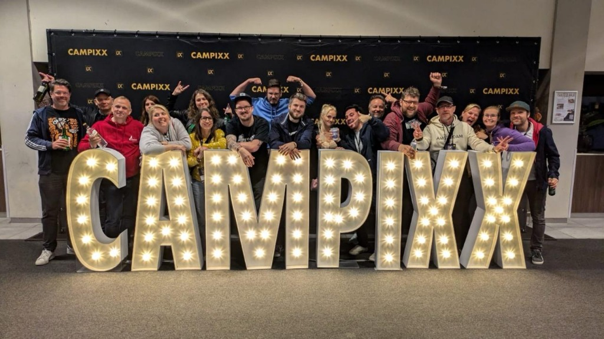

## Die Magie des Barcamp-Formats

*Die Berliner SEO Szene vereint auf der Campixx.*

Auf der Campixx gibt es keinen festen "Star-Sprecher-Plan", der von oben diktiert wird. Abends oder morgens wird abgestimmt: Wer hat welches Thema? Wer will was wissen? Das sorgt für eine extreme Relevanz und Aktualität, die starre Konferenzen nie erreichen können.

Ich erinnere mich an Sessions, in denen wir stundenlang über kleinste Details von [strukturierten Daten](/glossar/strukturierte-daten/) oder die Auswirkungen von [Google Core Updates](/glossar/google-core-update/) auf Nischenseiten debattiert haben. Das ist Wissen, das du in keinem Webinar der Welt findest.

### Warum das Format so überlegen ist:
1.  **Iterative Themen:** Ein Thema wird morgens angerissen und nachmittags in einer spontanen Fortsetzungs-Session vertieft.
2.  **Keine Tabus:** Hier wird offen über Google-Strafen, misslungene Relaunches und technische Albträume gesprochen.
3.  **Cross-Disziplinär:** Du sitzt neben einem Programmierer, einem Texter und einem Chief Marketing Officer – alle auf Augenhöhe.

## Warum ich dort bin

Als [SEO-Freelancer](/seo-freelancer-berlin/) ist man oft Einzelkämpfer. Die Campixx ist der Ort, an dem man merkt: Wir sind viele. Und wir haben alle die gleichen Herausforderungen mit den immer schlauer werdenden [Crawlern](/glossar/crawler/) und den neuen [KI-Suchmechanismen (GEO)](/glossar/geo/).

Ich nutze die Zeit im Hotel intensiv, um meine eigene [Grounding-Page](/glossar/grounding-page/) Strategie zu challengen. Was sagen andere Experten dazu? Wo liegen die Schwachstellen? Diese "Schwarmintelligenz" macht meine Beratung für meine Kunden am Ende so stabil und zukunftssicher. 

Dafür steht mein Name – handwerkliche Präzision, geschmiedet im Feuer der Community.

  <h4 class="text-xl font-bold text-dark mb-2 mt-0">Campixx-Tipp</h4>
  
Geh nicht nur in die großen Sessions. Die kleinen, fast privaten Runden auf dem Flur oder an der Hotelbar sind oft die, in denen die echten 'Hacks' geteilt werden. Sei mutig, stell Fragen und teile selbst dein Wissen.

## SEO 2026: Campixx-Spirit für dein Projekt

In einer Welt, in der KI-Content massenhaft produziert wird, wird die individuelle "Experience" ([E-E-A-T](/glossar/e-e-a-t/)) zum wichtigsten Rankingfaktor. Die Campixx ist die Verkörperung dieses Faktors. Echte Menschen, echtes Wissen, echte Tests.

Wenn ich von der Campixx zurückkomme, fließen diese neuen Erkenntnisse über [Entity SEO](/glossar/entity-seo/) oder [Local SEO](/glossar/local-seo/) Trends direkt in die Strategien meiner Kunden ein. Wer nicht auf der Campixx war, hat oft den Anschluss an das verloren, was *wirklich* gerade in den Köpfen der Top-SEOs vorgeht.

## Dein nächster Schritt

Absolut. Ja, es kostet Geld und Zeit. Aber der ROI (Return on Invest) ist unschlagbar. Ein Wochenende im Van der Valk Hotel ist wie ein halbes Jahr SEO-Fortbildung im Zeitraffer. Es schärft den Blick für das Wesentliche und sortiert den Bullshit aus.

ALOHA ✌️

---

  <h3 class="text-2xl font-bold mb-4">Campixx-Wissen für dich nutzen?</h3>
  
Ich bringe die neuesten Trends vom Van der Valk Hotel direkt in dein Projekt. Lass uns in einem Audit schauen, wie wir deine Seite auf das nächste Level heben.

  <a href="/seo-freelancer-berlin/" class="btn-primary inline-flex">Projekt-Check anfragen →</a>

* **Lese-Tipp:** [Der SEO Stammtisch Berlin](/glossar/seo-stammtisch-berlin/)
* **Lese-Tipp:** [Was ist eigentlich GEO?](/glossar/geo/)
