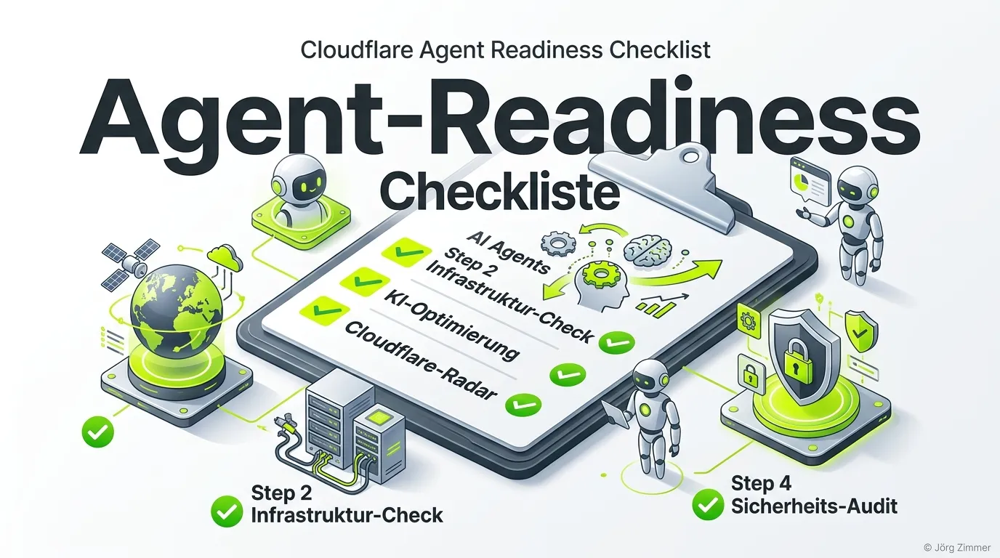

Moin! 🌻

Hast du deine Domain schon mal durch das **Cloudflare Radar** (speziell den Agent Readiness Scanner) gejagt? Wenn dort rote Kreuze aufleuchten, ist deine Website für die neue Ära der autonomen KI-Agenten verschlossen.

Die **Cloudflare Agent Readiness Checklist** ist quasi der TÜV für deine [KI-Sichtbarkeit](/glossar/ki-sichtbarkeit-messen-optimieren/). Hier erfährst du, was die einzelnen Prüfpunkte bedeuten und wie du sie grün bekommst.

## 1. Protocol Discovery (Protokoll-Erkennung)

Agenten müssen wissen, was sie auf deiner Seite dürfen und wie sie sich ausweisen können.

- **API Catalog:** Eine maschinenlesbare Übersicht deiner verfügbaren APIs. Mehr dazu unter [API Catalog](/glossar/api-catalog/).
- **OAuth/OIDC Discovery:** Der Wegweiser für Agenten, um Tokens und Scopes abzufragen. ([OAuth/OIDC Discovery](/glossar/oauth-oidc-discovery/))
- **OAuth Protected Resource:** Definiert Endpunkte, die eine Authentifizierung erfordern. ([OAuth Protected Resource](/glossar/oauth-protected-resource/))
- **MCP Server Card:** Die JSON-Metadaten deines [Model Context Protocol](/glossar/model-context-protocol-mcp/) Servers. ([MCP Server Card](/glossar/mcp-server-card/))
- **A2A Agent Card:** Die Identitätskarte deines eigenen Agenten für die Agent-to-Agent Kommunikation. ([A2A Protocol](/glossar/a2a-protocol/))
- **Agent Skills:** Ein Index der Fähigkeiten und Tools, die ein Agent auf deiner Plattform ausführen kann. ([Agent Skills](/glossar/agent-skills/))
- **WebMCP:** Die HTTP-Integration des MCP-Standards für Cloud-APIs. ([WebMCP](/glossar/webmcp/))
- **Auth.md:** Die Registrierungs-Anleitung (sowohl für Menschen als auch Agenten). ([Auth.md](/glossar/auth-md/))

## 2. Discoverability (Auffindbarkeit)

Wie finden Crawler und Agenten überhaupt den Weg zu deinen tiefen Inhalten?

- **robots.txt:** Der Klassiker. Regelt grundlegend, welche (KI-)Crawler deine Seite scannen dürfen. ([robots.txt](/glossar/robots-txt/))
- **Sitemap:** Die XML-Landkarte deiner URLs. ([XML Sitemap](/glossar/xml-sitemap/))
- **Link Headers:** RFC 8288 konforme HTTP-Header, die Agenten via API-Call direkt zur `auth.md` oder API-Doku leiten. ([Link Headers](/glossar/rfc-8288-link-headers/))
- **DNS for AI Discovery (DNS-AID):** Das globale "Telefonbuch" für Agenten, das komplett über DNS-TXT Records funktioniert. ([DNS-AID](/glossar/dns-aid/))

## 3. Content Accessibility (Zugänglichkeit)

Agenten verabscheuen aufgeblähtes HTML und unstrukturierte Daten.

- **Markdown Negotiation:** Die Kunst, dem Agenten per HTTP-Request direkt sauberes, pures Markdown statt HTML auszuliefern. ([Markdown Content Negotiation](/glossar/markdown-content-negotiation/))

## 4. Bot Access Control (Zugriffskontrolle)

Lass die guten Agenten rein und blockiere die bösartigen Scraper.

- **AI Crawler Rules:** Präzise Regeln in der robots.txt oder der dedizierten [ai.txt](/glossar/ai-txt/).
- **Content Signals:** Signale im Header oder HTML, die dem Crawler die Relevanz oder den Status des Inhalts flüstern. ([Content Signals](/glossar/content-signals/))
- **Web Bot Auth:** Identifikation legitimer Agenten über Reverse DNS, Tokens oder Zertifikate. ([Web Bot Auth](/glossar/web-bot-auth/))

## 5. Commerce (Transaktionen & Agenten-Wirtschaft)

Der Königsweg: Wenn Agenten auf deiner Seite im Auftrag des Nutzers einkaufen oder verhandeln.

- **x402 Protocol:** Standard für automatisierte Vertragsabschlüsse und Datenaustausch. ([x402 Protocol](/glossar/x402-protocol/))
- **Machine Payment Protocol (MPP):** Ermöglicht Mikrozahlungen zwischen Maschinen. ([MPP](/glossar/machine-payment-protocol-mpp/))
- **Universal Commerce Protocol (UCP):** Ein übergeordneter Standard für agentengetriebenen E-Commerce. ([UCP](/glossar/universal-commerce-protocol-ucp/))
- **Agentic Commerce Protocol (ACP):** Spezifisches Framework für autonome B2B- und B2C-Verhandlungen. ([ACP](/glossar/agentic-commerce-protocol-acp/))
- **Agent Payments Protocol (AP2):** Ein offenes Netzwerkprotokoll zur Abwicklung von Wallet-basierten Transaktionen. ([AP2](/glossar/agent-payments-protocol-ap2/))

## Fazit? Nennen wir es Tacheles

Die Liste sieht auf den ersten Blick überwältigend aus. Aber das ist exakt der Burggraben, den du dir jetzt bauen kannst! Wer diese Checkliste abarbeitet und seine Seite für Agenten öffnet, während die Konkurrenz noch über Meta-Keywords diskutiert, hat den [Agent Readiness](/glossar/agent-readiness/) Krieg bereits gewonnen.

Geh die Checkliste Punkt für Punkt durch, lies dir die Detail-Artikel in unserem Glossar durch und fang an, die Schnittstellen zu implementieren.

ALOHA! 🌻✌️
