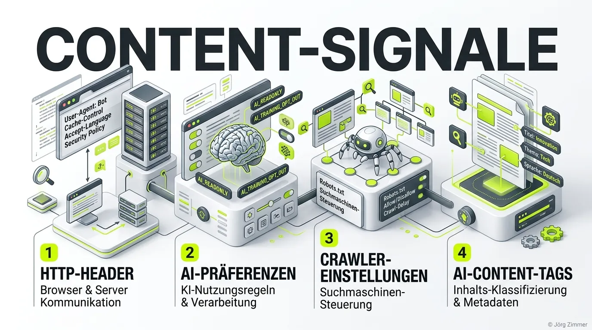

Moin! 🌻

Wenn du heute noch glaubst, eine simple Wildcard in der `robots.txt` würde ausreichen, um deine Website vor dem Hunger der KI-Modelle zu schützen, dann hast du den Schuss von 2026 nicht gehört. Früher haben wir einfach einen `User-agent: *` gesetzt und gehofft, dass die Welt draußen bleibt. Das war schon damals oft Pfusch am Bau. Heute ist es geschäftsschädigend. 

Willkommen in der Ära der **Content-Signale**.

## Content-Signale: Der neue Türsteher für KI

KI-Bots sind nicht gleich KI-Bots. Google-Extended crawlt für Trainingszwecke, andere Bots suchen nach Echtzeit-Antworten (RAG) für die nächste Suchanfrage. Wer hier mit dem Holzhammer arbeitet und alles blockt, sperrt auch den Traffic aus, der eigentlich den Umsatz treiben soll.

Content-Signale sind standardisierte Direktiven, mit denen wir granulare KI-Präferenzen definieren. Anstatt blind zu blockieren, diktieren wir die Spielregeln. Das Framework sieht mittlerweile so aus:

- `search=yes/no`: Darf der Bot einen klassischen Suchindex aufbauen?
- `ai-train=yes/no`: Darf mein Content genutzt werden, um das nächste LLM zu füttern? (Meistens: Hell no!)
- `ai-input=yes/no`: Darf der Inhalt für Echtzeit-Antworten (RAG) zitiert werden?
- `use=immediate/reference/full`: Der neue Goldstandard, um den Verwendungszweck punktgenau zu steuern.

> [!IMPORTANT]  
> Wer nicht differenziert, verliert. Blockierst du den falschen Bot, verschwindest du aus den zitierten KI-Antworten. Das ist keine SEO-Strategie, das ist geschäftlicher Selbstmord.

💬 **Jörgs SEO-Klartext (LinkedIn Insights)**  
*KI-Strategie ist Chefsache, keine Aufgabe für den Praktikanten am Freitagnachmittag. Wer seine Daten gratis zum Training hergibt, arbeitet aktiv an der eigenen Obsoleszenz. Die einzige Währung, die für uns heute noch zählt, ist die Sichtbarkeit in zitierten KI-Antworten.*

## HTTP-Header & X-Robots-Tag: Die unsichtbare Mauer

Die `robots.txt` ist nett, aber sie ist eben nur eine Bittekiste. Viele Scraper ignorieren sie gekonnt. Hier kommen **HTTP-Header** ins Spiel. 

Mit dem X-Robots-Tag können wir auf Netzwerkebene eingreifen, noch bevor der Bot auch nur ein Byte HTML parst. Besonders für Assets wie Bilder oder PDFs ist das elementar. Direktiven wie `noai`, `noLLM` oder `noimageai` schicken eine unmissverständliche Nachricht: "Finger weg von meinen Daten!".

Auf der Teleschmiede-Website (`teleschmie.de`) haben wir das praktisch umgesetzt: Über unser Edge-Setup (Cloudflare) injizieren wir diese Header gezielt für bestimmte Verzeichnisse und Dateitypen. Wer versucht, unsere tiefen Fachartikel oder PDFs ohne Erlaubnis abzugreifen, läuft gegen eine Wand aus klaren Direktiven. [DNS-AID](/glossar/dns-aid/) lässt grüßen.

## Vom Blocker zur Agent-Readiness

Es reicht nicht mehr, sich nur zu verteidigen. Wir müssen auch dafür sorgen, dass die *guten* Bots unsere Inhalte optimal verarbeiten können. Das nennt sich [Agent-Readiness](/glossar/agent-readiness/). 

Ein KI-Agent hat die Aufmerksamkeitsspanne von einem Goldfisch auf Espresso. Wenn deine Seite nicht in wenigen Sekunden geladen ist und die Inhalte nicht strukturiert vorliegen, springt der Bot ab. Die Lösung? Eine saubere `llms.txt` im Root-Verzeichnis, die deine wichtigsten Inhalte als schlankes, Markdown-basiertes Textdokument serviert. Über das [A2A-Protocol](/glossar/a2a-protocol/) kommunizierst du direkt von Maschine zu Maschine.

Wer heute CEO-Sprache spricht, versteht: "Canonical Tag fehlt" übersetzen wir mit "Wir verlieren gerade Umsatz, Chef". Und "Fehlende Content-Signale" heißt schlichtweg: "Wir verschenken unser geistiges Eigentum."

Klartext: Mach deine Hausaufgaben. Definiere deine KI-Präferenzen granular, setze HTTP-Header klug ein und werde Agent-Ready. Sonst bist du schneller aus den Suchergebnissen verschwunden als der ICE der Deutschen Bahn bei Schnee.

ALOHA! 🌻✌️
