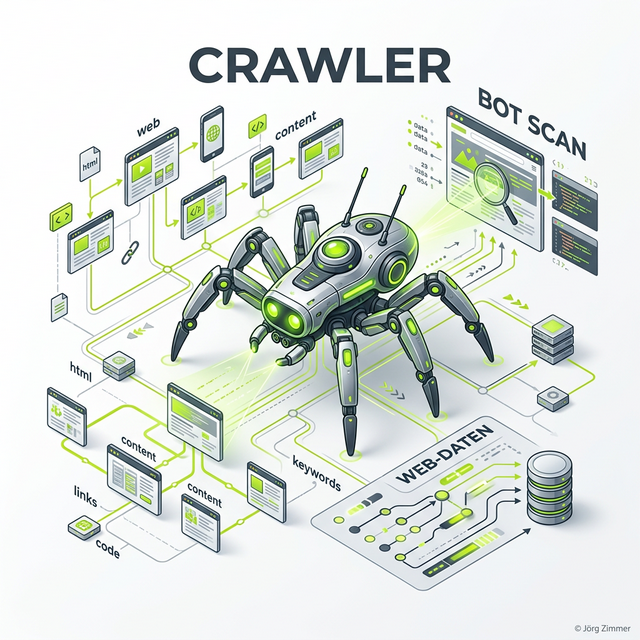

Moin! 🌻

Ein Crawler (oder Bot/Spider) ist ein Computerprogramm, das das Internet unermüdlich durchforstet. 
Stell dir Google wie eine riesige Bibliothek vor. 
Der Crawler ist der Bibliothekar, der jeden Tag neue Bücher liest und ins Regal sortiert.

  
 Jörgs SEO-Klartext (LinkedIn Insights)

  
"70% von AI-SEO ist einfach nur sauberes, klassisches SEO. Handwerk. Keine Magie."

Ohne Crawler gäbe es kein Google. 
Sie folgen Links, lesen HTML-Text und schießen Fotos von Websites. 
Wer seine Crawler versteht, versteht, wie Sichtbarkeit entsteht. Alles andere ist "Pfusch am Bau" .

## Die bekanntesten Crawler

Nicht jeder Bot ist gleich. Wir haben es meist mit diesen Gesellen zu tun:

1.  **Googlebot:** Der Chef. Er entscheidet über deine Rankings.
2.  **Bingbot:** Macht das Gleiche für die Microsoft-Suche – und damit für Copilot und ChatGPT.
3.  **GPTBot:** Der neue Mitspieler von OpenAI. Er sammelt Daten für das KI-Training.
4.  **AhrefsBot / SemrushBot:** Sammeln Daten für SEO-Tools (oft eine Hausnummer für sich).

## Warum Crawl-Budget lebenswichtig ist

Google hat keine unendliche Rechenpower, auch wenn es so wirkt. 
Für jede Website gibt es ein "Crawl-Budget". 
Das ist die Zeit und Anzahl der Seiten, die Google bei dir pro Tag besucht.

Verschwendest du dieses Budget? 
Zum Beispiel durch endlose Weiterleitungen, 404-Fehler oder unnötige Seiten-Duplikate? 
Dann werden deine wichtigen [Money Keywords](/glossar/money-keyword/) seltener besucht. 
Und das schadet deiner [Sichtbarkeit](/glossar/sichtbarkeit/) massiv. Wer "Bauchladen"  spielt, wird hier abgestraft.

  <h4 class="text-xl font-bold text-dark mb-2 mt-0">Dringender Hinweis für Admins</h4>
  
Wusstest du, dass du Crawler auch aussperren kannst? Mit der <a href="/glossar/robots-txt/" class="underline font-semibold text-lime-600 hover:text-lime-700">robots.txt</a> gibst du Anweisungen. Aber Vorsicht: Ein kleiner Fehler und deine gesamte Website verschwindet aus der Suche. Trailing Slashes / sind hier Pflicht!

## So machst du dich bei Crawlern beliebt

Crawler sind einfach gestrickt. Sie hassen Chaos und "Tracking-Hölle" . 
Was sie lieben:
*   **Schnelligkeit:** Ein langsamer [PageSpeed](/glossar/pagespeed/) nervt auch Bots.
*   **Struktur:** Saubere [H1-H3 Überschriften](/glossar/h1-h2-h3/) und [Sitemaps](/glossar/sitemap/).
*   **Logik:** Eine gute [interne Verlinkung](/glossar/interne-verlinkung/) ohne Sackgassen.

## Crawler in der Ära der KI ([GEO](/glossar/geo/))

Moderne Crawler für KI-Modelle arbeiten anders. 
Sie wollen nicht nur indexieren, sie wollen Wissen extrahieren. 
Dabei spielt die [LLMs.txt](/glossar/llms-txt/) eine Schlüsselrolle. 
Hier sagst du dem KI-Bot explizit, was er wissen muss. Das ist "SEO für Erwachsene".

## Mein Tacheles-Rat für dich

Behandle Crawler wie deine besten Kunden. Empfange sie mit einer schnellen Seite und klaren Informationen. Wenn der Bot sich bei dir wohlfühlt, belohnt er dich mit häufigeren Besuchen. Und häufige Besuche sind der erste Schritt zu besseren Rankings. Wer seine Crawler im Griff hat, hat die Kontrolle über sein SEO. Wer das ignoriert, hat bald "fertig".

ALOHA 🌻! 🌻

---

  <h3 class="text-2xl font-bold mb-4">Bot-Traffic richtig verstehen?</h3>
  
Ich zeige dir, wie Googlebot und KI-Crawler deine Seite sehen. Mit <a href="https://seranking.com/de/?ga=4169588&source=link" target="_blank" rel="noopener noreferrer">SE Ranking</a> tracken wir die Bot-Aktivität, mit <a href="https://rankscale.ai/?via=offer" target="_blank" rel="noopener noreferrer">Rankscale</a> deine KI-Reputation.

  <a href="/kontakt/" class="btn-primary inline-flex">Jetzt Crawler-Check anfragen </a>

* [Crawling vs. Indexing verstehen](/glossar/crawling-vs-indexing/)
* [Warum die robots.txt wichtig ist](/glossar/robots-txt/)
* [Was ist GEO?](/glossar/geo/)
