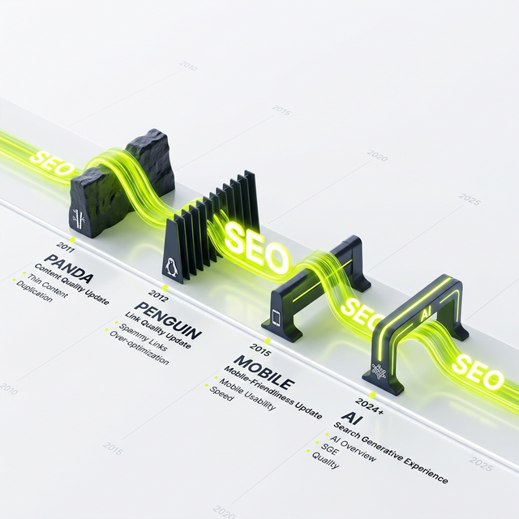

Einer der häufigsten Fehler, den ich als [SEO-Berater in Berlin](/seo-freelancer-berlin/) immer wieder in Gesprächen mit Entwicklern, Geschäftsführern und Marketingabteilungen klären muss, ist die konsequente Verwechselung der Begriffe "Crawling" und "Indexing".

Oftmals heißt es: *"Jörg, diese Seite darf nicht in Google auftauchen. Ich sperre sie schnell in der robots.txt gegen das Crawling"*. (Ein kapitaler Fehler, den wir uns später ansehen).

Um technisches SEO, Fehler in der Google Search Console oder die Effizienz von Website-Relaunches meistern zu können, musst du zwingend begreifen, dass eine Suchmaschine wie ein riesiger Bibliothekar arbeitet, der in zwei völlig abgetrennten, sequenziellen Phasen agiert. Wer diesen Unterschied verstanden hat, eliminiert spielend leicht [80 Prozent aller kritischen Website-Sichtbarkeits-Probleme](/blog/80-prozent-seo-fehler-sprechstunde/).

---

## 🕷️ Phase 1: Das Crawling (Das Entdecken & Lesen)

Das Crawling ist rein methodisch gesehen ein automatisierter Download-Prozess. 

Google schickt winzige Programme (die "Googlebots") durch das extrem verbundene Netz des Internets. Diese Kriechtiere navigieren fast ausschließlich entlang von den uns bekannten Hyperlinks (dem sogenannten [Linkjuice](/glossar/linkjuice/)). 

Finden sie eine neue HTML-URL, fragen sie diese beim Webserver an, warten geduldig bis der Server eine Antwort schickt (Server Return Codes im Idealfall: HTTP 200) und laden den Quellcode der Seite (oder die Bilder, das JavaScript und die CSS-Stylesheets) komplett herunter. 

**Das wichtigste Merkmal:** Was beim Crawlen passiert, bleibt beim Crawlen. Wenn ein Googlebot einen Blogartikel physisch "liest" (geladen hat), bedeutet das noch in absolut keiner Form, dass dieser Artikel jemals in den öffentlichen Suchergebnissen auftauchen wird. 

### Der Türsteher: Die robots.txt

Der einzige Mechanismus, der das Crawling einer URL aktiv **vorab** verbieten kann, ist die Domain-weite Steuerungsdatei `robots.txt`. Sieht der Crawler darin in der Befehlszeile ein `Disallow: /geheimes-verzeichnis/`, dann betritt er diesen Pfad gar nicht erst. Er dreht im Vorgarten um und speichert keinen Fetzen Code von dort auf den Google-Servern. Mehr dazu im Detail in meinem Fachartikel zur [Robots.txt](/glossar/robots-txt/).

  <h4 class="text-xl font-bold text-dark mt-0 mb-2">Crawl-Budget</h4>
  
Das massenhafte Downloaden von Millionen URLs kostet Google jeden Tag unfassbar viel Strom, Cache-Speicher und Geld. Jede Seite besitzt daher ein "Crawl Budget" – eine fiktive Grenze an täglichen Abrufen, nach der sich Google abmeldet. Ertränkt sich dein Crawl-Budget in unsinnigen URLs (Faceted Navigation, Parameter, Session-IDs, Tausende leere Tag-Seiten), crawlt Google nie deine neuen, hochwertigen Beiträge. Die Effizienz deines Crawlings ist das Herz der OnPage-Optimierung!

---

## 🗃️ Phase 2: Das Indexing (Das Einordnen & Bewerten)

Hat der Bot die Seite gecrawlt (Phase 1 abgehakt), reicht er das rohe Datenpaket an den Indexierungs-Algorithmus weiter. Das Indexing ist der intellektuelle, ressourcenfressende Prozess von Google (oder KI-Maschinen).

Hier wird das heruntergeladene HTML nun maschinell "verstanden" (geparst und gerendert). 

Der Algorithmus extrahiert die internen Verlinkungen, baut den DOM (Document Object Model) Baum auf, wertet JavaScript wie moderne [Core Web Vitals](/glossar/core-web-vitals/) Animationen aus und analysiert den auf der Seite gefundenen Text hinsichtlich Themenrelevanz, Duplicate Content, Spammigkeit und Qualität der Information (E-E-A-T).

Nur wenn dieser Indexer entscheidet: *"Ja, das ist ein absolut fantastisches, relevantes und einzigartiges Dokument, das den suchenden Menschen da draußen massiv helfen wird"*, nimmt er es ab in den elitären Kreis der aufgenommenen Suchergebnisse ab. Diese riesige, von Google angelegte Bibliothek aller weltweiten Top-Inhalte, nennt man "den Index".  

### Der Türsteher: Meta-Tag "Noindex"

Oft musst du Seiten erstellen, die technisch perfekt sind, aber trotzdem nichts, absolut gar nichts im Google-Index verloren haben (z. B. "Danke für Ihre Anfrage"-Seiten, doppelte Artikel oder kleine AGB-Hinweise).

Hierzu fügst du in den absoluten `<head>`-Bereich deines HTML-Codes das Meta-Tag `<meta name="robots" content="noindex">` ein. Alternativ funktioniert das auch über den x-robots-Tag im Server-Header. 

Der Ablauf sieht dann zwingend wie folgt aus: 
1. Der Crawler ruft die Seite ab (Phase 1 erfolgreich!). 
2. Er gibt sie den Indexer. 
3. Der Indexer fängt an zu rendern, liest im Head `"noindex"`, stoppt sofort jegliche Einordnung und schmeißt das Dokument physisch sofort und dauerhaft wieder in den Müllschlucker.

## Das tödliche Paradoxon: Sperren verboten!

Viele Webseitenbetreiber begehen den folgenschwersten Fehler der Indexierungskontrolle, weil sie Crawling mit Indexing verwechseln. 

Sie haben eine irrelevante Seite, die bereits aus Versehen von Google gefunden wurde und bei Suchanfragen als hässliches Trefferbild auftaucht. Die typische Reaktion in der Not: *"Ich schreibe die Seite sofort auf `Disallow:` in der `robots.txt`! Dann ist sie weg."*

**Was wirklich passiert:** 
Du baust einen dicken Betonwall um die Seite. Das bedeutet: Google darf ab morgen in Phase 1 (Crawling) nicht mehr herunterladen! Das klingt gut, aber gleichzeitig hat der Indexer diesen Content seit Wochen tief in Phase 2 in seinem großen Indexbuch aufgeführt.

Wie soll der Indexer das Buch jetzt aktualisieren und die Seite aus seinen Suchergebnissen löschen? Er müsste die Seite ansteuern, neu scrapen, und sehen dass die Seite weg ist (Status 404) oder mittlerweile den hart ersehnten `"noindex"` Tag im Header trägt. Doch das darf er nicht mehr. Sein Crawler scheitert schon meilenweit vorher am Eintritt wegen der `robots.txt`. 

Man sperrt den Bot logischerweise rigoros **aus** und friert damit den fehlerhaften Zustand im Google-Index permanent **ein**. Die Folge: Man rankt oft für Monate fehlerhaft weiter, und Tools wie [Sistrix schlagen im Sichtbarkeitsindex Alarm](/blog/sistrix-vs-se-ranking/).

### Merksatz der SEO-Dichotomie 

*   **Willst du Server-Power und Crawl-Budget schonen?** Blockiere in der `robots.txt` (Phase 1). Der Inhalt rankt möglicherweise trotzdem, falls massiv von außen verlinkt wird!
*   **Willst du chirurgisch kontrollieren, wer in der großen Bibliothek für Keywords gefunden wird?** Lasse das Crawlen gnadenlos zu, setze aber hart ein serverseitiges "noindex" im Header (Phase 2). 

Wer diese Trennschärfe im Projektmanagement begreift, dem gehört das Fundament einer robusten Online-Reputation ab der ersten Zeile Code.
