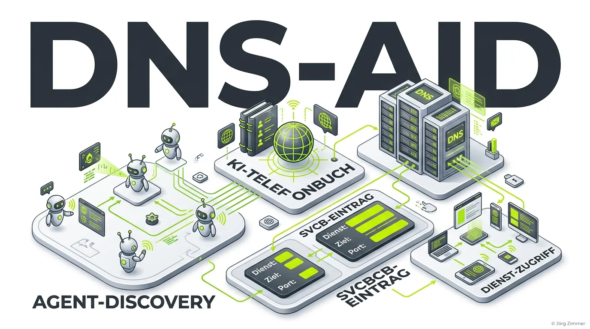

Moin! 🌻

Stell dir vor, du hast den besten KI-Agenten der Welt gebaut, aber er sitzt im Dunkeln und niemand weiß, dass er existiert. Genau das ist das aktuelle Problem in der rasant wachsenden Welt der autonomen KIs. Wir sprechen hier nicht von einfachen Chatbots, sondern von Agenten, die miteinander kommunizieren, Daten austauschen und Handlungen ausführen sollen. Aber wie finden die sich eigentlich? 

Bisher war das eher "Pfusch am Bau". Entweder musste man auf zentralisierte Plattformen setzen oder auf gut Glück nach einer Textdatei auf einem Webserver suchen. Mit **DNS-AID** ändert sich das Spiel komplett. Es ist das Telefonbuch für KI-Agenten, tief verankert in der sichersten Infrastruktur, die wir haben: dem Domain Name System (DNS).

## Was ist DNS-AID genau?

DNS-AID (DNS-based Agent Identification and Discovery) ist ein Open-Source-Projekt, das ursprünglich von Infoblox entwickelt wurde und nun unter den Fittichen der mächtigen Linux Foundation liegt. Aktuell wird es als Internet-Draft bei der IETF (Internet Engineering Task Force) vorangetrieben.

Der Kerngedanke: Wir erfinden das Rad nicht neu. Anstatt eine neue "Tracking-Hölle" oder geschlossene Netzwerke zu bauen, nutzt DNS-AID etablierte Standards. Wenn ein KI-Agent nach einem [Model Context Protocol (MCP)](/glossar/model-context-protocol-mcp/) Server sucht, fragt er einfach das DNS der Domain ab.

## Die Technik dahinter: SVCB und TXT

Wie sieht das in der Praxis aus? Wenn wir bei der *Teleschmiede* unsere Agenten für die Außenwelt sichtbar machen wollen, legen wir keine versteckten URLs mehr an, sondern setzen DNS-Records. 

- **SVCB-Records (Service Binding):** Teilen dem suchenden Agenten mit, welche Protokolle unterstützt werden und wo der Endpunkt liegt. 
- **TXT-Records:** Liefern zusätzliche Metadaten und Parameter direkt im DNS-Lookup.

Ein Eintrag könnte so aussehen:
`_agent._tcp.teleschmie.de. IN TXT "v=dns-aid1; id=teleschmiede; auth=https://teleschmie.de/auth.md"`

So weiß ein fremder Agent sofort, wo er unsere [auth.md](/glossar/auth-md/) findet, ohne die Webseite überhaupt aufrufen zu müssen.

## DNS-AID in der Teleschmiede-Praxis

Wir haben bei teleschmie.de in den letzten Wochen intensiv an unserer [Agent Readiness](/glossar/agent-readiness/) gearbeitet. Wir haben das [A2A Protocol](/glossar/a2a-protocol/) implementiert und die strengen Level-5-Checks von Cloudflare Radar bestanden. 

Aber: Das alles passiert auf der HTTP-Ebene. DNS-AID ist für uns der logische nächste Schritt. Es ist "Level 6". Sobald sich der Standard festigt, werden wir unsere Agenten-Endpunkte direkt in unsere IONOS-DNS-Zonen eintragen. Warum? Weil es durch DNSSEC kryptografisch fälschungssicher ist. Wenn jemand behauptet, die Teleschmiede zu sein, bürgt das DNS dafür, dass das auch stimmt.

💬 **Jörgs SEO-Klartext (LinkedIn Insights)**
> "Rankings sind Vanity-Metriken. Das gilt heute für Google und morgen für KI-Agenten. Wenn dein MCP-Server nicht via DNS-AID auffindbar ist, existierst du im autonomen Agenten-Web schlichtweg nicht. Und was nicht existiert, macht keinen Umsatz. Habe fertig."

## Klartext: Lohnt sich das schon?

Aktuell ist DNS-AID noch ein Draft. Ihr müsst also nicht sofort alles stehen und liegen lassen, um eure DNS-Zonen umzubauen. Aber: Wer CEO-Sprache spricht, bereitet sich auf die Infrastruktur von morgen vor. Wer heute noch glaubt, KI-Sichtbarkeit bedeutet nur, ein bisschen Text für ChatGPT umzuschreiben, der fährt gedanklich noch mit der Deutschen Bahn, während die anderen längst fliegen.

Unterm Strich: DNS-AID wird die Art und Weise, wie Maschinen im Internet miteinander interagieren, standardisieren. Behaltet es auf dem Radar.

ALOHA! 🌻✌️

### Verwandte Artikel
- [Agent Readiness verstehen](/glossar/agent-readiness/)
- [Das Model Context Protocol (MCP)](/glossar/model-context-protocol-mcp/)
- [Die auth.md Datei erklärt](/glossar/auth-md/)
- [A2A Protocol: Agent to Agent](/glossar/a2a-protocol/)
