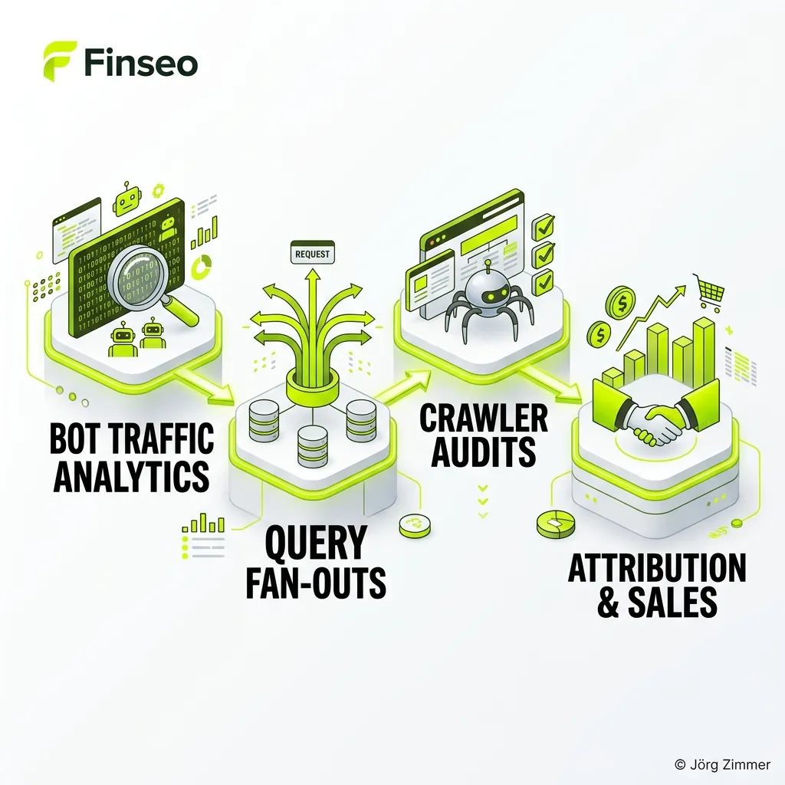

Der Kampf um die Sichtbarkeit hat sich verlagert. Milliarden von Nutzern überspringen klassische Suchmaschinen und stellen ihre Fragen direkt an KI-Modelle. Für Marken bedeutet das: Wer in den Antworten von ChatGPT, Perplexity oder Claude nicht zitiert wird, existiert im digitalen Bewusstsein der neuen Generation schlichtweg nicht mehr.

Aus genau diesem Schmerz heraus entstand **Finseo**. Die Plattform hat sich rasant als das führende deutsche Werkzeug für AI Search Monitoring etabliert. Der Ursprung des Startups mit Sitz in Gaildorf (Baden-Württemberg) liegt in der perfekten Verschmelzung von Technologie und tiefem SEO-Verständnis. Gegründet wurde die Finseo GmbH von David Mühlenweg (CEO), der als technischer Visionär die initiale Software-Architektur entwarf, und Maurice Marinelli (CMO). Marinelli, der bereits die sehr erfolgreiche SEO-Agentur "findling" aufgebaut hat, brachte die harten Praxis-Anforderungen aus dem Agentur-Alltag mit ein. Diese Kombination aus echtem Bootstrapping, Software-Expertise und tiefem Marketing-Wissen macht die Plattform heute so extrem praxistauglich. Renommierte Marken wie Kellogg's, Panasonic, Würth und Raiffeisen vertrauen bereits auf die Infrastruktur aus Süddeutschland.

In diesem ultimativen Übersichtsartikel zerlegen wir die Finseo-Plattform in ihre Einzelteile. Wir betrachten die Kernfunktionen für sauberes [AI Search Monitoring](/glossar/ki-sichtbarkeit/), analysieren den technischen Unterbau und bewerten die transparente Preisstruktur für Marken und Agenturen.

<figure class="my-8 bg-neutral-50 border border-neutral-200 p-6 md:p-8 rounded-2xl shadow-sm">
  

    
    

      <h4 class="font-bold text-base md:text-lg text-dark mb-0">Jörg Zimmer</h4>
      
Senior SEO & AI Search Consultant

    

  

  <blockquote class="text-base md:text-lg text-dark leading-relaxed italic border-l-4 border-lime-accent pl-4 my-4 font-normal">
    „Wer im Jahr 2026 nur noch auf blaue Google-Links starrt, verpasst die halbe Reise seiner Kunden. Finseo ist für mich das aktuell stärkste deutsche Werkzeug, um KI-Sichtbarkeit messbar zu machen – vor allem weil es über Bot-Logfiles und Query Fan-Outs zeigt, wie Sprachmodelle im Hintergrund tatsächlich nach unseren Marken forschen.“
  </blockquote>
  <figcaption class="mt-4 pt-3 border-t border-neutral-200/60 flex flex-wrap items-center justify-between gap-2 text-xs text-neutral-500">
    Experten-Zitat • <cite class="not-italic font-semibold text-neutral-700">Jörg Zimmer</cite>
    <a href="https://www.linkedin.com/in/joerg-zimmer-seo-sea-freelancer-berlin-spandau/" target="_blank" rel="noopener noreferrer" class="font-bold text-lime-700 hover:underline inline-flex items-center gap-1">
      Jörg Zimmer auf LinkedIn folgen →
    </a>
  </figcaption>
</figure>

  

    30-Sekunden Inhaber-Check
    <h3 class="text-base md:text-lg font-bold text-dark m-0">Jörgs Praxistipp aus der SEO-Sprechstunde</h3>
  

  

    Nutze Finseos Bot Crawler Analytics, um Server-Logfiles auf LLM-Bots (wie GPTBot, PerplexityBot und ClaudeBot) zu prüfen. Wenn deine Cloudflare- oder WAF-Firewall diese Bots versehentlich blockt, kann dich kein Sprachmodell als Quelle heranziehen – egal wie gut dein Content ist.
  

  

    <strong class="text-xs font-bold text-neutral-800 uppercase tracking-wide block mb-1">Deine Kontrollfrage an die Webagentur / das Dev-Team:</strong>
    

      „Haben wir in unseren Server-Logfiles verifiziert, ob KI-Crawler wie GPTBot, PerplexityBot und ClaudeBot freien Zugriff auf unsere Kerninhalte haben oder durch Sicherheitsfilter fälschlicherweise geblockt werden?“
    

  

## Die Kernfunktionen von Finseo

Finseo verlässt sich nicht auf oberflächliches Scraping, sondern positioniert sich als ganzheitliche Schnittstelle zwischen KI-Erwähnungen und echtem Unternehmensumsatz (Attribution). Die Plattform deckt den gesamten Workflow der [Generative Engine Optimization](/glossar/geo-tool/) ab.

### 1. AI Visibility Tracking & Competitor Rankings
Das Herzstück der Software ist das vollautomatische Monitoring. Finseo trackt die Sichtbarkeit auf allen relevanten Plattformen: ChatGPT, Anthropic Claude, Perplexity, Google Gemini und dem Google AI Mode. 
- **Zitations-Tracking:** Die Software prüft exakt, ob und in welchem Kontext deine Domain als Quelle herangezogen wird.
- **Wettbewerbsanalyse:** In übersichtlichen Dashboards siehst du deinen *Share of AI Voice* direkt im Vergleich zu deinen stärksten Konkurrenten. Du erkennst sofort, ob ChatGPT bei der Frage "Beste Laufschuhe 2026" Nike oder Adidas bevorzugt.
- **Sentiment & Produkte:** Das Tool extrahiert nicht nur reine Links, sondern identifiziert konkrete Produkte und Preise, die von der KI empfohlen werden.

### 2. Prompt Research
Die herkömmliche Keyword-Recherche ist in der generativen Suche nutzlos. Nutzer tippen keine zwei Wörter mehr ein, sie diktieren ganze Szenarien in ihr Smartphone.
Mit dem Prompt Research Modul deckt Finseo auf, welche spezifischen Fragen und Konversationen Nutzer im Kontext deiner Industrie starten. Aus diesen komplexen Datensätzen generiert das Tool klare Empfehlungen, welche redaktionellen Inhalte (Expert-Reviews, Comparisons) noch fehlen, um den KI-Algorithmus zu überzeugen.

### 3. Bot Traffic & Crawler Analytics
Ein Feature, das Finseo massiv von der Konkurrenz abhebt. Bevor eine KI dich zitieren kann, muss sie deinen Content lesen. Doch ein spezialisierter KI-[Crawler](/glossar/crawler/) (wie der `GPTBot` oder der `ClaudeBot`) verhält sich völlig anders als der statische Googlebot.
Finseo misst präzise, wann, wie oft und wie tief diese Bots deine Server crawlen. Du erkennst sofort, ob deine Firewall (WAF) die KIs versehentlich blockiert oder ob spezifische Artikel (z.B. der neue Pricing-Guide) erfolgreich ingestiert wurden. Ein extrem mächtiges Feature für technische SEO-Audits.

### 4. Query Fan-Out Analysis
Wenn ein Nutzer eine KI nach dem "besten CRM für kleine Handwerksbetriebe" fragt, greift das LLM im Hintergrund oft auf mehrere Unter-Anfragen zurück. Es sucht nach "CRM Handwerk", liest Bewertungen auf G2 und vergleicht Preislisten. 
Finseo visualisiert diese Dekonstruktion (Fan-Out). Die Plattform zeigt dir, auf welche Teilbereiche die KI intern zurückgreift, um die finale Antwort zu formen. Wer diese Architektur versteht, kann seine Website exakt auf die Informationsbedürfnisse der Maschinen zuschneiden.

### 5. Report Builder & API-Integrationen
Die Daten müssen aus dem Silo raus. Finseo liefert einen starken White-Label Report Builder, mit dem Inhouse-Teams oder Agenturen auf Knopfdruck beeindruckende PDF-Reports im eigenen Design generieren können.
Noch spannender ist die Konnektivität: Die Plattform bietet über 40 native Integrationen. Darunter CRM-Systeme wie Salesforce und HubSpot, E-Commerce-Plattformen wie Shopify, sowie direkte Anbindungen an Google Analytics. Damit schließt Finseo die Lücke zwischen einer bloßen Erwähnung im Chatbot und echtem, messbaren Umsatz (Attribution).

  

    

      🤖
      
Arbeitsanweisung für deinen KI-Agenten (Cursor / Claude / Antigravity)

    

    <button type="button" class="copy-agent-btn px-2.5 py-1 bg-lime-accent text-dark hover:bg-lime-600 hover:text-white text-[11px] font-bold uppercase rounded border border-lime-500 hover:border-lime-600 transition-all flex items-center gap-1 shadow-md cursor-pointer shrink-0 ml-auto" title="Prompt kopieren">
      <svg class="w-3.5 h-3.5" fill="none" stroke="currentColor" viewBox="0 0 24 24"><path stroke-linecap="round" stroke-linejoin="round" stroke-width="2" d="M8 16H6a2 2 0 01-2-2V6a2 2 0 012-2h8a2 2 0 012 2v2m-6 12h8a2 2 0 012-2v-8a2 2 0 01-2-2h-8a2 2 0 01-2 2v8a2 2 0 012 2z" /></svg>
      Kopieren für Agent
    </button>
  

  

    Kopiere diesen Prompt direkt in deinen KI-Coding-Assistenten, um Server-Logfile-Analysen für KI-Crawler automatisiert einzurichten:
  

  

    
# Prompt: LLM Bot Logfile Ingestion & Crawlability Audit

    
<strong>Rolle:</strong> Du bist ein Senior DevOps Engineer & Technical SEO Specialist.

    
<strong>Aufgabe:</strong> Erstelle ein Monitoring-Skript für Server-Logfiles (Nginx/Apache/Cloudflare), das Zugriffe gängiger KI-Crawler extrahiert und eventuelle 403/429 Statuscodes identifiziert.

    
<strong>Schritte & Validierung:</strong>

    
1. Parse Access-Logs nach den User-Agents: GPTBot, ChatGPT-User, ClaudeBot, PerplexityBot, Google-Extended und CCBot.

    
2. Aggregiere die Anzahl der Requests pro Tag, die angefragten Routen und den HTTP-Statuscode.

    
3. Überprüfe die robots.txt auf versehentliche Disallow-Direktiven für diese User-Agents.

    
4. Validierung: Simuliere Test-Requests mit gefälschtem User-Agent und stelle sicher, dass keine WAF-Regeln berechtigte KI-Scraper blockieren.

  

## Abgrenzung: Finseo vs. klassische SEO-Tools

Warum benötigen Marketing-Teams plötzlich ein zweites Tool neben ihrem etablierten Rank-Tracker? Die Antwort liegt in der Architektur der Suchsysteme.

| Metrik / Fokus | Klassische Rank-Tracker | Finseo (AI Visibility) |
| :--- | :--- | :--- |
| **Output** | Statische Listen (SERPs) | Synthetisierte, dynamische Antworten |
| **Erfolgsmetrik** | Position (1-10) & Klickrate | Zitationen & Share of AI Voice |
| **Tracking-Ansatz** | Simuliertes Browser-Scraping | Konversations- und Agenten-Tracking |
| **Wettbewerb** | Direkte Domain-Konkurrenten | Auch Plattformen (Reddit, Quora, G2) |
| **Zentrales Element** | Backlinks & OnPage-Dichte | RAG-Quellen & Crawler-Logfiles |

Herkömmliche [SEO Visibility Tools](/glossar/se-ranking/) messen das alte Paradigma der blauen Links. Finseo misst den neuen Standard: Wie Maschinen über Marken denken und sprechen. Für einen ganzheitlichen Überblick lohnt auch ein Blick in unsere Übersicht über die [Top 9 AI Visibility Tools](/blog/top-9-ai-visibility-tools/).

## Transparente Preismodelle (Stand 2026)

Finseo liefert ein klares, auf Wachstum ausgelegtes Pricing. Ein massiver Pluspunkt: **In jedem Plan sind unbegrenzte Team-Seats enthalten.** Niemand muss Lizenzen teilen, das gesamte Marketing-Team kann parallel in der Plattform arbeiten. 

### 1. Business Plan (ab 189 € / Monat)
Der ideale Einstieg für spezialisierte Teams und ambitionierte Marken.
- **Kosten:** Ab 189 € pro Monat.
- **Leistungsumfang:** Tracking von 100 Prompts, 9.000 AI-Antworten pro Monat, 1 Workspace (Project).
- **Inklusive:** 7.500 Content-Optimierungs-Credits, Crawlability-Checks für 500 Seiten.
- **Integrationen:** Voller Zugriff auf alle 40+ Integrationen, den Report Builder sowie die Public REST API und den MCP-Server.

### 2. Growth Plan (ab 350 € / Monat)
Entwickelt für skalierende Teams und Agenturen mit mehreren Kunden.
- **Leistungsumfang:** Tracking von 350 Prompts, 31.500 AI-Antworten pro Monat, 3 Workspaces.
- **Volumen:** 30.000 Credits, Crawlability-Checks für 1.500 Seiten.
- **Support:** Bevorzugter Support inklusive eines dedizierten Slack-Channels.

### 3. Enterprise (Custom Pricing)
Für globale Marken und Konzerne mit maximalen Ansprüchen.
- **Leistungsumfang:** Ab 700 Prompts (bis Custom), unlimitierte Workspaces, 50.000+ Credits.
- **Service:** Eigene Strategie-Meetings (2x im Jahr), Custom Contracts (SLA, DPA) und Invoice Billing Workflow.

### 4. Managed Service (Done-for-you)
Die Besonderheit von Finseo. Wem die Inhouse-Ressourcen fehlen, der bucht nicht nur die Software, sondern direkt das Experten-Team dahinter.
- **Leistungsumfang:** Monatliche Strategie-Meetings, Setup durch Experten, dedizierter Success Manager.
- **Umsetzung:** Das Finseo-Team übernimmt die Content-Produktion und das Community-Management (z. B. auf Reddit), um die KI-Sichtbarkeit aktiv und messbar zu steigern.

## Abschließende Bewertung: Das deutsche Radar für die KI-Suche

Die generative KI hat die Spielregeln des Marketings auf den Kopf gestellt. Die Frage ist nicht mehr, ob man für LLMs optimiert, sondern wie schnell man damit anfängt, bevor die Konkurrenz den Raum besetzt.

**Finseo** liefert nicht nur die harte Datengrundlage, um diesen Raum messbar zu machen, sondern bringt auch die Werkzeuge mit, um ihn aktiv zu erobern. Das Startup aus Gaildorf punktet massiv durch seine tiefe Bot-Analyse, die genialen Query Fan-Outs und den gnadenlosen Fokus auf Attribution. Wer als Marketing-Verantwortlicher heute beweisen muss, wie viel Umsatz eine ChatGPT-Erwähnung bringt, kommt an der Infrastruktur von Finseo kaum vorbei. Es ist die Brücke zwischen der neuen KI-Suche und dem echten Unternehmenserfolg.

  
    Aus Jörgs LinkedIn-Feed
  
  <blockquote class="text-base md:text-lg text-gray-200 italic max-w-2xl mx-auto mb-4 border-none font-normal">
    „Vergiss Spam und irgendwelche Abkürzungen, die nichts zur Qualität deiner Seite beitragen.“
  </blockquote>
  

    Diskutiere mit Jörg Zimmer und der SEO-Community auf LinkedIn über diesen Beitrag.
  

  <a href="https://www.linkedin.com/feed/update/urn:li:activity:7108451226622509057" target="_blank" rel="noopener noreferrer" class="btn-primary">
    <svg class="w-4 h-4 fill-current" viewBox="0 0 24 24"><path d="M20.447 20.452h-3.554v-5.569c0-1.328-.027-3.037-1.852-3.037-1.853 0-2.136 1.445-2.136 2.939v5.667H9.351V9h3.414v1.561h.046c.477-.9 1.637-1.85 3.37-1.85 3.601 0 4.267 2.37 4.267 5.455v6.286zM5.337 7.433c-1.144 0-2.063-.926-2.063-2.065 0-1.138.92-2.063 2.063-2.063 1.14 0 2.064.925 2.064 2.063 0 1.139-.925 2.065-2.064 2.065zm1.782 13.019H3.555V9h3.564v11.452zM22.225 0H1.771C.792 0 0 .774 0 1.729v20.542C0 23.227.792 24 1.771 24h20.451C23.2 24 24 23.227 24 22.271V1.729C24 .774 23.2 0 22.222 0h.003z"/></svg>
    Beitrag auf LinkedIn öffnen
    →
  </a>

