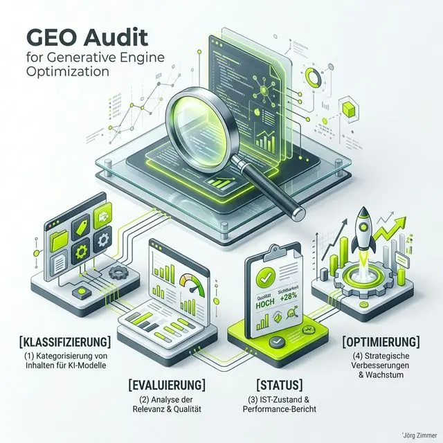

Moin! 🌻

Wer denkt, dass er mit einem klassischen SEO-Audit im Jahr 2026 noch die Kurve kriegt, der glaubt auch, dass die Deutsche Bahn morgen auf die Minute pünktlich kommt. Wir leben in der Ära der **Generative Engines**. Die Nutzer klicken nicht mehr stumpf auf den ersten Link bei Google, sie lassen sich die Antwort direkt von ChatGPT, Claude oder Perplexity servieren. 

Wenn dein Content dort nicht als Quelle auftaucht, existierst du für diese Zielgruppe schlichtweg nicht. Ein **GEO Audit** ist dein Werkzeug, um genau das zu verhindern. Es ist der sprichwörtliche Finger in der Wunde deiner aktuellen Strategie – ungeschönt, direkt und verdammt nützlich. In diesem Beitrag zeige ich dir, wie wir mit der RankScale-Methodik den "Pfusch am Bau" beenden und deine Seite fit für die KI-Revolution machen.

## Was ist ein GEO Audit (Generative Engine Optimization Audit)?

Ein GEO Audit ist eine systematische Untersuchung einer URL oder einer gesamten Domain hinsichtlich ihrer Fähigkeit, von generativen KI-Systemen (LLMs) erfasst, verstanden und als autoritative Quelle zitiert zu werden. Während wir uns beim SEO jahrelang um Keywords und Backlinks gekümmert haben, optimieren wir beim GEO für die **Fakten-Synthese**.

Es geht nicht mehr nur darum, dass der Googlebot deine Seite findet (Crawlability), sondern dass das LLM deine Informationen so "lecker" findet, dass es sie in seine Antwort einbaut. Ein professionelles Audit zerlegt deine Seite dabei in ihre Einzelteile und bewertet sie anhand von Messgrößen, die weit über das hinausgehen, was uns die Search Console bisher verraten hat.

  
💬 Jörgs SEO-Klartext (LinkedIn Insights)

  
"Ein GEO Audit ohne Daten ist wie eine Meinung ohne Ahnung. Wer heute noch rät, was die KI über ihn denkt, der spielt Russisch Roulette mit seinem Business. Wir brauchen harte, deterministische Fakten, keine vagen Vorhersagen."

## Warum klassische Audits heute versagen

Klassische Audits sind wie alte Landkarten in einer Welt, die sich alle 24 Stunden neu erfindet. Sie prüfen, ob die H1 da ist und ob die Meta-Description die richtige Länge hat. Das ist "SEO-Kindergarten".

Ein LLM (Large Language Model) liest deine Seite nicht wie ein Nutzer, aber auch nicht wie ein klassischer Bot. Es sucht nach **Entitäten** und deren Beziehungen. Wenn deine Seite keine klare Struktur hat, die dem RAG-Prozess (Retrieval-Augmented Generation) entgegenkommt, dann bist du raus. Ein GEO Audit schließt diese Lücke, indem es die Seite aus der Brille der KI-Modelle betrachtet – aber mit der Präzision eines Schweizer Uhrwerks.

---

## Die RankScale Methodik: Der Perfect Mix Auditor

Bei teleschmie.de setzen wir auf den **Perfect Mix Auditor** von <a href="https://rankscale.ai/features/page-audit?via=offer" target="_blank" rel="noopener noreferrer">RankScale</a>. Das Besondere: Die Analyse ist komplett regelbasiert. Keine LLMs, die selbst wieder raten, sondern Algorithmen, die deine Datenqualität knallhart prüfen.

### Der Prozess: In 4 Schritten zur KI-Autorität

1.  **Klassifizierung (Classification):** Zuerst wird die Webseite in einen von 8 Typen eingeteilt (z. B. Local Business, YMYL, E-Commerce, News). Ein lokaler Handwerker braucht ein völlig anderes GEO-Setup als ein Cloud-SaaS-Anbieter.
2.  **Modulare Evaluierung:** Die Engine lässt 7 spezialisierte Module über den Content laufen – vom traditionellen SEO bis zum Subjectivity Filter.
3.  **Status-Ermittlung:** Am Ende steht eine klare Diagnose: Bist du ein *Perfect Mix*, eine *AI-Trap* oder ein *Hidden Gem*?
4.  **Priorisierte Empfehlungen:** Du bekommst eine Liste von Aufgaben, die du nach Impact abarbeiten kannst. Kein Rätselraten mehr.

---

## Die 7 Säulen eines GEO Audits

Gehen wir ans Eingemachte. Was wird da eigentlich genau geprüft? Hier sind die 7 Säulen, die entscheiden, ob du oben mitschwimmst oder in der Bedeutungslosigkeit versinkst.

### 1. Traditional SEO (Das Fundament)
Ohne Fundament kein Haus. Wir prüfen Title Tags, Header-Strukturen und interne Verlinkungen. Wenn hier schon der "Pfusch am Bau" regiert, brauchen wir über KI gar nicht erst reden. Wer seine [interne Verlinkung](/glossar/interne-verlinkung/) nicht im Griff hat, verwirrt nicht nur Nutzer, sondern auch Bots.

### 2. RAG Optimization (Retrieval-Augmented Generation)
Das ist das Herzstück. Wie leicht können Suchmaschinen wie Perplexity deine Informationen extrahieren? Wir prüfen die "Chunks" deiner Seite. Sind deine Sätze klar? Nutzt du hilfreiche Listen? RAG-Optimierung sorgt dafür, dass die KI deine Fakten ohne Halluzinationen übernehmen kann.

### 3. AI Readiness
Hier geht es um technische Barrieren. Verhindert deine `robots.txt` den Zugriff für KI-Crawler (wie den GPTBot)? Ist dein Content so aufbereitet, dass er in einem "headless" Kontext (also ohne CSS/JS) noch Sinn ergibt? Wer sich hier einmauert, wird nicht zitiert.

### 4. Link Audit (Zitierwürdigkeit)
Es geht nicht um Linkjuice im klassischen Sinn. Wir prüfen, ob deine Seite als vertrauenswürdige Referenz taugt. Hast du ausgehende Links zu Autoritäten? Werden deine Quellen sauber deklariert? In der GEO-Welt ist ein Link ein Beweis für deine Seriosität.

### 5. Schema Engine (Die Maschinensprache)
Ich sage es immer wieder: [Strukturierte Daten](/glossar/strukturierte-daten/) sind kein "Nice-to-have" mehr. Es ist die einzige Sprache, die KIs fließend sprechen. Das GEO Audit prüft, ob dein JSON-LD fehlerfrei ist und ob alle wichtigen Entitäten (Personen, Organisationen, Angebote) korrekt verknüpft sind.

### 6. E-E-A-T (Erfahrung, Expertise, Autorität, Vertrauen)
Die KI sucht nach Beweisen, dass du weißt, wovon du redest. Werden Autorenprofile klar kommuniziert? Gibt es Belege für echte Erfahrung? Wenn dein Content nach "KI-Massenware vom Praktikanten" riecht, straft dich der Algorithmus ab.

### 7. Subjectivity Filter (Vermeidung von Floskeln)
Das ist der "Bullshit-Detektor". KI-Systeme hassen werbliches Geplänkel. Sätze wie "Wir sind der führende Anbieter für..." werden im GEO Audit als Malus gewertet. Die KI will Fakten, keine Adjektive. Wer zu viel "Marketing-Sprach" nutzt, landet in der AI-Trap.

---

## Die 3 Status-Typen: Wo stehst du?

Nach dem Audit spuckt das System einen Status aus. Sei gefasst: Die Wahrheit tut oft weh.

*   **Perfect Mix:** Dein Content ist hervorragend für Menschen UND Maschinen optimiert. Du bietest E-E-A-T Signale und eine perfekte technische Struktur. Glückwunsch, du wirst zitiert!
*   **AI-Trap (KI-Falle):** Deine Seite sieht für Suchmaschinen technisch okay aus, aber der Content ist so generisch oder werblich, dass die KI ihn nicht als zitierwürdig einstuft. Oft ein Zeichen für ungeprüften KI-Output (Dinosaurier-Warnung! 🦖).
*   **Hidden Gem (Verborgenes Juwel):** Dein Inhalt ist fachlich brillant und bietet echten Mehrwert für Menschen, aber technisch bist du ein Wrack. Die KI kann deine Perlen nicht finden, weil Schema fehlt oder die Struktur im Eimer ist.

---

  

  <h3 class="text-2xl font-bold mb-4 relative z-10 !text-white !mt-0">Jörgs Fazit: Tacheles zum GEO Audit</h3>
  

    Hört auf zu raten. Ein GEO Audit ist die einzige Möglichkeit, im Jahr 2026 noch die Kontrolle über das eigene Schicksal im Netz zu behalten. Wer heute nicht weiß, wie ein LLM seine Seite "sieht", der lässt bares Geld liegen. GEO ist kein Hexenwerk, es ist sauberes Handwerk. Wer den Pfusch am Bau beendet und auf deterministische Daten setzt, der gewinnt das Vertrauen der Nutzer – und der Maschinen.
  

## Dein Weg aus der "Tracking-Hölle"

Ein GEO Audit ist kein einmaliges Event. Es ist der Startschuss für eine neue Art der Optimierung. Wir nutzen die Ergebnisse, um gezielt Content-Lücken zu schließen, technische Hürden abzubauen und die Autorität deiner Marke in den KI-Modellen festzuschreiben. 

Wenn du wissen willst, was die KIs wirklich über dich denken, dann ist jetzt der Zeitpunkt für den ersten Check. Warte nicht, bis die Konkurrenz an dir vorbeizieht, während du noch über Keyword-Dichte diskutierst.

## Der Deep-Dive: Die AI-Trap (KI-Falle) im Detail

Oft passiert es unbewusst: Man will "modern" sein, schmeißt ChatGPT an, lässt Texte generieren und klatscht diese auf die Seite. Im GEO Audit wird das jedoch gnadenlos bestraft. Warum? Weil generative Engines darauf trainiert sind, Information von unnötigem Fülltext zu unterscheiden. Eine **AI-Trap** erkennst du an folgenden Symptomen:

*   **Extremer Einsatz von Adjektiven:** ("innovativ", "wegweisend", "einzigartig"). Die KI wertet dies als Rauschen ohne Informationsgehalt.
*   **Fehlende Quellen:** Wenn Behauptungen aufgestellt werden, ohne dass im Quellcode (via Schema oder semantische Links) eine Referenz existiert.
*   **Strukturelle Monotonie:** Texte, die keine Tabellen, Listen oder klar abgegrenzten Chunks nutzen.

Wer in der AI-Trap sitzt, wird von Perplexity oder SearchGPT links liegen gelassen, weil die KI den Content für "nicht vertrauenswürdig" hält. Hier hilft nur radikales Editieren: Tacheles statt Marketing-Sprech.

## Checkliste: Dein Prozess für ein erfolgreiches GEO Audit

Damit du den GEO Audit nicht nur theoretisch verstehst, sondern auch umsetzen kannst, hier meine 5-Schritte-Checkliste für die Praxis:

1.  **Entitäten definieren:** Welche Themen, Personen und Orte repräsentiert deine Seite? Sind diese via [Wikidata](https://www.wikidata.org/) oder [Knowledge Graph](/glossar/knowledge-graph/) eindeutig identifizierbar?
2.  **Schema.org Audit:** Nutze den Google-Test für strukturierte Daten. Erscheinen Fehler? Sind `knowsAbout` und `sameAs` Felder sinnvoll ausgefüllt?
3.  **Crawlability-Check:** Prüfe, ob deine Website KI-User-Agents blockiert. In der Search Console siehst du, ob die Ressourcen für alle Bots frei zugänglich sind.
4.  **Informationsdichte erhöhen:** Gehe jeden Absatz durch. Bietet er eine neue Information? Falls nicht: Streichen.
5.  **Zitier-Check:** Suche (z. B. auf Reddit oder LinkedIn) nach organischen Erwähnungen deiner Marke. Das sind die Signale, die die KI für ihre Citations braucht.

## Zukunftsausblick: GEO als neuer Standard

In wenigen Jahren werden wir nicht mehr über SEO und GEO getrennt sprechen. Es wird schlicht **Sichtbarkeitsmanagement** heißen. Der Prozess des GEO Audits wird so routiniert sein wie heute der Check des PageSpeed. Wer sich jetzt schon die Zeit nimmt, die Sprache der Maschinen und die Bedürfnisse der Nutzer in Einklang zu bringen, der baut keinen "Bauchladen" auf, sondern ein echtes digitales Asset.

Denk immer daran: Die KI ist nicht dein Feind, sie ist eine "Reasoning Engine". Füttere sie mit exzellenten Daten, und sie wird dein bester Vertriebler. Ignoriere sie, und du wirst zum Geist in der digitalen Welt.

ALOHA! 🌻✌️

---

  <h3 class="text-2xl font-bold mb-4">Bereit für den Perfect Mix?</h3>
  
Lass uns gemeinsam unter die Haube deiner Website schauen. Mit einem professionellen GEO Audit decken wir jede Schwachstelle auf und machen dich zum Star in ChatGPT, Gemini und Co.

  <a href="https://rankscale.ai/features/page-audit?via=offer" target="_blank" rel="noopener noreferrer" class="btn-primary inline-flex">Jetzt RankScale Page Audit testen</a>

### Verwandte Begriffe & Leseempfehlungen
* [Was ist GEO?](/glossar/geo/)
* RAG einfach erklärt
* [LLMO Strategien](/glossar/llmo/)
* KI-Tracking Tools
