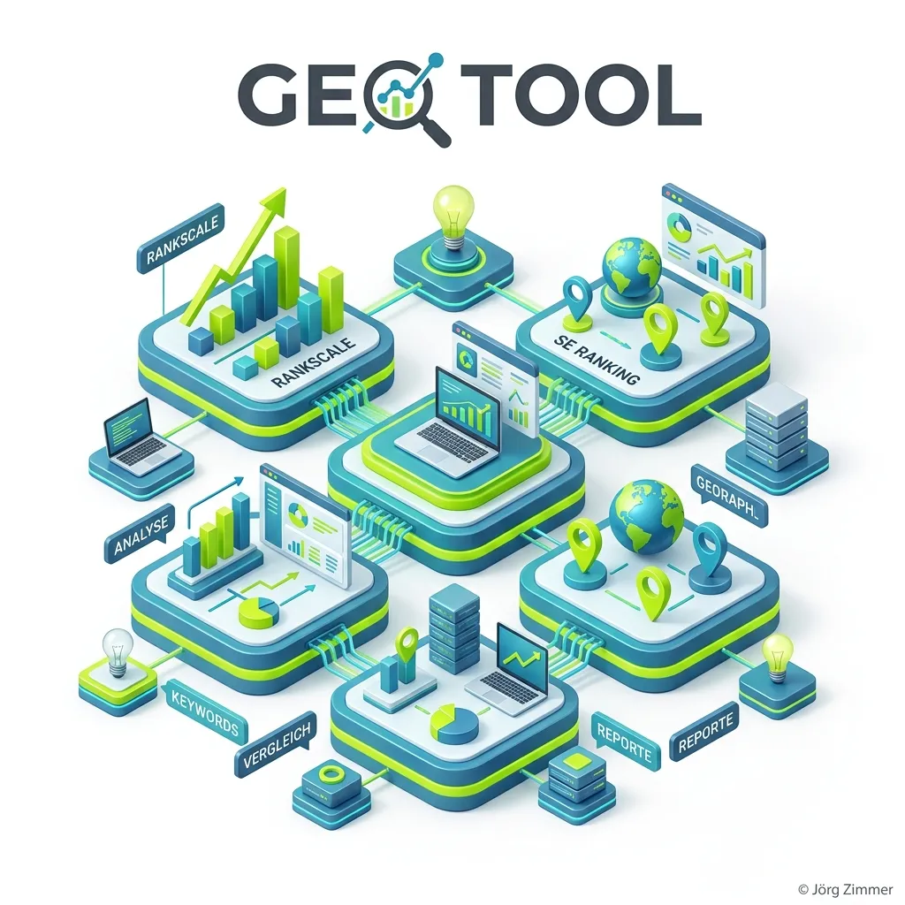

Moin! 🌻

Das gute alte Keyword-Tracking. Jahrelang war es unser Nordstern. Rankt das Keyword auf Platz 1, knallen die Korken. Fällt es auf Platz 4, brennt die Hütte. Doch was passiert, wenn der Nutzer gar nicht mehr auf Suchergebnisse klickt, sondern seine Antworten direkt von ChatGPT oder Perplexity serviert bekommt?

Genau hier betreten **GEO Tools** die Bühne. Wer heute die [KI Sichtbarkeit](/glossar/ki-sichtbarkeit/) seiner Marke nicht misst, agiert im absoluten Blindflug. 

## Was kann ein GEO Tool?

Ein GEO Tool (Generative Engine Optimization Tool) macht das Unsichtbare sichtbar. Während klassisches SEO-Reporting dir zeigt, wie viele Menschen auf deinen blauen Link geklickt haben, beantwortet ein GEO Tool fundamentale Fragen der KI-Ära:

*   Wird meine Marke von KI-Modellen überhaupt als [Entität](/glossar/entitaet/) wahrgenommen?
*   In welchem Kontext (Sentiment) wird mein Produkt erwähnt? Positiv, neutral oder gar negativ?
*   Welcher meiner Konkurrenten wird häufiger als Quelle empfohlen?

Zwei Tools dominieren aktuell diesen noch jungen, aber unfassbar wichtigen Markt. Lass uns Tacheles reden.

  
💬 Jörgs SEO-Klartext (LinkedIn Insights)

  
"Wer heute noch Budgets verteilt, ohne zu wissen, ob seine Marke überhaupt in ChatGPT existiert, verbrennt Geld. Ein echtes GEO Tool ist kein Nice-to-have mehr. AI-Strategie ist Chefsache, und ohne harte Daten aus Tools wie Rankscale oder SE Ranking seid ihr bei der nächsten Vorstandspräsentation völlig blank."

## 1. Rankscale: Der GEO-Spezialist

Wenn du es zu 100% ernst meinst mit Generative Engine Optimization ([GEO](/glossar/geo/)), führt kaum ein Weg an **[Rankscale](https://rankscale.ai/?via=offer)** vorbei. Die Gründer haben extrem früh erkannt, dass die klassischen Metriken nicht mehr greifen.

**Die Stärken von Rankscale:**
*   **Tiefe der GEO Analyse:** Rankscale trackt deine Sichtbarkeit in über 17 verschiedenen LLMs (Large Language Models), darunter ChatGPT, Claude, Gemini und viele mehr.
*   **Sentiment-Analyse:** Das Tool zeigt dir nicht nur, *dass* du erwähnt wurdest, sondern auch *wie*. Wenn ChatGPT dein Produkt als "teuer und veraltet" bezeichnet, schlägt Rankscale Alarm.
*   **Prompt-Messung:** Es arbeitet prompt-basiert und simuliert echte, konversationelle Nutzeranfragen, anstatt nur statische Keywords abzufragen.

👉 **[Rankscale direkt testen](https://rankscale.ai/?via=offer)** (Affiliate)

## 2. SE Ranking: Der All-in-One Platzhirsch

Das Problem bei hochspezialisierten Tools? Sie erfordern ein weiteres Abo und einen weiteren Login. Hier kommt **[SE Ranking](https://seranking.com/de/?ga=4169588&source=link)** ins Spiel. Als etablierte All-in-One-Suite haben sie erkannt, wohin die Reise geht, und einen eigenen AI Tracker in ihr Ökosystem integriert.

**Die Stärken von SE Ranking im KI-Zeitalter:**
*   **Das Fundament:** Keine KI empfiehlt eine technisch kaputte Seite. SE Ranking bietet einen der besten Website-Audits auf dem Markt. Du reparierst damit Pfusch am Bau (z.B. defekte [interne Verlinkung](/glossar/interne-verlinkung/)), bevor du dich um Zitate kümmerst.
*   **Integrierter AI Tracker:** Du kannst deine klassische Google-Sichtbarkeit und deine KI-Präsenz (z.B. in Google AI Overviews) in einem einzigen Dashboard miteinander vergleichen.
*   **Preis-Leistung:** Für Agenturen und Unternehmen, die ohnehin ein massives SEO-Tool für den Alltag brauchen, ist die Kombination aus klassischem SEO und neuem GEO-Feature unschlagbar.

👉 **[SE Ranking kostenlos ausprobieren](https://seranking.com/de/?ga=4169588&source=link)** (Affiliate)

## Unterm Strich

Die "Tracking-Hölle" von gestern – in der man sich über jeden einzelnen Klick in Google Analytics gefreut hat – weicht der Frage nach purer digitaler Marken-Autorität. Wenn du ein reines, tiefes Setup für KI-Antworten suchst, greif zu Rankscale. Wenn du ein solides Haus aufbauen und alles aus einer Hand willst, ist SE Ranking dein Daily Driver. Hauptsache, du fängst an zu messen.

Habe fertig.

ALOHA! 🌻✌️

### Verwandte Themen & Lese-Tipps
*   [KI Sichtbarkeit: So wirst du in ChatGPT & Co. zitiert](/glossar/ki-sichtbarkeit/)
*   [GEO: Was ist Generative Engine Optimization?](/glossar/geo/)
*   [Entitäten: Warum Keywords ausdienen](/glossar/entitaet/)
